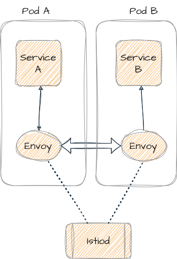
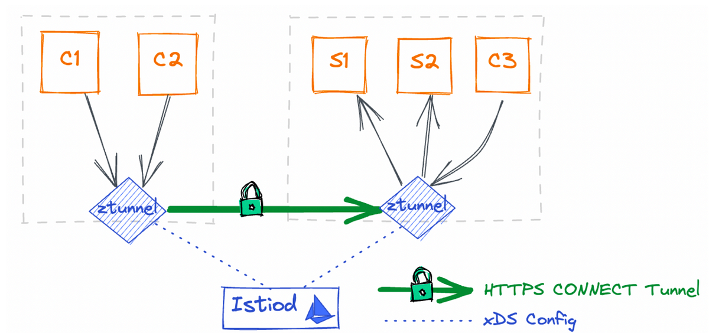
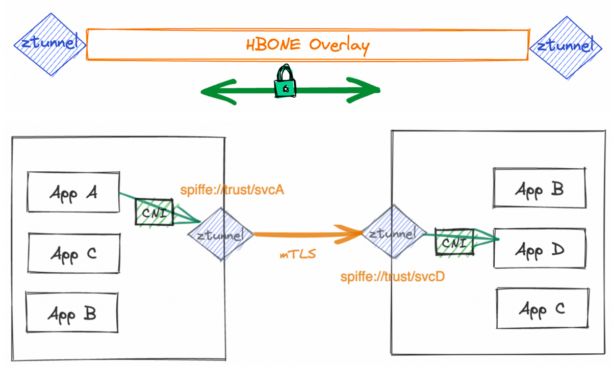
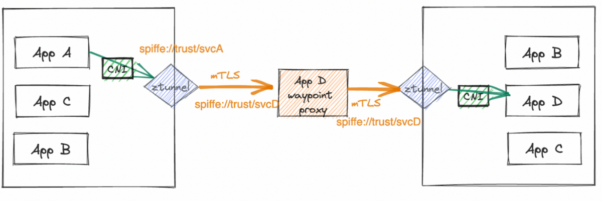
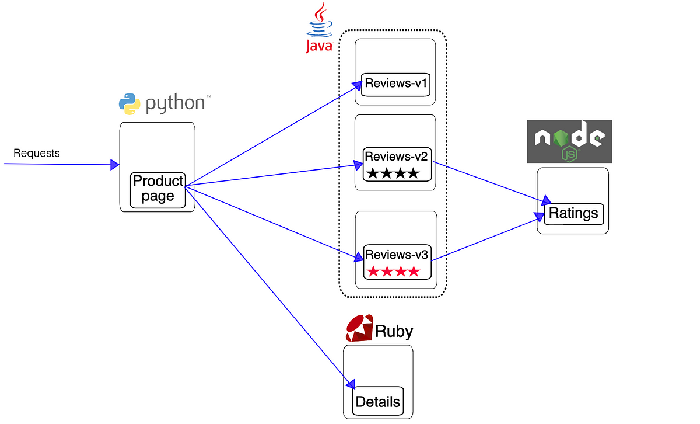

> **The Sidecarless Approach to Connect K8s Services ⚛**

## 🗯 Introduction

Istio with Envoy sidecars has been a great service mesh solution, providing a dynamic networking of microservices that delivers security, observability, and reliability features at the platform layer, rather than the application layer.

A service mesh is essentially the tool that controls this network traffic, ensuring that communication among services is fast, reliable, and secure. Service mesh technology isn't new; it's been around before Kubernetes. But as Kubernetes-based microservices have grown, so has the need for Kubernetes service mesh options. Why? Because microservices rely heavily on networking, and a service mesh helps manage that critical traffic.

Now, we're entering a new approach with Istio Ambient. This innovative approach makes networking in Kubernetes even easier. No more extra steps with sidecars. Services can now communicate more directly and simply.


### 🕸 What is Service Mesh and Istio?

A service mesh is an infrastructure layer that manages communication between microservices in a distributed application. It provides features like traffic management, security, and observability without requiring changes to the application code. Istio is one of the most popular service meshes available. Developed by Google, IBM, and Lyft, Istio provides a comprehensive solution for managing service-to-service communication in microservices architectures.

It offers capabilities such as:

- **Traffic Management**: Istio allows you to control the flow of traffic and API calls between services, enabling advanced routing, load balancing, and traffic splitting for tasks like A/B testing and canary deployments.
- **Security**: Istio enhances security by providing mutual TLS (mTLS) for service-to-service authentication, policy enforcement, and access control.
- **Observability**: Istio generates detailed telemetry data, which helps in monitoring and understanding the behavior of services. It integrates with tools like [Prometheus](https://prometheus.io/) and [Grafana](https://grafana.com/) for metrics and visualization.

Istio's architecture consists of a data plane and a control plane. [The data plane handles the actual network traffic between services using Envoy proxies, while the control plane manages configuration and policy enforcement](https://www.infoworld.com/article/2258313/what-is-istio-the-kubernetes-service-mesh-explained.html).

With the growing popularity of [eBPF](https://ebpf.io/), the recent announcements by Solo.io and Google in September 2022 at KubeCon 2023 regarding sidecarless service meshes - Ambient from Istio and [Cilium](https://isovalent.com/blog/post/cilium-service-mesh/) from Isovalent - have gained significant attention. eBPF is an excellent technology for making simple functions in the Linux kernel. Routing TCP traffic is possible with eBPF. Processing Layer 7 protocols (like HTTP) is not. [Istio can be configured to use eBPF to get traffic to the sidecar proxies](https://istio.io/latest/blog/2022/merbridge/), but for [ambient mode it actually came up with something better](https://istio.io/latest/blog/2024/inpod-traffic-redirection-ambient/).

If you have a lot of iptables rules, you can get a speed-up with eBPF, but for the small number of rules that we need with ambient mode, it's probably not worth the hassle.

## 🌟 What is Ambient?

Istio Ambient is a new mode for Istio that removes the need for sidecar proxies, making it a "sidecar-less" service mesh. [This approach simplifies the management and operation of the service mesh while maintaining the benefits of Istio](https://istio.io/latest/docs/ambient/).

### Transitioning from Sidecar to Sidecar-less with Istio Ambient

Traditionally, Istio uses sidecar proxies (Envoy) that are deployed alongside each microservice. These sidecars handle communication, security, and monitoring tasks.



### Ambient Mode

[In Ambient Mode,](https://istio.io/latest/docs/ambient/overview/) Istio moves away from sidecar proxies to a more centralized approach. It uses two main components:

- **ztunnel (zero-trust tunnel)**: A lightweight, per-node proxy that handles Layer 3 and Layer 4 traffic, providing secure connections and basic routing. Each Kubernetes node in the cluster will be running a daemonset pod — ztunnel. All traffic to and from pods in the node is intercepted by the ztunnel. Ztunnel is a L4 per-node proxy.
- **Waypoint Proxies**: These are optional Layer 7 proxies that can be deployed per namespace to handle more complex traffic management and policy enforcement. Ztunnel is enough for networking between workloads which only have a need for L4 proxy. For L7 requirements, like HTTP header-based routing, L7 authorization, we deploy a workload called waypoint proxy, which are Envoy pods, on a per-application basis. In this case, traffic originating from source ztunnel will hit waypoint proxy and waypoint will then forward it to the destination ztunnel.

### Benefits of Ambient Mode

- **Reduced overhead**: By removing sidecars, Ambient Mode reduces resource consumption and operational complexity.
- **Simplified upgrades**: Upgrading the mesh becomes easier since you don't need to update sidecars for each service.
- **Improved performance**: With fewer proxies, the overall performance of the application can improve.

## 🌐 Ambient Architecture and Components

The architecture and components of Istio Ambient are designed with a two-layer approach for the data plane, addressing different [OSI model layers](https://www.cloudflare.com/en-gb/learning/ddos/glossary/open-systems-interconnection-model-osi/): Layer 4 (TCP) and Layer 7 (HTTP/HTTPS).

This two-layer strategy allows for a step-by-step implementation of new proxy components.

### Layer 4: ztunnel Daemonsets

The first layer involves ztunnel daemonsets deployed on each node, providing Layer 4 secured connectivity with mTLS, authentication, authorization policies, and observability metrics, all without terminating HTTP traffic or headers. The ztunnel agent, a zero-trust tunnel, is responsible for securely connecting and authenticating microservices within the service mesh. Written in Rust for its lightweight and fast performance, it replaces the initial Envoy component due to the size of xDS (discovery service) settings. The Istiod Control plane component pushes configurations to the ztunnel using xDS API settings.


<div class="image-title"><a href="https://www.solo.io/blog/understanding-istio-ambient-ztunnel-and-secure-overlay/">Ztunnel implementation as daemonset, receiving configuration from Istiod</a></div>

Once Layer 4 connectivity is established using ztunnel and Istio-cni daemonsets on each node, Layer 7 capabilities come into play. The Istio-cni component continuously detects which workload pods are added to ambient mode and updates iptables rules to redirect traffic to the node's ztunnel agent. The tunnel between ztunnel agents uses HBONE (HTTP Based Overlay Network Encapsulation) on a dedicated TCP port 15008, employing mTLS and identity and authorization policies for secure traffic transmission. Workload identities are verified using the SPIFFE service identity format based on their service accounts: `spiffe://<trust-domain>/ns/<namespace>/sa/<service-account>`


<div class="image-title"><a href="https://www.solo.io/blog/understanding-istio-ambient-ztunnel-and-secure-overlay/">Ztunnel pods established two-way tunnel with mTLS enabled</a></div>

### Layer 7: Waypoint Proxies

For Layer 7 features, a waypoint proxy (based on Envoy) can be created for each workload service to provide L7 authorization policies, HTTP observability (metrics/logs/traces), and advanced traffic management features like canary deployments. App A pod can directly reach App B pod via ztunnel (with HBONE encapsulation) on Layer 4, or if App B has a waypoint proxy, it will be routed there, apply the routing policies, and then reach App B pod accordingly.


<div class="image-title"><a href="https://www.solo.io/blog/understanding-istio-ambient-ztunnel-and-secure-overlay/">Ztunnel pods established two-way tunnels to waypoint proxy with mTLS enabled, Istiod is still sending configuration data to ztunnel and the waypoint proxy</a></div>

## 🚀 Setup Istio Ambient Mesh on AWS EKS

We expect that you have an AWS EKS cluster created and credentials are configured locally to access it. This demo requires having a cluster running a [supported version of Kubernetes (1.27, 1.28, 1.29, 1.30, 1.31)](https://istio.io/latest/docs/releases/supported-releases/#support-status-of-istio-releases).

### Install Istio

Istio is configured using a command line tool called `istioctl`. Download it, and the Istio sample applications:

```shell
$ curl -L https://istio.io/downloadIstio | sh -
$ cd istio-1.22.3
$ export PATH=$PWD/bin:$PATH
```

Check that you are able to run `istioctl` by printing the version of the command:

```shell
$ istioctl version
no ready Istio pods in "istio-system"
1.22.3
```

Now we can install Istio Ambient Mesh. We should set the profile to ambient. Otherwise, it will install the default Istio with sidecars.

```shell
$ istioctl install --set profile=ambient --set "components.ingressGateways[0].enabled=true" --set "components.ingressGateways[0].name=istio-ingressgateway" --skip-confirmation
```

Once the installation completes, you'll get the following output that indicates all components have been installed successfully.

```shell
✔ Istio core installed
✔ Istiod installed
✔ CNI installed
✔ Ztunnel installed
✔ Installation complete
```

You can verify the installed components using the command `istioctl verify-install`. Or you can also check the pods in `istio-system` to verify the deployments:

```shell
$ kubectl get pods -n istio-system -o wide
```

### Install Kubernetes Gateway API CRDs

You need to install the Kubernetes Gateway API CRDs, which don't come installed by default on most Kubernetes clusters:

```shell
$ kubectl get crd gateways.gateway.networking.k8s.io &> /dev/null || \
  { kubectl kustomize "github.com/kubernetes-sigs/gateway-api/config/crd/experimental?ref=v1.1.0" | kubectl apply -f -; }
```

You will use the Kubernetes Gateway API to configure traffic routing. To discover Istio, we will use the [Bookinfo application](https://istio.io/latest/docs/examples/bookinfo/), composed of four separate microservices.



Deploy the application by running:

```shell
$ kubectl apply -f https://raw.githubusercontent.com/istio/istio/release-1.22/samples/bookinfo/platform/kube/bookinfo.yaml
$ kubectl apply -f https://raw.githubusercontent.com/istio/istio/release-1.22/samples/bookinfo/platform/kube/bookinfo-versions.yaml
```

We will use the Kubernetes Gateway API to deploy a gateway called bookinfo-gateway:

```shell
$ kubectl apply -f https://raw.githubusercontent.com/istio/istio/release-1.22/samples/bookinfo/gateway-api/bookinfo-gateway.yaml
```

Run the following command to get the DNS name of the application to access it from the outside of the cluster:

```shell
$ kubectl get svc -n istio-system
```

It will show the external IP of `istio-ingressgateway`.

### Ambient Injection

Till now, there is no ambient mode enabled. The requests are landing on the Istio ingress pods since it has listeners added by Istio Gateway and thereafter, getting routed to the pods. For mesh-internal calls, it is a direct pod-to-pod communication between the client and server pod. Let us run the below command to label and onboard the default namespace to ambient:

```shell
$ kubectl label namespace default istio.io/dataplane-mode=ambient
namespace/default labeled
```

Now all pods in the default namespace are added to the ambient mesh. 🎉 After labeling the namespace to ambient mode, you will see ztunnel logs showing entries by running below commands:

```shell
$ kubectl log -f -l app=ztunnel -n istio-system
```

### Enforce Authorization Policies

After you have added your application to the ambient mesh, you can secure application access using Layer 4 authorization policies. This feature lets you control access to and from a service based on the client workload identities that are automatically issued to all workloads in the mesh. Let's create an authorization policy that restricts which services can communicate with the productpage service. The policy is applied to pods with the `app: productpage` label, and it allows calls only from the service account `cluster.local/ns/default/sa/bookinfo-gateway-istio`. This is the service account that is used by the Bookinfo gateway you deployed in the previous step.

```shell
$ kubectl apply -f - <<EOF
apiVersion: security.istio.io/v1
kind: AuthorizationPolicy
metadata:
  name: productpage-viewer
  namespace: default
spec:
  selector:
    matchLabels:
      app: productpage
  action: ALLOW
  rules:
  - from:
    - source:
        principals:
        - cluster.local/ns/default/sa/bookinfo-gateway-istio
EOF
```

If you open the Bookinfo application in your browser, you will see the product page, just as before. However, if you try to access the productpage service from a different service account, you should see an error.

### Enforce Layer 7 Authorization Policy

To enforce Layer 7 policies, you first need a waypoint proxy for the namespace. This proxy will handle all Layer 7 traffic entering the namespace.

```shell
$ istioctl x waypoint apply --enroll-namespace --wait
waypoint default/waypoint applied
namespace default labeled with "istio.io/use-waypoint: waypoint"
```

You can view the waypoint proxy and make sure it has the `Programmed=True` status:

```shell
$ kubectl get gtw waypoint
NAME       CLASS            ADDRESS       PROGRAMMED   AGE
waypoint   istio-waypoint   10.96.58.95   True         42s
```

Adding a [L7 authorization policy](https://istio.io/latest/docs/ambient/usage/l7-features/) will explicitly allow the sleep service to send GET requests to the productpage service, but perform no other operations:

```shell
$ kubectl apply -f - <<EOF
apiVersion: security.istio.io/v1
kind: AuthorizationPolicy
metadata:
  name: productpage-viewer
  namespace: default
spec:
  targetRefs:
  - kind: Service
    group: ""
    name: productpage
  action: ALLOW
  rules:
  - from:
    - source:
        principals:
        - cluster.local/ns/default/sa/sleep
    to:
    - operation:
        methods: ["GET"]
EOF
```

Note the `targetRefs` field is used to specify the target service for the authorization policy of a waypoint proxy. The `rules` section is similar as before, but this time we added the `to` section to specify the operation that is allowed.

## 🔚 Key Takeaways

Istio's sidecarless innovation with Ambient Mesh represents a significant leap forward in Kubernetes networking. By getting rid of the sidecars, Ambient Mesh makes the system simpler, uses fewer resources, and works better. This approach not only makes it easier to deploy and manage microservices but also addresses many of the challenges associated with traditional sidecar-based service meshes.

<br>

**_Until next time, つづく 🎉_**

> 💡 Thank you for Reading !! 🙌🏻😁📃, see you in the next blog.🤘  **_Until next time 🎉_**

🚀 Thank you for sticking up till the end. If you have any questions/feedback regarding this blog feel free to connect with me:

**♻️ LinkedIn:** https://www.linkedin.com/in/rajhi-saif/

**♻️ X/Twitter:** https://x.com/rajhisaifeddine

**The end ✌🏻**

<h1 align="center">🔰 Keep Learning !! Keep Sharing !! 🔰</h1>

**📅 Stay updated**

Subscribe to our newsletter for more insights on AWS cloud computing and containers.
