> **A Guide to Network Management in Kubernetes 🕸**

## 📌 Overview

Kubernetes networking is a complex and fascinating topic, with many moving parts. `Kube-Proxy` and `CNI` are two essential components of Kubernetes networking, working together to enable excellent communication between various components.

[Kube-Proxy](https://kubernetes.io/docs/concepts/overview/components/#kube-proxy) is a network proxy that runs on each node in a Kubernetes cluster. It is responsible for maintaining network connectivity between services and pods. Kube-Proxy does this by translating service definitions into actionable networking rules.

[CNI](https://www.cni.dev/), The Container Network Interface (CNI) is a specification for configuring networking resources in Kubernetes. CNI provides a dynamic framework for provisioning IP addresses, establishing cross-host connectivity, and configuring overlay or underlay networks.

This blog post will explore the inner workings of **Kube-Proxy** and **CNI**, and dive into how they integrate with Kubernetes. We will also discuss different Kubernetes network plugins.

## ↳ Kube-Proxy: Kubernetes network proxy

In Kubernetes, the ephemeral nature of Pods means their IP addresses can change, making it challenging to establish stable connections 🤔. This is where the Service object comes into play. Services provide a consistent IP address to access Pods and are linked to a group of Pods. When traffic arrives at a Service, it is intelligently directed to the relevant backend Pods.

But how does this mapping of _`Service to Pod`_ actually function at the networking level? This is where Kube-Proxy excel.

Kube-Proxy serves as a vital Kubernetes agent that resides on each node within the cluster. Its primary role involves monitoring changes to Service objects and their corresponding endpoints. It then translates these changes into tangible network rules within the node.

Typically, Kube-Proxy operates within your cluster as a DaemonSet. However, depending on your cluster's installation type, it can also be directly installed as a Linux process on the node. Regardless of the setup, Kube-Proxy is the unsung hero ensuring that your network traffic efficiently reaches the right destinations in your Kubernetes cluster.

### 💭 How Kube-proxy works

Once `kube-proxy` is installed, it establishes authentication with the `API server`. As new **Services** or **endpoints** are introduced or removed, the API server promptly communicates these changes to Kube-Proxy.

Kube-Proxy takes these updates and translates them into `Network Address Translation (NAT)` rules within the node.

> These NAT rules are essentially mappings, linking Service IP addresses to Pod IP addresses.

When traffic is directed towards a Service, it adheres to these rules, leading it to the appropriate backend Pod.

To illustrate this process further, let's consider an example:

Imagine we have a Service named `SVC01` with a `ClusterIP` type. When `SVC01` is created, the API server examines which Pods should be associated with this Service by matching labels to the Service's label selector. In our case, let's call these Pods `Pod01` and `Pod02`. Subsequently, the API server creates an abstraction known as an `endpoint`, representing the IP address of each of these Pods. So, `SVC01` becomes linked to `2 endpoints`, denoted as `EP01` and `EP02`.

In the final step, the API server maps the IP address of `SVC01` to the IP addresses of `EP01` and `EP02`, solidifying the connection between the Service and its associated endpoints.

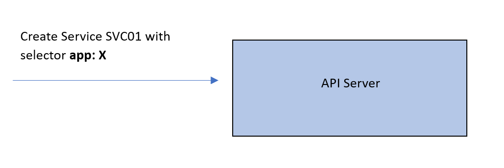
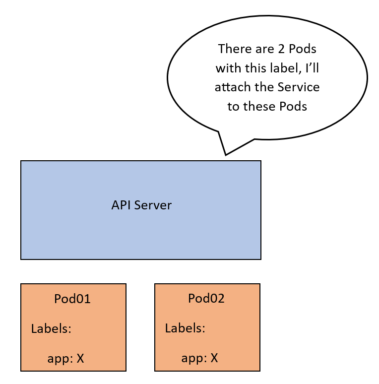
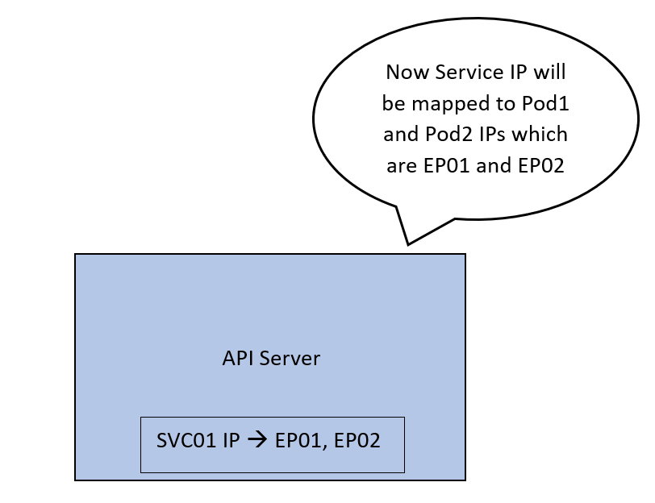


All of this configuration is currently only part of the control plane. We want this mapping to be actually implemented on the network. Once it is applied, traffic coming to the IP of `SVC01` will be forwarded to `EP01` or `EP02`.

So here comes the `Kube-Proxy`. The API server will advertise these updates to the Kube-proxy on each node. Which will apply it as internal rules to the node.

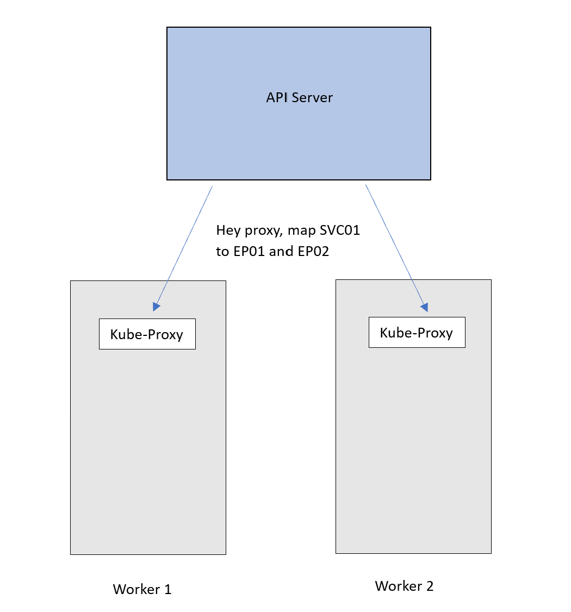
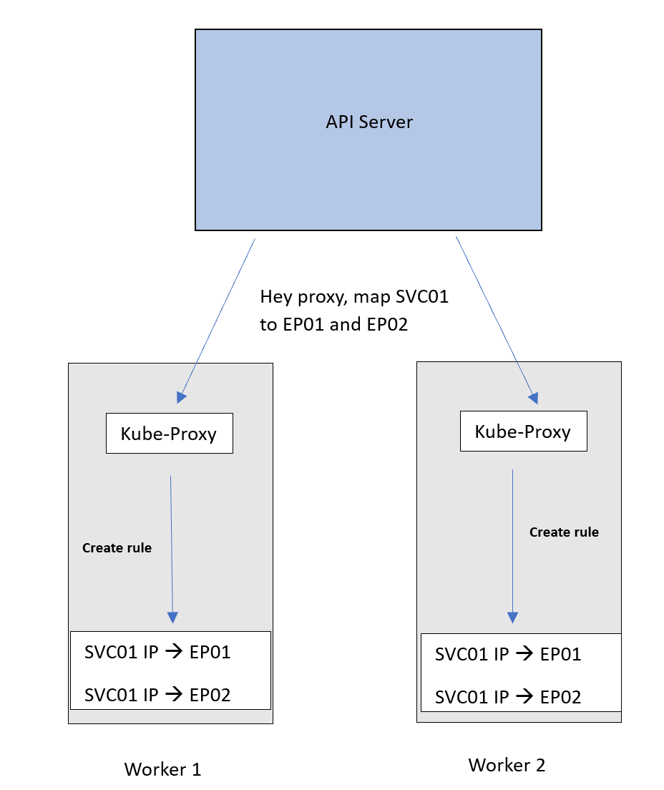

Now traffic destined for the `SVC01` IP will follow this [DNAT](https://en.wikipedia.org/wiki/Network_address_translation#DNAT) rule and get forwarded to the Pods. 

> Remember that `EP01` and `EP02` are basically the IPs of the Pods.

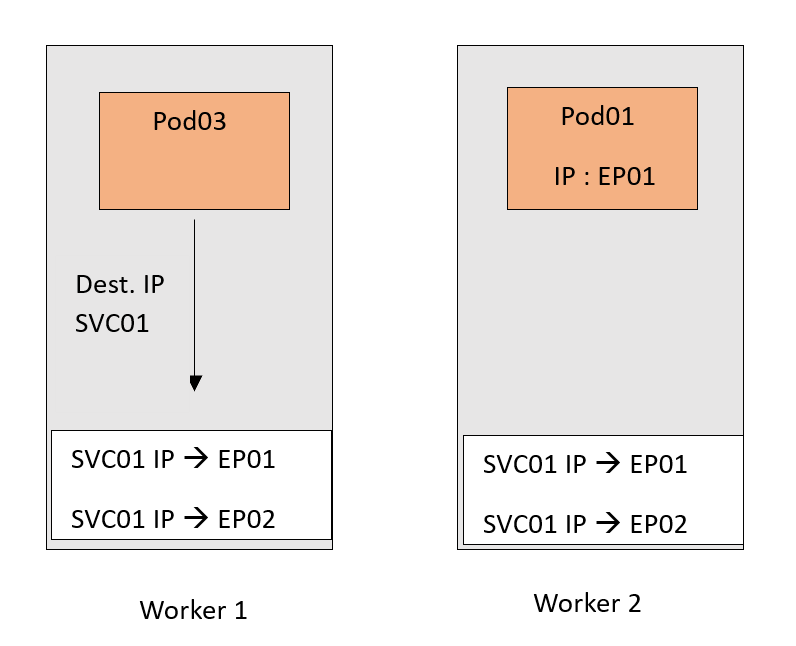
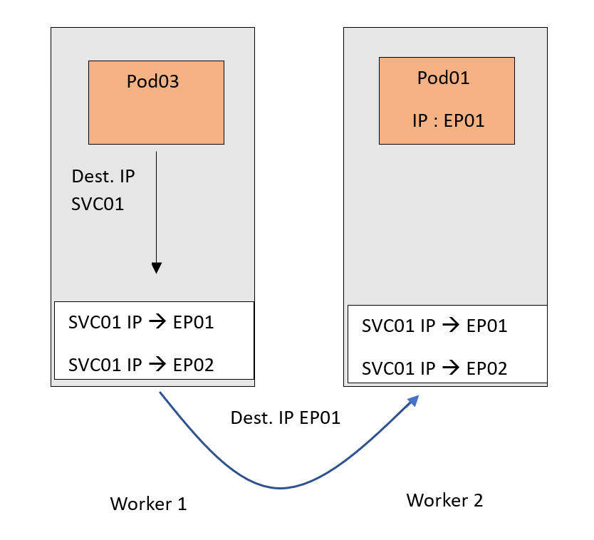

Now of course I tried to keep the scenario as simple as possible. This is just to focus on the important part of the Kube-Proxy.

There are a couple of points that are worth mentioning:

* **IP and port mappings:** Services and endpoints in Kubernetes represent IP and port mappings, ensuring proper routing of traffic to specific combinations of IP addresses and ports within the cluster.
* **ClusterIP and DNAT translation:** ClusterIP services use DNAT (Destination Network Address Translation) on the source node, keeping their IPs hidden from external access. They function as internal NAT rules, exclusively accessible within the cluster.
* **Service types and rode rules**: Different service types can lead to the installation of distinct rules within nodes. These rules may be organized into chains, specific sets of rules with defined order in the traffic path.
* **Random pod selection:** By default, NAT rules select a random Pod to handle incoming traffic. However, this behavior can vary depending on the chosen Kube-Proxy mode, which determines the load balancing strategy for routing traffic to Pods.


## 💭 Understanding Kube-Proxy modes

Kube-Proxy operates in various modes, each with its approach to implementing NAT rules. To grasp their workings and nuances, let's explore these modes:

### ✅ IPtables mode

This is the default and widely used mode. Kube-Proxy relies on `IPtables`, a Linux feature for packet processing and filtering. In this mode, Kube-Proxy inserts `Service-to-Pod NAT` rules into IPtables, redirecting traffic from Service IP to Pod IP.

However, IPtables can become less efficient with a large number of rules, as its sequential algorithm results in O(n) performance. It also lacks specific load balancing algorithms, using a random equal-cost distribution.

Now the Kube-Proxy role can be described more as the "installer" of the rules.

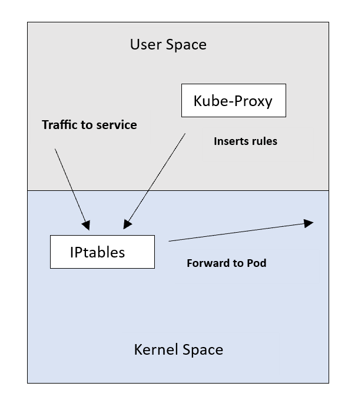

### ✅ IPVS mode

IPVS (IP Virtual Server) is designed for load balancing and offers efficient lookup with O(1) complexity, ensuring consistent performance regardless of rule count. Kube-Proxy in this mode inserts rules into IPVS instead of IPtables.

IPVS supports various load balancing algorithms like round robin and least connections. Note that IPVS may not be available on all Linux systems, unlike IPtables.

### ✅ KernelSpace mode

This mode is exclusive to Windows nodes. Kube-Proxy utilizes Windows Virtual Filtering Platform (VFP) to insert packet filtering rules. VFP works similarly to IPtables on Linux, responsible for packet encapsulation and destination IP address replacement. If you're familiar with virtual machines on the Windows platform, think of VFP as an extension of the Hyper-V switch.

### ✅ Userspace mode

In the early days, Kube-Proxy used the Userspace mode, where it managed connections by proxying them through a user-level process. While charming and simple, this mode is less efficient than others and is akin to riding a bike with training wheels.

Each Kube-Proxy mode has its advantages and limitations, making the choice of mode an essential consideration based on your specific cluster's needs and infrastructure.

**⛓ Checking Kube-Proxy mode**

To determine the mode in which Kube-Proxy is running, you can use the `/proxyMode` endpoint, which Kube-Proxy exposes for querying information. 

Here's how you can do it:

* **SSH into a cluster node:** Connect to one of the nodes within your Kubernetes cluster using SSH.
*** Use curl to query Kube-Proxy:** Once connected, execute the following command using curl to query the Kube-Proxy mode:

```shell
curl -v localhost:10249/proxyMode
```

This command will retrieve information about the Kube-Proxy mode, helping you verify which mode it is currently operating in.

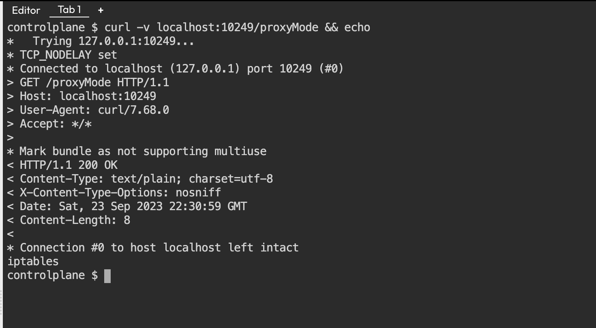

Here you can see the last line that Kube-Proxy is using `iptables` mode.

**Recap: Kubernetes Service and Kube-Proxy:**

* A Kubernetes Service operates akin to a proxy by providing a stable IP address for client connections. It directs traffic received at this IP to the corresponding backend Pod IP, effectively solving the issue of Pods' dynamic IP changes.
* In terms of load balancing, it depends on which aspect of Kube-Proxy is under consideration. The Kube-Proxy agent itself does not handle traffic or perform load balancing; it's solely part of the control plane responsible for creating Service rules. However, Kube-Proxy, through the rules it generates, facilitates load balancing by distributing traffic across multiple identical Pods associated with a specific Service. These Pods serve as replicas and collectively handle incoming requests.


## ↳ Container Network Interface CNI

Container Network Interface (CNI) is a framework that allows you to dynamically configure networking resources for your Kubernetes clusters. It uses a plugin architecture, so you can use the CNI plugins that best meet your needs.

CNI can be used to configure both `overlay` and `underlay` networks:

* **Overlay networks** encapsulate network traffic using a virtual interface such as [Virtual Extensible LAN (VXLAN)](https://datatracker.ietf.org/doc/html/rfc7348).
* **Underlay networks** work at the physical level and comprise switches and routers.

Once you've chosen a network configuration type, the container runtime defines the network that containers will join. The runtime adds the interface to the container namespace via a call to the CNI plugin and allocates the connected subnetwork routes via calls to the I`P Address Management (IPAM)` plugin.

CNI can be used with Kubernetes and other Kubernetes-based container orchestration platforms such as OpenShift. It uses a software-defined networking (SDN) approach to unify container communication throughout clusters.


## 📍 Kubernetes networking

Kubernetes provides networking for containerized applications with a flat network structure. This eliminates the need to map host ports to container ports, enabling the operation of a distributed system without dynamic port allocation.

The networking architecture in Kubernetes is based on the Container Network Interface (CNI) plugin specification. This plugin acts as a common interface between the Kubernetes runtime and the underlying network, supporting various networking solutions like Flannel, Calico, Weave Net, and Cilium.


### How Kubernetes networking works?

When a Kubernetes Pod is created, the CNI plugin configures the network interface, assigning an IP address to the Pod. This facilitates communication within the Kubernetes Pod network, which is a flat network accessible to all Pods in the cluster.

Additionally, Pods can interact with external applications through the Kubernetes Service network, a virtual network that exposes Pods to external entities.

Kubernetes networking offers several benefits:

* `Portability`: Kubernetes clusters can be deployed across different cloud providers and on-premises environments.
* `Scalability`: It supports a large number of Pods within a Kubernetes cluster.
* `Reliability`: Ensures consistent connectivity for Pods in a Kubernetes cluster.


Both Linux container and container networking technology are continuing to evolve to meet the needs of applications running in various environments. CNI is an initiative of the Cloud-Native Computing Foundation (CNCF), which specifies the configuration of Linux container network interfaces.

CNI was created to make networking solutions integratable with a range of container orchestration systems and runtimes. Instead of making the networking solutions pluggable, it defines a common interface standard for both the networking and container execution layers.


<div class="note">
    <p><strong>🔵 Note:</strong></p>
    <p>CNI is not native to Kubernetes. Developers using the CNI standard can create network plugins to interoperate with a variety of container runtimes. CNI networks can use an encapsulated network model,
    such as <a href="https://www.techtarget.com/whatis/definition/VXLAN">Virtual Extensible LAN (VXLAN)</a>, or an unencapsulated - also known as decapsulated - network model, such as <a href="https://www.techtarget.com/searchnetworking/definition/BGP-Border-Gateway-Protocol">Border Gateway Protocol (BGP).</a></p>
</div>


**How CNI works?**

CNI uses a plugin architecture to configure the Kubernetes cluster's networking. The CNI plugin is responsible for creating and configuring the network interface for each container. When a container is created,
the Kubernetes kubelet calls the CNI plugin to set up the network interface, assign an IP address, and add it to the Kubernetes network.


The CNI plugin also interacts with the `IP Address Management (IPAM) plugin` to allocate IP addresses to containers. This involves managing the pool of available IP addresses and assigning them as needed. Once the network interface is established, the kubelet starts the container,
enabling it to communicate with other containers on the Kubernetes network.

CNI focuses on the connectivity of container networks and the removal of allocated resources upon the termination of containers. This focus makes CNI specifications simple and allows them to be widely adopted.
For additional information on CNI specifications, including third-party plugins and runtimes, refer to the [CNI GitHub project](https://github.com/containernetworking/cni).


## 🧵Diverse Kubernetes network plugins necessity

Kubernetes relies on a rich ecosystem of network plugins, many of which are endorsed and widely adopted by major container orchestration platforms, with Kubernetes at the forefront.

These plugins play a crucial role in enabling various container networking functions, all while adhering to the rigorous standards set forth in the Container Network Interface (CNI) specification. Given the inherent complexity of networking, CNI thoughtfully delineates specifications for multiple plugins, recognizing that user requirements can greatly vary.

Within the realm of CNI, networks can be instantiated using two primary models: `encapsulated` and `unencapsulated`.

**The encapsulated(Overlay) network model:**

This model is represented by technologies like `VXLAN` and `IPsec`, overlays a logical Layer 2 network over an existing Layer 3 network topology. This approach simplifies routing complexity and minimizes overhead.

It relies on UDP ports to disseminate encapsulation data among Kubernetes workers, creating a bridge connecting these workers and pods. Communication management within pods is then expertly handled by Docker or alternative container engines.

This encapsulated network model proves particularly advantageous for scenarios that favor a Layer 2 bridge, especially those sensitive to Kubernetes worker latencies in a Layer 3 environment. 

For distributed data centers spanning distinct geographic locales, minimizing latency is pivotal in preventing network segmentation.

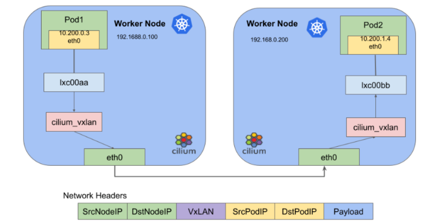

**🧩 The unencapsulated(Underlay) network model:**

This model extends a Layer 3 network to facilitate the routing of packets among containers. Unlike the encapsulated counterpart, this model does not introduce an isolated Layer 2 network or any associated overhead. However, it places the onus of managing necessary route distribution squarely on the shoulders of Kubernetes workers.

To make this work, a network protocol is put into action, connecting Kubernetes workers and utilizing the Border Gateway Protocol (BGP) to efficiently propagate routing information to pods. Within these pods, the role of overseeing communication with workloads is assumed by Docker or a comparable container engine. The unencapsulated network model is ideally suited for scenarios favoring a routed Layer 3 network.

Here, routes for Kubernetes workers undergo dynamic updates at the operating system level, effectively mitigating latency concerns. In essence, Kubernetes networking unfolds as a multifaceted landscape, offering a plethora of plugin choices while accommodating diverse network models tailored to the distinct needs of your containerized workloads.

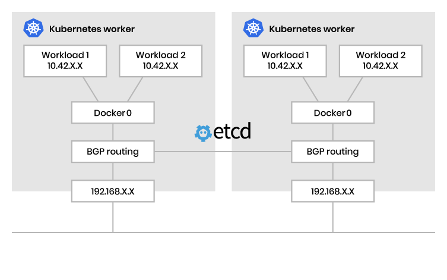

## 🐝 CNI with Cilium

[alt text](./cilium.png)


[Cilium](https://www.solo.io/topics/cilium/) is an open-source project that enables networking, security, and observability for Kubernetes clusters and other containerized environments.

It is based on a technology called [eBPF](https://ebpf.io/), which can inject network control logic, security controls, and observability features directly into the Linux kernel.

[Cilium CNI](https://docs.cilium.io/en/stable/) is a powerful networking plugin for Kubernetes which provides enhanced security and networking capabilities for containerised applications. It leverages the power of eBPF (extended Berkeley Packet Filter), a highly efficient and programmable kernel-level technology, to deliver transparent network security and traffic monitoring features.

Cilium uses VXLAN to form an overlay network and extended Berkeley Packet Filter to manage network connectivity and application rules. It supports both IPv4 and IPv6 addressing and uses BGP for unencapsulated routing. Cilium can support multiple Kubernetes clusters and, like Multus, provides multi-CNI capabilities.

Cilium handles aspects of network management, such as network policies, through HTTP request filters. Policies can be written to YAML or JSON files, both of which provide network traffic enforcement for incoming and outgoing traffic.

 > Cilium can run using VXLAN as an overlay network for encapsulation and routingor BGP routing as an underlay network. Cilium used to rely on metallb to power it's BGP features, but since Cilium 1.3 it is possible to use their own implementation built on GoBGP.

Cilium Is the only CNI with L7 aware policies. This means you can write Kubernetes networking policies that understand DNS, HTTP, and even Kafka.

For example, you can write a DNS L7 networking policy to:

**🧩 Restrict DNS Resolution to Subset:**

```yaml
apiVersion: cilium.io/v2
kind: CiliumClusterwideNetworkPolicy
metadata:
  name: dns-allow-list
spec:
  endpointSelector: {}
  egress:
    - toEndpoints:
      - matchLabels:
        io.kubernetes.pod.namespace: kube-system
        k8s-app: kube-dns
      toPorts:
        - ports:
          - port: "53"
            protocol: UDP
          rules:
            dns:
              - matchPattern: "*.abc.xyz"
              - 
```

**🧩 Allow POST HTTP requests to abc.xyz:**

```yaml
apiVersion: cilium.io/v2
kind: CiliumNetworkPolicy
metadata:
  name: http-post-abc-xyz
spec:
  endpointSelector: {}
  egress:
    - toPorts:
        - ports:
            - port: "443"
              protocol: TCP
      rules:
        http:
          - method: POST
    - toFQDNs:
        - matchPattern: "*.abc.xyz"
```

**🧩 Restrict Kafka Topic Access to the Following Pods:**

Typically, we're forced to write networking policies like: "Allow any application with the label kafka-consumer" to speak to Kafka. This casts a rather wide net, when with L7 policies we can limit the access to individual topics depending on the labels. As such, we can say that only the "beer-brewer" can publish to the hops topic. Amazing, right?

```yaml
apiVersion: cilium.io/v2
kind: CiliumNetworkPolicy
metadata:
  name: beer-brewers
spec:
  ingress:
    - fromEndpoints:
        - matchLabels:
            role: beer-brewer
      toPorts:
        - ports:
            - port: 9092
              protocol: TCP
          rules:
            kafka:
              - role: produce
                topic: hops
```


### 🎩 Developer experience

Now don't worry if these resources look difficult, because Cilium has that covered too. All of these network policies can be visualised, modified, and event constructed through an entirely point and click visual builder.

Check out the [Cilium Editor](https://editor.networkpolicy.io/) to see for yourself.

### 🐧 Installing Cilium

Cilium is installable as a Helm chart. So you'll first need to make the repository available:

```shell
helm repo add cilium https://helm.cilium.io/
```

Next, we can begin to understand and tweak the default values for the installation we require.

The highlights are:

**IPAM mode:**

Cilium has a few different modes to manage IPAM.

```shell
--set global.ipam.mode=cluster-pool
--set global.ipam.operator.clusterPoolIPv4PodCIDR=192.168.0.0/16
--set global.ipam.operator.clusterPoolIPv4MaskSize=23
```

Cilium also has a preview feature where the IPAM mode can be set to `cluster-pool-v2beta`,
which allows for dynamic, resource usage-based, allocation of node CIDRs.

**eBPF and XDP:**

eBPF is a relatively new technology that runs within the Linux kernel and enables the execution of eBPF programs, which run in a sandbox environment.

These programs allow for user-land code to run within the kernel with unprecedented performance; extending the capabilities of the kernel.

XDP leverages eBPF to provide a highly performant packet processing pipeline that runs as soon as the networking driver receives the packet. What does this actually mean? Well, with XDP - Cilium can help mitigate DDOS attacks by dropping packets before they even hit the traditional networking stack.

Cilium's use of eBPF and XDP means we're not reliant on iptables, so we can actually disable the kube-proxy altogether. You'll need to do this with kubeadm and through Cilium's deploy.

```shell
--set kubeProxyReplacement=probe
```

**Native routing:**

As discussed above, Cilium doesn't need encapsulation to handle the routing of packets within our cluster; so let's ensure we enable it.

```shell
--nativeRoutingCIDR=192.168.0.0/16
```

**Hubble:**

As Hubble and Cilium observability is a big part of the appeal, let's not forget to enable it.

```shell
--set global.hubble.relay.enabled=true
--set global.hubble.enabled=true
--set global.hubble.listenAddress=":4244"
--set global.hubble.ui.enabled=true
```

**Complete install:**

```shell
helm repo add cilium https://helm.cilium.io/
helm upgrade --install cilium/cilium cilium \
                --version 1.13.4 \
                --namespace kube-system \
                --set image.repository=quay.io/cilium/cilium \
                --set global.ipam.mode=cluster-pool \
                --set global.ipam.operator.clusterPoolIPv4PodCIDR=192.168.0.0/16 \
                --set global.ipam.operator.clusterPoolIPv4MaskSize=23 \
                --set global.nativeRoutingCIDR=192.168.0.0/16 \
                --set global.endpointRoutes.enabled=true \
                --set global.hubble.relay.enabled=true \
                --set global.hubble.enabled=true \
                --set global.hubble.listenAddress=":4244" \
                --set global.hubble.ui.enabled=true \
    --set kubeProxyReplacement=probe \
    --set k8sServiceHost=${PUBLIC_IPv4} \
    --set k8sServicePort=6443
```

Cilium might be much newer to the Kubernetes CNI landscape, but in its short time,
it has become the gold standard for Kubernetes networking.

While Calico is also a great option, Cilium's adoption of eBPF and XDP provides a future-facing solution,
enriched with the best debugging tool available (Hubble) and the best developer experience with the assistance of the Cilium Editor.

## Closing thoughts

Kubernetes networking is powered by two vital components: Kube-Proxy and CNI.

Kube-Proxy maintains network rules and forwards traffic to Pods, while CNI provides a common interface to the underlying network. These components are essential for running containerized applications on Kubernetes.

<br>

**_Until next time, つづく 🎉_**

> 💡 Thank you for Reading !! 🙌🏻😁📃, see you in the next blog.🤘  _**Until next time 🎉**_

🚀 Thank you for sticking up till the end. If you have any questions/feedback regarding this blog feel free to connect with me:

**♻️ LinkedIn:** https://www.linkedin.com/in/rajhi-saif/

**♻️ X/Twitter:** https://x.com/rajhisaifeddine

**The end ✌🏻**

<h1 align="center">🔰 Keep Learning !! Keep Sharing !! 🔰</h1>

**📅 Stay updated**

Subscribe to our newsletter for more insights on AWS cloud computing and containers.
