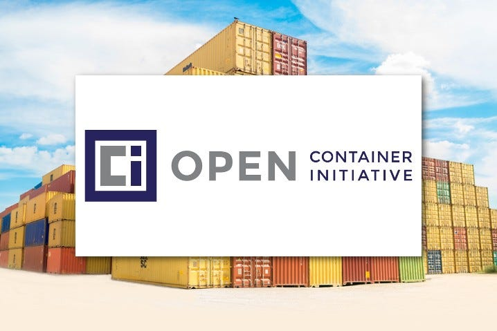
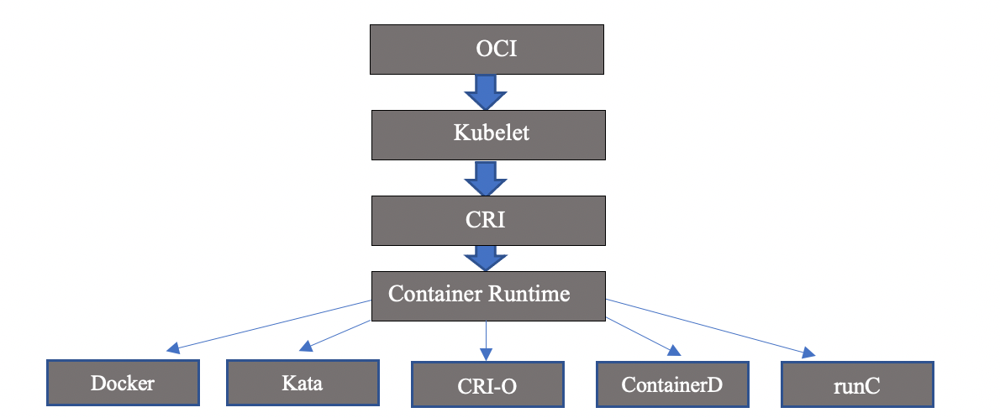
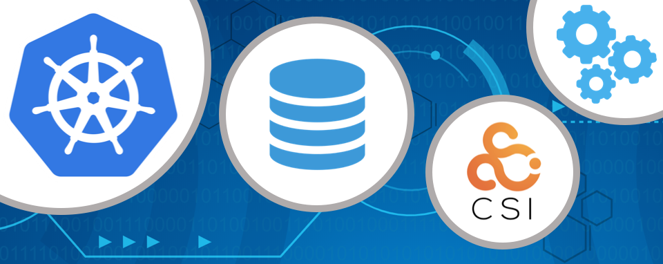
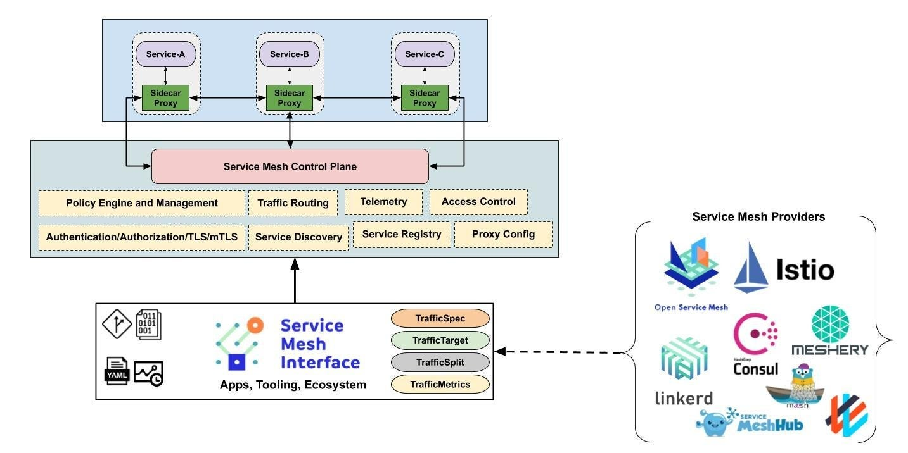
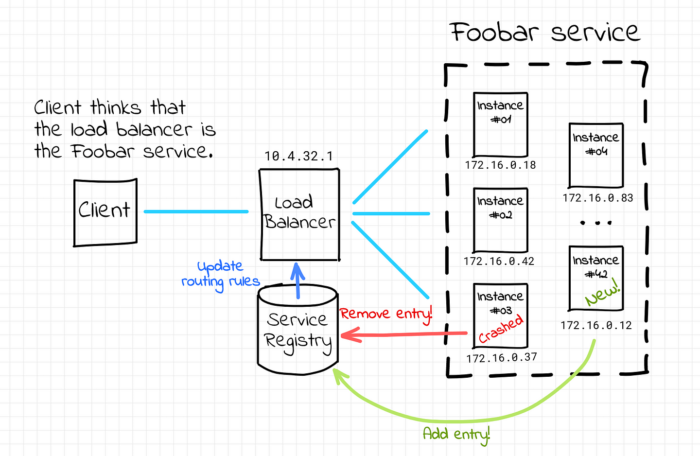
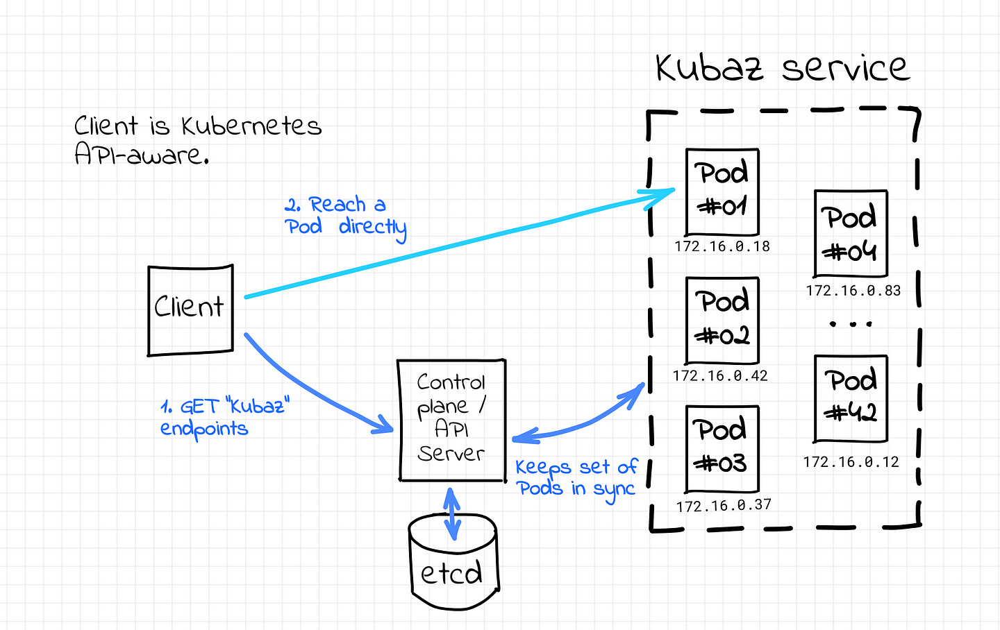

> **Discover k8s open standards (OCI, CRI, CNI, CSI, SMI, CPI, KSD, CIL) 🕸**

## 🎲 Preamble

Kubernetes relies on a number of open standards to function effectively.

These standards define the best practices for implementing Kubernetes, and they play a vital role in supporting the platform's scalability, flexibility, and security.

By understanding the Kubernetes open standards, you will be better equipped to use the platform effectively. You will also be able to contribute to the Kubernetes community and help to shape the future of container orchestration.

I hope this introduction sparks your interest in learning more about Kubernetes open standards. Stay tuned for the next installment of this blog series, where we will take a deeper dive into each of these standards.

## 📶 Purpose

In this blog post, we will provide a brief overview of the most important Kubernetes open standards. We will discuss OCI, CRI, CNI, CSI, SMI, and CPI, and we will explain how these standards work together to make Kubernetes the powerful platform that it is.

## 👉 Open Container Initiative (OCI): A Standard for Container Image Formats and Runtimes

The [Open Container Initiative (OCI)](https://opencontainers.org/) is a community-driven open standard for container image formats and runtimes. It was created to provide a common set of specifications that can be used by different container runtimes and tools. This makes it easier to move containers between different environments and to use them with a variety of tools.

Some examples of OCI-compliant container images include Docker images, [CRI-O images](https://cri-o.io/), and rkt images.

OCI-compliant runtimes include runC, [containerd](https://containerd.io/), and CRI-O.

The two most important specifications in the OCI are the image format specification and the runtime specification.

- ☑️ **Image Format Specification**: Defines the format of container images, including the way that the images are stored and the way that they are loaded into a container runtime.
- ☑️ **Runtime Specification**: Defines the interface that a container runtime must implement in order to run OCI-compliant container images.

The OCI is a valuable standard that is helping to make containers more portable and interoperable. It is used by a wide range of container runtimes and tools, and it is likely to continue to grow in importance in the years to come.

## 👉 Container Network Interface (CNI): A Standard for Container Networking

The [Container Network Interface (CNI)](https://github.com/containernetworking/cni) is a standard for configuring and managing container networks. It was created to provide a common way to connect containers to networks, regardless of the underlying infrastructure.

CNI is a plug-in architecture, which means that different CNI plugins can be used to configure different types of networks. Some popular CNI plugins include [Flannel](https://github.com/flannel-io/flannel), [Calico](https://www.projectcalico.org/), and [Weave Net](https://www.weave.works/docs/net/latest/overview/).

CNI is a valuable standard that is helping to make container networking more portable and interoperable. It is used by a wide range of container orchestration platforms, including Kubernetes, Docker Swarm, and Mesos.

Here are some examples of CNI plugins:

- **Flannel**: A CNI plugin that uses a virtual overlay network to connect containers.
- **Calico**: A CNI plugin that uses a policy-based networking model to connect containers.
- **Weave Net**: A CNI plugin that uses a mesh network to connect containers.

## 👉 Container Runtime Interface (CRI): A Standard for Communicating with Container Runtimes

The **Container Runtime Interface (CRI)** is a standard for communicating with container runtimes. It was created to provide a consistent way for Kubernetes to interact with different container runtimes.

CRI is a plug-in architecture, which means that different CRI plugins can be used to support different container runtimes. Some popular CRI plugins include [CRI-O](https://cri-o.io/) and [containerd](https://containerd.io/).

CRI is a valuable standard that is helping to make container orchestration more portable and interoperable. It is used by Kubernetes, which is the most popular container orchestration platform.

- **CRI-O**: A CRI plugin that uses containerd as its underlying container runtime. CRI-O is a lightweight and efficient container runtime that is well-suited for use with Kubernetes.
- **containerd**: A standalone container runtime that implements the CRI standard. containerd is a popular choice for container runtimes because it is well-maintained and supported by a large community.
- **Docker Engine**: A containerization platform that uses its own container runtime, called Docker Engine. Docker Engine is not compatible with the CRI standard, so it cannot be used as a CRI plugin with Kubernetes. However, there is a project called [dockershim](https://kubernetes.io/blog/2020/12/02/dockershim-faq/) that allows Kubernetes to communicate with Docker Engine. Dockershim is a compatibility layer that bridges the gap between the CRI standard and Docker Engine.

> **Note**: Dockershim is deprecated as of Kubernetes 1.23, and it will be removed in a future version of Kubernetes. If you are using Docker with Kubernetes, you should use a CRI-compatible container runtime such as CRI-O or containerd. These runtimes are more efficient and offer better performance than Docker Engine.

## 👉 Container Storage Interface (CSI): A Standard for Exposing Storage to Containers

The **Container Storage Interface (CSI)** is a standard for exposing storage to containers. It was created to provide a consistent way for Kubernetes to interact with different storage providers.

CSI is a plug-in architecture, which means that different CSI drivers can be used to support different storage providers. Some popular CSI drivers include [Portworx](https://portworx.com/), [AWS Elastic Block Storage](https://docs.aws.amazon.com/eks/latest/userguide/csi-aws-ebs.html), and [NetApp](https://www.netapp.com/).

CSI is a valuable standard that is helping to make container storage more portable and interoperable. It is used by Kubernetes, which is the most popular container orchestration platform.

Here are some examples of CSI drivers:

- **Portworx**: A CSI driver that provides a high-performance, scalable, and secure storage solution for Kubernetes.
- **AWS Elastic Block Storage**: A Container Storage Interface (CSI) Driver for AWS Elastic Block Storage (EBS).
- **NetApp**: A CSI driver that provides NetApp storage solutions for Kubernetes.

## 👉 Service Mesh Interface (SMI): A Standard for Service Meshes on Kubernetes

The [Service Mesh Interface (SMI)](https://smi-spec.io/) is a standard for service meshes on Kubernetes. It was created to provide a consistent way for Kubernetes to interact with different service mesh implementations.

SMI is a plug-in architecture, which means that different SMI adapters can be used to support different service mesh implementations. Some popular SMI adapters include [Istio](https://istio.io/), [Linkerd](https://linkerd.io/), and [Consul Connect](https://www.consul.io/docs/connect).

SMI is a valuable standard that is helping to make service meshes more portable and interoperable. It is used by Kubernetes, which is the most popular container orchestration platform.

Here are some examples of SMI adapters:

- [**Istio**](https://istio.io/): A popular service mesh that provides a wide range of features, including traffic management, service discovery, and security.
- [**Linkerd**](https://linkerd.io/): A lightweight service mesh that is well-suited for use with Kubernetes.
- [**Consul Connect**](https://developer.hashicorp.com/consul/docs/connect): A service mesh that is integrated with Consul, a popular service discovery and configuration management tool.

## 👉 Cloud Provider Interface (CPI): A Standard for Cloud-Native Infrastructure

The [Cloud Provider Interface (CPI)](https://cloud-provider-vsphere.sigs.k8s.io/cloud_provider_interface.html) is a standard for cloud-native infrastructure. It was created to provide a consistent way for Kubernetes to interact with different cloud providers.

CPI is a plug-in architecture, which means that different CPI plugins can be used to support different cloud providers. Some popular CPI plugins include AWS, Azure, and GCP.

CPI is a valuable standard that is helping to make cloud-native infrastructure more portable and interoperable. It is used by Kubernetes, which is the most popular container orchestration platform.

Here are some examples of CPI plugins:

- **AWS**: A CPI plugin that provides support for [Amazon Web Services (AWS)](https://aws.amazon.com/).
- **Azure**: A CPI plugin that provides support for [Microsoft Azure](https://azure.microsoft.com/).
- **GCP**: A CPI plugin that provides support for [Google Cloud Platform (GCP)](https://cloud.google.com/).

## 👉 Kubernetes Service Discovery (KSD)

**Kubernetes Service Discovery (KSD)** is a standard for discovering and connecting to services in Kubernetes. It allows applications to find each other without having to know their IP addresses or ports.

KSD is implemented using a variety of mechanisms, including DNS, environment variables, and Kubernetes API calls. The specific mechanism that is used depends on the configuration of the Kubernetes cluster.

KSD is an important part of Kubernetes because it allows applications to be deployed and scaled without having to manually update the configuration of each application. This makes Kubernetes more portable and scalable.

## 👉 Container Image Library (CIL)

The **Container Image Library (CIL)** is a standard for storing and distributing container images. It is a set of specifications that define how container images are stored, indexed, and distributed.

CIL is used by a variety of container registries, including [Docker Hub](https://hub.docker.com/), [Quay.io](https://quay.io/), and [Harbor](https://goharbor.io/). It allows container images to be shared and reused across different platforms and environments.

CIL is an important standard because it ensures that container images are portable and interoperable. This makes it easier to use container images in a variety of different applications.

## 🉑 Synthesis

As the container ecosystem continues to grow, the importance of open standards will only increase. By providing a common set of specifications, open standards make it easier for different components of Kubernetes to work together seamlessly. This allows Kubernetes to be used in a wider range of environments and to support a wider range of applications.

The future of container orchestration is bright, and open standards will play a key role in its success. By continuing to develop and evolve, open standards will help to ensure that Kubernetes remains the leading container orchestration platform for years to come.

 

**_Until next time, つづく 🎉_**

> 💡 Thank you for Reading !! 🙌🏻😁📃, see you in the next blog.🤘  **_Until next time 🎉_**

🚀 Thank you for sticking up till the end. If you have any questions/feedback regarding this blog feel free to connect with me:

**♻️ LinkedIn:** https://www.linkedin.com/in/rajhi-saif/

**♻️ X/Twitter:** https://x.com/rajhisaifeddine

**The end ✌🏻**

<h1 align="center">🔰 Keep Learning !! Keep Sharing !! 🔰</h1>

**📅 Stay updated**

Subscribe to our newsletter for more insights on AWS cloud computing and containers.
