> **Protect Your Kubernetes Clusters from Attacks**

## 📗 Introduction

Kubernetes is a popular container orchestration platform that has revolutionized the way we develop and deploy applications. However, with great power comes great responsibility, and Kubernetes security is a top concern for many organizations.

[The OWASP Kubernetes Top 10](https://owasp.org/www-project-kubernetes-top-ten/) is a prioritized list of the most common security risks associated with Kubernetes. It is an essential resource for security practitioners, system administrators, and software developers alike.

In this blog post, we will take a comprehensive look at the OWASP Kubernetes Top 10. We will discuss each risk in detail, and provide recommendations for mitigating it. We will also group some of the risks together into categories, such as misconfigurations, monitoring, and vulnerabilities. Finally, we will recommend some tools and techniques for auditing your configuration and making sure that your security posture is the most appropriate.

We hope that this blog post will help you to understand and mitigate the security risks associated with Kubernetes.

## 📌 Overview

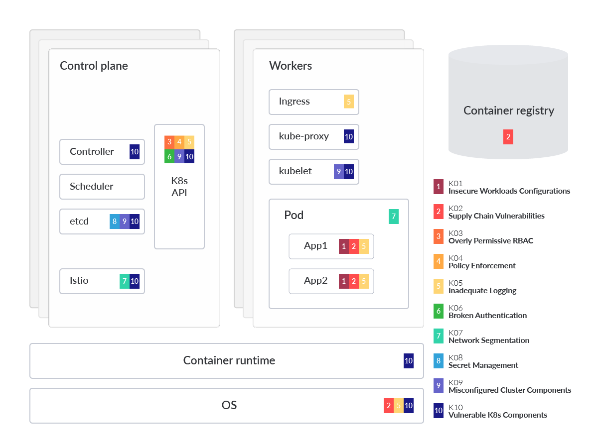

In the visual above, we spotlight which component or part is impacted by each of the risks that appear in OWASP Kubernetes mapped to a generalized Kubernetes threat model to aid in understanding. This analysis also dives into each OWASP risk, providing technical details on why the threat is prominent, as well as common mitigations. It's also helpful to group the risks into three categories and in order of likelihood.

The OWASP (Open Web Application Security Project) is a non-profit organization dedicated to enhancing software security. While initially concentrating on web application security, OWASP has expanded its focus due to evolving system designs.

As software development transitions from traditional monolithic architectures hosted on virtual machines shielded behind firewalls to contemporary microservice setups running on cloud infrastructure, it becomes imperative to adapt security measures to suit each unique application environment.

For this reason, the OWASP Foundation has introduced the OWASP Kubernetes Top 10, comprising the ten most prevalent attack vectors tailored specifically for the Kubernetes environment.

## K00: Welcome to the Kubernetes Security Top Ten

The OWASP Kubernetes Top 10 is a comprehensive guide designed to help organizations understand and mitigate the most critical security risks associated with Kubernetes. As Kubernetes adoption grows, so do the potential risks to applications and infrastructure. This guide serves as a starting point for security practitioners, system administrators, and software developers to prioritize and address these risks effectively.

### K01: Insecure Workload Configurations


Insecure workload configurations are one of the most common risks in Kubernetes environments. These misconfigurations can lead to vulnerabilities that attackers can exploit. Ensuring that workloads are configured securely involves setting appropriate resource limits, using security contexts, and avoiding the use of privileged containers. Regular audits and automated tools can help identify and remediate insecure configurations.

The security context of a workload in Kubernetes is highly configurable, which can lead to serious security misconfigurations across an organization's workloads and clusters. [According to Redhat's 2022 report](https://www.redhat.com/en/resources/kubernetes-adoption-security-market-trends-overview), nearly 53% of respondents experienced a misconfiguration incident in their Kubernetes environments in the last 12 months. Cloud providers like AWS, GCP, and Azure offer various security features, but the shared security model means users must also implement security measures. Administrators should prioritize safe image usage, maintain updated operating systems, and conduct continuous audits to prevent misconfigurations, which are common entry points for attackers.

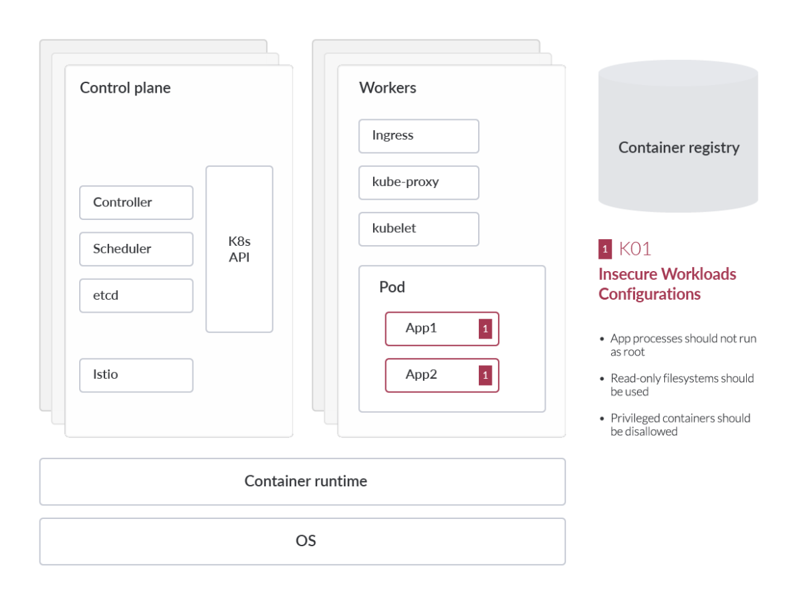

### Insecure Workload Configurations

- Misconfigurations in Kubernetes workloads can lead to serious security issues.
- Cloud providers offer security features, but users must also implement security measures.
- Administrators should prioritize safe image usage, maintain updated OS, and conduct continuous audits.
- Misconfigurations are common entry points for attackers.

**Operating System:**

- Use minimal, streamlined images like Alpine Linux to reduce potential security risks.
- Start with a base image and add necessary packages gradually.

**Audit Workloads:**

- Use [CIS Benchmark for Kubernetes](https://www.cisecurity.org/benchmark/kubernetes) and tools like [kube-bench](https://github.com/aquasecurity/kube-bench) or [trivy](https://aquasecurity.github.io/trivy/v0.56/tutorials/kubernetes/cluster-scanning/) to discover misconfigurations.

**Preventing Workload Misconfigurations with OPA:**

- [Open Policy Agent (OPA)](https://github.com/open-policy-agent/gatekeeper) helps identify and rectify misconfigurations.
- OPA can enforce policies to prevent insecure configurations.

### Misconfigured Cluster Components

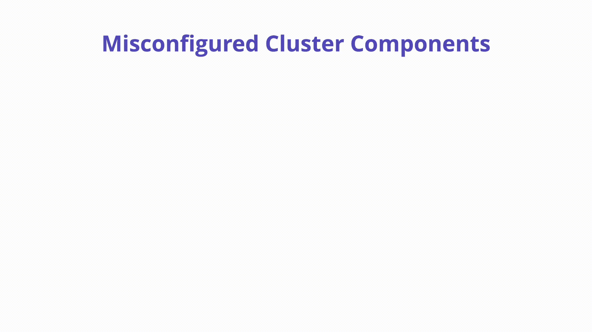

- Continuous and automatic auditing of IaC and Kubernetes YAML manifests is crucial.
- Misconfigurations in core components like Kubelet can lead to severe security risks.
- Disable anonymous access in Kubelet by setting `--anonymous-auth=false`.

**Securing etcd:**

- Regular backups of [etcd](https://kubernetes.io/docs/concepts/overview/components/#etcd) data are essential.
- Use `etcdctl snapshot save` command for backups.

**kube-apiserver:**

- Ensure all connections to the API server use TLS.
- Enable TLS with `--tls-cert-file` and `--tls-private-key-file` flags.
- Use TLS bootstrapping for automatic certificate management.
- Regularly rotate certificates.

**Enhancing DNS Security with CoreDNS:**

- [CoreDNS](https://coredns.io/) is the preferred DNS solution for Kubernetes, replacing kube-dns.
- CoreDNS addresses security vulnerabilities and performance issues.
- Regular compliance checks with tools like kube-bench are necessary.

### K02: Supply Chain Vulnerabilities

[The software supply chain](https://sysdig.com/blog/software-supply-chain-security/) is a critical component of any Kubernetes environment. Dependencies and third-party components can introduce vulnerabilities that compromise the security of the entire system. Managing supply chain risks involves verifying the integrity of software components, using trusted sources, and implementing security measures such as image signing and vulnerability scanning. By securing the supply chain, organizations can reduce the risk of introducing malicious code into their environments.

Containers in the development lifecycle supply chain present unique security challenges due to their reliance on numerous third-party components and dependencies. These challenges include image integrity, image composition, and known software vulnerabilities.

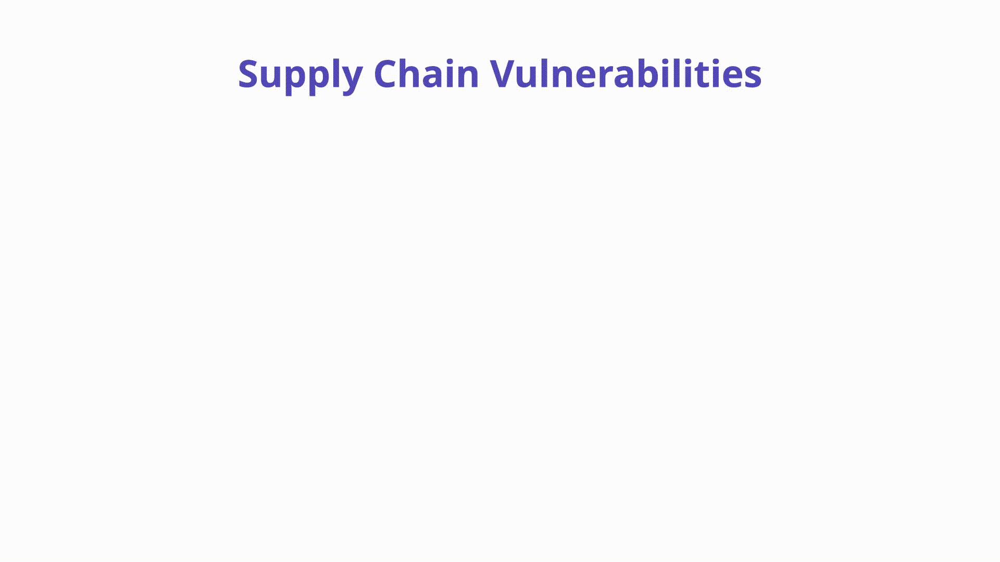

**Overview:**

- Containers rely on many third-party components, making trust difficult.
- Challenges include image integrity, composition, and known vulnerabilities.

**Description:**

- **Image Integrity:** Risks from unverified container contents, as seen in incidents like the [Solarwinds breach](https://www.sans.org/blog/what-you-need-to-know-about-the-solarwinds-supply-chain-attack/).
- **Image Composition:** Layers in container images can present security risks; properly constructed images reduce attack surfaces.
- **Known Software Vulnerabilities:** Third-party packages in images can introduce vulnerabilities.

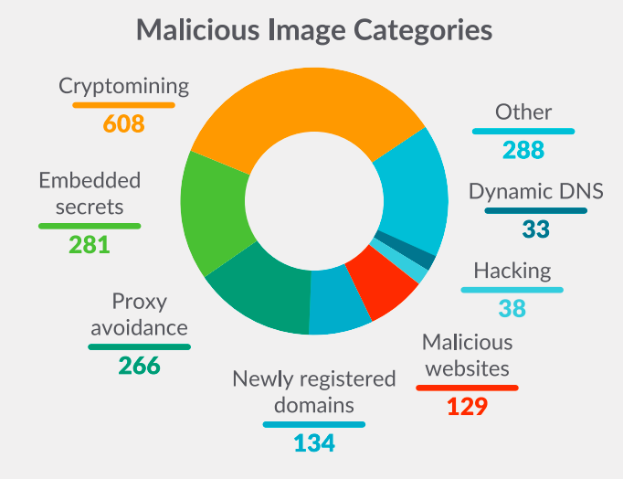

**How to Prevent:**

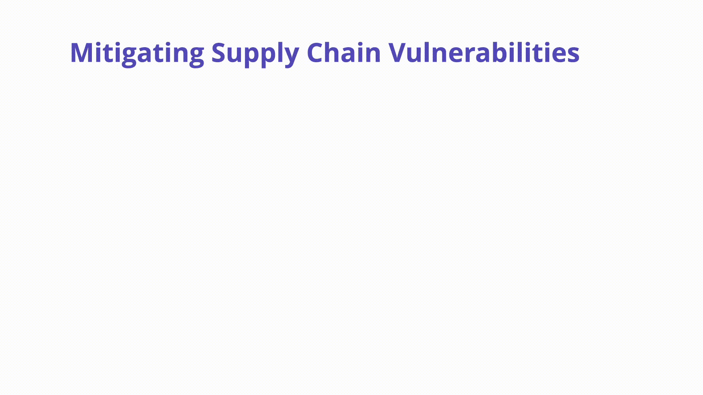

- **Image Integrity:** Validate software through each phase using in-toto attestations to increase SLSA level.
- **Software Bill of Materials (SBOM):** Use SBOMs to list software packages and licenses; standards include [CycloneDX](https://cyclonedx.org/) and [SPDX](https://spdx.dev/).
- **Image Signing:** Use cryptographic key-pairs to sign and verify artifacts; tools like Cosign can help.
- **Image Composition:** Use minimal OS packages and dependencies; consider base images like Distroless or Scratch.
- **Known Software Vulnerabilities:** Use image vulnerability scanning tools like Clair and Trivy to identify and fix vulnerabilities.
- **Enforcing Policy:** Use Kubernetes admission controls and policy engines like OPA and Kyverno to enforce security policies.

**Example Attack Scenarios:**

- **Compromised CI/CD Pipeline:** If a build tool is compromised, malicious packages can be injected, leading to malware execution or backdoor installation in Kubernetes clusters.

### K03: Overly Permissive RBAC Configurations

Role-Based Access Control (RBAC) is a powerful feature in Kubernetes that allows administrators to define and enforce access policies. However, overly permissive RBAC configurations can lead to unauthorized access and potential security breaches. It is essential to follow the principle of least privilege, granting users and services only the permissions they need to perform their tasks. Regular reviews and audits of RBAC policies can help ensure that access controls remain tight and effective.

Role-based access control (RBAC) regulates access to resources based on user roles. Misconfigurations can allow attackers to elevate privileges and control the cluster. Creating RBAC rules is straightforward, but managing them long-term can be complex. Admins should use ClusterRoles for cluster-scoped rules and RoleBindings to bind roles to users. Ensuring correct access without excessive permissions is crucial. Tools like RBAC Audit, Kubiscan, and Krane help manage and audit RBAC configurations to strengthen security.

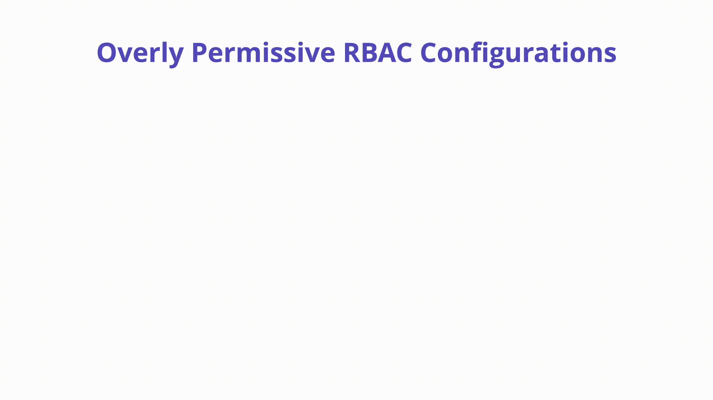

**Overview:**

- RBAC regulates access based on user roles.
- Misconfigurations can lead to privilege escalation.

**Description:**

- **Creating RBAC Rules:** Example policy for read-only CRUD actions on pods.
- **Managing RBAC Rules:** Use ClusterRoles and RoleBindings for efficient management.
- **Ensuring Correct Access:** Avoid granting excessive permissions.

**How to Prevent:**

- **Audit RBAC:** Use tools like [RBAC Audit](https://github.com/cyberark/kubernetes-rbac-audit), [Kubiscan](https://github.com/cyberark/KubiScan), and [Krane](https://github.com/appvia/krane) to scan for risky roles and permissions.

**Example Tools:**

- **RBAC Audit:** Scans for risky roles within RBAC.
- **Kubiscan:** Scans for risky permissions in RBAC authorization model.
- **Krane:** Provides a dashboard for RBAC security posture and suggestions for mitigation.

### K04: Lack of Centralized Policy Enforcement

Without centralized policy enforcement, maintaining consistent security policies across a Kubernetes cluster can be challenging. Centralized policy management tools, such as Open Policy Agent (OPA) and Kubernetes Policy Controller, enable organizations to define, enforce, and audit policies consistently. These tools help ensure that security policies are applied uniformly, reducing the risk of misconfigurations and policy violations.

Distributing and enforcing security policies across multiple clusters and clouds is challenging for security teams. Without centralized policy enforcement, clusters can be left vulnerable to misconfigurations and compromises.

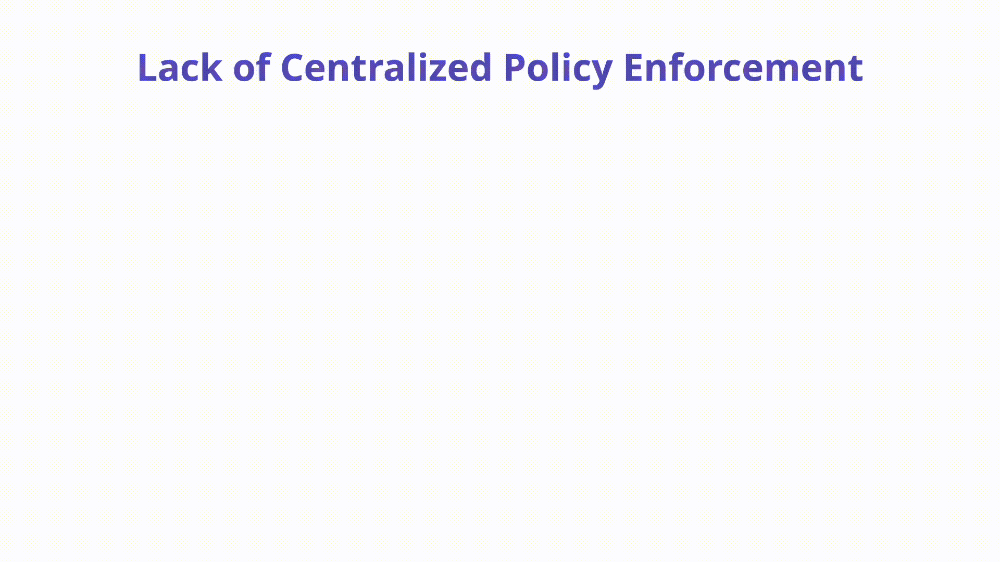

**Overview:**

- Managing security policies across multiple clusters and clouds is difficult.
- Lack of centralized policy enforcement can lead to vulnerabilities.

**Description:**

- **Policy Enforcement:** Should occur throughout the software delivery lifecycle.
- **Example Policies:** Disallowing images from untrusted registries using OPA Gatekeeper Rego policy.

**How to Prevent:**

- **Admission Controllers:** Use Kubernetes API's Pod Security Standards to enforce policies.
- **OSS Projects:** Tools like Open Policy Agent Gatekeeper, Kyverno, and Kubewarden offer policy enforcement capabilities.

**Example Attack Scenarios:**

- **Container Breakout:** A command that creates a highly privileged container, breaking container isolation and allowing access to the host.

**Example Enforcement Policies:**

- **Disallowing Images from Untrusted Registries:** Example OPA Gatekeeper Rego policy to block workloads using images from untrusted registries.

```yaml
# Allowed repos
apiVersion: constraints.gatekeeper.sh/v1beta1
kind: K8sAllowedRepos
metadata:
  name: allowed-repos
spec:
  match:
    kinds:
      - apiGroups: [""]
        kinds: ["Pod"]
    namespaces:
      - "sbx"
      - "prd"
  parameters:
    repos:
      - "open-policy-agent"
      - "ubuntu"
```

**Mitigations:**

- Use [Admission Controllers](https://sysdig.com/blog/kubernetes-admission-controllers/) and OSS projects to enforce policies and prevent misconfigured pods from being scheduled.


### K05: Inadequate Logging and Monitoring

Effective logging and monitoring are crucial for detecting and responding to security incidents in a Kubernetes environment. Inadequate logging and monitoring can leave organizations blind to potential threats and unable to respond promptly. Implementing comprehensive logging and monitoring solutions, such as Prometheus, Grafana, and ELK stack, allows organizations to gain visibility into their environments, detect anomalies, and respond to incidents swiftly.

A Kubernetes environment can generate logs from various components. Without proper logging and monitoring, attackers can exploit vulnerabilities undetected, and incident investigation becomes challenging.

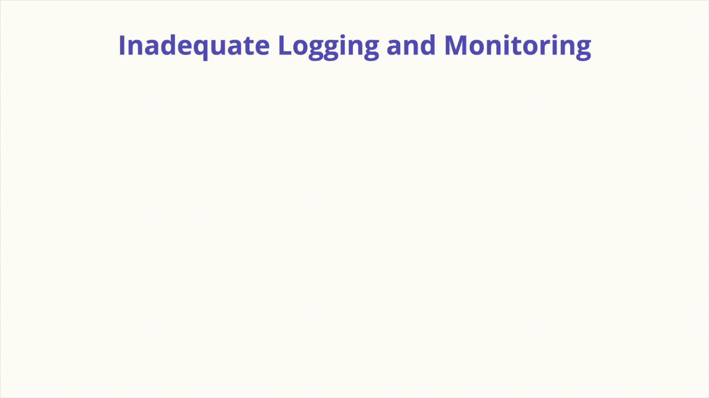

**Overview:**

- Logs must be captured, stored, and monitored to detect and respond to security incidents.
- Lack of logging and monitoring can leave organizations blind to potential threats.

**Description:**

- **Inadequate Logging:** Occurs when relevant events are not logged, logs are not monitored, alerting thresholds are not set, logs are not centrally stored, or logging infrastructure is disabled.
- **Relevant Events:** Include failed authentication attempts, access to sensitive resources, and manual deletion or modification of resources.

**How to Prevent:**

- **Kubernetes Audit Logs:** Record actions taken by the API for later analysis. Monitor for anomalous API calls and authorization failures.
- **Kubernetes Events:** Indicate resource state changes and errors.
- **Application & Container Logs:** Capture logs from applications running inside Kubernetes.
- **Operating System Logs:** Additional logs from the OS running Kubernetes nodes.
- **Cloud Provider Logs:** Additional logging streams available in managed environments like AWS EKS, Azure AKS, and GCP GKE.
- **Network Logs:** Capture logs from proxy or ingress components and projects like eBPF.

**Mitigations:**

- Implement a robust security logging architecture that captures relevant security events, centralizes logs, and maintains integrity.

### K06: Broken Authentication Mechanisms

Authentication mechanisms are the first line of defense in securing a Kubernetes cluster. Broken or weak authentication mechanisms can be exploited by attackers to gain unauthorized access. Implementing strong authentication methods, such as multi-factor authentication (MFA) and integrating with identity providers, can enhance the security of the cluster. Regularly reviewing and updating authentication mechanisms helps ensure they remain robust and effective.

Authentication in Kubernetes is highly configurable, making it adaptable to various environments but also presenting security challenges. Broken or weak authentication mechanisms can be exploited by attackers to gain unauthorized access.

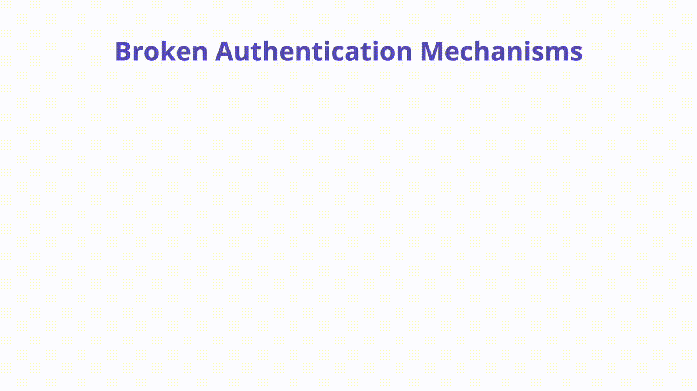

**Overview:**

- Authentication in Kubernetes is flexible but can present security challenges.
- Ensuring robust authentication mechanisms is crucial for cluster security.

**Description:**

- **Human Authentication:** Methods include OpenID Connect (OIDC), Certificates, cloud IAM, and ServiceAccount tokens.
- **Service Account Authentication:** SA tokens are used for container-to-API authentication within the cluster.

**How to Prevent:**

- **Avoid Using Certificates for End User Authentication:** Certificates are convenient but risky due to the lack of revocation mechanisms.
- **Never Roll Your Own Authentication:** Use supported and widely adopted methods.
- **Enforce MFA When Possible:** Require a second method of authentication for humans.
- **Don’t Use Service Account Tokens from Outside the Cluster:** Use short-lived tokens for external authentication.
- **Authenticate Users and External Services Using Short-Lived Tokens:** Minimize the lifespan of authentication tokens to reduce the risk of compromise.

**Mitigations:**

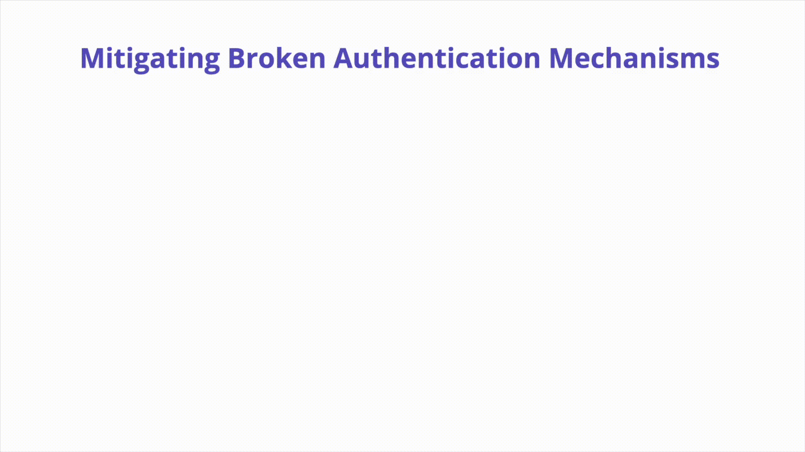

- Implement strong authentication methods and regularly review and update them to ensure they remain robust and effective.

### K07: Missing Network Segmentation Controls

Network segmentation controls are essential for limiting the spread of attacks within a Kubernetes cluster. Without proper segmentation, an attacker who gains access to one part of the network can move laterally and compromise other components. Implementing network policies, using tools like Calico or Cilium, and segmenting workloads based on their security requirements can help contain potential breaches and protect sensitive data.

In Kubernetes, controlling network traffic is crucial, especially with multiple microservices and tenants. Network segmentation helps isolate traffic and prevent attackers from exploiting vulnerabilities to move laterally within the cluster.


**Overview:**

- Network segmentation controls traffic within a Kubernetes cluster.
- It helps prevent attackers from moving laterally if they compromise a workload.

**Description:**

- **Flat Networking:** By default, Kubernetes allows unrestricted communication between workloads.
- **Risk:** Attackers can exploit this to probe the network and access other containers or private APIs.

**How to Prevent:**

- **Native Controls (Multi-Cluster):** Use separate clusters for different tenants based on risk.
- **Native Controls (NetworkPolicies):** Define network policies to control pod communication, similar to firewall rules. Example policy to prevent backend egress:

```yaml
apiVersion: networking.k8s.io/v1
kind: NetworkPolicy
metadata:
  name: deny-backend-egress
  namespace: default
spec:
  podSelector:
    matchLabels:
      tier: backend
  policyTypes:
  - Egress
  egress:
  - to:
    - podSelector:
        matchLabels:
          tier: backend
```

- **Service Mesh:** Use service mesh technologies like Istio, Linkerd, and Hashicorp Consul to segment network traffic. Example Istio AuthorizationPolicy:

```yaml
apiVersion: "security.istio.io/v1beta1"
kind: "AuthorizationPolicy"
metadata:
  name: "shoes-writer"
  namespace: default
spec:
  selector:
    matchLabels:
      app: shoes
  rules:
  - from:
    - source:
        principals: ["cluster.local/ns/default/sa/inventory-sa"]
    to:
    - operation:
        methods: ["POST"]
```

- **CNI Plugins:** Use Container Network Interface (CNI) plugins like Project Calico and Cilium to implement network policies and isolate traffic.

**Mitigations:**

- Implement robust network segmentation controls to minimize the blast radius of a compromised container and prevent lateral movement within the cluster.

### K08: Secrets Management Failures

Secrets management is a critical aspect of securing sensitive information in a Kubernetes environment. Failures in managing secrets, such as storing them in plaintext or using weak encryption, can lead to exposure of sensitive data. Using Kubernetes secrets, integrating with external secrets management solutions like HashiCorp Vault, and following best practices for secrets management can help protect sensitive information from unauthorized access.

In Kubernetes, a Secret is a small object that contains sensitive data like passwords or tokens. Proper management of secrets is crucial to prevent unauthorized access and data exposure.

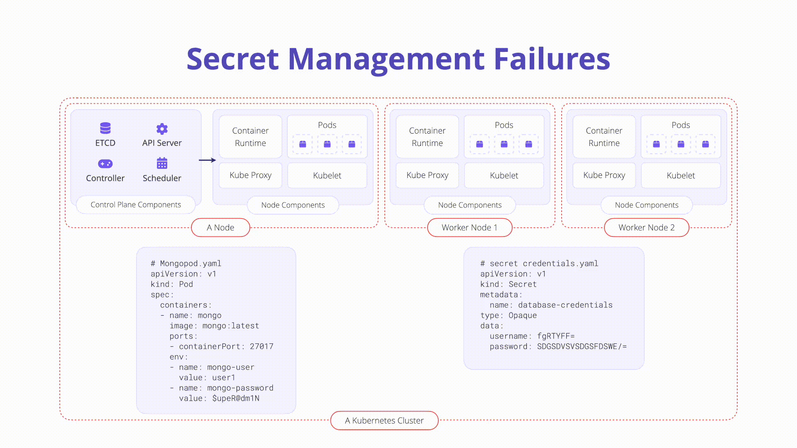

**Overview:**

- Secrets store sensitive data in Kubernetes.
- They must be handled with caution to prevent leaks and unauthorized access.

**Description:**

- **Kubernetes Secrets:** Standalone API objects used to store small sensitive data objects. Example manifest for a secret:

```yaml
apiVersion: v1
kind: Secret
metadata:
  name: top-secret
data:
  username: XXXXXXXXXXXXXXXX
  password: XXXXXXXXXXXXXXXX
type: Opaque
```

- **Base64 Encoding:** Secrets are base64 encoded by default, not encrypted, making them vulnerable if checked into version control.

**How to Prevent:**

- **Encrypt Secrets at Rest:** Use Kubernetes' encryption at rest feature to encrypt Secret resources in etcd.
- **Address Security Misconfigurations:** Ensure rock-solid configuration across clusters, lock down RBAC configurations, and audit third-party plugins.
- **Ensure Logging and Auditing:** Enable and configure Kubernetes Audit records to detect malicious or anomalous behavior.

**Mitigations:**

- Implement robust secrets management practices, including encryption, secure configurations, and comprehensive logging and auditing, to protect sensitive data from unauthorized access and exposure.

### K09: Misconfigured Cluster Components

Misconfigured cluster components can create vulnerabilities that attackers can exploit. Ensuring that all components of the Kubernetes cluster, including the API server, etcd, and kubelet, are configured securely is essential for maintaining the overall security of the environment. Regular audits, automated configuration management tools, and adherence to security best practices can help identify and remediate misconfigurations.

A Kubernetes cluster is comprised of many different components ranging from key-value storage within etcd, the kube-apiserver, the kubelet, and more. Each of these components is highly configurable and has important security responsibilities.


**Description:**
Misconfigurations in core Kubernetes components can lead to complete cluster compromise or worse. In this section, we will explore some of the components that exist on the Kubernetes control plane and nodes which can easily be misconfigured:

- **kubelet:** Agent that runs on each node in the cluster and ensures that containers run as expected and are healthy. Some dangerous configurations to watch out for on the kubelet itself are as follows:
  - **Anonymous authentication:** Allows non-authenticated requests to the Kubelet. Check your Kubelet configuration and ensure the flag below is set to false:
  
    ```yaml
    #bad
    --anonymous-auth=true
    #good
    --anonymous-auth=false
    ```

  - **Authorization checks:** Should always be performed when communicating with the Kubelets. It is possible to set the Authorization mode to explicitly allow unauthorized requests. Inspect the following to ensure this is not the case in your Kubelet config. The mode should be set to anything other than AlwaysAllow:
  
    ```yaml
    #bad
    --authorization-mode=AlwaysAllow
    #good
    --authorization-mode=Webhook
    ```

- **etcd:** A highly available key-value store that Kubernetes uses to centrally house all cluster data. It is important to keep etcd safe as it stores config data as well as secrets.

- **kube-apiserver:** The API server is a component of the Kubernetes control plane that exposes the Kubernetes API. The API server is the front end for the Kubernetes control plane. A simple security check you can perform is to inspect the internet accessibility of the API server itself. It is recommended to keep the Kubernetes API off of the public network as seen in recent news.

**How to Prevent:**
A good start is to perform regular CIS Benchmark scans and audits focused on component misconfigurations. A strong culture of Infrastructure-as-Code can also help centralize Kubernetes configuration and remediation, giving security teams visibility into how clusters are created and maintained. Using managed Kubernetes such as EKS or GKE can also help limit some of the options for component configuration as well as guide operators into more secure defaults.

### K10: Outdated and Vulnerable Kubernetes Components

Running outdated or vulnerable Kubernetes components can expose the cluster to known exploits and attacks. Keeping Kubernetes components up to date with the latest security patches and updates is crucial for maintaining a secure environment. Implementing a regular update and patch management process helps ensure that vulnerabilities are addressed promptly, reducing the risk of exploitation.

Vulnerabilities exist in Kubernetes, and administrators must follow CVE databases, disclosures, and updates closely. Implementing a regular update and patch management process helps ensure that vulnerabilities are addressed promptly, reducing the risk of exploitation.

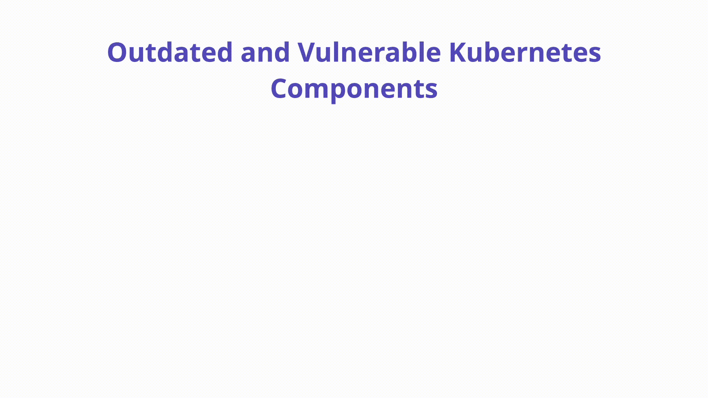

**Overview:**

- Vulnerabilities in Kubernetes components can expose the cluster to known exploits and attacks.
- Regular updates and patch management are crucial for maintaining a secure environment.

**Description:**

- **ArgoCD CVEs:** Example CVE-2022-24348 allows malicious actors to load a malicious Kubernetes Helm Chart to access restricted information.
- **Kubernetes CVEs:** Example CVE in ingress-nginx allowed users to obtain all secrets in a cluster.
- **Istio CVEs:** Example CVE-2020-8595 allowed unauthorized access to resources without a valid JWT token.
- **Minimum Kubernetes Version:** Maintain an accurate inventory of clusters and ensure conformance with minimum Kubernetes versions.

**How to Prevent:**

- **Track CVE Databases:** Include Kubernetes and associated components in your CVE vulnerability scanning process.
- **Continuous Scanning:** Use tools like OPA Gatekeeper to write custom rules and discover vulnerable components.
- **Minimize Third-Party Dependencies:** Audit all third-party software independently before deployment.

**Mitigations:**

- Implement a multi-pronged approach to eliminate vulnerable components, including tracking CVE databases, continuous scanning, and minimizing third-party dependencies.

## Grouping Risks into Categories

### Misconfigurations

Misconfigurations are a common source of security risks in Kubernetes environments. This category includes insecure workload configurations (K01), overly permissive RBAC configurations (K03), and misconfigured cluster components (K09). Addressing these risks involves regular audits, automated configuration management, and adherence to security best practices.

### Monitoring and Logging

Inadequate logging and monitoring (K05) can leave organizations blind to potential threats. Implementing comprehensive logging and monitoring solutions helps detect anomalies and respond to incidents swiftly. Tools like Prometheus, Grafana, and the ELK stack are essential for gaining visibility into Kubernetes environments.

### Vulnerabilities

Supply chain vulnerabilities (K02) and outdated Kubernetes components (K10) are significant risks. Managing supply chain risks involves verifying the integrity of software components and using trusted sources. Keeping Kubernetes components up to date with the latest security patches is crucial for reducing the risk of exploitation.

## Tools and Techniques for Auditing Your Configuration

### Kubernetes Security Tools

Several tools can help audit and secure your Kubernetes environment. These include:

- **Kube-bench**: Checks the security configuration of Kubernetes clusters against the CIS Kubernetes Benchmark.
- **Kube-hunter**: Hunts for security issues in Kubernetes clusters.
- **Polaris**: Audits Kubernetes resources for best practices and provides recommendations for improving security.

### Best Practices for Kubernetes Security

Following best practices is essential for maintaining a secure Kubernetes environment. These include:

- **Implementing RBAC**: Use RBAC to enforce the principle of least privilege.
- **Using Network Policies**: Implement network policies to segment the network and limit the spread of attacks.
- **Managing Secrets Securely**: Use Kubernetes secrets and external secrets management solutions to protect sensitive information.
- **Regular Audits**: Conduct regular audits of your Kubernetes environment to identify and remediate security risks.

## Conclusion

Understanding and mitigating these top risks is essential for maintaining a secure Kubernetes environment. By prioritizing these risks, security practitioners, system administrators, and software developers can better protect their applications and infrastructure. The OWASP Kubernetes Top 10 serves as a valuable resource for guiding security efforts and ensuring that Kubernetes environments remain secure and resilient.

**References:**

- [OWASP Kubernetes Top Ten](https://owasp.org/www-project-kubernetes-top-ten/)
- [Sysdig OWASP Kubernetes Top 10](https://sysdig.com/blog/top-owasp-kubernetes/)
- [CIS Benchmarks for Kubernetes](https://www.cisecurity.org/benchmark/kubernetes)
- [Open Policy Agent](https://github.com/open-policy-agent/opa)
- [Pod Security Standards](https://kubernetes.io/docs/concepts/security/pod-security-standards/)
- [Admission Controllers](https://kubernetes.io/docs/reference/access-authn-authz/extensible-admission-controllers/)
- [Trivy Kubernetes Cluster Scanning](https://aquasecurity.github.io/trivy/v0.56/tutorials/kubernetes/cluster-scanning)
- [Cosign](https://github.com/sigstore/cosign)
- [CycloneDX](https://owasp.org/www-project-cyclonedx/)
- [Docker Slim](https://github.com/docker-slim/docker-slim)
- [Kubernetes Security Recommendations for Developers](https://kubernetes.io/docs/concepts/configuration/secret/#security-recommendations-for-developers)
- [OPA Gatekeeper](https://github.com/open-policy-agent/gatekeeper)
- [Pod Security Admission Controller](https://kubernetes.io/docs/concepts/security/pod-security-admission/)
- [Kyverno](https://kyverno.io/)
- [Threat Hunting with Kubernetes Audit Logs](https://developer.squareup.com/blog/threat-hunting-with-kubernetes-audit-logs/)
- [Kubernetes Logging](https://kubernetes.io/docs/concepts/cluster-administration/logging/)
- [Extracting Value from the Kubernetes Events Feed](https://www.cncf.io/blog/2021/12/21/extracting-value-from-the-kubernetes-events-feed/)
- [Istio Authorization](https://istiobyexample.dev/authorization/)
- [Kubernetes CNI Explained](https://www.tigera.io/learn/guides/kubernetes-networking/kubernetes-cni/)
- [Kubernetes Network Policies](https://kubernetes.io/docs/concepts/services-networking/network-policies/)
- [Hacking Kubelet on GKE](https://www.4armed.com/blog/hacking-kubelet-on-gke/)
- [Kubernetes Security Cheat Sheet](https://cheatsheetseries.owasp.org/cheatsheets/Kubernetes_Security_Cheat_Sheet.html#securing-data)
- [Kubernetes Cluster Components](https://kubernetes.io/docs/concepts/overview/components/)
- [ArgoCD CVE Database](https://www.cvedetails.com/vulnerability-list/vendor_id-11448/product_id-81059/version_id-634305/Linuxfoundation-Argo-cd–.html)
- [CVE Database Keyword “Kubernetes”](https://cve.mitre.org/cgi-bin/cvekey.cgi?keyword=kubernetes)
- [Istio Security Bulletins](https://istio.io/latest/news/security/)
- [Kubernetes Security and Disclosure Information](https://kubernetes.io/docs/reference/issues-security/security/)
- [Tremlo Blog Post](https://www.tremolosecurity.com/post/what-the-nsa-and-cisa-left-out-of-their-kubernetes-hardening-guide)
- [Kubernetes Authentication](https://kubernetes.io/docs/concepts/security/controlling-access/)

