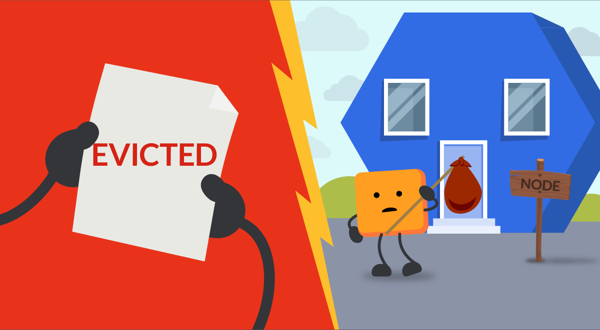

> **A Guide to Managing Pod Priorities 📊**

## 🗯 Introduction

When running a Kubernetes cluster, it's important to ensure that your critical pods get the resources they need to function properly. This can be difficult to do if your cluster is under heavy load or if there are not enough resources available.

One way to ensure that your critical pods get the resources they need is to use Kubernetes pod priority and preemption. Pod priority allows you to assign a numerical value to each pod, indicating its importance. Pods with higher priority will be scheduled before pods with lower priority, even if the lower-priority pods have been waiting longer.

Pod preemption allows the scheduler to evict lower-priority pods from nodes in order to make room for higher-priority pods. This can be a useful way to ensure that your critical pods are always running, even if your cluster is under heavy load.

In this tutorial, you will learn about pod priority, preemption, and pod PriorityClass. You will also learn how to use these features to ensure that your critical pods always get the resources they need.



## 🚀 Kubernetes Pod Priority: Enhancing Scheduling Efficiency

[Pod priority](https://kubernetes.io/docs/concepts/scheduling-eviction/pod-priority-preemption/) is a Kubernetes scheduling feature that allows you to assign a numerical value to each pod, indicating its importance. Pods with higher priority will be scheduled before pods with lower priority, even if the lower-priority pods have been waiting longer.

[Pod preemption](https://kubernetes.io/docs/concepts/scheduling-eviction/pod-priority-preemption/#preemption) is a feature that allows the Kubernetes scheduler to evict lower-priority pods from nodes in order to make room for higher-priority pods. This can be useful for ensuring that your critical pods are always running, even if your cluster is under heavy load.

There are two main concepts related to pod priority:

- **[Pod priority class](https://kubernetes.io/docs/concepts/scheduling-eviction/pod-priority-preemption/#priorityclass)**: A pod priority class is a non-namespaced object that defines a mapping from a name to the integer value of the priority. The higher the value, the higher the priority.
- **[Pod preemption policy](https://kubernetes.io/docs/concepts/scheduling-eviction/pod-priority-preemption/#non-preempting-priority-class)**: The preemption policy determines whether or not Kubernetes will preempt lower-priority pods to make room for higher-priority pods. The default preemption policy is PreemptLowerPriority, which means that Kubernetes will preempt lower-priority pods if there are no resources available for higher-priority pods.

## 🛡 Pod Preemption: Ensuring High-Priority Task Execution

Within the Kubernetes ecosystem, the concept of Pod preemption emerges as a strategic feature designed to uphold optimal resource utilization. This functionality empowers Kubernetes to elegantly oust lower-priority pods from nodes whenever the scheduling queue harbors higher-priority counterparts demanding resources that are currently unavailable.

## 🎯 Kubernetes Pod Priority Class: Fine-Tuning Priority Assignment

In the intricate dance of Kubernetes resource allocation, the Kubernetes Pod Priority Class takes center stage. This indispensable construct facilitates the allocation of specific priorities to pods, enabling meticulous control over task execution sequences.

By harnessing the PriorityClass object (which operates outside the bounds of namespacing), administrators can seamlessly designate priorities for pods. The cornerstone of this assignment lies in the 'Value' parameter - a numerical indicator that effectively steers the order of execution. The range for this value spans from 1 to 1,000,000,000 (one billion), with a simple principle: the larger the value, the more pronounced the priority bestowed upon the pod.

```yaml
apiVersion: scheduling.k8s.io/v1
kind: PriorityClass
metadata:
    name: high-priority
value: 1000000
preemptionPolicy: Never
globalDefault: false
description: "This priority class for backends"
```

The name of the priorityclass (priorityClassName) will be used in the pod specification to set the priority. If you don't want the priority class to preempt the pods, you can set `PreemptionPolicy: Never`. By default, Priorityclasss use PreemptLowerPriority policy.

```yaml
apiVersion: v1
kind: Pod
metadata:
    name: nginx
    labels:
        env: test
spec:
    containers:
    - name: nginx
        image: nginx
        imagePullPolicy: IfNotPresent
    priorityClassName: high-priority
```

## 🛡 Shielding Critical System Pods in Kubernetes: High PriorityClasses

Securing pivotal pods from preemption within the Kubernetes ecosystem is a vital concern. To address this, Kubernetes has introduced two preconfigured high-priority classes, tailored to safeguard system-critical operations.

- **system-node-critical**: This priority class is endowed with a numerical value of 2000001000. It is exclusively designated for static pods that play a crucial role in the system, such as etcd, kube-apiserver, kube-scheduler, and Controller Manager. The utilization of this priority class ensures that these fundamental components are shielded from preemption.
- **system-cluster-critical**: Boasting a priority value of 2000000000, this priority class serves as the bastion for essential Addon Pods. Noteworthy components like coredns, calico controller, metrics server, and more align with this priority class. By aligning with the system-cluster-critical class, these Addon Pods are granted a robust shield against preemption, preserving the integrity of your Kubernetes cluster.

## ⚙️ Kubernetes Pod Priority & Preemption: How It All Works

When it comes to orchestrating the intricate ballet of Kubernetes pod allocation, the dynamic duo of Pod Priority and Preemption takes center stage. Let's delve into the inner workings of this process to uncover the magic behind efficient resource utilization.

- **Assigning Priority via PriorityClassName**: Picture this - you've deployed a pod furnished with a PriorityClassName. As the pod takes its place in the Kubernetes environment, the priority admission controller steps in. This controller deftly extracts the priority value associated with the PriorityClassName, setting the stage for what's to come.
- **Scheduling Order Based on Priority**: In the bustling queue of pending pods, the scheduler deftly orchestrates their sequence based on their assigned priorities. Here, the golden rule prevails: high-priority pods claim their rightful spot ahead of their lower-priority counterparts.
- **Preemption Logic Takes the Stage**: But what if the spotlight shines on a high-priority pod without a suitable stage? In other words, if no nodes flaunt the resources required to host this eager pod, the preemption logic enters the scene. Like a seasoned theater director, the scheduler orchestrates the graceful eviction (preemption) of a low-priority pod from its node.
- **A Graceful Ballet of Eviction**: As the curtain falls on the evicted pod's performance, it bows out with a gracious default termination time of 30 seconds. Yet, there's room for customization - if pods come prepared with a terminationGracePeriodSeconds specified for preStop container Lifecycle Hooks, this interval supersedes the default 30 seconds.
- **Scheduling Continues with Flexibility**: But what if the stars fail to align even after preemption? Fear not, for Kubernetes is adept at adaptation. If scheduling constraints persist, the scheduler graciously adjusts its strategy, making room for the ensemble of lower-priority pods to claim their spotlight.

## ⛳️ Throttling and Quality of Service (QoS) in Kubernetes: A Deep Dive

At the core of efficient resource management in Kubernetes lies the concept of throttling - a strategic technique that curbs the processing speed of specific resources, such as network bandwidth or CPU usage. The essence of throttling is to create a balanced environment where high-priority tasks can progress while allowing room for other tasks to function, albeit at a reduced pace. In the realm of containers, resources can be broadly classified into compressible (throttle-able) and incompressible (non-throttle-able) categories, depending on whether they can be regulated.

### Understanding Throttling's Impact on Pod Deployment

In the context of Kubernetes pods, throttling plays a significant role in shaping resource allocation and task execution. Imagine a scenario where a pod is fervently consuming a substantial chunk of a node's memory - this situation could impede the scheduling of new pods, potentially leading to deployment issues. Unlike CPUs, which can be slowed down to manage resource contention, memory lacks a similar mechanism. Consequently, an overzealous pod hogging memory can thwart the deployment of new pods, creating a bottleneck.

### Tackling Throttling Challenges

To circumvent these challenges and ensure seamless pod deployment, Kubernetes offers several strategies:

- **Resource Management with LimitRange and ResourceQuota**: Kubernetes provides tools like LimitRange and ResourceQuota to maintain control over resource allocation. These mechanisms enable administrators to rein in pods that exceed their allocated limits, preventing resource overutilization.
- **Precise Resource Requests and Limits**: Crafting accurate resource requests and limits for containers can mitigate potential resource contention issues. By defining these parameters judiciously, you optimize resource utilization and foster smoother pod deployment.
- **Node Upgrades for Enhanced Capability**: Upgrading the capabilities of your nodes can alleviate resource constraints and enhance the overall performance of your cluster. This proactive measure fortifies your infrastructure to accommodate varying resource demands.

### Diving into Quality of Service (QoS) and Its Implications

As you delve deeper into the Kubernetes realm, Quality of Service (QoS) emerges as a pivotal concept closely intertwined with resource allocation. When you stipulate resource requests and limits for your containers, Kubernetes assigns a QoS tier based on your configuration. This tiered approach reflects the priority and potential behavior of your pods:

- **Guaranteed**: Reserved for pods with identical resource requests and limits, the guaranteed QoS signifies high-priority tasks that are assured of the resources they need to operate optimally.
- **Burstable**: Characterized by differing requests and limits, burstable pods enjoy minimal resource guarantees but have the potential to use additional resources if available. However, they might face termination if the node confronts resource scarcity.
- **Best-Effort**: Pods falling under this QoS tier lack explicit resource requests and limits. As low-priority entities, best-effort pods might be terminated when incompressible resources become scarce.

### Navigating QoS for Successful Pod Deployment

To troubleshoot pod deployment challenges arising from QoS considerations, it's prudent to:

- Assess the priority of your pod's resource requests and limits.
- Evaluate if other pods' configurations can be adjusted to optimize resource allocation.
- Draw insights from the earlier-discussed throttling strategies to fine-tune your pod deployment approach.

## ☸️ QoS vs. Pods Priority: Independent Forces in Kubernetes

While QoS and Pods Priority might appear related, they operate separately in Kubernetes. QoS primarily helps Kubelet maintain node health by considering resource availability. In contrast, Pods Priority guides scheduler evictions, focusing solely on pods' priority classes. The scheduler evicts lower-priority pods to make room for higher-priority ones, ensuring efficient resource allocation.

## 🔚 Conclusion

Navigating Kubernetes' intricate resource management involves understanding the nuances of Pod Priority, PriorityClass, and Preemption QoS. These mechanisms harmonize to optimize resource allocation, ensuring critical tasks take precedence while maintaining fairness. By comprehending the dynamic interplay between these elements, you're equipped to orchestrate a symphony of efficient container deployment, prioritization, and resource utilization within your Kubernetes ecosystem.

## 📚 References

- [Kubernetes Pod Priority and Preemption](https://kubernetes.io/docs/concepts/scheduling-eviction/pod-priority-preemption/)
- [Pod Priority Class](https://kubernetes.io/docs/concepts/scheduling-eviction/pod-priority-preemption/#priorityclass)
- [Pod Preemption Policy](https://kubernetes.io/docs/concepts/scheduling-eviction/pod-priority-preemption/#non-preempting-priority-class)
- [Kubernetes Quality of Service (QoS)](https://kubernetes.io/docs/tasks/configure-pod-container/quality-service-pod/)
- [Resource Management with LimitRange and ResourceQuota](https://kubernetes.io/docs/concepts/policy/limit-range/)
- [Throttling in Kubernetes](https://kubernetes.io/docs/concepts/configuration/manage-resources-containers/)
- [Pod Priority and Preemption](https://kubernetes.io/docs/concepts/scheduling-eviction/pod-priority-preemption/)

<br>

**Thank you for Reading, see you in the next post. ✍**

**_Until next time, つづく 🎉_**

> 💡 Thank you for Reading !! 🙌🏻😁📃, see you in the next blog.🤘  **_Until next time 🎉_**

🚀 Thank you for sticking up till the end. If you have any questions/feedback regarding this blog feel free to connect with me:

**♻️ LinkedIn:** https://www.linkedin.com/in/rajhi-saif/

**♻️ X/Twitter:** https://x.com/rajhisaifeddine

**The end ✌🏻**

<h1 align="center">🔰 Keep Learning !! Keep Sharing !! 🔰</h1>

**📅 Stay updated**

Subscribe to our newsletter for more insights on AWS cloud computing and containers.
