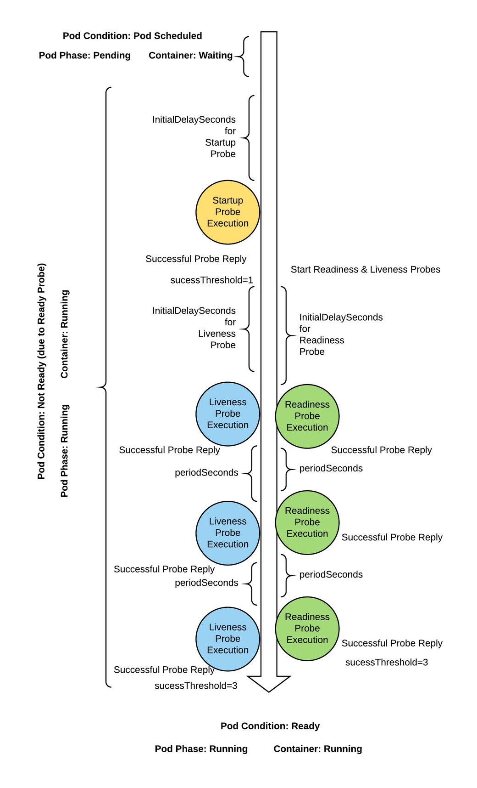
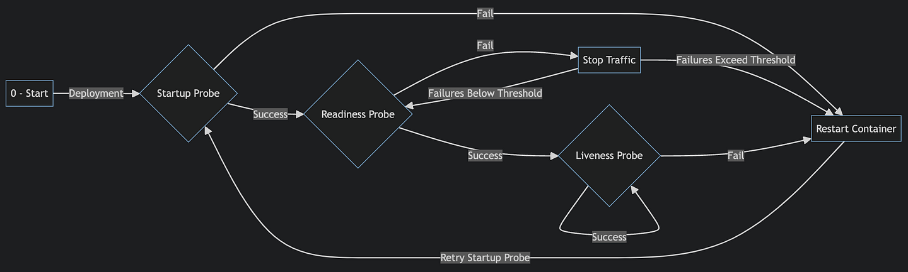
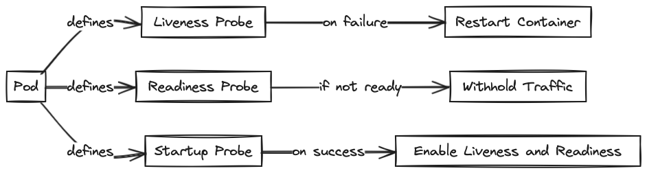

> **Guide to Liveness, Readiness, and Startup Probes ♻️**

## 📌 Introduction

Kubernetes offers a feature called **probes**, which play an important role in ensuring the health of applications running within its environment. These probes, categorized into **liveness**, **readiness**, and **startup**, enable Kubernetes to monitor the state of applications and take appropriate actions to maintain their optimal functioning.

In this blog post, we will explore the significance of these probes in enhancing the self-healing capabilities of Kubernetes and providing a comprehensive understanding of how they work. We will explore each probe type, their specific purposes, and how they contribute to the overall resilience of containerized applications.

📢 **Announcement:** I have just launched a [GitHub repository](https://github.com/seifrajhi/Kubernetes-practical-exercises-Hands-on) dedicated to gathering resources, exercises, and labs to aid in learning Kubernetes from the ground up. This repository aims to provide practical exercises that guide users in deploying, managing, and scaling containerized applications using Kubernetes. Your feedback and contributions are welcomed to enhance and improve the learning experience. 🎉

### 🩺 Health Check

Health checks are a simple way to let the system know whether an instance of your app is working. If the instance of your app is not working, the other services should not access it or send requests to it. Instead, requests should be sent to another instance that is ready, or you should retry sending requests.

The system should be able to bring your app to a healthy state. By default, Kubernetes will start sending traffic to the pod when all the containers inside the pod have started. Kubernetes will restart containers when they crash. This default behavior should be enough to get started. Making deployments more robust becomes relatively straightforward as Kubernetes helps create custom health checks.


## 🚀 Kubernetes Probes

[Kubernetes probes](https://kubernetes.io/docs/tasks/configure-pod-container/configure-liveness-readiness-startup-probes/) are a mechanism for providing the Kubernetes control plane with information about the internal state of your applications. They let your cluster identify running pods that are in an unhealthy state. Probes are kubelet's answer to the health checks, and there are three handlers:

- **ExecAction**: Command execution check. If the command's exit status is 0, it is considered a success.
- **TCPSocketAction**: TCP check to determine if the port is open. If open, it is considered a success.
- **HTTPGetAction**: HTTP check to determine if the status code is equal to or above 200 and below 400.

Each type of probe has common configurable fields:

- `initialDelaySeconds`: Probes start running after `initialDelaySeconds` after the container is started (default: 0).
- `periodSeconds`: How often the probe should run (default: 10).
- `timeoutSeconds`: Probe timeout (default: 1).
- `successThreshold`: Required number of successful probes to mark the container healthy/ready (default: 1).
- `failureThreshold`: When a probe fails, it will try `failureThreshold` times before deeming unhealthy/not ready (default: 3).

These parameters need to be configured per your application's spec.



## 🔍 Kubernetes Probe Types


Kubernetes has three basic probe types:

- **Liveness Probes**: They detect whether a pod is healthy by running a command or making a network request inside the container. Containers that fail the check are restarted.
- **Readiness Probes**: They identify when a container is able to handle external traffic received from a service. Containers don't become part of their services until they pass a readiness probe.
- **Startup Probes**: They provide a way to defer the execution of liveness and readiness probes until a container indicates it's able to handle them. Kubernetes won't direct the other probe types to a container if it has a startup probe that hasn't yet succeeded.

## 🔄 Sequence of Health Probes

This diagram effectively illustrates the workflow of Kubernetes health probes and their impact on a container's lifecycle.



The process begins with the deployment of the container in Kubernetes. After the container starts, the **startup probe** checks if the application within the container is ready to run. If the startup probe succeeds, it proceeds to the **readiness probe**. If the startup probe fails, Kubernetes restarts the container.

When the startup probe is successful, the readiness probe is executed. This probe determines if the container is ready to serve traffic. If the readiness probe is successful, Kubernetes initiates the **liveness probe** to continually monitor the container's health. If the readiness probe fails, traffic to the container is stopped. Kubernetes will retry the readiness probe until it succeeds or the failure threshold is exceeded. If the failure threshold is exceeded, Kubernetes restarts the container.

Once the startup probe and the readiness probes are successful, Kubernetes continuously checks the health of the container during its runtime. If the liveness probe is successful, it will continue to monitor at defined intervals. If the liveness probe fails, Kubernetes will restart the container. After restarting the container, the process begins again with the startup probe.



### 🚀 Startup Probes

Startup probes should be used when the application in your container could take a significant amount of time to reach its normal operating state. Applications that would crash or throw an error if they handled a liveness or readiness probe during startup need to be protected by a startup probe. This ensures the container doesn't enter a restart loop due to failing healthiness checks before it's finished launching.

#### Creating a Startup Probe

Startup probes are created by adding a `startupProbe` field within the `spec.containers` portion of a pod's manifest.

**Exec Probe:**

Exec probe runs a command inside the container as a health check; the command's exit code determines the success.

```yaml
startupProbe:
    initialDelaySeconds: 1
    periodSeconds: 5
    timeoutSeconds: 1
    successThreshold: 1
    failureThreshold: 1
    exec:
        command:
            - cat
            - /etc/nginx/nginx.conf
```

**TCP Probe:**

TCP probe checks if the specified port is open or not; an open port points to success.

```yaml
startupProbe:
    initialDelaySeconds: 1
    periodSeconds: 5
    timeoutSeconds: 1
    successThreshold: 1
    failureThreshold: 1
    tcpSocket:
        host:
        port: 80
```

**HTTP Probe:**

HTTP probe sends an HTTP GET request with defined parameters. HTTP Probe has additional options to configure.

```yaml
startupProbe:
    initialDelaySeconds: 1
    periodSeconds: 2
    timeoutSeconds: 1
    successThreshold: 1
    failureThreshold: 1
    httpGet:
        host:
        scheme: HTTP
        path: /
        httpHeaders:
            - name: Host
                value: myapplication1.com
        port: 80
```

### 🟢 Readiness Probes

Similar to other probes, it checks to ensure the container is ready to accept traffic. Unlike the liveness probe which checks to see if things remain ship-shape, the readiness probe makes sure things are in a state that traffic can start flowing. This is at the pod level. Meaning all of the containers must be in a ready state prior to anything being passed to the service. The startup probe, while also similar, is at the application level. It would be active prior to any liveness or readiness probes.

#### Creating a Readiness Probe

Readiness probes are created by adding a `readinessProbe` field within the `spec.containers` portion of a pod's manifest.

**Exec Probe:**

Exec action has only one field, and that is command. Exit status of the command is checked, and the status of zero (0) means it is healthy, and another value means it is unhealthy.

```yaml
readinessProbe:
    initialDelaySeconds: 1
    periodSeconds: 5
    timeoutSeconds: 1
    successThreshold: 1
    failureThreshold: 1
    exec:
        command:
            - cat
            - /etc/nginx/nginx.conf
```

**TCP Probe:**

We need to define host and port parameters, host parameter defaults to the cluster-internal pod IP.

```yaml
readinessProbe:
    initialDelaySeconds: 1
    periodSeconds: 5
    timeoutSeconds: 1
    successThreshold: 1
    failureThreshold: 1
    tcpSocket:
        host:
        port: 80
```

**HTTP Probe:**

HTTP Probe has additional options to configure.

```yaml
readinessProbe:
    initialDelaySeconds: 1
    periodSeconds: 2
    timeoutSeconds: 1
    successThreshold: 1
    failureThreshold: 1
    httpGet:
        host:
        scheme: HTTP
        path: /
        httpHeaders:
            - name: Host
                value: myapplication1.com
        port: 80
```

### 🔴 Liveness Probes

Liveness probes enhance Kubernetes' ability to manage workloads on your behalf. Without probes, you need to manually monitor your pods to distinguish which application instances are healthy and which are not. This becomes time-consuming and error-prone when you're working with hundreds or thousands of pods.

Allowing unhealthy pods to continue without detection degrades your service's stability over time. Pods that are silently failing as they age, perhaps due to race conditions, deadlocks, or corrupted caches, will gradually reduce your service's capacity to handle new requests. Eventually, your entire pod fleet could be affected, even though all the containers report as running.

#### Creating a Liveness Probe

Liveness probes are defined by a pod's `spec.containers.livenessProbe` field. There are three types of actions kubelet performs on a pod, which are:

- Executes a command inside the container
- Checks for a state of a particular port on the container
- Performs a GET request on container's IP

**Define a Liveness Command:**

```yaml
livenessProbe:
    exec:
        command:
            - sh
            - /tmp/status_check.sh
    initialDelaySeconds: 10
    periodSeconds: 5
```

**Define a Liveness HTTP Request:**

```yaml
livenessProbe:
    httpGet:
        path: /health
        port: 8080
    initialDelaySeconds: 5
    periodSeconds: 3
```

**Define a TCP Liveness Probe:**

```yaml
livenessProbe:
    tcpSocket:
        port: 8080
    initialDelaySeconds: 15
    periodSeconds: 20
```

## 🏁 Conclusion

Kubernetes probes are essential for ensuring the health and resilience of your applications. They provide a more streamlined, data-driven approach to monitoring, which facilitates informed decision-making and responsive adjustments to changes in your application's usage patterns. By using health checks, you can improve your application availability, reduce your maintenance burden, and make certain that your application is not only running but also accessible to your users.

<br>

**_Until next time, つづく 🎉_**

> 💡 Thank you for Reading !! 🙌🏻😁📃, see you in the next blog.🤘 **_Until next time 🎉_**

🚀 Thank you for sticking up till the end. If you have any questions/feedback regarding this blog feel free to connect with me:

**♻️ LinkedIn:** https://www.linkedin.com/in/rajhi-saif/

**♻️ X/Twitter:** https://x.com/rajhisaifeddine

**The end ✌🏻**

<h1 align="center">🔰 Keep Learning !! Keep Sharing !! 🔰</h1>

**📅 Stay updated**

Subscribe to our newsletter for more insights on AWS cloud computing and containers.
