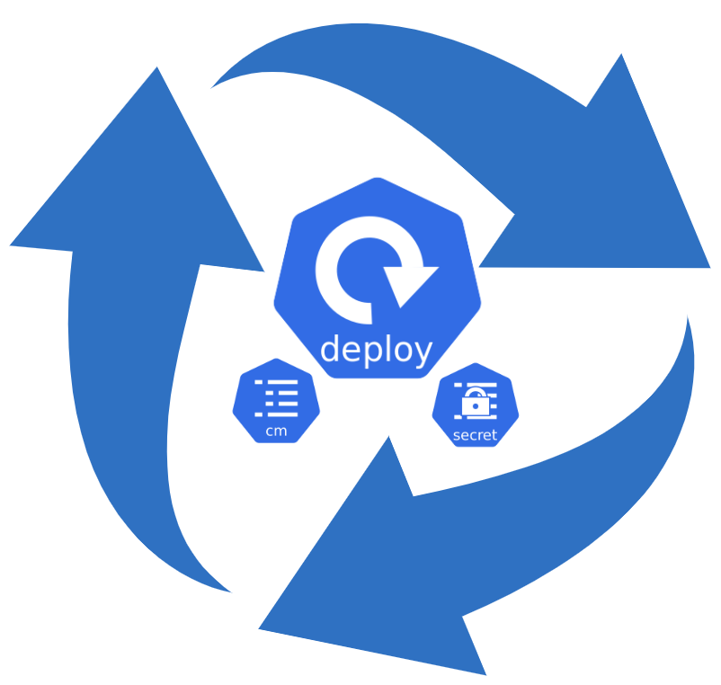
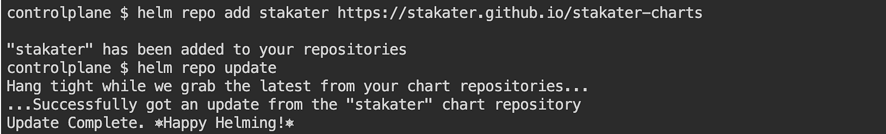
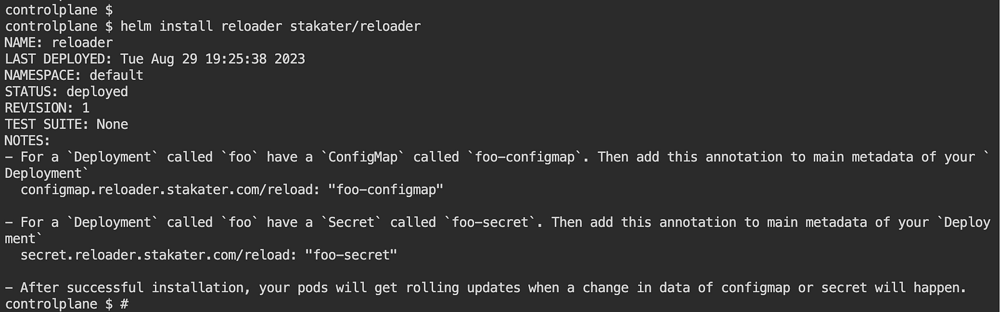
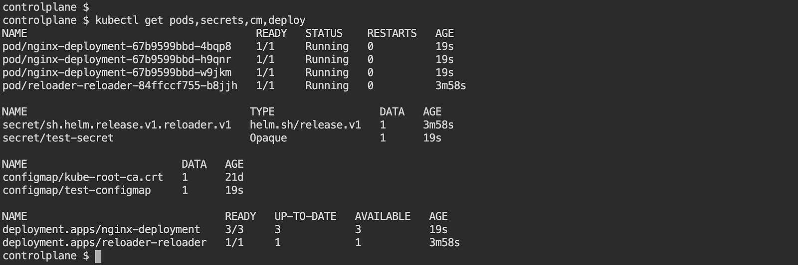
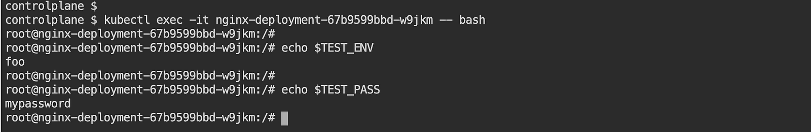
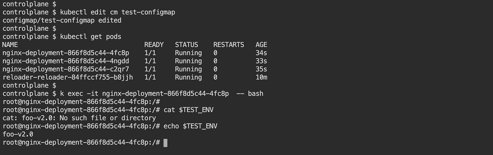
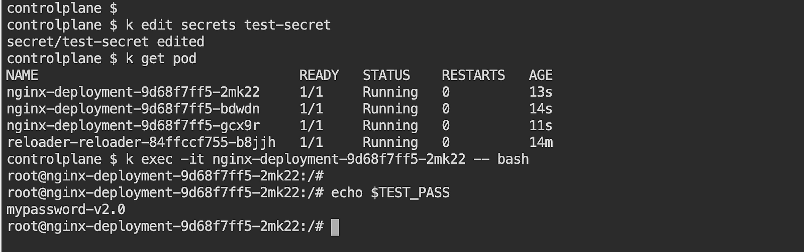

> **Simple ConfigMap and Secret Updates 🆕**

## 🌠 Introduction

Kubernetes [ConfigMaps](https://kubernetes.io/docs/concepts/configuration/configmap/) and [Secrets](https://kubernetes.io/docs/concepts/configuration/secret/) are essential for injecting environment variables and application secrets into pods. However, updating these configurations can be challenging, as changes are not automatically propagated to running pods.

[Reloader](https://github.com/stakater/Reloader) is a Kubernetes controller that automates the process of detecting and reflecting changes to ConfigMaps and Secrets in running pods. This eliminates the need for manual restarts or volume reattachments, and ensures that your applications are always up-to-date.

In this blog post, we will discuss the benefits of using Reloader, and how to deploy and configure it in your Kubernetes cluster. We will also provide some code snippets to help you get started.

There's a lot of work to do, so roll up your sleeves and get busy.



## Getting to Know Reloader

Imagine you're in charge of keeping your applications running smoothly on a Kubernetes playground. But hey, things change, right? You might need to tweak how your apps behave — like telling them to use a different secret password or to play nice with updated settings.

Now, meet your helpful buddy: **Reloader**. It's like a watchful wizard that hangs around ConfigMaps and Secrets in Kubernetes. Whenever those sneaky settings change, Reloader takes the cue and says, "Hey, your apps need to catch up!" It works some magic to gently update your apps, making sure they stay happy and snug in their pods. And the cool part? You don't need to wave your wand manually — Reloader does it for you.

## Deploy Reloader to Kubernetes Cluster

There are multiple deployment options available, including using manifests and Helm. In this blog, we will explore both methods.

### Using Helm

Add the Helm chart:

```shell
helm repo add stakater https://stakater.github.io/stakater-charts
helm repo update
```



Deploy Reloader:

```shell
helm install reloader stakater/reloader # To watch CM/secrets in all namespaces
helm install reloader stakater/reloader --set reloader.watchGlobally=false --namespace NAMESPACENAME # To watch CM/Secrets in one namespace
```



### Using Vanilla Manifests

Apply vanilla manifests by changing the `RELEASE-NAME` placeholder provided in the manifest with a proper value and apply it by running the command given below:

```shell
kubectl apply -f https://raw.githubusercontent.com/stakater/Reloader/master/deployments/kubernetes/reloader.yaml
kubectl apply -k https://github.com/stakater/Reloader/deployments/kubernetes
```

By default, Reloader gets deployed in the default namespace and watches changes to secrets and configmaps in all namespaces.

Reloader can be configured to ignore the resources secrets and configmaps by passing the following args (`spec.template.spec.containers.args`) to its container.

This will create a Reloader pod and the required resources.

For more details, visit the [Reloader GitHub repository](https://github.com/stakater/Reloader).

## How to Use Reloader

For a Deployment called `foo`, have a ConfigMap called `foo-configmap` or Secret called `foo-secret` or both. Then add your annotation (by default `reloader.stakater.com/auto`) to the main metadata of your Deployment:

```yaml
kind: Deployment
metadata:
    annotations:
        reloader.stakater.com/auto: "true"
spec:
    template:
        metadata:
```

This will discover deployments, daemonsets, and statefulsets automatically where `foo-configmap` or `foo-secret` is being used either via an environment variable or from a volume mount. It will perform rolling upgrades on related pods when `foo-configmap` or `foo-secret` are updated.

You can restrict this discovery to only ConfigMap or Secret objects that are tagged with a special annotation. To take advantage of that, annotate your deployments/daemonsets/statefulsets like this:

```yaml
kind: Deployment
metadata:
    annotations:
        reloader.stakater.com/search: "true"
spec:
    template:
        metadata:
```

Reloader will trigger the rolling upgrade upon modification of any ConfigMap or Secret annotated like this:

```yaml
kind: ConfigMap
metadata:
    annotations:
        reloader.stakater.com/match: "true"
data:
    key: value
```

provided the secret/configmap is being used in an environment variable, or a volume mount.

> **Note:** `reloader.stakater.com/search` and `reloader.stakater.com/auto` do not work together. If you have the `reloader.stakater.com/auto: "true"` annotation on your deployment, then it will always restart upon a change in configmaps or secrets it uses, regardless of whether they have the `reloader.stakater.com/match: "true"` annotation or not.

We can also specify a specific configmap or secret which would trigger a rolling upgrade only upon a change in our specified configmap or secret. This way, it will not trigger a rolling upgrade upon changes in all configmaps or secrets used in a deploymentconfig, deployment, daemonset, statefulset, or rollout. To do this, either set the auto annotation to "false" (`reloader.stakater.com/auto: "false"`) or remove it altogether, and use annotations for [Configmap](https://github.com/stakater/Reloader/tree/master#Configmap) or [Secret](https://github.com/stakater/Reloader/tree/master#Secret).

It's also possible to enable auto reloading for all resources by setting the `--auto-reload-all` flag. In this case, all resources that do not have the auto annotation set to "false" will be reloaded automatically when their ConfigMaps or Secrets are updated. Notice that setting the auto annotation to an undefined value counts as false as well.

## 🏪 ConfigMap

To perform rolling upgrades when changes happen only on specific configmaps, use the below annotation. For a Deployment called `foo`, have a ConfigMap called `foo-configmap`. Then add this annotation to the main metadata of your Deployment:

```yaml
kind: Deployment
metadata:
    annotations:
        configmap.reloader.stakater.com/reload: "foo-configmap"
spec:
    template:
        metadata:
```

Use a comma-separated list to define multiple configmaps:

```yaml
kind: Deployment
metadata:
    annotations:
        configmap.reloader.stakater.com/reload: "foo-configmap,bar-configmap,baz-configmap"
spec:
    template:
        metadata:
```

For more details, visit the [Reloader GitHub repository](https://github.com/stakater/Reloader).

## 🔐 Secret

To perform rolling upgrades when changes happen only on specific secrets, use the annotation below.

For a Deployment called `foo`, have a Secret called `foo-secret`. Then add this annotation to the main metadata of your Deployment:

```yaml
kind: Deployment
metadata:
    annotations:
        secret.reloader.stakater.com/reload: "foo-secret"
spec:
    template: 
        metadata:
```

Use a comma-separated list to define multiple secrets:

```yaml
kind: Deployment
metadata:
    annotations:
        secret.reloader.stakater.com/reload: "foo-secret,bar-secret,baz-secret"
spec:
    template: 
        metadata:
```

## 💫 Notes

Reloader also supports [sealed-secrets](https://github.com/bitnami-labs/sealed-secrets). [Here](https://github.com/stakater/Reloader/blob/master/docs/Reloader-with-Sealed-Secrets.md) are the steps to use sealed-secrets with Reloader.

For [rollouts](https://github.com/argoproj/argo-rollouts/), Reloader simply triggers a change; it is up to you how you configure the rollout strategy.

- `reloader.stakater.com/auto: "true"` will only reload the pod if the ConfigMap or Secret is used (as a volume mount or as an env) in DeploymentConfigs/Deployment/Daemonsets/Statefulsets.
- `secret.reloader.stakater.com/reload` or `configmap.reloader.stakater.com/reload` annotation will reload the pod upon changes in the specified ConfigMap or Secret, irrespective of the usage of ConfigMap or Secret.
- You may override the auto annotation with the `--auto-annotation` flag.
- You may override the search annotation with the `--auto-search-annotation` flag and the match annotation with the `--search-match-annotation` flag.
- You may override the ConfigMap annotation with the `--configmap-annotation` flag.
- You may override the Secret annotation with the `--secret-annotation` flag.
- You may want to prevent watching certain namespaces with the `--namespaces-to-ignore` flag.
- You may want to watch only a set of namespaces with certain labels by using the `--namespace-selector` flag.
- You may want to watch only a set of secrets/configmaps with certain labels by using the `--resource-label-selector` flag.
- You may want to prevent watching certain resources with the `--resources-to-ignore` flag.
- You can configure logging in JSON format with the `--log-format=json` option.
- You can configure the "reload strategy" with the `--reload-strategy=<strategy-name>` option (details below).

### 🎲 Reload Strategies

Reloader supports multiple "reload" strategies for performing rolling upgrades to resources. The following list describes them:

- **env-vars**: When a tracked `ConfigMap/Secret` is updated, this strategy attaches a Reloader-specific environment variable to any containers referencing the changed ConfigMap or Secret on the owning resource (e.g., Deployment, StatefulSet, etc.). This strategy can be specified with the `--reload-strategy=env-vars` argument. Note: This is the default reload strategy.
- **annotations**: When a tracked `ConfigMap/Secret` is updated, this strategy attaches a `reloader.stakater.com/last-reloaded-from` pod template annotation on the owning resource (e.g., Deployment, StatefulSet, etc.). This strategy is useful when using resource syncing tools like ArgoCD, since it will not cause these tools to detect configuration drift after a resource is reloaded.
  
    >> Note: Since the attached pod template annotation only tracks the last reload source, this strategy will reload any tracked resource should its ConfigMap or Secret be deleted and recreated. This strategy can be specified with the `--reload-strategy=annotations` argument.

For more details, visit the [Reloader GitHub repository](https://github.com/stakater/Reloader).

## 🌟 Test Reloader: Hands-on

To test the Reloader, I will deploy a deployment that uses a ConfigMap and a Secret to inject environment variables into its pod.

### Create ConfigMap and Secret

```yaml
apiVersion: v1
kind: ConfigMap
metadata:
    name: test-configmap
data:
    test_env: "foo"
---
apiVersion: v1
data:
    pass: bXlwYXNzd29yZA==
kind: Secret
metadata:
    name: test-secret
```

### Create Deployment

```yaml
apiVersion: apps/v1
kind: Deployment
metadata:
    name: nginx-deployment
    labels:
        app: nginx
    annotations:
        configmap.reloader.stakater.com/reload: "test-configmap"
        secret.reloader.stakater.com/reload: "test-secret"
spec:
    replicas: 3
    selector:
        matchLabels:
            app: nginx
    template:
        metadata:
            labels:
                app: nginx
        spec:
            containers:
            - name: nginx
                image: nginx:1.14.2
                ports:
                - containerPort: 80
                env:
                - name: TEST_ENV
                    valueFrom:
                        configMapKeyRef:
                            name: test-configmap
                            key: test_env
                - name: TEST_PASS
                    valueFrom:
                        secretKeyRef:
                            name: test-secret
                            key: pass
```



> **Note:** The annotations in the deployment are used to watch specific ConfigMap or Secret. 
> - `secret.reloader.stakater.com/reload: "test-secret"` watches for the secret `test-secret`. Any changes to this secret will trigger a rolling upgrade of the deployment.
> - `configmap.reloader.stakater.com/reload: "test-configmap"` watches for the ConfigMap `test-configmap`. Any changes to this ConfigMap will trigger a rolling upgrade.

There are other supported annotations that can be added to a deployment or statefulset:
- `reloader.stakater.com/auto: "true"`: This will look for all ConfigMaps or Secrets being used either via environment variables or mounts and trigger a rolling upgrade if any changes are made to those ConfigMaps/Secrets.


<div class="image-title">Initial values of environment variables</div>

### Update ConfigMap

Once the deployment is created, make a change in the ConfigMap. You will notice a rolling upgrade has been triggered by the deployment, and new pods come up with updated values from the ConfigMap. ✒️


<div class="image-title">New pods came up after updating ConfigMap</div>

### Update Secret

You can also make a change in the Secret. You will notice a rolling upgrade has been triggered by the deployment, and new pods come up with updated values from the Secret. 🎉


<div class="image-title">New value of environment variables loaded in pod after updating secret</div>

## 🔚 Summary

Reloader is a powerful tool that can help you automate rolling upgrades in Kubernetes. It monitors changes to ConfigMaps and Secrets, and then triggers rolling upgrades for associated pods. This eliminates the need for manual restarts or volume reattachments, and ensures that your applications are always up-to-date.

In this blog post, we discussed how to deploy Reloader using manifests and Helm, and how to use it to reload ConfigMaps and Secrets. We also explored a real-world use case where Reloader was used to automate rolling upgrades based on changes in associated ConfigMaps.

By leveraging Reloader's capabilities, you can enhance the reliability and efficiency of your Kubernetes deployments. When deploying Reloader, be sure to adapt the deployment method and configuration to your specific environment and requirements.

For more details, visit the [Reloader GitHub repository](https://github.com/stakater/Reloader).

<br>

**_Until next time, つづく 🎉_**

> 💡 Thank you for Reading !! 🙌🏻😁📃, see you in the next blog.🤘  **_Until next time 🎉_**

🚀 Thank you for sticking up till the end. If you have any questions/feedback regarding this blog feel free to connect with me:

**♻️ LinkedIn:** https://www.linkedin.com/in/rajhi-saif/

**♻️ X/Twitter:** https://x.com/rajhisaifeddine

**The end ✌🏻**

<h1 align="center">🔰 Keep Learning !! Keep Sharing !! 🔰</h1>

**📅 Stay updated**

Subscribe to our newsletter for more insights on AWS cloud computing and containers.
