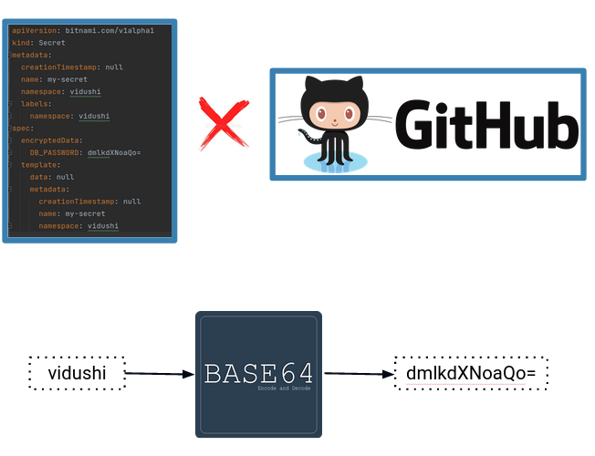
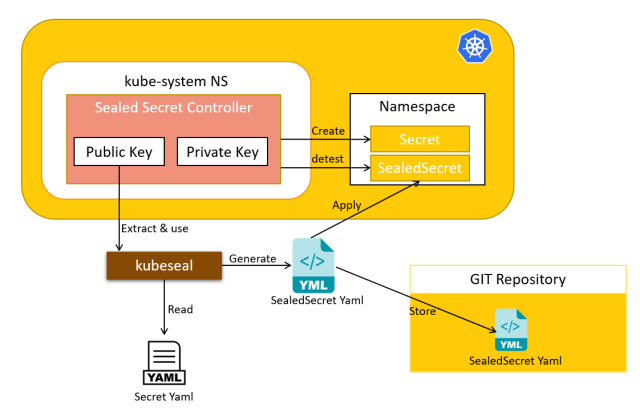
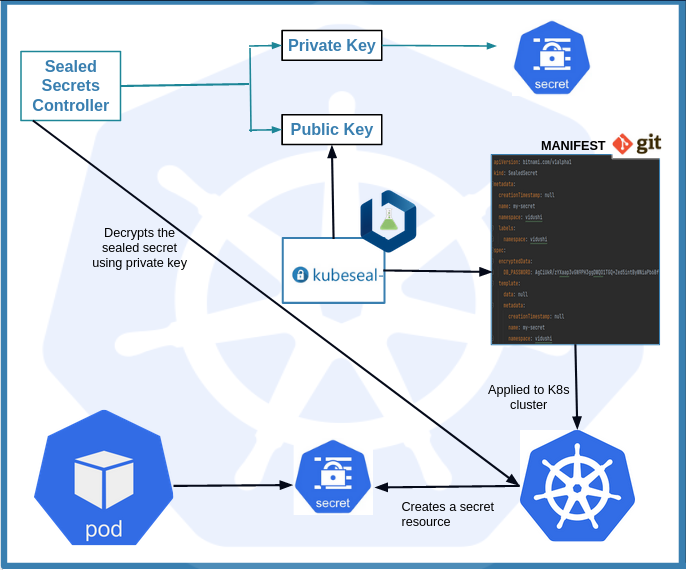

> **Sealed Secrets for one-way encryption 🔒**

## 🔐 Introduction

Kubernetes Secrets are a powerful way to store sensitive data in your cluster, but they are not encrypted at rest by default. This means that anyone with access to the cluster can view them, which is a security risk.

**Sealed Secrets** is a Kubernetes controller and CLI tool that encrypts Secrets using asymmetric cryptography. This means that the Secrets can only be decrypted by the controller, which has the private key. This makes Sealed Secrets a much more secure way to store Secrets in Kubernetes.

In this blog post, we will introduce Sealed Secrets and show you how to use them to manage your Kubernetes passwords.

## 🔑 Secrets in Kubernetes

Secrets in Kubernetes are the resource that manages the deployment of sensitive information, such as passwords, OAuth tokens, and SSH keys. It is suggested to store the sensitive information as a secret resource rather than having it imbibed in an environment variable. Secrets can be mounted as data volumes or exposed as environment variables to the containers in a Kubernetes Pod. Secrets in k8s are stored in a centralized repository named etcd in a base64 encoded format.

## ⚠️ Problems with Secrets in Kubernetes

Applications may also tend to expose the secrets in audit logs and monitoring systems. Following is a sample YAML file for a Secret:

```yaml
apiVersion: v1
kind: Secret
metadata:
    name: mysecret
type: Opaque
data:
    username: d2VsY29tZSB0bw==
    password: Zm94dXRlY2g=
```

We can easily decode the sensitive information with base64 command like the following:

```shell
echo -n Zm94dXRlY2g= | base64 -d
```

So, definitely, we should not store Kubernetes Secrets on Git/any visible systems. There are many different ways to externalize k8s secrets like [Hashicorp's Vault](https://www.vaultproject.io/), [Azure Key Vault](https://azure.microsoft.com/en-us/services/key-vault/), [External Secret Operator](https://external-secrets.io/), [Helm Secrets](https://github.com/jkroepke/helm-secrets), [Secrets Store CSI Driver](https://github.com/kubernetes-sigs/secrets-store-csi-driver), [Bitnami's SealedSecret](https://github.com/bitnami-labs/sealed-secrets), etc.

### Suggestions for Secret Management

We can follow these steps to safely use the secrets in Kubernetes:

- Enable Encryption at Rest
- Enable or configure RBAC rules to restrict access to the secrets in a cluster
- Restrict Secret access to specific containers, or the containers that require access to the secret to perform their operations.
- Consider using external Secret store providers

## 🔒 What are Sealed Secrets?

Sealed Secrets are the resource in Kubernetes that are basically encrypted Secrets that can be created by anyone, but can only be decrypted by the controller running in the target cluster. The Sealed Secret is safe to share publicly and upload to git repositories. Once the Sealed Secret is safely uploaded to the target Kubernetes cluster, the sealed secrets controller will decrypt it and recover the original Secret.

## 🤔 Why Use Sealed Secrets?

If we follow the GitOps approach, there should be a single source of truth, which means all the manifests, configuration files, and deployment YAMLs should be present in the same repository. We cannot store sensitive information like passwords or secret tokens in a GitHub repository. This is a huge risk because the original sensitive credentials and values can easily be derived from the base64 encoding format.



## 🧩 Components of Sealed Secrets

Sealed Secrets are comprised of three main components for their functionality:

1. **Controller**: Responsible for managing the sealed secret deployment. The primary task of the controller is to manage the private and public keys for encryption and decryption purposes.
2. **Kubeseal**: A CLI tool that creates a Custom Resource Definition (CRD) for sealed secrets from a secret. It communicates with the controller and retrieves the public key needed for encrypting the secrets.
3. **CRD**: A custom resource definition that we can apply in our Kubernetes cluster to create a secret.

### 🔄 How it Works



The process works as follows:

1. **Encrypt the Secret**: On the developer machine, use a public key and the `kubeseal` CLI to encrypt the secret. This encodes the encrypted secret into a Kubernetes Custom Resource Definition (CRD).
2. **Deploy the CRD**: Deploy the CRD to the target cluster.
3. **Decrypt the Secret**: The Sealed Secret controller decrypts the secret using a private key on the target cluster to produce a standard Kubernetes secret.

The private key is only available to the Sealed Secrets controller on the cluster, and the public key is available to the developers. This way, only the cluster can decrypt the secrets, and the developers can only encrypt them.

### 🛠️ How to Use Sealed Secrets

1. **Key Generation**: The controller generates a 4096-bit RSA key pair. The private key is stored as a secret, whereas the public key is made available to encrypt the secret.
2. **Sealing the Secret**: `Kubeseal` uses this public key from the controller to seal the secret values.
    - The value is symmetrically encrypted using AES-256 with a randomly generated session key.
    - The session key is asymmetrically encrypted with the controller's public key using SHA256.
3. **Creating the CRD**: `Kubeseal` creates a CRD for a sealed secret that can be safely pushed to the repository.
4. **Applying the CRD**: When the CRD is applied in the cluster, the controller unseals it using the private key and creates a secret resource in the defined namespace.



For more information, you can refer to the [Bitnami Sealed Secrets GitHub repository](https://github.com/bitnami-labs/sealed-secrets).

## 🛠️ Installation

### Client-side

The `kubeseal` client can be installed on Linux using the following commands:

```shell
KUBESEAL_VERSION='' # Set this to, for example, KUBESEAL_VERSION='0.24.3'
wget "https://github.com/bitnami-labs/sealed-secrets/releases/download/v${KUBESEAL_VERSION:?}/kubeseal-${KUBESEAL_VERSION:?}-linux-amd64.tar.gz"
tar -xvzf kubeseal-${KUBESEAL_VERSION:?}-linux-amd64.tar.gz kubeseal
sudo install -m 755 kubeseal /usr/local/bin/kubeseal
```

### Server-side

The Sealed Secrets Helm chart is officially supported and hosted in the [Bitnami Sealed Secrets GitHub repository](https://github.com/bitnami-labs/sealed-secrets).

```shell
helm repo add sealed-secrets https://bitnami-labs.github.io/sealed-secrets
helm dependency update sealed-secrets
helm install sealed-secrets sealed-secrets/sealed-secrets --namespace kube-system --version 2.7.4
```

Installing the `Sealed Secrets Controller` can be done via Helm or `kubectl`. This example uses `kubectl`. This will install Custom Resource Definitions (CRDs), RBAC resources, and the controller.

```shell
wget https://github.com/bitnami-labs/sealed-secrets/releases/download/v0.24.3/controller.yaml
kubectl apply -f controller.yaml
```

Once it is running, you can retrieve the generated public key certificate using `kubeseal` and store it on your local disk:

```shell
kubeseal --fetch-cert > pub-key-cert.pem
```

You can then create a Secret and seal it with `kubeseal`. This example uses the manifest detailed at the start of this section, but you can change the key-value pairs under the data field as you see fit.

```yaml
apiVersion: v1
kind: Secret
metadata:
    creationTimestamp: null
    name: my-secret
    namespace: test-ns
data:
    password: dXNlcm5hbWU=        # base64 encoded username
    username: cGFzc3dvcmQ=        # base64 encoded password
```

Seal the secret:

```shell
kubeseal --cert=pub-key-cert.pem --format=yaml < secret.yaml > sealed-secret.yaml
```

The generated output will look something like this:

```yaml
apiVersion: bitnami.com/v1alpha1
kind: SealedSecret
metadata:
    creationTimestamp: null
    name: my-secret
    namespace: test-ns
spec:
    encryptedData:
        password: AgBvA5WMunIZ5rF9...
        username: AgCCo8eSORsCbeJSoRs/...
    template:
        data: null
        metadata:
            creationTimestamp: null
            name: my-secret
            namespace: default
        type: Opaque
```

The SealedSecret is the only resource that will be deployed to the cluster as follows:

```shell
kubectl apply -f sealed-secret.yaml
```

Once the SealedSecret CRD is created in the cluster, the controller knows and unseals the underlying Secret using the private key and deploys it to the same namespace. This is seen by looking at the logs from the controller.

## 📑 Conclusion

In this post, you learned that using Secrets in Kubernetes introduces risks that can be mitigated with encryption. Furthermore, we covered how Sealed Secrets can be used as a tool for managing your sensitive data. Alternative solutions that you can consider for the encryption and management of your Secrets in Kubernetes are [Mozilla SOPS](https://github.com/mozilla/sops) and [Helm Secrets](https://github.com/jkroepke/helm-secrets).

<br>

**_Until next time, つづく 🎉_**

> 💡 Thank you for Reading !! 🙌🏻😁📃, see you in the next blog.🤘  **_Until next time 🎉_**

🚀 Thank you for sticking up till the end. If you have any questions/feedback regarding this blog feel free to connect with me:

**♻️ LinkedIn:** https://www.linkedin.com/in/rajhi-saif/

**♻️ X/Twitter:** https://x.com/rajhisaifeddine

**The end ✌🏻**

<h1 align="center">🔰 Keep Learning !! Keep Sharing !! 🔰</h1>

**📅 Stay updated**

Subscribe to our newsletter for more insights on AWS cloud computing and containers.
