> **🔒 Fortify k8s with Strace, Falco, AppArmor, and Seccomp**

## 📚 Introduction

This blog post provides a comprehensive guide to securing Kubernetes, covering runtime security and system hardening. The post starts by discussing the importance of runtime security, which is the process of protecting running containers from malicious attacks. It then covers a number of tools that can be used to implement runtime security, including [Strace](https://strace.io/), [Falco](https://falco.org/), [AppArmor](https://wiki.ubuntu.com/AppArmor), and [Seccomp](https://github.com/seccomp/libseccomp).

The post then moves on to system hardening, which is the process of making the underlying operating system more secure. It discusses a number of system hardening techniques. Let's get started!

### 🛠️ Strace: A Guide to System Call Tracing

Strace, short for system call trace, acts as a sidecar on the system call interface, meticulously recording every syscall. In this article, we present a straightforward explanation of how most users leverage strace in practice, while also providing a detailed walk-through for those seeking in-depth knowledge. With a multitude of parameters available, the effectiveness of strace largely depends on the specific situation at hand. Throughout this article, we will focus on commonly used parameters to debug Kubernetes operations.

Among the practical applications of strace is the ability to inspect whether secrets stored in etcd are accessible. To accomplish this, we'll try identifying the process ID on which etcd runs.

```bash
# SSH into K8s master nodes
ps aux | grep etcd
```

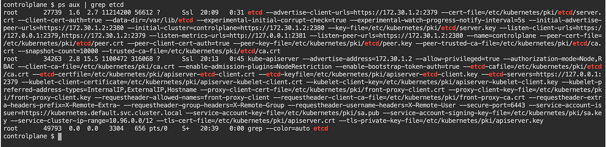

Based on the results above, the first process ID is the one we want to focus on, as the second process is `kube-apiserver` and the third is the `grep` command that we just ran.

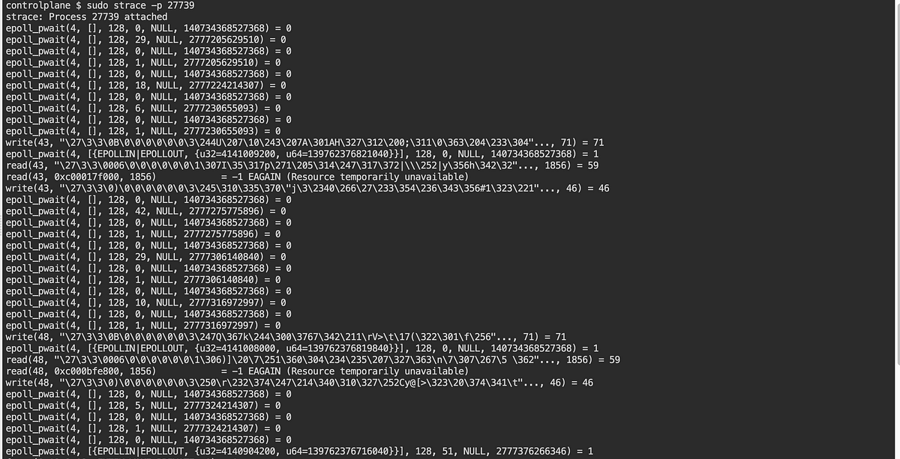

We should be seeing a lot of operations being listed out. From here, we could head over to the process directory and see what is contained within it.


At this point, it seems like the directory `10` contains the information that Kubernetes needs. We could create a simple secret and try to locate the value within it.

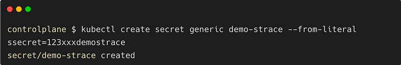

The `-A10` and `-B10` options in the below command mean that you should show 10 lines before and after the search string.

```bash
# Example command
grep -A10 -B10 'search_string' /proc/10
```

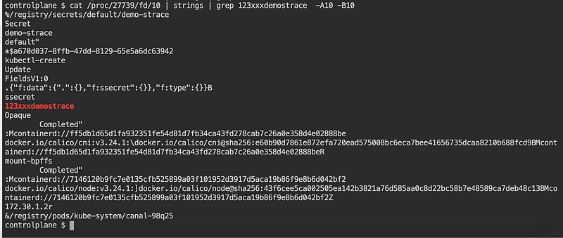

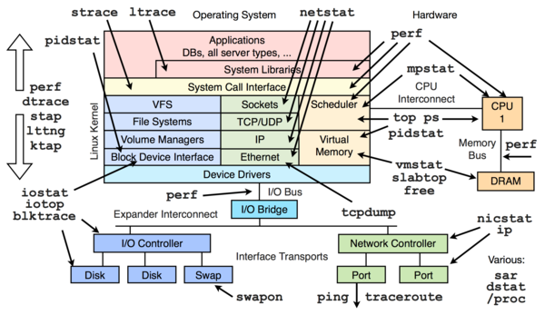

## 🛡️ Falco: Auditing and Rule-based Detection

[**Falco**](https://falco.org/) is a CNCF project that was created to track all actions taken by Kubernetes administrators. It can be used as both a powerful auditing tool and a rule engine to identify any violations.

Falco can be installed on Kubernetes in two modes: standalone mode or daemonset mode. In daemonset mode, a Pod is run on every node in the cluster. In this example, we will install Falco in standalone mode.

After installing Falco, you can start writing rules to detect specific events or conditions. For example, you could write a rule to detect if a user tries to delete a critical Kubernetes object. You can also use Falco to generate alerts when a rule is triggered.

Falco is a powerful tool that can help you to protect your Kubernetes cluster from unauthorized access and malicious activity. By installing Falco and writing rules to detect specific events, you can help to keep your cluster secure.

For more information, visit the [Falco Documentation](https://falco.org/docs/).

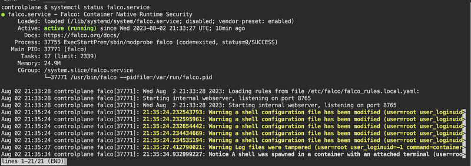

Falco rules are located in /etc/falco.

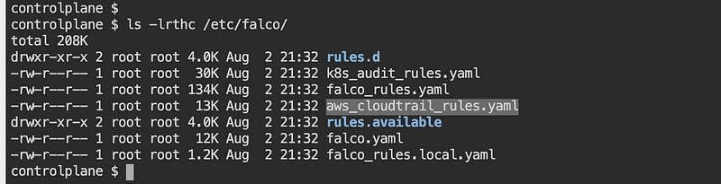

Let's test Falco by performing administrative actions inside a Pod (container), such as writing additional information to a file in the /etc/ directory. We can then see what logs Falco generates to detect any suspicious activity.

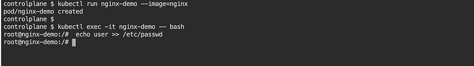

The logs that Falco generates can be found in the /var/log/syslog file. To search for Falco logs, you can use the grep command with the keyword falco.

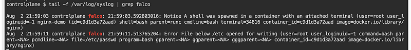

### 📝 Falco Rule Management

Falco comes with a set of default rules located in the `/etc/falco/falco_rules.yaml` file. Administrators can use a text editor, such as `vim` or `nano`, to view the contents of this file and learn how each rule works.

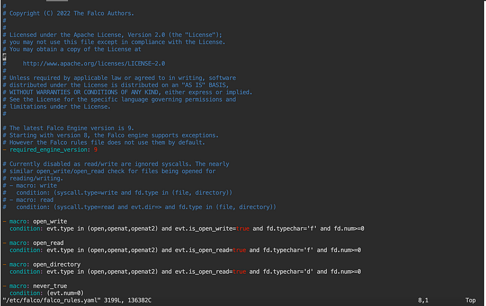

There are two ways to change Falco rules:

1. **Modify the Default Rule**: Change the rule found in the `falco_rules.yaml` directory. This is the default location for Falco rules. To change a rule, you can open the `falco_rules.yaml` file in a text editor and make the necessary changes.
2. **Add a New Rule**: Add the new rule in the `falco_rules.local.yaml` file. This file is used to override the default rules. To add a new rule, you can open the `falco_rules.local.yaml` file in a text editor and add the new rule.

#### Finding and Modifying Rules

To find the rule that needs to be modified, you can open the `falco_rules.yaml` file in a text editor and search for the rule that you want to change. The rule will be identified by its name. Once you have found the rule, you can make the necessary changes.

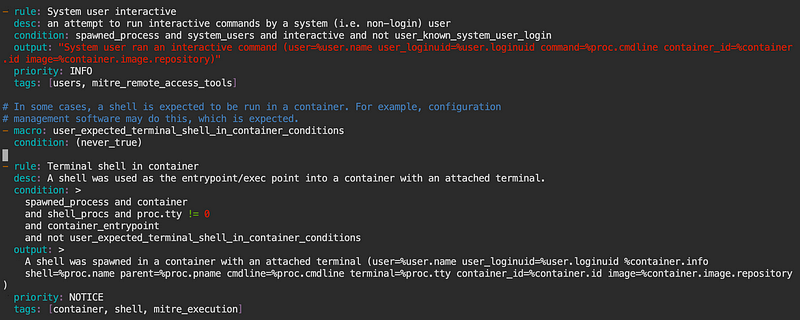

Copy the content and add it to the end of `falco_rules.local.yaml`.

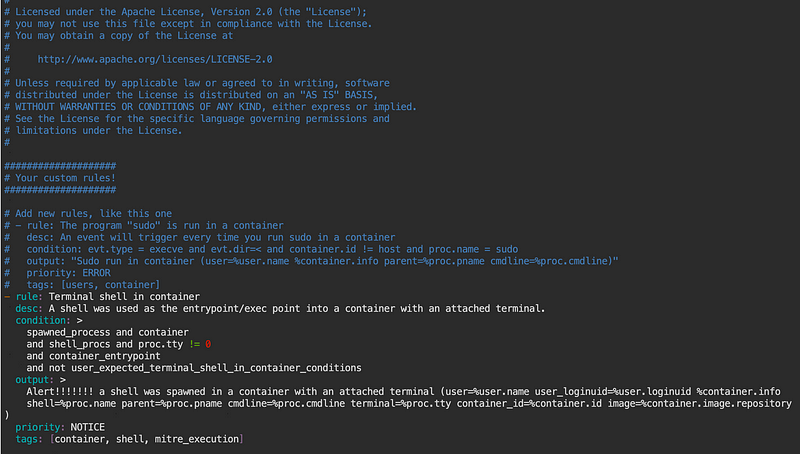

Repeat the same action of executing into a terminal within a Pod (container) and check the `/var/log/syslog` file on the worker node to see what is displayed.

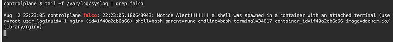

### 🔒 The Immutable Pod: A Secure k8s Deployment

Immutable pods are pods that cannot be modified once they have been created. This makes them more secure and stable, as it prevents attackers from making changes to the pod that could compromise its security or functionality.

One way to achieve immutability in Kubernetes is to use the `startupProbe`. This probe is designed to detect when a pod has finished starting up and is ready to be monitored by Kubernetes.

```yaml
apiVersion: v1
kind: Pod
metadata:
    creationTimestamp: null
    labels:
        run: nginx-demo
    name: nginx-demo
spec:
    containers:
    - image: nginx
        name: nginx-demo
        resources: {}
        startupProbe:
            exec:
                command:
                - sh
                - c
                - |
                    rm /bin/bash
                    rm /bin/touch    
            initialDelaySeconds: 5
            periodSeconds: 5    
    dnsPolicy: ClusterFirst
    restartPolicy: Always
```

When administrators attempt to execute into a terminal within the container, they will receive an error message because the `/bin/bash` binary has been removed.

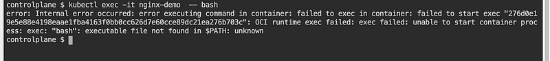

### 📂 Another Example of an Immutable Pod with a Read-Only Root Filesystem

In this example, we will create an immutable pod with a read-only root filesystem. However, we will also create an empty directory for logs. This directory will be used to store essential logs that the pod generates.

```yaml
apiVersion: v1
kind: Pod
metadata:
    name: immutable-pod
spec:
    containers:
    - name: immutable-container
        image: nginx:latest
        command: ["nginx"]
        securityContext:
            readonlyRootFilesystem: true
        volumeMounts:
        - name: logs
            mountPath: /var/log
            subPath: logs
    volumes:
    - name: logs
        emptyDir: {}
```

## 🏗 Kubernetes Auditing

Kubernetes auditing is a security feature that helps to keep your cluster secure by recording a chronological set of records documenting the sequence of actions in a cluster. This includes activities generated by users, by applications that use the Kubernetes API, and by the control plane itself.

Audit policies define rules about what events should be recorded and what data they should include. The audit policy object structure is defined in the [audit.k8s.io API group](https://kubernetes.io/docs/reference/generated/kubernetes-api/v1.20/#auditpolicy-v1-audit-k8s-io). When an event is processed, it is compared against the list of rules in order. The first matching rule sets the audit level of the event.

A simple kube-apiserver auditing policy template can be found [here](https://kubernetes.io/docs/tasks/debug-application-cluster/audit/#audit-policy).

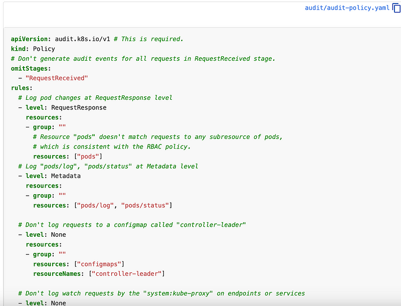

You can enable this in the `kubeadm` configuration or edit the manifest of the running API server on the masters:

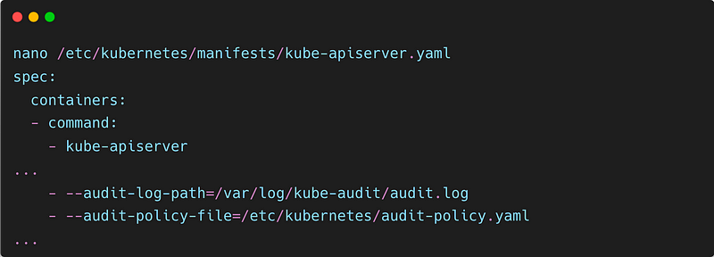

Then mount the volumes:

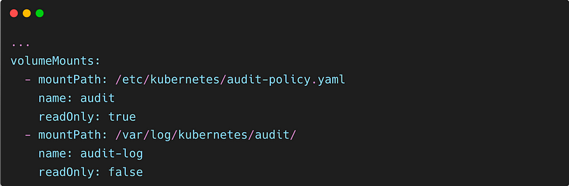

And finally, configure the hostPath:

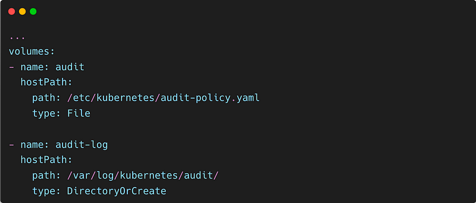

To check the logs, use:

```shell
sudo tail -f /var/log/kubernetes/audit/audit.log
```

Every log entry starts with "{" and ends with "}", in other words, JSON format. You can get a clear visual by putting the content in any online JSON formatter. For example, you can use [this site](https://jsonformatter.curiousconcept.com/) to get formatted JSON data.


## AppArmor in Kubernetes

AppArmor is a Linux kernel security module that can be used to restrict the capabilities of running processes. In Kubernetes, AppArmor can be used to secure containers by defining profiles that restrict the actions that a container can perform.

AppArmor profiles can be defined for individual containers or for entire namespaces. When a container is started, it is assigned the AppArmor profile that is defined for its namespace. This ensures that the container is only able to perform the actions that are allowed by the profile.

AppArmor can be used to secure Kubernetes pods by defining profiles that restrict the actions that a pod can perform. Once the profile is loaded, we can assign it to a pod by specifying the profile name in the pod spec. This will ensure that the pod is only able to perform the actions that are allowed by the profile.

For example, we could create a profile that prevents a pod from accessing the filesystem. This would prevent an attacker from modifying the pod's files or stealing sensitive data.

To do this, we first need to create an AppArmor profile `k8s-apparmor-example-deny-write` and load it into the nodes that will be hosting the pods.

```shell
#include <tunables/global>

profile k8s-apparmor-example-deny-write flags=(attach_disconnected) {
    #include <abstractions/base>

    file,

    # Deny all file writes.
    deny /** w,
}
```

Next, we'll run a simple Hello AppArmor pod with the deny-write profile:

```yaml
apiVersion: v1
kind: Pod
metadata:
    name: hello-apparmor
    annotations:
        # Tell Kubernetes to apply the AppArmor profile "k8s-apparmor-example-deny-write".
        # Note that this is ignored if the Kubernetes node is not running version 1.4 or greater.
        container.apparmor.security.beta.kubernetes.io/hello: localhost/k8s-apparmor-example-deny-write
spec:
    containers:
    - name: hello
        image: busybox:1.28
        command: [ "sh", "-c", "echo 'Hello AppArmor!' && sleep 1h" ]
```

Then apply it:

```shell
kubectl create -f ./hello-apparmor.yaml
```

If we look at the pod events, we can see that the Pod container was created with the AppArmor profile `k8s-apparmor-example-deny-write`:

```shell
kubectl get events | grep hello-apparmor
```

We can verify that the container is actually running with that profile by checking its proc attr:

```shell
kubectl exec hello-apparmor -- cat /proc/1/attr/current
k8s-apparmor-example-deny-write (enforce)
```

Finally, we can see what happens if we try to violate the profile by writing to a file:

```shell
kubectl exec hello-apparmor -- touch /tmp/test
touch: /tmp/test: Permission denied
error: error executing remote command: command terminated with non-zero exit code: Error executing in Docker Container: 1
```

For more information, visit the [AppArmor Documentation](https://wiki.ubuntu.com/AppArmor).

## Seccomp

[Seccomp](https://kubernetes.io/docs/tutorials/security/seccomp/) is a Linux kernel feature that can be used to restrict the system calls that a process can make. In Kubernetes, Seccomp can be used to secure containers by defining profiles that restrict the system calls that a container can make.

Seccomp profiles can be defined for individual containers or for entire namespaces. When a container is started, it is assigned the Seccomp profile that is defined for its namespace. This ensures that the container is only able to make the system calls that are allowed by the profile.

To use Seccomp to secure Kubernetes pods, we need to create a Seccomp profile and load it into the kubelet process. The kubelet process is the core service that manages pods in Kubernetes.

The Seccomp profile can be stored in a file anywhere on the filesystem. The default path for the Seccomp profile is `/var/lib/kubelet`. The file name of the Seccomp profile can be `audit.json`.

Once the Seccomp profile is loaded into the kubelet process, it will be used to restrict the system calls that pods can make. This will help to prevent malicious attacks.

```shell
$ ls /var/lib/kubelet/seccomp/profiles
audit.json

$ cat audit.json

{
    "defaultAction": "SCMP_ACT_LOG"
}
```

To create a Pod with a Seccomp profile for syscall auditing, we can apply the `audit.json` profile, which will log all syscalls of the process, to a new Pod.

Here is a manifest for that Pod:

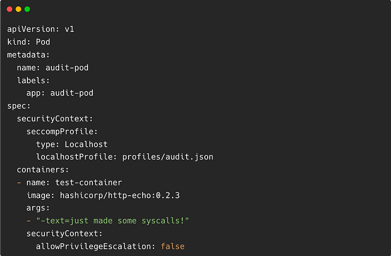

Create the Pod in the cluster:

```shell
kubectl apply -f https://k8s.io/examples/pods/security/seccomp/ga/audit-pod.yaml
```

This profile does not restrict any syscalls, so the Pod should start successfully.

```shell
kubectl get pod audit-pod
NAME        READY   STATUS    RESTARTS   AGE
audit-pod   1/1     Running   0          30
```

Open up a new terminal window and use `tail` to monitor for log entries that mention calls from `http-echo`:

```shell
# The log path on your computer might be different from "/var/log/syslog"
tail -f /var/log/syslog | grep 'http-echo'
```

You should already see some logs of syscalls made by `http-echo`, and if you run `curl` again inside the control plane container you will see more output written to the log.

## 🌸 Conclusion

In this blog, we have discussed three ways to secure Kubernetes pods using AppArmor, Seccomp, and immutable pods. These techniques can help to prevent malicious attacks and protect your Kubernetes cluster.

It is important to note that these are just a few of the many ways to secure Kubernetes pods. There are many other techniques that can be used, and the best approach will vary depending on your specific needs.

If you are concerned about the security of your Kubernetes cluster, I recommend that you consult with a security expert. They can help you to assess your current security posture and recommend the best course of action for your specific needs.

https://giphy.com/gifs/thats-all-folks-upg0i1m4DLe5q

<br>

**_Until next time, つづく 🎉_**

> 💡 Thank you for Reading !! 🙌🏻😁📃, see you in the next blog.🤘  _**Until next time 🎉**_

🚀 Thank you for sticking up till the end. If you have any questions/feedback regarding this blog feel free to connect with me:

**♻️ LinkedIn:** https://www.linkedin.com/in/rajhi-saif/

**♻️ X/Twitter:** https://x.com/rajhisaifeddine

**The end ✌🏻**

<h1 align="center">🔰 Keep Learning !! Keep Sharing !! 🔰</h1>

**📅 Stay updated**

Subscribe to our newsletter for more insights on AWS cloud computing and containers.
