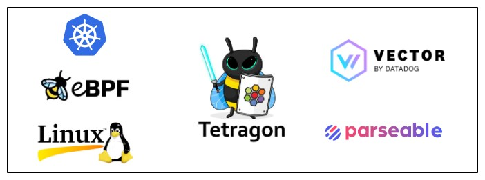
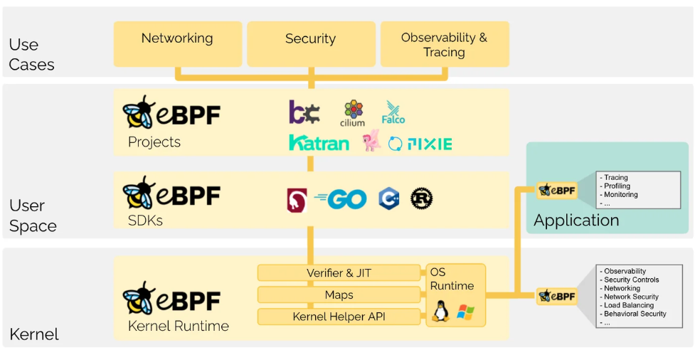
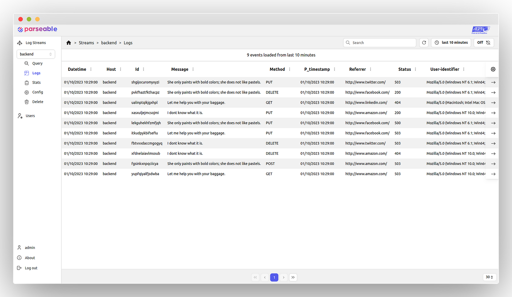
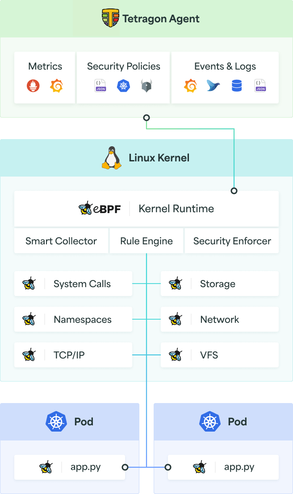
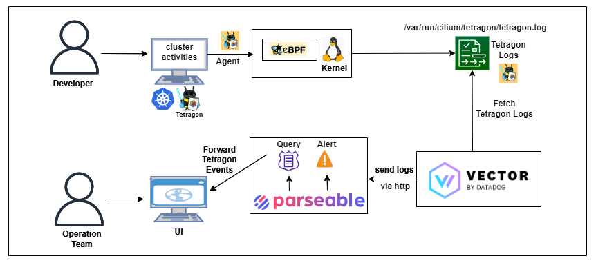

> **eBPF Log Analytics in Kubernetes Cluster with eBPF-Based Tetragon Using Parseable 🕸️**

## 🛰️ Overview

[eBPF](https://ebpf.io/) is a powerful technology that allows you to extend the Linux kernel at runtime, without having to modify the kernel source code or reboot. This makes it ideal for a wide range of use cases, including security, observability, and networking.

One of the most exciting applications of eBPF is log analytics. By using eBPF to hook into kernel calls, you can collect detailed information about everything that is happening in your Kubernetes cluster. This information can then be analyzed with a tool like [Parseable](https://www.parseable.io/) to identify trends, patterns, and anomalies.

In this blog post, we will show you how to use Parseable to audit Tetragon logs in your Kubernetes cluster. We will also examine a specific use case for auditing and alerting on sensitive file access.



## Getting Started

eBPF is a technology that enables the Linux kernel to be extended at runtime, i.e., without modifying the kernel source code or rebooting it. It has been noted that eBPF does to Linux exactly what JavaScript does to HTML. The extended Berkeley Packet Filter, or eBPF, allows us to dynamically program the Linux kernel and obtain insights. Generally, eBPF functions in networking, security, and observability.



[Parseable](https://www.parseable.io/) is a log analytics platform, built for the modern, cloud-native era. Parseable uses an index-free mechanism to organize and query data, allowing low latency and high throughput ingestion and query.



[Tetragon](https://tetragon.io/) is a powerful Kubernetes-aware security observability and runtime enforcement tool that applies TracingPolicy and filtering directly with eBPF. It ensures the reduction of observation overhead by tracking any process and real-time policy enforcement.



As shown in the above figure, Tetragon is deployed to the Kubernetes cluster. Tetragon uses hook points in eBPF programs to observe kernel calls. If any TracingPolicy is applied, it filters the logs as per the policy configuration. When any event is filtered using TracingPolicy, it stores Tetragon logs locally or uses a webhook backend like Parseable to collect logs.

### 📋 Pre-requisites

To get started, you'll need the following pre-requisites:

- A Kubernetes cluster with admin access. You can create a local one using [Minikube](https://minikube.sigs.k8s.io/docs/start/) or [Kind](https://kind.sigs.k8s.io/).
- `kubectl` and `helm` installed.

We'll implement Tetragon logs using TracingPolicy. The Tetragon server stores them in a local file system and configures [Vector](https://vector.dev/), a lightweight, ultra-fast tool, to send logs to the Parseable server. Finally, we'll verify Tetragon logs in the Parseable UI for sensitive file access via a Kubernetes pod.

## Hands-On

We'll implement Tetragon logs using TracingPolicy. The Tetragon server stores them in a local file system, and we'll configure [Vector](https://vector.dev/), a lightweight, ultra-fast tool, to send logs to the Parseable server. Finally, we will verify Tetragon logs in the Parseable UI with sensitive file access through the Kubernetes pod.

Here is the high-level architecture that shows what we would achieve:



We will perform the following tasks to understand how Parseable helps us in auditing Tetragon logs:

1. **Enable Tetragon in the Kubernetes cluster which stores logs locally.**
2. **Send Tetragon logs to Parseable through Vector.**
3. **Access sensitive files from the pod and generate alerts through Parseable.**

### 🛠️ Setup Environment

#### Install Tetragon using Helm

```sh
helm repo add cilium https://helm.cilium.io
helm repo update
helm install tetragon cilium/tetragon -n kube-system
```

Wait for a moment, then:

```sh
kubectl get ds tetragon -n kube-system
kubectl logs -n kube-system -l app.kubernetes.io/name=tetragon -c export-stdout -f
```

#### Install Parseable

Follow this [installation guide](https://docs.parseable.io/installation) to install Parseable on your Kubernetes cluster. Wait for Parseable to start, and then verify that Parseable pods are running in the `parseable` namespace:

```sh
kubectl get pods -n parseable
```

#### Configure Vector to Send Logs to Parseable

Install Vector through Helm. We have a `vector-tetragon-values.yaml` file configured to access the `tetragon.log` file.

```sh
helm repo add vector https://helm.vector.dev
wget https://github.com/seifrajhi/tetragon-vector-parseable-blog/blob/main/vector-tetragon-values.yaml
helm install vector vector/vector --namespace vector --create-namespace --values vector-tetragon-values.yaml
```

It will take a few minutes for the Vector pod to get started. Verify the vector pod is running in the `vector` namespace:

```sh
kubectl get pods -n vector
```

Now Vector is ready to send the events stored in `/var/run/cilium/tetragon/tetragon.log` file. Once this is done, you can verify the log events in the Parseable UI.

### 🔍 Track Sensitive File Access with Parseable

Although integrating Tetragon logs with Parseable has several advantages, we will concentrate on one of the most notable use cases — auditing Tetragon events when accessing sensitive files like `/etc/shadow`.

#### Create a Pod to Access Files on the Host

Create a pod with privileged access.

```yaml
# dev-pod.yaml
apiVersion: v1
kind: Pod
metadata:
    name: dev-pod
spec:
    containers:
        - command:
                - /nsenter
                - --all
                - --target=1
                - --
                - su
                - "-"
            image: alexeiled/nsenter:2.34
            name: nsenter
            securityContext:
                privileged: true
            stdin: true
            tty: true
    hostNetwork: true
    hostPID: true
```

Apply the pod configuration:

```sh
kubectl apply -f dev-pod.yaml
```

To list the pods:

```sh
kubectl get pods
```

#### Apply TracingPolicy

Apply [TracingPolicy](https://tetragon.io/docs/use-cases/filename-access/) for read/write access.

```sh
wget https://github.com/cilium/tetragon/blob/main/examples/tracingpolicy/filename_monitoring_filtered.yaml
kubectl apply -f filename_monitoring_filtered.yaml
```

This policy monitors a specific file, `/etc/passwd`. If you check the content of the TracingPolicy file, it hooks on kernel functions from which the file can be accessed:

- `security_file_permission`
- `security_mmap_file`
- `security_path_truncate`

This TracingPolicy will extract read/write event logs.

#### Access Sensitive Files from a Pod

Now, exec into the dev-pod and apply the `cat` command to read the `/etc/passwd` file:

```sh
kubectl exec -it dev-pod -n default -- cat /etc/passwd
```

You can verify the logs from the Parseable Console. Next, we will generate an alert in Parseable to get a notification when a sensitive file is accessed.

### 🚨 Set an Alert in Parseable

Parseable allows us to generate an alert when the `/etc/shadow` file is read from the pod. Use the following JSON code to set an alert from the Parseable UI. Click `console -> config -> alert`.

To generate an alert for a specific pod:

```json
{
    "version": "v1",
    "alerts": [
        {
            "name": "Unauthorised access",
            "message": "/etc/shadow file is accessed by an unauthorised pod",
            "rule": {
                "type": "composite",
                "config": "(process_kprobe_process_arguments =% \"shadow\")"
            },
            "targets": [
                {
                    "type": "webhook",
                    "Endpoint": "<webhook.site_custom_endpoint>",
                    "skip_tls_check": false,
                    "repeat": { "interval": "10s", "times": 5 }
                }
            ]
        }
    ]
}
```

This alert will trigger when the `/etc/shadow` file is accessed from the pod. Set up the target endpoint by going through [webhook.site](https://webhook.site) and copying your unique URL. Paste it in place of `webhook.site_custom_endpoint`. Click the Submit button.

Now, let's verify how the above Parseable setup triggers an alert. Exec into the dev-pod and apply the `cat` command to read the `/etc/passwd` file and check the unique URL to see the alerts:

```sh
kubectl exec -it dev-pod -n default -- cat /etc/passwd
```

## 🏁 Conclusion

This post explained how Parseable can be used to analyze Tetragon logs in Kubernetes. We set up a logging pipeline from Tetragon to Parseable using Vector, applied a TracingPolicy to filter the logs, and generated alerts in Parseable when sensitive files were accessed.

If you have any further ideas or feedback, please join our [Slack channel](https://slack.parseable.io) to share them. We value your insights and look forward to hearing from you.

<br>

**_Until next time, つづく 🎉_**

> 💡 Thank you for Reading !! 🙌🏻😁📃, see you in the next blog.🤘  **_Until next time 🎉_**

🚀 Thank you for sticking up till the end. If you have any questions/feedback regarding this blog feel free to connect with me:

**♻️ LinkedIn:** https://www.linkedin.com/in/rajhi-saif/

**♻️ X/Twitter:** https://x.com/rajhisaifeddine

**The end ✌🏻**

<h1 align="center">🔰 Keep Learning !! Keep Sharing !! 🔰</h1>

**📅 Stay updated**

Subscribe to our newsletter for more insights on AWS cloud computing and containers.
