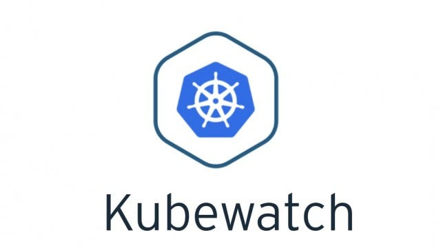
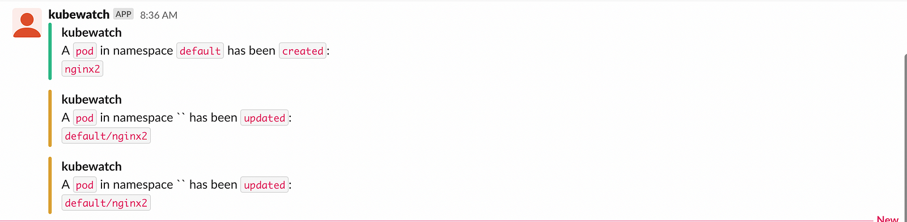

> **Real-Time Observability 🌟**

## 🗯 Introduction

Kubernetes is a popular container orchestration platform that automates many of the tasks involved in deploying, managing, and scaling containerized applications. However, Kubernetes can be complex, and it can be difficult to keep track of all the changes that are happening in your cluster.

This is where Kubewatch comes in. Kubewatch is a Kubernetes watcher that publishes notifications to available collaboration hubs/notification channels. It watches the cluster for resource changes and notifies you through webhooks.



## 👀 What is Kubewatch?

[Kubewatch](https://github.com/robusta-dev/kubewatch) is a Kubernetes watcher that sends notifications to various channels like Slack, Hipchat, and others. It can monitor a wide range of [Kubernetes events](https://www.datadoghq.com/blog/monitor-kubernetes-events/), including pod lifecycle events, deployment status changes, service updates, and more.

With Kubewatch, you can get real-time notifications when changes occur in your Kubernetes environment, so you can take action immediately.

### How does Kubewatch work?

To understand how Kubewatch works, let's first look at the concept of Kubernetes events. Kubernetes events are objects that help you know what's happening inside your resources (pods, nodes, clusters, and so on). These objects are usually generated in response to changes happening within these resources. By collecting and analyzing these events, you can sneak a peek into the performance and health of your Kubernetes cluster.

Kubewatch is an open-source events watcher for Kubernetes. You can configure it to watch your Kubernetes clusters for events, collect them, and stream relevant notifications to external services such as Slack. With Kubewatch, you can set up a Slack bot that sends a message in your team channel whenever one of your resources goes down.

Internally, a kubewatch container is created whenever you run the tool, alongside the kubectl sidecar for communicating with the API server.

### 🧩 Key Features

- **Simplicity**: Completely open-source with a large community of developers.
- **Integration**: Works with various notification channels like Slack, Hipchat, Mattermost, Flock, Webhook, and SMTP.
- **Event Monitoring**: Monitors events like pod, deployment, configmap creation, and deletion.

### Installation

In this blog, we will use Helm to install Kubewatch and use Slack as the notification medium.

#### Configuring Slack

1. Go to your Slack workspace, and you have the option to create a new channel, or you can use an existing channel. For this demo, I am going to use an existing channel `slacktest` (but creating a new channel is pretty easy, you need to click on Create a new channel).
2. Once you have a Slack channel, the next step is to get a Slack token to integrate with Kubewatch. To create a Slack token, go to [Slack API](https://api.slack.com/apps/new) and create a new app. Give your App Name, for example: `kubewatch`, and select your Development Slack Workspace.
3. Define your token scope. In this case, we are using `chat:write` as scope which gives permission to post messages in approved channels & conversations.

#### Setup

To use Kubewatch, you first need to install it on your Kubernetes cluster. There are a few ways to do this, but the simplest method is to use Helm. Here's how you can install Kubewatch with Helm:

1. **Install Helm** on your machine if you haven't already done so.
2. **Add the Kubewatch repository to Helm**:
    ```sh
    helm repo add robusta https://robusta-charts.storage.googleapis.com
    ```
3. **Update your Helm repository**:
    ```sh
    helm repo update
    ```
    Update Complete. ⎈Happy Helming!⎈
4. **Install Kubewatch**:
    ```sh
    helm install kubewatch robusta/kubewatch
    ```

As we know all Helm charts come with a default set of values but in this case, we want to modify these values according to our requirement.

```sh
helm show values robusta/kubewatch > ~/kubewatch.yaml
```

Now, please open this file and make modifications to a few parameters. Let's begin with Slack by adding the channel where notifications should be sent and inserting the token that we generated during the Slack section:

```yaml
slack:
  enabled: true
  # Slack channel to notify
  channel: "slacktest"
  # Slack bots token. Create using: https://my.slack.com/services/new/bot
  # and invite the bot to your channel using: /join @botname
  token: "xoxb-XXXXXXX"
```

In the next step, we need to define what we want to monitor. In this case, we want to monitor only the events from the default namespace (`namespaceToWatch: "default"`) and the resources to watch (deployment, services, pod). If you wish to monitor any other resources, simply change the corresponding parameter to true. For example, you can change `replicaset: false` to `replicaset: true`.

```yaml
namespaceToWatch: "default"
resourcesToWatch:
  deployment: false
  replicationcontroller: false
  replicaset: false
  daemonset: false
  services: true
  pod: true
  job: false
  node: false
  clusterrole: true
  clusterrolebinding: true
  serviceaccount: true
  persistentvolume: false
  namespace: false
  secret: false
  configmap: false
  ingress: false
  coreevent: false
  event: true
```

One crucial parameter to configure is `rbac`, which should be set to 'true.' If left at its default value of 'false,' the service account created by this Helm chart won't have the necessary permissions to list Kubernetes resources, such as pods, deployments, services, and more.

```yaml
rbac:
  create: true
```

With all the configuration in place, it is time to deploy the Helm chart with our customized values:

```sh
helm upgrade kubewatch robusta/kubewatch --values ~/kubewatch.yaml
```

**Please be patient while the chart is being deployed**

### Testing

Try to create any pod in the default namespace:

```sh
kubectl run nginx2 --image=nginx
```

Pod created:

```sh
pod/nginx2 created
```

If you go to the Slack channel, you will see a notification like this:



### Wrapping Up

In conclusion, Kubewatch is a potent tool that delivers notifications for all events within your Kubernetes cluster. However, it's important to configure it thoughtfully, as an excessive number of notifications in a busy cluster can result in notification fatigue, potentially causing you to overlook critical alerts.

> **If you found this article helpful, please don't forget to hit the Follow 👉 and Clap 👏 buttons to help me write more articles like this.**

**Thank You 🖤**

<br>

**_Until next time, つづく 🎉_**

> 💡 Thank you for Reading !! 🙌🏻😁📃, see you in the next blog.🤘  **_Until next time 🎉_**

🚀 Thank you for sticking up till the end. If you have any questions/feedback regarding this blog feel free to connect with me:

**♻️ LinkedIn:** https://www.linkedin.com/in/rajhi-saif/

**♻️ X/Twitter:** https://x.com/rajhisaifeddine

**The end ✌🏻**

<h1 align="center">🔰 Keep Learning !! Keep Sharing !! 🔰</h1>

**📅 Stay updated**

Subscribe to our newsletter for more insights on AWS cloud computing and containers.
