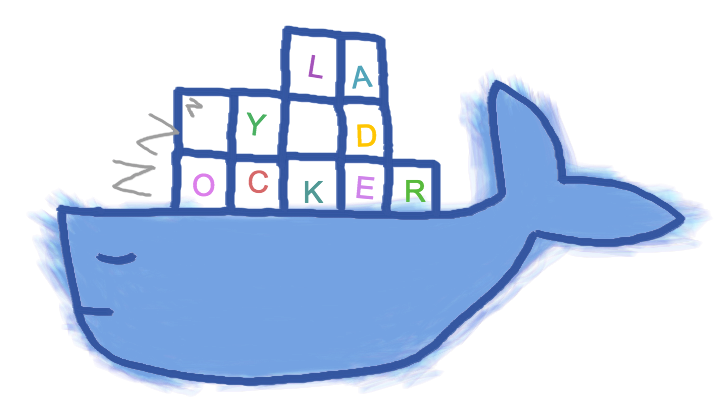
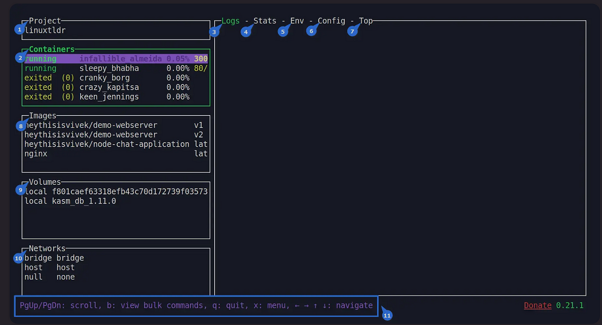

> **The lazy way to manage Docker 🐋**

## 🗯 Introduction

[LazyDocker](https://github.com/jesseduffield/lazydocker) is a user-friendly CLI tool that makes it easy to manage Docker. With LazyDocker, you can perform common Docker tasks such as starting, stopping, restarting, and removing containers with a single command. LazyDocker also makes it easy to view logs, prune unused containers and images, and customize metrics.

LazyDocker is the perfect tool for anyone who wants to use Docker without having to learn all the complex commands. It is also a great tool for experienced Docker users who want to save time and effort.

In this article, you'll discover its features, the installation process on Linux, and beginner-friendly usage instructions.


### Debunking common myths

- **Myth:** Docker is a black box, and I don't know what's going on inside it.
- **Myth:** You can't troubleshoot applications running in Docker.
- **Myth:** I just want to run the application on my host server, why don't they tell me how to do that?

## Manage Docker Applications Easily



LazyDocker is an amazing command line utility for managing Docker applications and services. It's a cross-platform tool with a user-friendly CLI interface, so you can use it on Windows, macOS, and Linux systems. You can even navigate and take actions with either the mouse or keyboard shortcuts.

### Why Use LazyDocker

While Docker is a powerful tool for developing and running applications, it can be complex to use, especially in production environments. LazyDocker makes it easy to manage Docker applications and services, even if you're not a Docker expert.

LazyDocker, a minimalist CLI tool (unlike the advanced [Portainer](https://www.portainer.io/) Web UI), is highly beneficial for Docker users who primarily focus on monitoring containers, images, volumes, and networks. It provides a more interactive and user-friendly way to interact with Docker compared to the standard command-line interface (CLI).

LazyDocker simplifies Docker container management with a visual interface, but it's not a substitute for the standard Docker CLI or advanced front-ends like Portainer.

### 🌟 Features and Limitations of LazyDocker

LazyDocker could become your preferred Docker management tool if your primary requirements align with the following:

- **Features:**

- Quickly view the list of running/stopped containers, images, volumes, and networks.
- Instantly track your container's resource utilization (CPU, memory) and view live logs through real-time monitoring.
- Easily manage containers using LazyDocker's user-friendly interface for starting, stopping, restarting, and removing them.
- Support Docker Compose for easy management of multi-container applications defined in Compose files.
- Launch a terminal session inside a running container directly from the LazyDocker interface.
- Provides time-saving keyboard shortcuts for Docker commands, enhancing efficiency for power users.

- **Limitations:**

- It lacks robust support for orchestrating containers using Docker Swarm or Kubernetes.
- Advanced networking setups, such as custom bridge networks with complex routing, may necessitate the use of the standard Docker CLI since they cannot be configured here.
- It isn't meant for creating Docker images from Dockerfiles or other sources.
- It doesn't provide extensive tools for managing user accounts and permissions within running containers.
- If you rely on Docker plugins for additional functionality, such as storage or network drivers, managing those plugins would generally require the standard Docker CLI.
- It is best suited for single-host Docker setups; for distributed or multi-host Docker environments like Docker Swarm or Kubernetes clusters, different tools and configurations are needed.

Despite these limitations, if your requirements align with the features, you can give it a try.

## Installation and Hands-on

LazyDocker isn't in the Linux repository but offers straightforward installation options for Linux, macOS, and even Windows. To begin, choose one of the preferred methods for installing it on your Linux system. Normally, the LazyDocker formula can be found in the Homebrew core, but we suggest you tap our formula to get frequently updated versions. It works with Linux, too.

### Homebrew (Linux/macOS)

**Tap:**

```shell
brew install jesseduffield/lazydocker/lazydocker
```

**Core:**

```shell
brew install lazydocker
```

### 🥄 Scoop (Windows)

You can install LazyDocker using Scoop:

```shell
scoop install lazydocker
```

### 🍫 Chocolatey (Windows)

You can install LazyDocker using Chocolatey:

```shell
choco install lazydocker
```

### 📦 Binary Release (Linux/macOS/Windows)

You can manually download a binary release from the [release page](https://github.com/jesseduffield/lazydocker/releases).

### 🔄 Automated Install/Update

Don't forget to always verify what you're piping into bash:

```shell
curl https://raw.githubusercontent.com/jesseduffield/lazydocker/master/scripts/install_update_linux.sh | bash
```

The script installs the downloaded binary to the `$HOME/.local/bin` directory by default, but it can be changed by setting the `DIR` environment variable.

### 🐹 Go

**Required Go Version >= 1.16**

```shell
go install github.com/jesseduffield/lazydocker@latest
```

**Required Go Version >= 1.8, <= 1.17**

```shell
go get github.com/jesseduffield/lazydocker
```

### 🐧 Arch Linux AUR

You can install LazyDocker using the AUR by running:

```shell
yay -S lazydocker
```

### 🐳 Docker

Click [here](https://github.com/jesseduffield/lazydocker#docker) if you have an ARM device.

**Run the container:**

```shell
docker run --rm -it -v /var/run/docker.sock:/var/run/docker.sock -v /yourpath:/.config/jesseduffield/lazydocker lazyteam/lazydocker
```

Don't forget to change `/yourpath` to an actual path you created to store LazyDocker's config.

You can also use this [docker-compose.yml](https://github.com/jesseduffield/lazydocker/blob/master/docker-compose.yml).

**You might want to create an alias, for example:**

```shell
echo "alias lzd='docker run --rm -it -v /var/run/docker.sock:/var/run/docker.sock -v /yourpath/config:/.config/jesseduffield/lazydocker lazyteam/lazydocker'" >> ~/.zshrc
```

**For development, you can build the image using:**

```shell
git clone https://github.com/jesseduffield/lazydocker.git
cd lazydocker
docker build -t lazyteam/lazydocker \
    --build-arg BUILD_DATE=`date -u +"%Y-%m-%dT%H:%M:%SZ"` \
    --build-arg VCS_REF=`git rev-parse --short HEAD` \
    --build-arg VERSION=`git describe --abbrev=0 --tag` \
    .
```

If you encounter a compatibility issue with the Docker bundled binary, try rebuilding the image with the build argument:

```shell
--build-arg DOCKER_VERSION="v$(docker -v | cut -d" " -f3 | rev | cut -c 2- | rev)"
```

so that the bundled Docker binary matches your host Docker binary version.

## 🚀 Usage

Call `lazydocker` in your terminal. I personally use this a lot, so I've made an alias for it like so:

```shell
echo "alias lzd='lazydocker'" >> ~/.zshrc
```

Once you've successfully installed LazyDocker, use this command to launch it:

```shell
$ lazydocker
# OR
$ lzd # If alias is created
```

## 🖥️ Output

When LazyDocker is launched, you'll use the interface displayed in the image below:



Let's understand each section of this interface:

- **Project:** Displays the hostname of your Linux system (equivalent to `hostname`).
- **Containers:** Lists container names, running or exited status, resource utilization, and forwarded ports (equivalent to `docker ps -a`).
- **Logs:** Shows the chosen container logs (equivalent to `docker logs {container_name}`).
- **Stats:** Shows the live stream of container resource usage statistics in ASCII graphs (equivalent to `docker stats {container_name}`).
- **Env:** Shows the chosen container environment variables (equivalent to `docker inspect {container_name} --format "{{.Config.Env}}"`).
- **Config:** Displays concise container information, with an option for full details (equivalent to `docker inspect {container_name}`).
- **Top:** Displays the running processes within the container (equivalent to `docker top {container_name}`).
- **Images:** Displays saved Docker images in your system (equivalent to `docker images`).
- **Volumes:** Shows container-created volumes (equivalent to `docker volume ls`).
- **Networks:** Shows all available Docker networks (equivalent to `docker network ls`).
- **Help section:** Displays keyboard shortcuts for scrolling, quitting, menu navigation, and more.

## 📝 Summary

LazyDocker is a powerful and user-friendly command line utility for managing Docker applications and services. It's a great tool for anyone who wants to make Docker easier to use, whether you're a beginner or an expert.

If you're looking for a way to save time and effort managing Docker, LazyDocker is the tool for you.

For more information, visit the [LazyDocker GitHub page](https://github.com/jesseduffield/lazydocker).

<br>

**_Until next time, つづく 🎉_**

> 💡 Thank you for Reading !! 🙌🏻😁📃, see you in the next blog.🤘  **_Until next time 🎉_**

🚀 Thank you for sticking up till the end. If you have any questions/feedback regarding this blog feel free to connect with me:

**♻️ LinkedIn:** https://www.linkedin.com/in/rajhi-saif/

**♻️ X/Twitter:** https://x.com/rajhisaifeddine

**The end ✌🏻**

<h1 align="center">🔰 Keep Learning !! Keep Sharing !! 🔰</h1>

**📅 Stay updated**

Subscribe to our newsletter for more insights on AWS cloud computing and containers.
