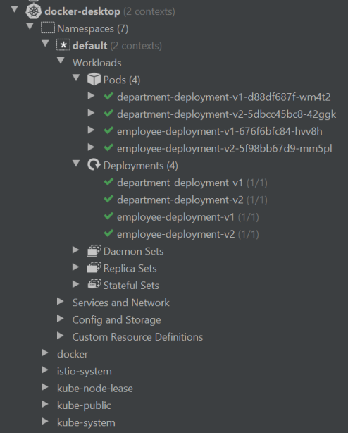

> **Improving your k8s development experience locally 🌠**

## 🗯 Introduction

Local Kubernetes development tools play an important role in simplifying the process of developing applications for Kubernetes clusters. These tools help developers to connect their local environment to Kubernetes clusters seamlessly, facilitating efficient testing and debugging. In this blog post, we will explore various local Kubernetes development solutions and tools that can elevate your development workflow and productivity. Let's get started!

### Why You Need Local k8s Development Tools

The increasing complexity of Kubernetes has made software development more challenging. It seems that developing and debugging Kubernetes-based apps is often overlooked by its creators, who primarily designed it as a production system. Kubernetes expects you to provide production-ready OCI images, discouraging modifications to running containers. However, in reality, creating production-ready software isn't straightforward.

Now, more than ever, having a local Kubernetes development solution is crucial. Before we explore different tools, let's understand why. There are several compelling reasons for wanting a local Kubernetes cluster:

- **Test Deployment Methods**: Ensure they run smoothly before going live.
- **Check Application Interactions**: Test how your application interacts with mounted volumes and manifest files.
- **Service Integration**: Ensure your service works seamlessly with other services and communicates effectively when deployed to a Kubernetes cluster.

In today's development landscape, merely spinning up your own service for testing isn't sufficient. You need to ensure that your service works seamlessly with other services and communicates effectively when deployed to a Kubernetes cluster. That's why having the option of a local Kubernetes cluster has become more important than ever.

To support you during your daily development and debugging tasks, we'll explore three categories of tools or problems:

1. **Tools to Speed Up Development Iteration Cycles** 🚀
2. **Debugging with a Debugger (During Development)** 🐞
3. **Tools for Debugging Problems in Production** 🔧

But remember, this article isn't a deep dive into each tool; it's an overview to get you started on the right path.

## ♻️ Speeding Up Development Iteration Cycles

To ensure consistency between development and production environments, testing code within a Kubernetes cluster is essential. Use a remote staging or development cluster provided by your organization, or set up a local Kubernetes cluster.

The "development iteration cycle" refers to the duration between code changes and running it within a container in the cluster. Manual processes like building a new image with a new tag and updating the referenced image in Deployment or StatefulSet can be time-consuming.

Fortunately, automation tools like [DevSpace](https://devspace.sh/), [Tilt](https://tilt.dev/), and [Skaffold](https://skaffold.dev/) simplify these tasks. They monitor local source code folders, rebuild Docker images upon changes, and update Kubernetes manifests in the cluster. These tools allow code synchronization into running containers without restart for interpreted languages supporting hot-reloading. While their configurations vary, experimentation is needed to determine the best fit.

For rapid development iterations on specific microservices, [Telepresence](https://www.telepresence.io/) is invaluable. It installs other microservices into the cluster while replacing the selected one with a locally running application. Telepresence injects a proxy pod into the cluster, forwarding traffic to the local app and redirecting outbound traffic back into the cluster.

Similar functionality is offered by [Bridge to Kubernetes](https://learn.microsoft.com/en-us/visualstudio/bridge/overview?view=vs-2022), available in VS Code or Visual Studio IDE.

For local cluster setup, options include [Minikube](https://minikube.sigs.k8s.io/docs/), [MicroK8S](https://microk8s.io/), [Kind](https://kind.sigs.k8s.io/), and lightweight Kubernetes distributions like [K3S](https://k3s.io/)/[K3D](https://k3d.io/) by Rancher.

### Minikube

Minikube has support for all three major operating systems: Windows, macOS, and Linux. This means you likely don't have to worry if you plan on rolling out Minikube organization-wide since pretty much any PC is able to run it. On top of that, you also get great platform support in terms of how Minikube should be run, given that it supports many different drivers, like Docker, kvm2, and VirtualBox.

### Kind

Like Minikube, Kind supports all three major platforms. It works by spinning up Docker containers to act as nodes in your cluster, which are based on an image created by Kind. However, if you want to use your own image, that's also possible using the `--image` flag.

### K3s

K3s is the first tool on this list that only supports running on Linux due to the fact that K3s isn't actually made to be a development solution. Rather, it was developed as a low-resource alternative to Kubernetes (hence the name K3s, which is a play on the abbreviation K8s).

### MicroK8s

MicroK8s again supports the three main operating systems, and you will find easy-to-follow installation instructions on their website. Once installed, you'll see that this is a tool that's made for development, and you'll be heavily using the CLI. Even when running simple `kubectl` commands, you need to prefix it with `microk8s`.

### Okteto

[Okteto](https://okteto.com/) accelerates the development workflow of Kubernetes applications. You write your code locally and Okteto detects the changes and instantly updates your Kubernetes applications. Okteto allows you to develop inside a container. When you run `okteto up`, your Kubernetes deployment is replaced by a development container that contains your development tools (e.g., Maven and JDK, or npm, Python, Go compiler, debuggers, etc.). This development container can use any Docker image. The development container inherits the same secrets, configmaps, volumes, or any other configuration value of the original Kubernetes deployment.

### Cloud Code IntelliJ Plugin

If you use IntelliJ as a development IDE and you prefer "clicking" over command-line tools, [Cloud Code](https://cloud.google.com/code) is something for you. There is also the Cloud Code plugin for Microsoft Visual Studio Code.

Cloud Code comes with a set of tools to help you write, run, and debug cloud-native applications quickly and easily. It can be integrated with popular tools like Skaffold, Jib, `kubectl`, or `kustomize`.

With Google's Cloud Code, you can run and debug your application on Kubernetes the same as you would do it during local development without any third-party platform. You need to click the Run or Debug button on the configuration built using the template Cloud Code: Kubernetes as shown below.

With Cloud Code, you can easily explore all your Kubernetes clusters that are configured inside the local Kubernetes context. You can verify a list of workloads, services, ingresses, config maps, secrets, and others. You can easily stream logs, view detailed descriptions, and open a terminal for selected pods. All information is exposed as a drop-down list box in the tree structure as you see in the picture below.

## Improving K8S Command Line Experience

- [**kubectx+kubens**](https://github.com/ahmetb/kubectx): Swiftly switch between clusters and namespaces, and merge kube config files for seamless context switching.
- [**kube-shell**](https://github.com/cloudnativelabs/kube-shell): Integrated shell for Kubernetes CLI.
- [**kube-prompt**](https://github.com/c-bata/kube-prompt): Interactive client with auto-complete.
- [**K9S**](https://github.com/derailed/k9s): Terminal UI for Kubernetes clusters.
- [**kube-ps1**](https://github.com/jonmosco/kube-ps1): Kubernetes prompt info for bash and zsh.
- [**Stern**](https://github.com/stern/stern): Multi-pod and container log tailing.
- [**Kail**](https://github.com/boz/kail): Kubernetes log viewer.
- [**KubeSpy**](https://github.com/pulumi/kubespy): Real-time observation tools for Kubernetes resources.
- [**kubectl plugins (Krew)**](https://krew.sigs.k8s.io/): Package manager for kubectl plugins with an index of available plugins.
- [**Arkade**](https://github.com/alexellis/arkade): Single-command installation for Kubernetes applications.
- [**kubefwd**](https://github.com/txn2/kubefwd): Bulk port forwarding for local development.

### 🖥️ GUI/TUI Tools

- [**K8S Dashboard**](https://github.com/kubernetes/dashboard)
- [**Octant**](https://github.com/vmware-tanzu/octant)
- [**Kubernetic**](https://github.com/harbur/kubernetic)
- [**Portainer**](https://docs.portainer.io/user/kubernetes/dashboard)
- [**KubeNav**](https://github.com/kubenav/kubenav)
- [**OpenLens**](https://github.com/MuhammedKalkan/OpenLens)
- [**Okteto**](https://www.okteto.com/)

## 🐞 Debugging with a Debugger

One significant challenge when working in Kubernetes, as opposed to local or native development, is the difficulty in debugging containerized code with a debugger. However, it is still feasible to use debuggers through remote debugging. You'll need to find a specific solution that suits your programming language and preferred IDE or debugger.

### Remote Debugging Approaches

#### Server-on-Host

On the host machine (e.g., in the IDE), you initiate a debug server. You then incorporate the debug client into your application's code to connect to the debug server on your host. Since applications or ports on your host aren't reachable from within a cluster, you'll require a solution that sets up a proxy or reverse tunnel. Some solutions like [Telepresence](https://www.telepresence.io/) or VS Code's [Bridge to Kubernetes](https://learn.microsoft.com/en-us/visualstudio/bridge/overview?view=vs-2022) have this proxy feature built-in, while others, such as [ktunnel](https://github.com/omrikiei/ktunnel), are dedicated solutions.

For instance, PyCharm IDE for Python utilizes this approach. You can refer to this example using [ktunnel](https://github.com/omrikiei/ktunnel).

#### Server-in-Container

You embed a debugging server into your application code running in a container within a Pod, operating on a specific port. Then, you utilize `kubectl port-forward` to create a connection from your host to that port, allowing you to connect from your debugger/IDE, acting as the debugger client.

Examples of this approach include debugging NodeJS applications by starting Node with the `--inspect` switch or debugging Python applications with VS Code using [debugpy](https://github.com/microsoft/debugpy/) and following its README instructions.

## 🔧 Debugging Problems in Production

When encountering issues in production environments, swift and accurate identification of the root cause is paramount. To aid in this endeavor, several specialized tools offer advanced debugging capabilities tailored for Kubernetes environments:

- [**Inspektor Gadget**](https://github.com/inspektor-gadget/inspektor-gadget): This tool suite provides a comprehensive set of utilities for debugging and inspecting Kubernetes applications. It enables detailed examination of various aspects such as TCP traffic, process management within pods, and file access tracing, facilitating precise diagnosis of issues.
- [**kubeshark**](https://github.com/kubeshark/kubeshark): Designed specifically for Kubernetes, kubeshark serves as a graphical API traffic sniffer. It offers real-time visualization of API communication between microservices, akin to TCPDump and Wireshark but optimized for Kubernetes environments.
- [**koolkits**](https://github.com/lightrun-platform/koolkits): Leveraging Kubernetes' ephemeral debug container feature, koolkits supplies prebuilt OCI images customized for debugging purposes. These images come equipped with a range of essential tools tailored for debugging applications written in popular languages like Python, Node.js, or Java.
- [**kubectl debug ephemeral command**](https://kubernetes.io/docs/tasks/debug/debug-application/debug-running-pod/): This command allows for the creation of ephemeral debug containers directly within Kubernetes clusters. By spawning temporary debugging environments, developers gain immediate access to the cluster's resources for in-depth investigation and diagnosis of issues.
- [**netshoot**](https://github.com/nicolaka/netshoot): As a versatile troubleshooting tool, netshoot serves as a comprehensive Docker and Kubernetes network diagnostic container. Equipped with a plethora of network troubleshooting utilities, netshoot enables engineers to perform detailed analysis and troubleshooting of network-related issues within Kubernetes clusters.

With these advanced debugging tools at their disposal, Kubernetes operators and developers can efficiently diagnose and resolve production issues, ensuring optimal performance and reliability of their applications.

## Conclusion

Before starting development, it is worth spending some time discovering useful tools for managing the Kubernetes cluster. As you see, there is a wide selection of such Kubernetes development tools, starting from simple command-line solutions to more advanced GUI or web-based interfaces. Once we have selected such tools, we may proceed to the second phase — a setup of local or remote Kubernetes cluster for development.

For more information, you can check out the [Kubernetes Documentation](https://kubernetes.io/docs/home/) and [Kubernetes Tools](https://kubernetes.io/docs/tasks/tools/).

 

**_Until next time, つづく 🎉_**

> 💡 Thank you for Reading !! 🙌🏻😁📃, see you in the next blog.🤘  **_Until next time 🎉_**

🚀 Thank you for sticking up till the end. If you have any questions/feedback regarding this blog feel free to connect with me:

**♻️ LinkedIn:** https://www.linkedin.com/in/rajhi-saif/

**♻️ X/Twitter:** https://x.com/rajhisaifeddine

**The end ✌🏻**

<h1 align="center">🔰 Keep Learning !! Keep Sharing !! 🔰</h1>

**📅 Stay updated**

Subscribe to our newsletter for more insights on AWS cloud computing and containers.
