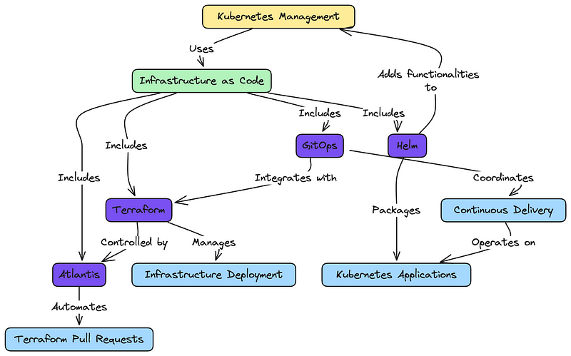

> **How to automate, secure, and scale your Kubernetes infra**

## 🗯 Introduction

Kubernetes is probably the most well-known solution for deploying and managing large-scale containerized applications. But, it can be complex to deploy and manage across different environments and infras.

This is where IaC tools come in. Integrating tools like ArgoCD, Terraform, and Vault can make Kubernetes management more automated, secure, and scalable.
In this blog post, we'll explore how using IaC tools can help you manage Kubernetes infrastructure more efficiently.



## Kubernetes Management with IaC: A Technical Deep Dive

Managing a Kubernetes cluster efficiently requires a clear automation strategy.

### 1. Setting Up Your IaC Foundation

Start by creating a Git repository to store all your IaC configurations:

- Use separate directories for Terraform, Kubernetes manifests, and Helm charts.
- Implement a branching strategy (e.g., [GitFlow](https://nvie.com/posts/a-successful-git-branching-model/)) for managing changes. GitFlow helps in organizing your work with feature branches, release branches, and hotfixes.
- Set up pre-commit hooks to enforce code quality and formatting using tools like [pre-commit](https://pre-commit.com/).

### 2. Automating Cluster Provisioning with Terraform

Terraform is key for creating and managing your Kubernetes infrastructure:

- Define your cluster using [Terraform's Kubernetes provider](https://registry.terraform.io/providers/hashicorp/kubernetes/latest/docs).
- Use [Terraform modules](https://www.terraform.io/docs/language/modules/index.html) to create reusable components (e.g., VPCs, subnets).
- Implement [Terraform workspaces](https://www.terraform.io/docs/language/state/workspaces.html) for managing multiple environments (dev, staging, prod).

Example Terraform code snippet:

```hcl
provider "aws" {
  region = "eu-west-1"
}

module "eks_cluster" {
  source       = "./modules/eks"
  cluster_name = "my-cluster"
  vpc_id       = module.vpc.vpc_id
  subnet_ids   = module.vpc.private_subnets
  node_groups  = {
    example = {
      desired_capacity = 2
      max_size         = 3
      min_size         = 1
      instance_type    = "t2.medium"
    }
  }
}
```

### 3. Enhancing Terraform Workflows

#### **Terraform Cloud:**

Terraform Cloud provides remote state management, version control, and a collaborative environment for Terraform runs. To use Terraform Cloud:

1. Sign up and create an organization on [Terraform Cloud](https://app.terraform.io/signup).
2. Create a workspace for your project.

Configure the remote backend in your Terraform configuration:

```hcl
terraform {
    backend "remote" {
        organization = "my-org"
        workspaces {
            name = "my-workspace"
        }
    }
}
```

#### **Atlantis:**

[Atlantis](https://www.runatlantis.io/) is an open-source tool for automating Terraform workflows through pull requests. 

To set up Atlantis:

1. Deploy Atlantis in your Kubernetes cluster.
2. Configure repository settings to trigger Atlantis on pull requests.
3. Define the workflow in the `atlantis.yaml` file:

```yaml
version: 3
projects:
    - name: my-terraform-project
        dir: .
        workspace: default
        autoplan:
            when_modified: ["*.tf"]
            enabled: true
```

#### **Terramate:**

[Terramate](https://terramate.io/) enhances Terraform's capabilities by providing a framework for managing configurations at scale. It allows for better modularization and automation.

1. Install Terramate by following the [installation guide](https://terramate.io/docs/install).
2. Define stack configurations in your project:

```hcl
# terramate.hcl
terramate {
    # Define global settings
}
stack "prod" {
    # Define stack-specific settings
    source = "./stacks/prod"
}
```

### 4. Streamlining Application Deployment with Helm and Helmfile

Helm simplifies package management for Kubernetes:

- Create Helm charts for your applications.
- Use [Helmfile](https://github.com/helmfile/helmfile) to manage multiple Helm releases.

Example of helmfile:

```yaml
repositories:
    - name: prometheus-community
        url: https://prometheus-community.github.io/helm-charts

releases:
    - name: my-app
        namespace: default
        chart: ./charts/my-app
        values:
            - ./values/my-app-values.yaml
    - name: prometheus
        namespace: monitoring
        chart: prometheus-community/prometheus
        version: 15.0.0
        values:
            - ./values/prometheus-values.yaml
```

### 5. Customizing Deployments with Kustomize

[Kustomize](https://kustomize.io/) allows for environment-specific customizations:

- Create a base configuration for your applications.
- Use overlays to customize for different environments.

Example Kustomize structure:

```shell
├── base
│   ├── deployment.yaml
│   ├── service.yaml
│   └── kustomization.yaml
└── overlays
        ├── dev
        │   ├── cpu_limit.yaml
        │   └── kustomization.yaml
        └── prod
                ├── replica_count.yaml
                └── kustomization.yaml
```

### 5. Implementing GitOps with ArgoCD

ArgoCD enables continuous deployment from Git repositories:

- **Install ArgoCD** in your cluster. Follow the [official installation guide](https://argo-cd.readthedocs.io/en/stable/getting_started/).
- **Define your applications** using ArgoCD custom resources.
- **Set up automated sync policies** for continuous deployment.

Example ArgoCD Application manifest:

```yaml
apiVersion: argoproj.io/v1alpha1
kind: Application
metadata:
    name: my-app
    namespace: argocd
spec:
    project: default
    source:
        repoURL: https://github.com/myorg/my-app.git
        targetRevision: HEAD
        path: kustomize/overlays/prod
    destination:
        server: https://kubernetes.default.svc
        namespace: my-app
    syncPolicy:
        automated:
            prune: true
            selfHeal: true
```

### 6. Securing Secrets with HashiCorp Vault

Vault provides secure secret management:

- **Deploy Vault** using the [official Helm chart](https://www.vaultproject.io/docs/platform/k8s/helm).
- **Configure Vault** to use Kubernetes authentication.
- **Use the Vault Secrets Operator** to inject secrets into your pods.

Example Vault SecretStore resource:

```yaml
apiVersion: secrets-store.csi.x-k8s.io/v1
kind: SecretProviderClass
metadata:
    name: vault-database
spec:
    provider: vault
    parameters:
        vaultAddress: "http://vault:8200"
        roleName: "database-role"
        objects: |
            - objectName: "db-password"
                secretPath: "secret/data/myapp/database"
                secretKey: "password"
        namespace: my-app
        audience: "vault"
```
### 7. Automating Cluster Add-ons

Use a combination of Helm and ArgoCD to manage cluster add-ons:

- Create an "add-ons" repository with Helm charts for common tools (e.g., [Prometheus](https://prometheus.io/), [Grafana](https://grafana.com/), [Cert-Manager](https://cert-manager.io/)).
- Use ArgoCD to deploy and manage these add-ons.

### 8. Implementing Policy Enforcement with OPA Gatekeeper

Automate policy enforcement across your cluster:

- Install [OPA Gatekeeper](https://github.com/open-policy-agent/gatekeeper) using Helm. Follow the [installation guide](https://open-policy-agent.github.io/gatekeeper/website/docs/install/).
- Define custom policies using the [Rego language](https://www.openpolicyagent.org/docs/latest/policy-language/).
- Use Gatekeeper constraints to enforce these policies.

Example Gatekeeper constraint:

```yaml
apiVersion: constraints.gatekeeper.sh/v1beta1
kind: K8sRequiredLabels
metadata:
    name: require-team-label
spec:
    match:
        kinds:
            - apiGroups: [""]
                kinds: ["Namespace"]
    parameters:
        labels:
            - key: "team"
                value: "my-team"
```

### 9. Automating Backup and Restore with Velero

Implement automated backup and restore processes:

- Install [Velero](https://velero.io/) using Helm. Follow the [installation guide](https://velero.io/docs/v1.7/basic-install/).
- Set up scheduled backups using Velero's schedule CRD.
- Automate restore processes for disaster recovery.

Example Velero schedule:

```yaml
apiVersion: velero.io/v1
kind: Schedule
metadata:
    name: daily-backup
spec:
    schedule: "0 1 * * *"
    template:
        includedNamespaces:
            - "*"
        excludedNamespaces:
            - "velero"
        ttl: 720h0m0s
```

By implementing these automation strategies, you'll create a scalable and easily manageable Kubernetes environment. This approach reduces manual work, increases consistency, and improves overall cluster security and reliability.

## 💬 Key Takeaways

Automating Kubernetes infrastructure with IaC and tools like Terraform, Helm, ArgoCD, and Vault enhances efficiency, security, and scalability. Integrating CI/CD, service mesh, monitoring, and policy enforcement tools ensures resilient Kubernetes environments, driving operational excellence and innovation.

**🔖 References:🖌️**

- https://www.paloaltonetworks.com/cyberpedia/kubernetes-infrastructure-as-code
- https://www.adaptavist.com/blog/kubernetes--automation-and-configuration-explained
- https://www.fairwinds.com/blog/deep-dive-how-to-improve-kubernetes-management-with-iac-tools
- https://vzilla.co.uk/vzilla-blog/using-terraform-iac-to-automate-your-kubernetes-clusters-and-apps

<br>

**_Until next time, つづく 🎉_**

> 💡 Thank you for Reading !! 🙌🏻😁📃, see you in the next blog.🤘  _**Until next time 🎉**_

🚀 Thank you for sticking up till the end. If you have any questions/feedback regarding this blog feel free to connect with me:

**♻️ LinkedIn:** https://www.linkedin.com/in/rajhi-saif/

**♻️ X/Twitter:** https://x.com/rajhisaifeddine

**The end ✌🏻**

<h1 align="center">🔰 Keep Learning !! Keep Sharing !! 🔰</h1>

**📅 Stay updated**

Subscribe to our newsletter for more insights on AWS cloud computing and containers.
