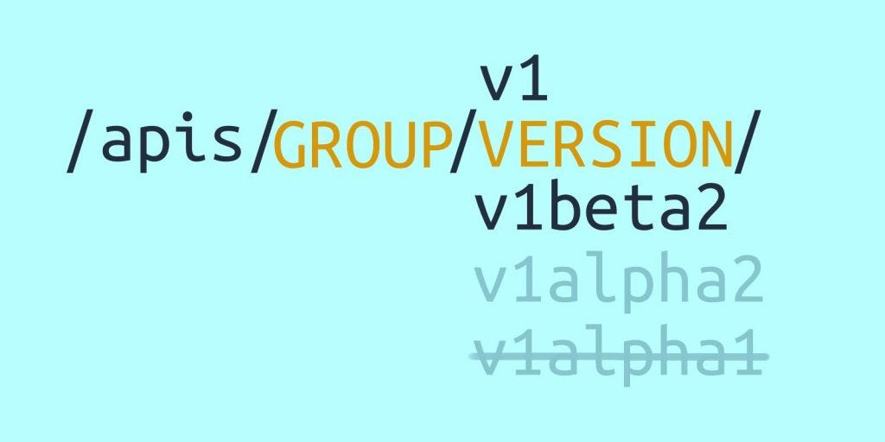
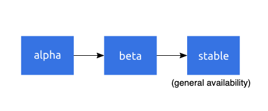
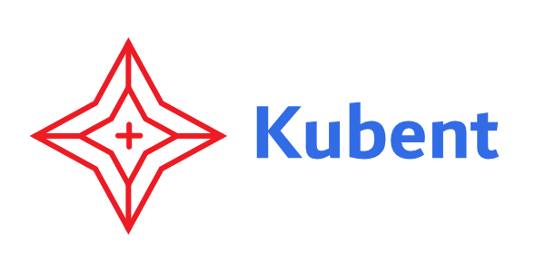
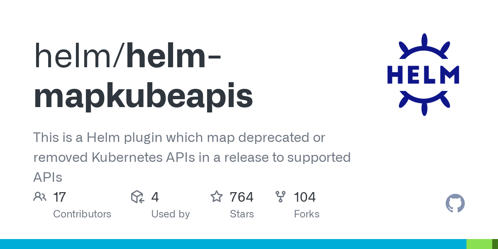

> **Techniques for Handling Deprecated APIs 🐳**

## 📌 Introduction

As new features and functionality are added, older APIs are deprecated and eventually removed. While this is a necessary part of the evolution of Kubernetes, it can create challenges for organizations that rely on the platform to run their applications. Kubernetes API serves as the interface to interact with a K8 cluster. If deprecated APIs are still active in the cluster, disruptions may occur.

In this blog post, we'll explore what deprecated Kubernetes APIs are, why they matter, and how to manage them effectively. We'll also introduce some of the available tools for handling obsolete APIs in Kubernetes and provide best practices for managing deprecated APIs. By the end of this post, you'll have a better understanding of how to approach Kubernetes cluster upgrades and gain confidence in your infrastructure.



---

### 🌀 API Lifecycles

Kubernetes follows a maturity progression of alpha → beta → stable with some additional versioning, so that a resource can iterate without needing to progress to the next level of maturity. An alpha resource can start at `v1alpha1` and iterate with `v1alpha2` or, if there are breaking changes, maybe `v2alpha1`. A beta API may be the same spec as an alpha API, but the maturity and contract with the user will be different.

- **Alpha APIs** are experimental. They can have bugs and backward-incompatible changes. They are not enabled by default, and you should use them sparingly.
- **Beta APIs** are well-tested and enabled by default. They can be relied upon for future functionality, but their implementation may change based on user feedback or constraints such as scalability.
- **Stable APIs** don't have "beta" or "alpha" names. They are represented with a version (e.g., `v1`) and their implementation should not have breaking changes without changing the version number.

---

The lifecycle I mentioned runs as follows:



A deprecation means a version of the API has been removed, and you need to verify in your manifests and resources that you're using the correct version of the API. In some cases, you may need to change your resource fields to update the new scheme for the resource. If an API is available in multiple versions at the same time, the Kubernetes API can silently upgrade some of them for you. However, you should still make sure you have the correct resource scheme — especially since as alpha APIs mature, the scheme may change between versions.

You can check the [K8s API Overview here](https://kubernetes.io/docs/reference/generated/kubernetes-api/v1.31/), for instance, deployments belong to the app group and have a `v1` version. You can list them with the endpoint:

```shell
/apis/apps/v1/namespaces/{namespace}/deployments
```

### ♻️ Deprecating and Removing Kubernetes APIs

If you're running an outdated version of the Kubernetes API, you're putting your application at risk of substantial downtime. Even if an upgrade doesn't result in an outage, subtle differences in Kubernetes APIs can cause frustration and wasted effort investigating underlying problems.

In this context, deprecation implies identifying an API component for eventual removal. While it functions currently, it is scheduled to be eliminated in an upcoming version. Kubernetes follows a well-defined deprecation policy that informs users about APIs that are slated for removal or modification.

The Kubernetes API serves as the interface to interact with a Kubernetes cluster, allowing users to query and manipulate various Kubernetes objects like pods, namespaces, and deployments. These APIs can be accessed through tools such as `kubectl`, via the REST API directly, or by using client libraries. As Kubernetes evolves, older APIs are marked as deprecated and eventually phased out. This underscores the importance for users or maintainers to be aware of deprecated Kubernetes APIs.

### The Concerns of Deprecated Kubernetes APIs

When configuring applications in Kubernetes, users specify the API version of the employed Kubernetes object, a critical aspect indicated by the `apiVersion` field in YAML manifests or Helm charts. This emphasizes the need for users and maintainers to stay informed about deprecated Kubernetes API versions and their scheduled removal in upcoming releases.

During a Kubernetes cluster upgrade, encountering deprecated APIs becomes a potential issue, especially if the upgraded version no longer supports them. For instance, if resources in your cluster use an outdated API version, your application relying on that resource may cease to function due to the elimination of the deprecated API in the new cluster version. This scenario can lead to significant downtime, exemplified by Reddit's sitewide outage.

An illustrative case is the removal of `APIVersion extensions/v1beta1` of the Ingress Resource in Kubernetes version `v1.22`. Attempting to utilize this removed API version in your configuration would result in an error message:

```shell
Error: UPGRADE FAILED: current release manifest contains removed kubernetes api(s) for this kubernetes version and it is therefore unable to build the kubernetes objects for performing the diff. error from kubernetes: unable to recognize "": no matches for kind "Ingress" in version "extensions/v1beta1"
```

### How K8s APIs are Used

To specify a particular [API version](https://kubernetes.io/docs/reference/using-api/deprecation-guide) in your configuration, refer to the sample below, sourced from [Kubernetes documentation](https://kubernetes.io/docs/concepts/workloads/controllers/deployment/#creating-a-deployment):

```yaml
apiVersion: apps/v1     # API Version of the Kubernetes object
kind: Deployment
metadata:
    name: nginx
```

You can review all supported API groups and their versions through the official documentation or by using the `kubectl` command-line tool's `api-versions` command:

```sh
kubectl api-versions
admissionregistration.k8s.io/v1
admissionregistration.k8s.io/v1beta1
apiextensions.k8s.io/v1
apiextensions.k8s.io/v1beta1
apiregistration.k8s.io/v1
apiregistration.k8s.io/v1beta1
apps/v1
```

### Challenges in Identifying Deprecated APIs

Identifying the resources in your cluster that utilize deprecated APIs can be quite challenging. Additionally, Kubernetes follows a stringent API versioning protocol, resulting in multiple deprecations of `v1beta1` and `v2beta1` APIs across several releases. Their policy states that Beta API versions are mandated to receive support for a minimum of 9 months or 3 releases (whichever is longer) after deprecation, after which they may be subject to removal.

In cases where APIs that have been deprecated are still actively employed by workloads, tools, or other components interfacing with the cluster, disruptions may occur. Hence, users and administrators must conduct a thorough assessment of their cluster to identify any APIs in use slated for removal and subsequently migrate the affected components to leverage the appropriate new API version.

### 🗃 Tools for Managing Deprecated Kubernetes APIs

To tackle the issue of handling obsolete Kubernetes APIs, several tools can be employed:

#### Tool 1: Pluto by FairwindsOps — Automated Detection and GitHub Integration

FairwindsOps presents [Pluto](https://github.com/FairwindsOps/pluto), an automated solution for detecting deprecated Kubernetes APIs within code repositories and Helm releases. With seamless GitHub workflow integration, Pluto ensures continuous monitoring, enabling timely identification of deprecated APIs and proactive management.


#### Tool 2: Kube No Trouble (kubent) by doitintl — Comprehensive Cluster-Wide Checks

Developed by [doitintl](https://www.doit.com/), [Kube No Trouble (kubent)](https://github.com/doitintl/kube-no-trouble) specializes in thorough cluster-wide checks for deprecated APIs, focusing on deployments for detection. This tool requires the storage of original manifests, offering a comprehensive solution to identify and address deprecated APIs across Kubernetes clusters.



#### Tool 3: Helm MapkubeAPIs Plugin — Chart-Centric API Identification

The [Helm MapkubeAPIs Plugin](https://github.com/helm/helm-mapkubeapis) is a valuable asset for identifying deprecated APIs within Helm charts installed on your cluster. This plugin provides a targeted approach to managing API deprecation, ensuring compatibility and smooth transitions during upgrades.



#### Tool 4: Plural CD — Versatile API Management

[Plural CD](https://github.com/pluralsh/plural) stands out as a versatile tool for the comprehensive management of deprecated Kubernetes APIs. Its multifaceted capabilities contribute to a smoother transition during Kubernetes upgrades, making it an essential component for identifying and handling deprecated APIs effectively.

These tools collectively help users to proactively identify and address deprecated APIs, minimizing potential issues during Kubernetes upgrades. By seamlessly incorporating these tools into your workflow, you can ensure a smooth transition to newer API versions, enhancing the overall stability and reliability of your Kubernetes infrastructure.

## 🔚 Conclusion

The Kubernetes API is designed to be flexible and change often, which is one of its core strengths. Users must be aware of which groups and versions their resources are using to ensure compatibility with the current Kubernetes API. Resources can often be modified and stored as newer resources without user action, allowing for gradual scheme changes and more confidence in API upgrades.

It is important to safely migrate resources from one version to another by verifying resources statically with a tool or automatically converting resources with a conversion webhook. Adding tests early will help give confidence in using Kubernetes long term.

<br>

**_Until next time, つづく 🎉_**

> 💡 Thank you for Reading !! 🙌🏻😁📃, see you in the next blog.🤘  **_Until next time 🎉_**

🚀 Thank you for sticking up till the end. If you have any questions/feedback regarding this blog feel free to connect with me:

**♻️ [LinkedIn](https://www.linkedin.com/in/rajhi-saif/)**

**♻️ [X/Twitter](https://x.com/rajhisaifeddine)**

**The end ✌🏻**

<h1 align="center">🔰 Keep Learning !! Keep Sharing !! 🔰</h1>

**📅 Stay updated**

Subscribe to our newsletter for more insights on AWS cloud computing and containers.
