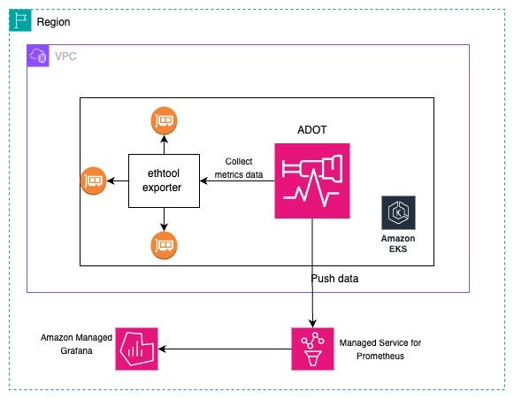
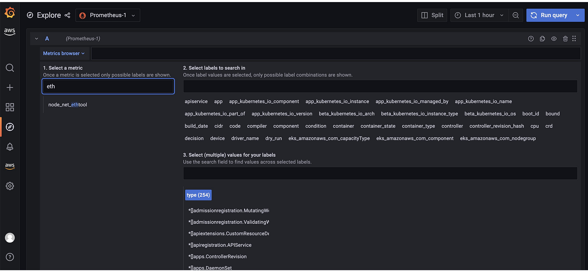
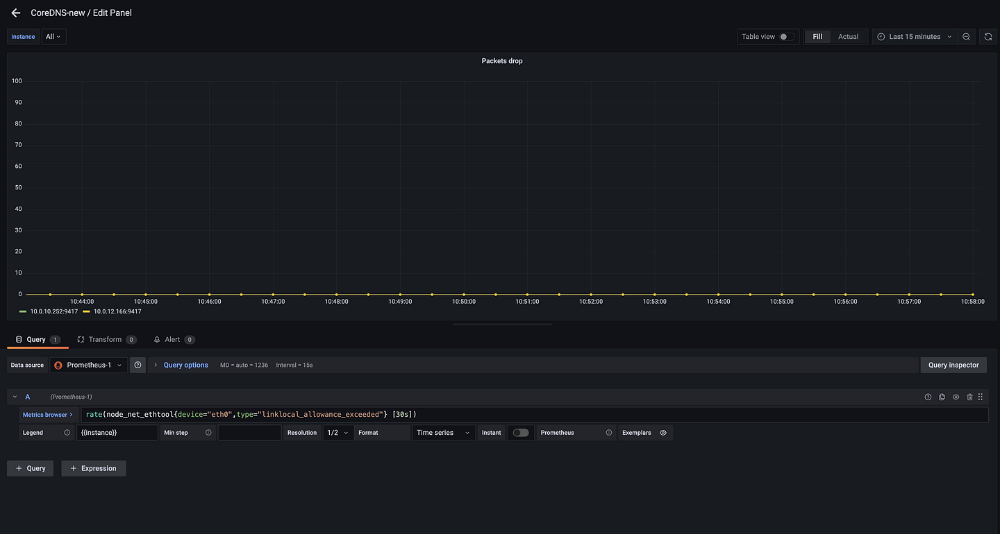

## 📚 Introduction

Running DNS-intensive workloads can sometimes lead to intermittent [CoreDNS](https://kubernetes.io/docs/tasks/administer-cluster/dns-custom-nameservers/#coredns) failures caused by DNS throttling. These issues can have a significant impact on your applications.

Such disruptions can hinder the reliability and performance of your services, making it mandatory to have a monitoring solution in place. AWS offers a suite of open-source tools — [CloudWatch](https://aws.amazon.com/cloudwatch/), [Fluentd](https://www.fluentd.org/), and [Grafana](https://grafana.com/) — that can be integrated to monitor CoreDNS.

## 🧩 Introduction to Kubernetes DNS

Kubernetes relies on [DNS](https://kubernetes.io/docs/tasks/administer-cluster/dns-custom-nameservers/#introduction) for service discovery within clusters. When applications running in pods need to communicate with each other, they often refer to services by their domain names rather than IP addresses.

This is where Kubernetes DNS comes into play. It ensures that these domain names are resolved to the correct IP addresses, allowing pods and services to communicate.

In Kubernetes, each pod is assigned a temporary IP address. However, these IP addresses are dynamic and can change over time, making it challenging for applications to keep track of them. Kubernetes addresses this challenge by assigning fully qualified domain names ([FQDNs](https://kubernetes.io/docs/concepts/services-networking/dns-pod-service/#dns-records)) to pods and services.

CoreDNS, the default DNS provider in Kubernetes, is responsible for handling DNS queries within the cluster. It maps these FQDNs to the corresponding IP addresses, enabling communication between pods and services.

## 🛠️ CoreDNS in Kubernetes

CoreDNS plays an important role in providing DNS services within Kubernetes clusters. As the default DNS provider since Kubernetes v1.13, CoreDNS simplifies cluster networking by enabling clients to access services using DNS names rather than IP addresses. It resolves domain name requests and facilitates service discovery within the cluster.

### ⚙️ How CoreDNS Operates

CoreDNS operates as a resolver and forwarder for DNS requests within Kubernetes clusters. When a pod needs to communicate with another service, it sends a DNS query to CoreDNS, specifying the domain name of the target service. CoreDNS then resolves this query by mapping the domain name to the corresponding IP address using its internal records.

For external domain names that CoreDNS is not authoritative for, it forwards the DNS query to public resolvers or upstream DNS servers for resolution.

To enhance performance and reduce latency, CoreDNS can cache DNS responses for frequently accessed domain names. This caching mechanism improves the responsiveness of DNS queries and reduces the load on upstream DNS servers.

CoreDNS achieves this functionality through its modular architecture and extensible plugin system, allowing operators to customize and optimize DNS resolution according to their specific requirements.

## 🚀 Mitigating CoreDNS Throttling in Amazon EKS

In Amazon EKS clusters, CoreDNS and DNS throttling issues can be challenging to identify and troubleshoot. While many users focus on monitoring CoreDNS logs and metrics, they often overlook the hard limit of 1024 [packets per second (PPS)](https://docs.aws.amazon.com/vpc/latest/userguide/vpc-dns.html#vpc-dns-limits) enforced at the Elastic Network Interface (ENI) level. Understanding how this limit can lead to throttling issues requires insight into the typical DNS resolution flow of a Kubernetes pod.

In a Kubernetes environment, pods must resolve domain names for both internal and external services to enable communication. This resolution process involves routing DNS queries through the worker node's ENI, particularly when resolving external endpoints. Even for internal endpoints, if the CoreDNS pod is not co-located with the querying pod, DNS packets still traverse the worker node's ENI.

Consider a scenario where there is a sudden surge in DNS queries, causing the PPS to approach the hard limit of 1024. This situation can result in DNS throttling, impacting all microservices running on the affected worker node. Unfortunately, troubleshooting such issues can be hard because the focus tends to be on CoreDNS pods rather than ENI metrics.

To mitigate DNS throttling issues in EKS clusters, it is important to monitor packet drops occurring at the ENI level continuously. This monitoring allows for early detection and prevention of potential outages. In this blog post, we introduce a solution that leverages network performance metrics to identify DNS throttling issues effectively.

### 🛡️ Solution

An easy way to identify the DNS throttling issues in worker nodes is by capturing the `linklocal_allowance_exceeded` metric provided by the Elastic Network Adapter (ENA) driver and other metrics as well.

The [`linklocal_allowance_exceeded`](https://docs.aws.amazon.com/AmazonCloudWatch/latest/monitoring/metrics-collected-by-CloudWatch-agent.html#linux-metrics-enabled-by-CloudWatch-agent) metric indicates the number of packets dropped because the PPS of the traffic to local proxy services exceeded the maximum for the network interface. This impacts traffic to the DNS service, the Instance Metadata Service, and the Amazon Time Sync Service.

Instead of tracking this event in real-time, we can stream this metric to [Amazon Managed Service for Prometheus](https://aws.amazon.com/prometheus/) and visualize it in [Amazon Managed Grafana](https://aws.amazon.com/grafana/).





## 🛠️ Hands-on: Collect and Visualize CoreDNS Metrics in AWS EKS

### 📊 CoreDNS Prometheus Plugin

The [CoreDNS Prometheus plugin](https://coredns.io/plugins/metrics/) exposes metrics in the [OpenMetrics](https://github.com/OpenObservability/OpenMetrics/blob/main/specification/OpenMetrics.md) format, a text-based standard that evolved from the [Prometheus format](https://prometheus.io/docs/instrumenting/exposition_formats/#text-based-format). In a Kubernetes cluster, the plugin is enabled by default, so you can begin monitoring [many key metrics](https://www.datadoghq.com/blog/coredns-metrics) as soon as you launch your cluster.

By default, the Prometheus plugin writes metrics to a `/metrics` endpoint on port `9153` on each CoreDNS pod.

### 🏗️ Create an Amazon Managed Service for Prometheus Workspace and Managed Service for Grafana

In this step, we will create a workspace for Amazon Managed Service for Prometheus and Managed Service for Grafana. The configuration in these files creates:

- AMP workspace
- AMP alert manager definition

#### `main.tf`

```hcl
module "prometheus" {
    source = "terraform-aws-modules/managed-service-prometheus/aws"

    workspace_alias = "demo-coredns"

    alert_manager_definition = <<-EOT
    alertmanager_config: |
        route:
            receiver: 'default'
        receivers:
            - name: 'default'
    EOT

    rule_group_namespaces = {}
}
```

#### `versions.tf`

```hcl
terraform {
    required_version = ">= 1.3"

    required_providers {
        aws = {
            source  = "hashicorp/aws"
            version = ">= 5.32"
        }
    }
}
```

To run the Terraform code, execute:

```sh
# terraform init
# terraform plan
# terraform apply
```

### 🖥️ Create a Default Grafana Workspace

The below configuration files will create a default Grafana workspace using defaults provided by the module.

#### `main.tf`

```hcl
provider "aws" {
    region = local.region
}

data "aws_availability_zones" "available" {}

locals {
    region      = "eu-west-1"
    name        = "amg-ex-${replace(basename(path.cwd), "_", "-")}"
    description = "AWS Managed Grafana service for ${local.name}"

    vpc_cidr = "10.0.0.0/16"
    azs      = slice(data.aws_availability_zones.available.names, 0, 3)
}

module "managed_grafana" {
    source = "terraform-aws-modules/managed-service-grafana/aws"

    name                      = local.name
    associate_license         = false
    description               = local.description
    account_access_type       = "CURRENT_ACCOUNT"
    authentication_providers  = ["AWS_SSO"]
    permission_type           = "SERVICE_MANAGED"
    data_sources              = ["CLOUDWATCH", "PROMETHEUS", "XRAY"]
    notification_destinations = ["SNS"]
    stack_set_name            = local.name
    grafana_version           = "9.4"

    configuration = jsonencode({
        unifiedAlerting = {
            enabled = true
        },
        plugins = {
            pluginAdminEnabled = false
        }
    })

    vpc_configuration = {
        subnet_ids = module.vpc.private_subnets
    }
    security_group_rules = {
        egress_postgresql = {
            description = "Allow egress to PostgreSQL"
            from_port   = 5432
            to_port     = 5432
            protocol    = "tcp"
            cidr_blocks = module.vpc.private_subnets_cidr_blocks
        }
    }

    workspace_api_keys = {
        viewer = {
            key_name        = "viewer"
            key_role        = "VIEWER"
            seconds_to_live = 3600
        }
        editor = {
            key_name        = "editor"
            key_role        = "EDITOR"
            seconds_to_live = 3600
        }
        admin = {
            key_name        = "admin"
            key_role        = "ADMIN"
            seconds_to_live = 3600
        }
    }

    create_iam_role                = true
    iam_role_name                  = local.name
    use_iam_role_name_prefix       = true
    iam_role_description           = local.description
    iam_role_path                  = "/grafana/"
    iam_role_force_detach_policies = true
    iam_role_max_session_duration  = 7200
    iam_role_tags                  = { role = true }

    tags = local.tags
}

module "managed_grafana_default" {
    source = "terraform-aws-modules/managed-service-grafana/aws"

    name              = "${local.name}-default"
    associate_license = false

    tags = local.tags
}

module "managed_grafana_disabled" {
    source = "terraform-aws-modules/managed-service-grafana/aws"

    name   = local.name
    create = false
}

module "vpc" {
    source  = "terraform-aws-modules/vpc/aws"
    version = "~> 5.0"

    name = local.name
    cidr = local.vpc_cidr

    azs             = local.azs
    private_subnets = [for k, v in local.azs : cidrsubnet(local.vpc_cidr, 4, k)]
    public_subnets  = [for k, v in local.azs : cidrsubnet(local.vpc_cidr, 8, k + 48)]

    enable_nat_gateway = false 
    single_nat_gateway = true

    tags = local.tags
}
```

#### versions.tf

```hcl
terraform {
    required_version = ">= 1.0"

    required_providers {
        aws = {
            source  = "hashicorp/aws"
            version = ">= 5.0"
        }
    }
}
```

To run this code, execute:

```shell
# terraform init
# terraform plan
# terraform apply
```

### 🚀 Deploying Prometheus Ethtool Exporter

[Ethtool](https://linux.die.net/man/8/ethtool) is a Linux tool for configuring and gathering information about Ethernet devices on worker nodes. We will use ethtool's output to detect packet loss and convert it to Prometheus format with a Prometheus ethtool exporter utility.

Deploy the exporter using:

```sh
kubectl apply -f https://raw.githubusercontent.com/Showmax/prometheus-ethtool-exporter/master/deploy/k8s-daemonset.yaml
```

### 📦 Deploy ADOT Collector to Scrape Ethtool Metrics

In this step, we will deploy the ADOT collector and configure it to ingest metrics to Amazon Managed Service for Prometheus. We will use the [Amazon EKS add-on for ADOT operator](https://docs.aws.amazon.com/eks/latest/userguide/opentelemetry.html) to send the metrics [linklocal_allowance_exceeded](https://docs.aws.amazon.com/AmazonCloudWatch/latest/monitoring/metrics-collected-by-CloudWatch-agent.html#linux-metrics-enabled-by-CloudWatch-agent) to Amazon Managed Service for Prometheus for monitoring CoreDNS.

#### Create an IAM Role and Amazon EKS Service Account

We will deploy the ADOT collector to run under the identity of a Kubernetes [service account](https://kubernetes.io/docs/tasks/configure-pod-container/configure-service-account/) `adot-collector`. [IAM roles for service accounts (IRSA)](https://docs.aws.amazon.com/eks/latest/userguide/iam-roles-for-service-accounts.html) let you associate the `AmazonPrometheusRemoteWriteAccess` role with a Kubernetes service account, thereby providing IAM permissions to any pod utilizing the service account to ingest the metrics to Amazon Managed Service for Prometheus.

You need `kubectl` and `eksctl` CLI tools to run the script. They must be configured to access your Amazon EKS cluster.

```sh
eksctl create iamserviceaccount \
--name adot-collector \
--namespace default \
--region eu-west-1 \
--cluster coredns-monitoring-demo \
--attach-policy-arn arn:aws:iam::aws:policy/AmazonPrometheusRemoteWriteAccess \
--approve \
--override-existing-serviceaccounts
```

#### Install ADOT Add-on

You can check the list of add-ons enabled for different versions of Amazon EKS using the following command:

```sh
aws eks describe-addon-versions --addon-name adot --kubernetes-version 1.28 \
    --query "addons[].addonVersions[].[addonVersion, compatibilities[].defaultVersion]" --output text
```

Run the following command to install the ADOT add-on, replacing the `--addon-version` flag based on your Amazon EKS cluster version as shown in the step above.

```sh
aws eks create-addon --addon-name adot --addon-version v0.66.0-eksbuild.1 --cluster-name coredns-monitoring-demo
```

Verify that the ADOT add-on is ready using the following command:

```sh
kubectl get po -n opentelemetry-operator-system
```

The following procedure uses an example YAML file with `deployment` as the mode value. This is the default mode and deploys the ADOT Collector similarly to a standalone application. This configuration receives OTLP metrics from the sample application and Amazon Managed Service for Prometheus metrics scraped from pods on the cluster.

```sh
curl -o collector-config-amp.yaml https://raw.githubusercontent.com/aws-observability/aws-otel-community/master/sample-configs/operator/collector-config-amp.yaml
```

In `collector-config-amp.yaml`, replace the following with your own values:

- `mode: deployment`
- `serviceAccount: adot-collector`
- `endpoint: ""`
- `region: ""`
- `name: adot-collector`

Apply the configuration:

```sh
kubectl apply -f collector-config-amp.yaml
```

Once the ADOT collector is deployed, the metrics will be stored successfully in Amazon Prometheus.

### 📈 Visualize Ethtool Metrics in Amazon Managed Grafana

Configure the Amazon Managed Service for Prometheus workspace as a datasource inside the Amazon Managed Grafana console.

Let's explore the metrics in Amazon Managed Grafana now: Click the explore button, and search for `ethtool`.



Let's build a dashboard for the linklocal_allowance_exceeded metric by using the query

```shell
rate(node_net_ethtool{device="eth0",type="linklocal_allo
wance_exceeded"} [30s])
```



We can see that there were no packets dropped as the value is zero. You can further extend this by configuring alerts in the alert manager in Amazon Managed Service for Prometheus to send notifications.

## Conclusion

In this post, we showed how to monitor and create alerts for CoreDNS throttling issues using AWS Distro for OpenTelemetry (ADOT), Amazon Managed Service for Prometheus, and Amazon Managed Grafana. By monitoring the coreDNS metrics, customers can proactively detect packet drops and take preventive actions.

**References:**

- https://www.datadoghq.com/blog/coredns-monitoring-tools/
- https://cilium.io/blog/2019/12/18/how-to-debug-dns-issues-in-k8s/
- https://sysdig.com/blog/how-to-monitor-coredns/
- https://www.datadoghq.com/blog/coredns-metrics/
- https://aws.amazon.com/blogs/mt/monitoring-coredns-for-dns-throttling-issues-using-aws-open-source-monitoring-services/

<br>

**_Until next time, つづく 🎉_**

> 💡 Thank you for Reading !! 🙌🏻😁📃, see you in the next blog.🤘  **_Until next time 🎉_**

🚀 Thank you for sticking up till the end. If you have any questions/feedback regarding this blog feel free to connect with me:

**♻️ LinkedIn:** https://www.linkedin.com/in/rajhi-saif/

**♻️ X/Twitter:** https://x.com/rajhisaifeddine

**The end ✌🏻**

<h1 align="center">🔰 Keep Learning !! Keep Sharing !! 🔰</h1>

**📅 Stay updated**

Subscribe to our newsletter for more insights on AWS cloud computing and containers.
