> **OpenFaaS and Kubernetes: Orchestrating Serverless Symphony 🎶**

## 📇 Overview

OpenFaaS and Kubernetes are catalysts for change in the world of serverless computing. Together, they enable organizations to scale new heights with efficiency and simplicity.

[OpenFaaS](https://github.com/openfaas/faas), an open-source serverless platform, harmonizes perfectly with [Kubernetes](https://kubernetes.io/), the renowned container orchestration system, to achieve the true potential of serverless computing. With OpenFaaS and Kubernetes, businesses can embrace the power of serverless computing and embark on a transformative journey toward a future of agility, scalability, and boundless possibilities.

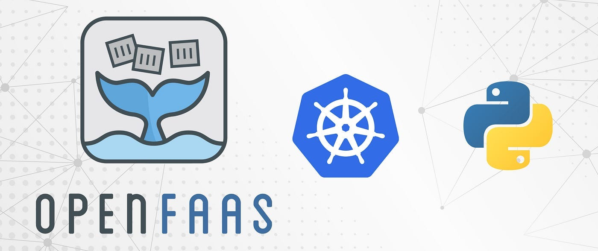

## 🔭 Goals & Objectives

In this blog, we will explore the powerful combination of OpenFaaS and Kubernetes and explore how they are revolutionizing the world of serverless computing.

https://giphy.com/gifs/netflix-blown-away-glassblowing-cUpOMrVpmmLCF3rjyA

## Understanding Serverless Architecture: Simplifying Code Execution without Infrastructure

Serverless architecture refers to an innovative approach in which the core business logic is implemented as functions that can be executed in a stateless manner. Contrary to its name, serverless does not imply running code without servers; rather, it entails eliminating the need for manual hardware and infrastructure provisioning during the development process. In this model, the application still operates on servers, albeit ones that are managed by external service providers.

[Function-as-a-Service (FaaS)](https://en.wikipedia.org/wiki/Function_as_a_service) plays a big role in enabling serverless architecture. With FaaS, developers can focus solely on writing the functions that represent the specific business logic, without concerning themselves with the underlying infrastructure or server management. FaaS platforms, such as [AWS Lambda](https://aws.amazon.com/lambda/), [Azure Functions](https://azure.microsoft.com/en-us/services/functions/), or [Google Cloud Functions](https://cloud.google.com/functions), allow developers to deploy their functions and execute them in response to specific events or triggers.

The beauty of FaaS lies in its event-driven nature. Functions are executed only when a specific event occurs, such as an HTTP request, a file upload, or a database update. This event-driven approach brings several benefits. First, it enables auto-scaling, as the FaaS platform dynamically scales the execution environment based on the incoming workload. This ensures that the application can handle sudden spikes in traffic without any manual intervention.

## Exploring OpenFaaS: A Technical Overview of Open-Source Function-as-a-Service

[OpenFaaS](https://docs.openfaas.com/) is an open-source Function-as-a-Service (FaaS) platform that offers developers a flexible and scalable solution for building serverless applications. By leveraging containerization technology, OpenFaaS allows developers to package their functions into lightweight, independent containers that can be easily deployed and executed in a serverless environment. With OpenFaaS, developers have the freedom to write functions in any language of their choice, enabling a polyglot development approach.

Under the hood, OpenFaaS relies on Docker and Kubernetes for container orchestration, providing robust scalability and high availability. The platform supports automatic scaling, allowing functions to handle varying workloads seamlessly. Additionally, OpenFaaS integrates with popular cloud providers, allowing developers to leverage existing cloud services and resources.

### Getting Hands-On with OpenFaaS

In this hands-on exploration of OpenFaaS, we will follow a straightforward process to deploy a Flask microservice as a serverless function. The steps involve setting up Kubernetes and OpenFaaS, dockerizing the Python application, creating a custom function, deploying the function, and finally, testing its functionality. This practical approach will provide a firsthand experience of leveraging OpenFaaS for serverless development. Let's start!

### ❕ Setting up the environment

Setting up Kubernetes and OpenFaas involves deploying OpenFaaS on either a local or remote Kubernetes cluster. In our case, we will utilize the EKS Kubernetes cluster to deploy OpenFaaS. The deployment of OpenFaaS can be accomplished using either Helm or arkade.

[Helm](https://helm.sh/) serves as a Kubernetes package and operations manager. Users can utilize Helm to publish their application configurations in the form of Charts.

On the other hand, [arkade](https://github.com/alexellis/arkade) is a Go-based open-source CLI that simplifies app management. Internally, arkade leverages helm charts and kubectl to install applications onto the Kubernetes cluster.

In this demo, we will use arkade to install OpenFaas as it is very easy and quick to use.

#### ✅ Install arkade

Use the following command to install arkade.

```shell
# Note: you can also run without `sudo` and move the binary yourself
curl -sLS https://get.arkade.dev | sudo sh

arkade --help
ark --help  # a handy alias

# Windows users with Git Bash
curl -sLS https://get.arkade.dev | sh
```

#### ✅ Install OpenFaas

Use arkade install to configure OpenFaaS with a cloud LoadBalancer, in this instance an "ALB" will be created.

```shell
arkade install openfaas --load-balancer

=======================================================================
= OpenFaaS has been installed.                                        =
=======================================================================
```

To verify if the installation is successful we can execute the following command:

```shell
kubectl -n openfaas get deployments -l release=openfaas,app=openfaas
```

Or to verify that openfaas has started, run:

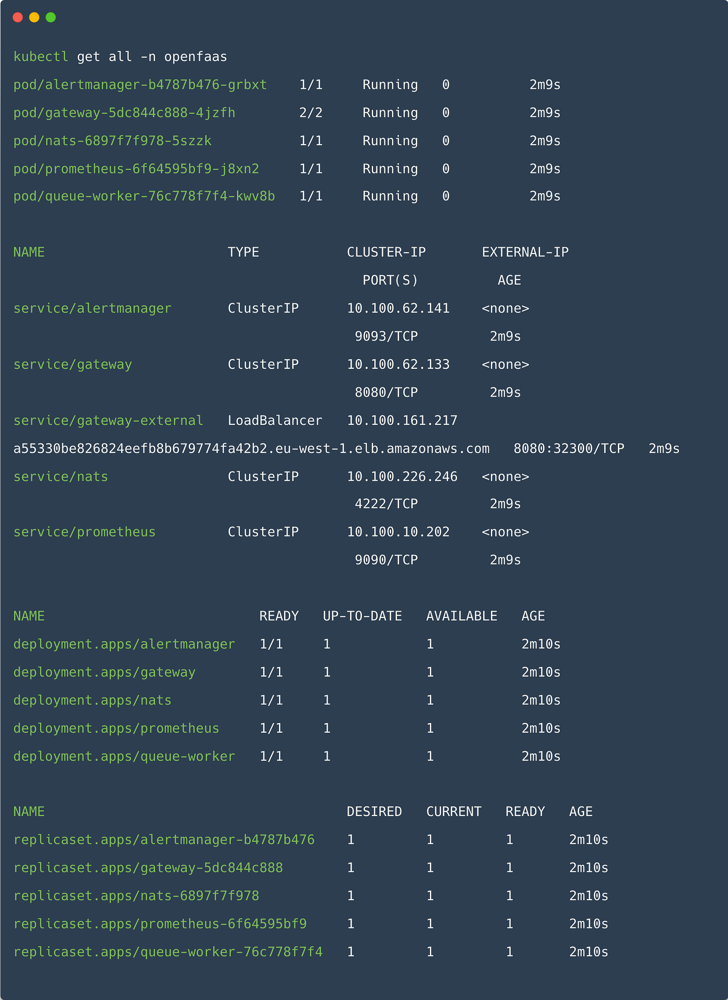

To retrieve the admin password, run:

```shell
echo $(kubectl -n openfaas get secret basic-auth -o jsonpath="{.data.basic-auth-password}" | base64 --decode )
```

#### ✅ Install faas-cli

Once OpenFaas is installed, we must install faas-cli.

The faas-cli is required to deploy and test functions with OpenFaas. Execute the following command to install faas-cli.

```shell
curl -SLsf https://cli.openfaas.com | sudo sh
```

If basic auth is enabled, you can now log into your gateway:

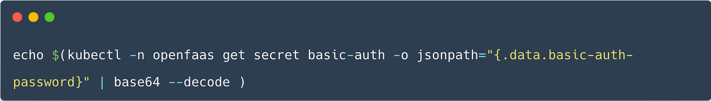

Then Open UI and you will find it like below:

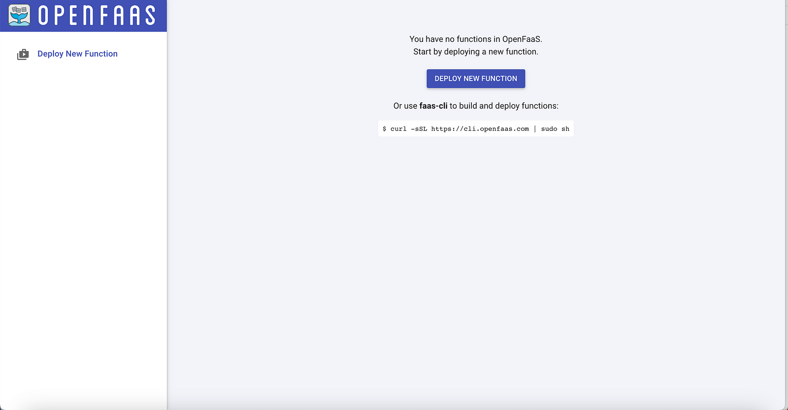

### Flask on Fire: Dockerizing the Python Application

In simpler words, dockerizing means using special containers called docker to package, deploy, and run applications.

We will use docker to package and run the sample Flask application.

#### Prepare the Codebase

To set up the application, you can make a copy of my sample Python application project by running the provided command in any directory you prefer.

```shell
git clone https://github.com/seifrajhi/python-openfaas-demo
```

We will use this Flask application to be packaged into our docker image.

#### Brief explanation of the Dockerfile

A Dockerfile is essentially a textual document that contains specific instructions on constructing a Docker image for our project.

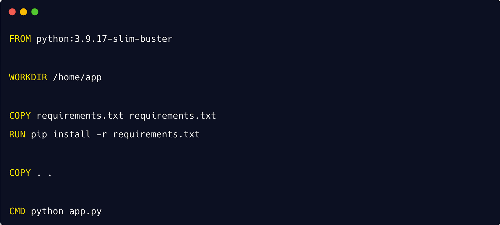

First, we need to create the image by using the Dockerfile.

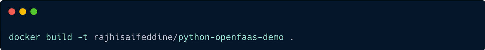

To verify the created image, you can use the following command:

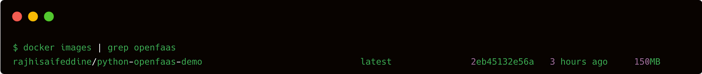

### Pushing Docker Image to Docker Hub

To upload the Docker image to Docker Hub, we can use the docker tag and docker push commands. This step enables us to create, test, store, and distribute container images through the Docker Hub platform.

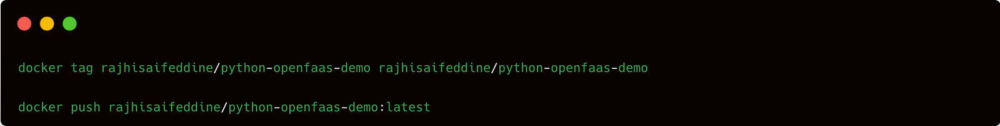

Now, that the docker image is created, we can use this docker image to run the Flask application from anywhere we want.

### Building a Serverless Function

In the preceding stages, we used the arkade CLI to install OpenFaaS on a Kubernetes cluster.

Now, we can generate a function using the OpenFaas template, which we can subsequently deploy within OpenFaas.

Since we have a dockerized Flask application we will use the [dockerfile template of OpenFaas](https://github.com/openfaas/templates) to create our function as follows:

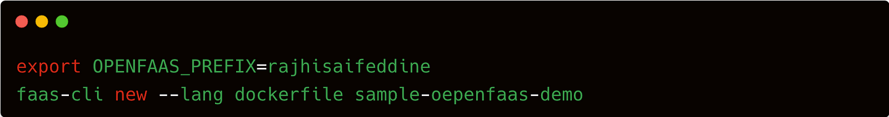

Container images are used to store OpenFaas functions. In this case, we will use DockerHub as the repository for our image. Consequently, we will establish the environment variable `OPENFAAS_PREFIX` with the username associated with DockerHub.

`faas-cli new` enables us to create a new function via the dockerfile template in the current directory. Here, we have created a function called `sample-openfaas-demo` using the OpenFaas template dockerfile. After executing the above commands we will find that the following files were created:

- `sample-openfaas-demo.yaml`
- `sample-openfaas-demo/Dockerfile`

We will now make the necessary changes to files in order to deploy our serverless logic.

```yaml
version: 1.0
provider:
    gateway: http://a55330be826824eefb8b679774fa42b2.eu-west-1.elb.amazonaws.com
functions:
    sample-flask-service:
        lang: dockerfile
        handler: ./dockerfile-sample/python-openfaas-demo
        image: rajhisaifeddine/python-openfaas-demo:latest
        environment:
            RAW_BODY: True
            write_timeout: 30s
            read_timeout: 30s
            exec_timeout: 30s
        labels:
         com.openfaas.scale.min: 1
         com.openfaas.scale.max: 5
         com.openfaas.scale.zero: "true"
```

Then, we update the Dockerfile for our function.

```yaml
FROM ghcr.io/openfaas/classic-watchdog:0.2.1 as watchdog

FROM rajhisaifeddine/python-openfaas-demo:latest

RUN mkdir -p /home/app

COPY --from=watchdog /fwatchdog /usr/bin/fwatchdog
RUN chmod +x /usr/bin/fwatchdog

# Add non root user
RUN addgroup -S app && adduser app -S -G app
RUN chown app /home/app

WORKDIR /home/app

USER app

ENV fprocess="python app.py"

ENV upstream_url="http://127.0.0.1:5000"
ENV mode="http"
ENV cgi_headers="true"

# Set to true to see request in function logs
ENV write_debug="false"

HEALTHCHECK --interval=3s CMD [ -e /tmp/.lock ] || exit 1

CMD ["fwatchdog"]
```

https://giphy.com/gifs/RosannaPansino-go-get-going-lets-goin-drj2TRzBtDG6lx5le3

### Deploy the Function

The function is now ready to be deployed. We can run the following command to deploy the function.

```shell
faas-cli up -f sample-openfaas-demo.yaml
```

The above command will perform the following actions:

- Creates a local container image of the function.
- Pushes the image to the remote registry, which in our case is the docker hub.
- Using the OpenFaas REST API, creates a deployment inside Kubernetes Cluster and a new Pod to serve the traffic.

### Testing the Function

We have deployed our function as a Serverless function with autoscaling enabled in OpenFaas. Before proceeding to test our function we must set up monitoring of the process to understand how serverless actually works. For monitoring purposes, we can use [Grafana](https://grafana.com/).

We can easily install Grafana as a pod in Kubernetes Cluster using the below command:

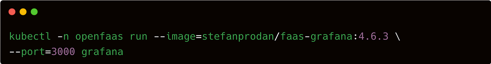

Next, use port-forward from our local computer to access Grafana the URL:

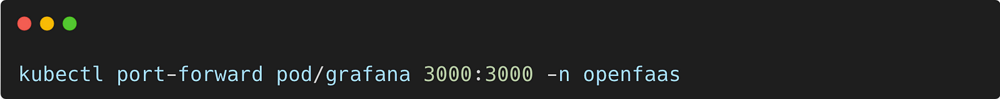

Open the OpenFaas Grafana Dashboard from [http://127.0.0.1:3000/](http://127.0.0.1:3000/). Enter the default password for Grafana, which is admin: admin. The OpenFaas Grafana Dashboard would look as follows:

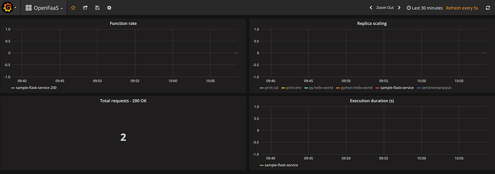

From the Dashboard, we can see that the number of replicas has increased to 1 from 0 to serve the request. This replica count will further increase depending on the load till the `com.openfaas.scale.max` specified previously.

The way autoscaling works in the background is that the requests are blocked until the desired count of replicas is achieved. We can verify that from the gateway logs as follows:

```shell
kubectl logs -n openfaas deploy/gateway -c gateway -f
```

https://giphy.com/gifs/studiosoriginals-workplace-compliments-3o84U9arAYRM73AIvu

## 🌟 Wrap-up

The combination of OpenFaaS and Kubernetes has unlocked new possibilities in serverless computing. These powerful tools have acted as catalysts for change, enabling businesses to scale new heights in terms of efficiency and flexibility. By harnessing their potential, organizations can embrace the future of technology and revolutionize the way they deploy and manage applications. With OpenFaaS and Kubernetes orchestrating serverless environments, the sky's the limit for innovation and growth.

<br>

**_Until next time, つづく 🎉_**

> 💡 Thank you for Reading !! 🙌🏻😁📃, see you in the next blog.🤘  **_Until next time 🎉_**

🚀 Thank you for sticking up till the end. If you have any questions/feedback regarding this blog feel free to connect with me:

**♻️ LinkedIn:** https://www.linkedin.com/in/rajhi-saif/

**♻️ X/Twitter:** https://x.com/rajhisaifeddine

**The end ✌🏻**

<h1 align="center">🔰 Keep Learning !! Keep Sharing !! 🔰</h1>

**📅 Stay updated**

Subscribe to our newsletter for more insights on AWS cloud computing and containers.
