OpenTelemetry is an observability framework and an active [CNCF project](https://www.cncf.io/projects/opentelemetry/) that provides a vendor-neutral and tool-agnostic way to collect observability signals across your heterogeneous system.

In this blog post series, we will dig into two big questions:

- how OpenTelemetry instrumentation works on the application side taking [Python's SDK](https://github.com/open-telemetry/opentelemetry-python/) as an example. We will touch traces, metrics, logs and context propagation across services.

- how OpenTelemetry Collector works under the hood and some of the interesting engineering decisions made there.

Gotta be fun 🙌

## 📚 Introduction

With the rise of the open source community, people and organizations don’t really want to invest in proprietary protocols and standards anymore. Instead, it's mainstream to pick a widely-recognized open source project as a basis to build on top of it.

In the observability domain, there are enough open source protocols that cover some of the three key pillars:

- `Logs` - stdout and stderr streams your services or application outputs while running in the container.
- `Metrics` - aggregations of some measurements over a period of time
- `Traces` - a visualization of the steps or the execution path that your workflow passed

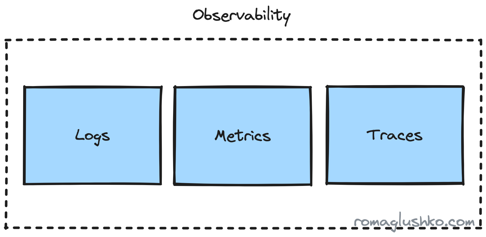
<div class="image-title">The Three Pillars of Observability</div>

When you think about metrics, [Prometheus](https://prometheus.io/) and [statsd](https://github.com/statsd/statsd) may come to your mind.
On the traces side, there are [Jaeger](https://www.jaegertracing.io/) and [Zipkin](https://zipkin.io/).
There are also various beats that could scrap your logs like [fluentd](https://www.fluentd.org/) or [Grafana Loki](https://grafana.com/oss/loki/).

Now if you want to cover all three pillars, you need to pick a combination of collectors/protocols to cover each one (well, some are capable of covering a few pillars).

However, there are still a few problems left:

- even though the protocols are open source, they may still tightly connect your application to the underlying collector or storage, so it won't be that easy to switch gears and use something else
- we have divided observability into three pieces, but in reality, they are three different signals or points of view on the application work, so we may get the whole picture and max value out of them when they are well connected and correlated for us

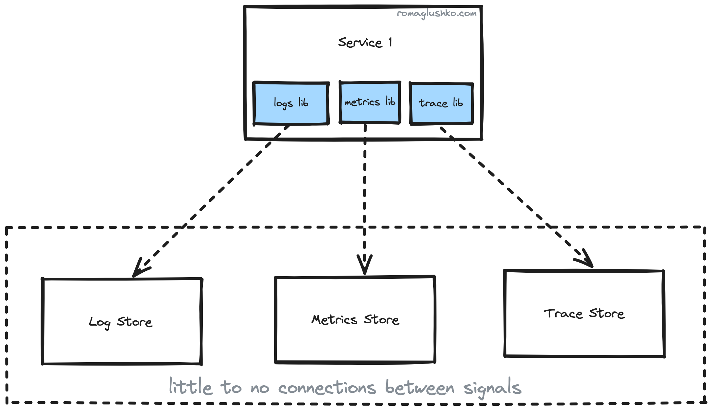
<div class="image-title">The observability signals are unconnected when you use separate highly specialized protocols</div>

To sum it up, we want to have:

- one open source vendor-lock-free protocol to rule all observability signals
- a stable abstraction for us for the underlying observability storage(s) without a need to migrate our service every time that storage changes
- a coverage of popular programming languages, not to be limited in what our tech stack looks like

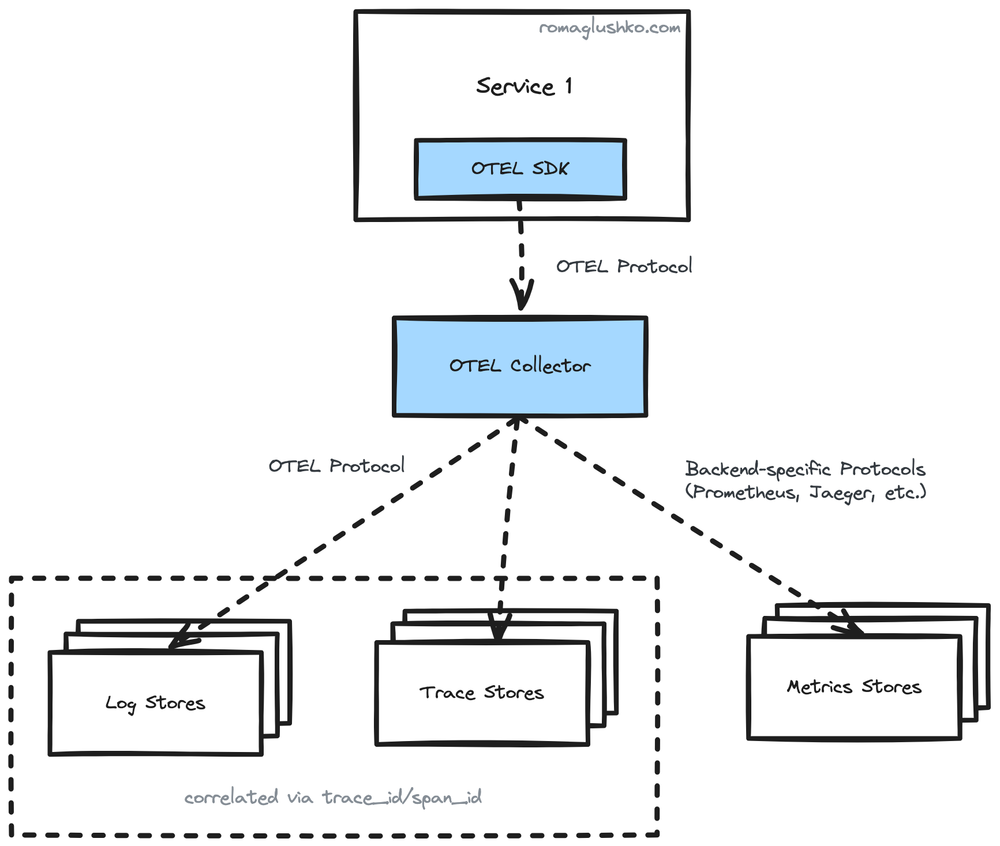
<div class="image-title">Observability signals with OTel</div>

<br>
<div class="info" style='background-color:#d9edf7; color:#31708f; border-left: solid #bce8f1 12px; border-radius: 33px; padding: 1.7em;'>
<span>
<p style='margin-top:1em; text-align:center'>
<b>The OTEL Origin</b>
</p>
<p style='margin-left:1em;'>This ubiquitous open protocol idea is so compelling that at some point there were two projects, <a href="https://opentracing.io/" style="color:#31708f">OpenTracing</a> and <a href="https://opencensus.io/" style="color:#31708f">OpenCensus</a>, that were trying to fill the gap.<br><br>
They were trying to compete with each other, but there was not the right context to do that, so it didn't make sense to try to conquer some market shares, but rather to consolidate their effort and come there much quicker shaping the space.
That's what happened. Both projects were merged into one known as <a href="https://opentelemetry.io/" style="color:#31708f">OpenTelemetry</a> (aka OTel).
</p>
</span>
</div>
<br>

## The Software development kit SDK

Collecting logs, metrics and traces in a unified way across services implemented in different technical stacks is the central task of OpenTelemetry.

To get there, OpenTelemetry provides:

- SDKs for [11+ of the most popular languages](https://opentelemetry.io/docs/instrumentation/) (like Python, Go, NodeJS, Rust, Java, etc) that inits OTel core components.
- library-specific instrumentations that provide tool/framework-specific signals and context automagically (e.g. [Starlette](https://www.starlette.io/), [HTTPX](https://www.python-httpx.org/), [aiopika](https://aio-pika.readthedocs.io/en/latest/) instrumentations, and so on)

The third thing you could do is to further instrument your codebase with business logic specific traces and metrics.

This process is generally known as codebase *instrumentation*.

There are two ways to setup OTel in your application:

- automatic - when you run some agent before the main application entry point that configures OpenTelemetry (but not all languages support it, for example, Golang doesn't)
- manual - when you configure OpenTelemetry yourself to start collecting your observability signals.

To understand how OpenTelemetry SDK is designed and implemented, we will delve into the manual setup.

This is what it takes you to manually setup Python's service:

```python {11-12,21-22,24,27}
from opentelemetry import metrics, trace
from opentelemetry.sdk.metrics import MeterProvider
from opentelemetry.sdk.metrics.export import (
    ConsoleMetricExporter,
    PeriodicExportingMetricReader,
)
from opentelemetry.sdk.resources import SERVICE_NAME, SERVICE_VERSION, Resource
from opentelemetry.sdk.trace import TracerProvider
from opentelemetry.sdk.trace.export import BatchSpanProcessor, ConsoleSpanExporter

span_processor = BatchSpanProcessor(ConsoleSpanExporter())
metric_reader = PeriodicExportingMetricReader(ConsoleMetricExporter())

resource = Resource(
    attributes={
        SERVICE_NAME: "demo",
        SERVICE_VERSION: "v42",
    }
)

trace_provider = TracerProvider(resource=resource)
metrics_provider = MeterProvider(metric_readers=[metric_reader])

trace_provider.add_span_processor(span_processor)

# Sets the global default providers
trace.set_tracer_provider(trace_provider)
metrics.set_meter_provider(metrics_provider)

# Creates a custom tracer from the global provider
tracer = trace.get_tracer("users")

# Creates a custom meter from the global provider
meter = metrics.get_meter("users")
```

Let's try to unpack what's going on there.

### Resources

First of all, let's pay attention to the `Resource{:.entity.name}`. It is an abstraction around entities that could generate signals:

```python
from opentelemetry.sdk.resources import SERVICE_NAME, SERVICE_VERSION, Resource

resource = Resource(
    attributes={
        SERVICE_NAME: "demo",
        SERVICE_VERSION: "v42",
    }
)
```

Right off the bat, `Resource{:.entity.name}` illustrates a few important concepts in the observability domain.

Most context in the observability signals are going to be conveyed via `attributes{:.variable.parameter}` or tags which are essentially key-value pairs. Then, the observability backend could do some processing of these values to correlate various pieces of information.

OTel strives to standardize the attribute names to keep them consistent across your system. That's why they come as constants.
In practice, this is an extremely daunting and challenging task, especially when multiple teams are working on different services in parallel.

### Providers

Python's SDK comes with two modules called `trace{:python}` and `metrics{:python}`.
Both modules contain a global variable that holds the current provider and a setter method like `set_tracer_provider(){:.entity.name.function}` to configure it.

If you don't want to configure a real provider, there are also `NoOpTracerProvider{:.entity.name.class}` or `NoOpMeterProvider{:.entity.name.class}` that are helpful to keep all custom instrumentations in place without a need for guarding them via `if{:python}`s, for example.

<br>
<div class="info" style='background-color:#d9edf7; color:#31708f; border-left: solid #bce8f1 4px; border-radius: 4px; padding:0.7em;'>
    <span>
        <p style='margin-top:1em; text-align:center'>
            <b>Design Patterns in Wild</b>
        </p>
        <p style='margin-left:1em;'>
            All providers have NoOp implementations which is a great example of <a href="https://refactoring.guru/introduce-null-object" style="color:#31708f">the null object pattern</a>. Since telemetry could spread across codebase, it would be disastrous to have `if` statements everywhere we had it in case we have no proper observability setup under some circumstances like during automated testing.
        </p>
    </span>
</div>
<br>

Then, the rest of the codebase refers to the global providers when it needs to create traces or metrics.

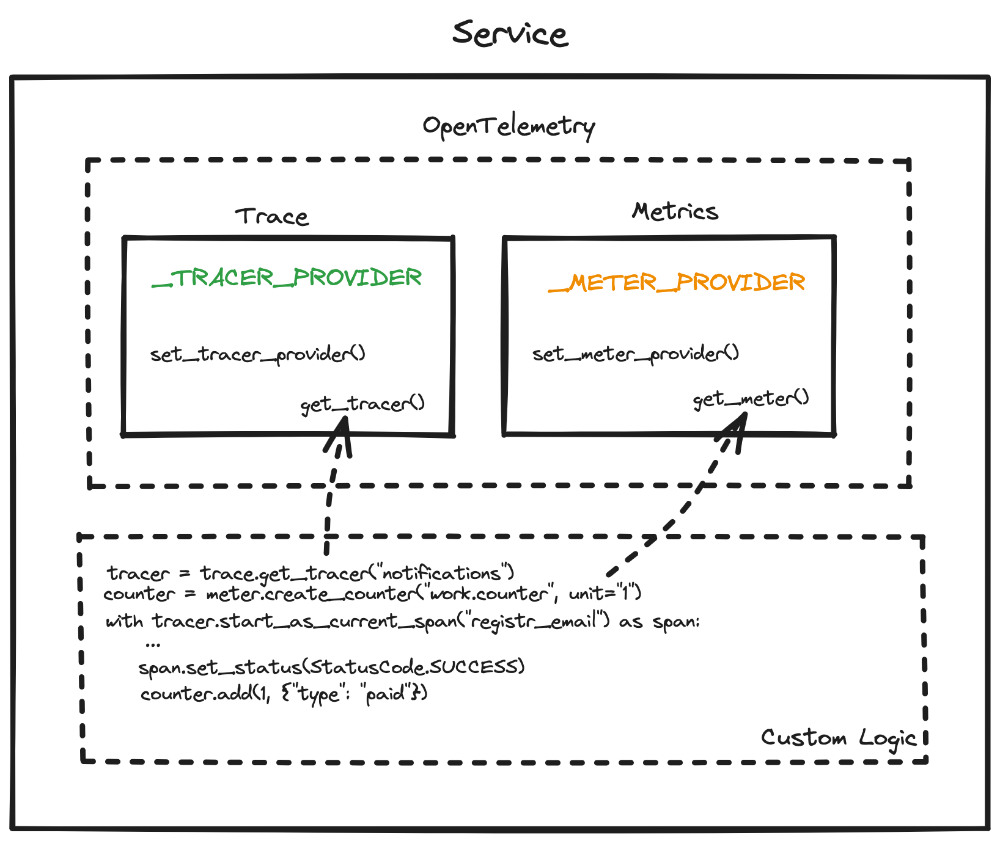
<div class="image-title">The Tracer & Meter Registries</div>

## Traces

The `TracerProvider{:.entity.name.class}` is basically a factory that creates `Tracer{:.entity.name.class}`s and passes most of its params down to a `Tracer{:.entity.name}`.
`Tracer{:.entity.name}`s represent the specific `trace` that could contain many `spans`.

Conceptually, `traces` are connected to the specific workflow or operation in the system.
That's why their names should be the same for the same processes e.g. `GET /users/{user_id}/` may represent all requests to an API that returns user's data.

Then, `spans` may represent some steps in your workflow. For instance, to get the user information, you may need to perform a request to your database.
That action may be wrapped into a `span`. Additional `attributes{:.variable.parameter}` could be added to the span to record some events, action result statuses, etc.
In the end, all `spans` form a hierarchical tree that could be viewed in the observability backend.

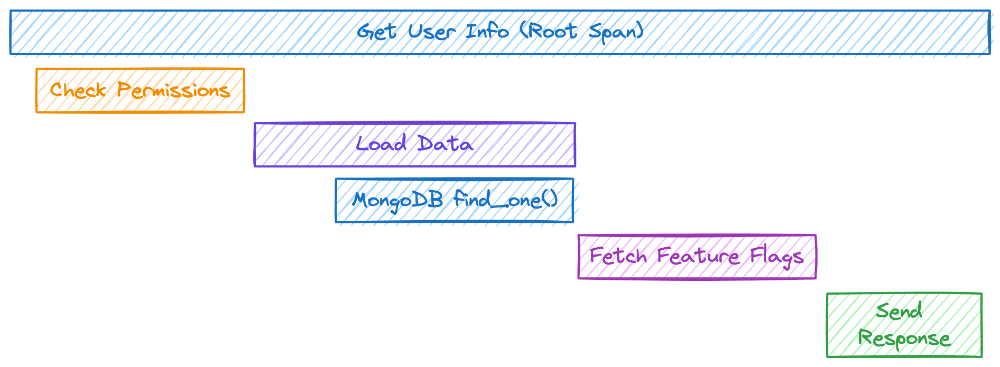
<div class="image-title">An example of trace</div>

Using [the tracer inited above](#the-sdk), we can create a new trace via:

```python
# the root span
with tracer.start_as_current_span("users:get-info") as span:
    span.set_attribute("user_id", str(...))

    # nested/child span
    with tracer.start_as_current_span("users:get-info:check-permissions") as span:
        ...
```

### Spans

In OTel protocol, `traces` are rather virtual entities that hold some execution context. The real data points that are being collected, processed and exported are `spans`.

The `Span{:.entity.name.class}` consists of:

- name - the human-friendly title of the step
- kind like internal, server, client, producer, consumer
- status like `not set`, `ok`, `error`
- the span context
- the parent span context
- the resource context
- the trace or instrumentation scope
- span `attributes{:.variable.parameter}`
- span events - special entities with the name, timestamp and own set of `attributes{:.variable.parameter}`
- span links to other spans that have caused the current span
- start_time & end_time as `time.time_ns(){:python}`

The `Span{:.entity.name.class}` class is also a [context manager](https://book.pythontips.com/en/latest/context_managers.html#context-managers), so when it starts and exits, the span signals the `SpanProcessor` about that.

### Span Sampling

There is also an optional opportunity to configure a span sampler.

Sampling is a way to filter out some spans or other data points if they match some specific criteria or just randomly.
The major reasons to sample are:

- to optimize the cost of ingesting and storing observability signals
- filter out boring regular data and mostly keep interesting one e.g. spans with errors, that took more than the threshold
- merely filter based on the presence or absence of `attributes{:.variable.parameter}`

Sampling on the SDK side could allow filtering as soon as possible in the pipeline (or the head sampling).

OTel comes with a few span samplers out of the box:

- `StaticSampler{:.entity.name.class}` that always or never drops spans
- `TraceIdRatio{:.entity.name.class}` that probabilistically drops a given portion of spans

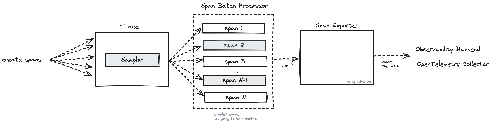
<div class="image-title">OTel SDK Span Pipeline</div>

These two samplers could be also configured to respect parent span decisions, so if the parent span was dropped, all its children spans would be eliminated, too.

<div class="info" style='background-color:#d9edf7; color:#31708f; border-left: solid #bce8f1 4px; border-radius: 4px; padding:0.7em;'>
    <span>
        <p style='margin-top:1em; text-align:center'>
            <b>Design Patterns in Wild</b>
        </p>
        <p style='margin-left:1em;'>
            Parent span aware sampling is implemented using <a href="https://refactoring.guru/design-patterns/composite" style="color:#31708f">the composite design pattern</a>.<br><br>
            The parent-based sampler wraps the static or ratio-based sampler mentioned above and adds a logic to propagate the parent span's sampling decision.
        </p>
    </span>
</div>

### Span Processors

When spans end, they come to span processors. Span processing is the last stage of span's lifecycle before it's exported outside of the service. OpenTelemetry uses it to batch spans and multiplex them to multiple exporters.

The `BatchSpanProcessor` collects spans and exports them on schedule or when its queue is full. For that, it maintains a separate daemon thread where this logic is executed. The processor waits until a batch is collected or a timeout is reached.
[Threading.condition](https://docs.python.org/3/library/threading.html#condition-objects) is used to implement this elegantly.

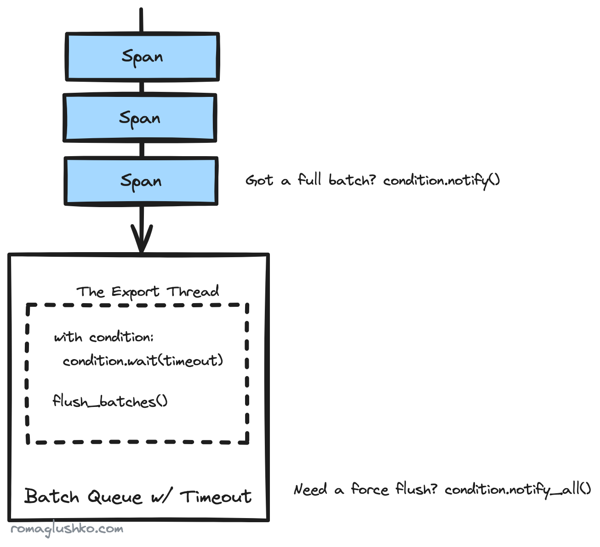
<div class="image-title">A Batch Queue with Timeout</div>

There are also two `MultiSpanProcessors` that operate on a list of span processors and dispatch them sequentially or concurrently.

The concurrent span processing happens via [ThreadPoolExecutor](https://docs.python.org/3/library/concurrent.futures.html#threadpoolexecutor).

## Ctx Propagation

So far we have been talking about trace spans processing in the scope of one services,
but the real value of traces unlocks when multiple microservices take part in a workflow and you could connect what they were doing there into one coherent picture.

In order to do that, OpenTelemetry needs to propagate some context during cross-service communication,
so the next microservice in the flow would know that all spans it was going to create should be attached to the parent trace created at the start of the workflow.

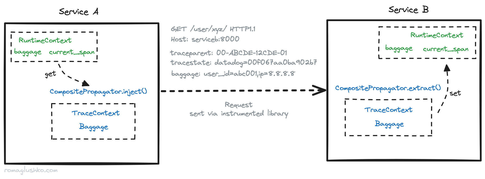
<div class="image-title">The Context Propagation in a Distributed Workflow</div>

OTel holds propagatable information in the <span class="green">runtime context</span>.
In Python's SDK, it's implemented using the convenient [contextvars](https://docs.python.org/3/library/contextvars.html) standard library which is a perfect mechanism to have scoped "global" variables on the level of asyncio.Task-s, for example.

By default, OTel defines two context vars:

- the <span class="green">current span</span> - holds a reference to the currently active OTel trace span
- the <span class="green">baggage</span> - holds arbitrary key-value information that should be propagated as an additional context for every microservice involved

Another important thing here is the actual <span class="blue">context propagation</span> which incurs context serialization and deserialization.

In the realm of HTTP-based communication, OpenTelemetry propagates the context via HTTP headers according to [the W3C Trace Context specification](https://www.w3.org/TR/trace-context/). According to the specification, the current span context is propagated as two headers:

- `traceparent` - with trace span ID, parent span ID and parent span flags (e.g. trace was marked as sampled or not)
- `tracestate` - arbitrary vendor-specific trace context or identifiers

The <span class="green">baggage</span> context doesn't seem to be outlined in the specification, but OTel shares it as one more identically named HTTP header.

The microservice that receives such requests should be aware of context information in the headers, extract it and set it in the local <span class="green">runtime context</span>.

Since OpenTelemetry is framework- or transport-protocol-agnostic, it just provides all needed functions to extract or inject context.
To actually propagate that information, you should instrument your clients and servers and OTel provides plenty of auto-instrumentors in [their registry](https://opentelemetry.io/ecosystem/registry/).

## Metrics

Metrics are another observability pillar we are going to review next. The mechanism of collecting metrics is a bit different to traces.

In case of traces, user code actively creates trace spans and as soon as they are completed, OpenTelemetry can process and export them.
The metrics dynamic is much more continuous, so the collection really ends when the service shuts down.
Since service uptime could be measured in days if not weeks, we need to take a different approach here to export all measurements in between like doing metric data aggregations periodically over a time window.

Just like in the case of traces, OpenTelemetry provides <span class="orange">MeterProvider</span> that bridges all metrics with metric exporters.
<span class="orange">MeterProvider</span> creates new instances of `Meter{:.entity.name.class}`.
Meters are instrumentation-specific measurement components. Each OTel instrumentation library creates its own meter (e.g. HTTP client or server meters).
When you do your custom measurements it's alright to have one global meter per service (but you certainly could have more).

Using [the meter inited above](#the-sdk), you can measure a custom metric like that:

```python
# globally defined custom metric
user_info_cache_miss_counter = meter.create_counter(
    "users.cache.miss",
    description="The number of cache misses when fetching user's info",
)

# later on, you can import the metric and measure what you need
user_info_cache_miss_counter.add(1, {"user.org_id": ...})
```

### Metric Instruments

Now, having a meter, you could create specific metrics (a.k.a. metric instruments) that you want to measure or observe. Generally, OTel divides metrics into two categories:

- `Synchronous metrics` - there are metrics that you measure directly right in your service workflows, so you observe them as soon as the event happens (e.g. a service increases a counter metric in the user login workflow)
- `Asynchronous (or observable) metrics` - these metrics are read from "external" sources, so you just observe an aggregated or in-time statistics instead of measuring the value directly (e.g. number of items in a queue given that you cannot instrument the queue directly and you could just read its size property)

OpenTelemetry supports the following metric types:

- <span class="green">Counter</span> (and <span class="green">Observable Counter</span>) - an ever-growing (or monotonically increasing) value (for example, the number of requests processed by service)
- <span class="green">UpDownCounter</span> (and <span class="green">Observable UpDownCounter</span>) - a value that could grow or fall (for example, the number of in-flight requests)
- <span class="green">Histogram</span> (and <span class="green">Observable Histogram</span>) - suitable for measurements on which you want to calculate statistics (for example, request latency)
- <span class="green">Gauge</span> - just like the observable <span class="green">UpDownCounter</span>, but each measurement is treated as a separate data point, so they are not summed up (for example, CPU or RAM utilizations)

### Views & agregations

With our metrics defined, we could start measuring, aggregating and collecting actual values.

Metric instruments don't collect data directly but rather send it to `MeasurementConsumer{:.entity.name.class}` which is a global component initiated on the <span class="orange">MeterProvider's</span> level.
`MeasurementConsumer{:.entity.name.class}` collects data for each and all `MetricReader{:.entity.name.class}`s configured on the provider.

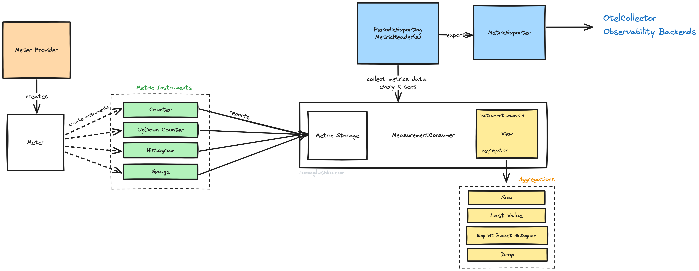
<div class="image-title">The Architecture of OTel Metrics</div>

Thinking about our source metrics data, it's just arrays of numbers with attributes (or one number at the time in the case of observable instruments), so there are multiple options possible how they could be aggregated.
OpenTelemetry provides great flexibility there.

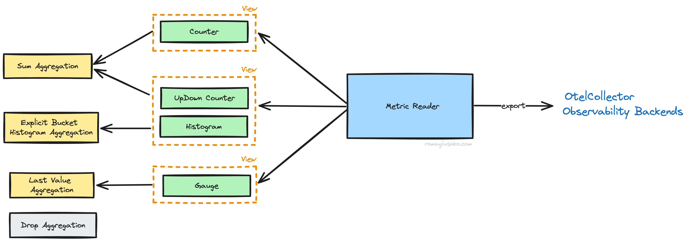
<div class="image-title">OTel Metrics, Views, Aggregations</div>

First of all, aggregations could be configured on the metric exporter side. Maybe, you are an observability backend vendor like DataDog or Chronosphere and you come up with a better or specific way to deal with metric data points. This would be an opportunity for you to adjust exported data.

Then, you could leverage a concept of <span class="yellow">views</span> to override the config further. <span class="yellow">Views</span> effectively allow to specify the aggregation strategy per metric instrument and its metadata (e.g. name, attributes).

By default, OTel implements the following aggregations:

- <span class="yellow">Drop Aggregation</span> - a way to drop metric collection completely.
- <span class="yellow">Last Value Aggregation</span> - keeps the last aggregated value until it's collected (used by gauges).
- <span class="yellow">Sum Aggregation</span> - arithmetic sum of provided data points (used by counters).
- <span class="yellow">Explicit Bucket Histogram Aggregation</span> - assigns collected data points to one of 15 predefined buckets. Besides that, it collects sum, count, min and max across given data.
- <span class="yellow">Exponential Bucket Histogram Aggregation</span> - similar to the explicit bucket aggregation, but buckets are generated dynamically by the exponentially growing size of the next bucket and much more fine grained (by default, there are 150 buckets).

The sum and histogram aggregations may collect data between probes as:

- <span class="yellow">deltas</span> e.g. differences between the previous aggregated stats (e.g. sums, counts) and the current ones.
- <span class="yellow">cumulative data</span> e.g. the previous and the current stats are summed up (so the values keep increasing over time).

This is called <span class="yellow">aggregation temporality</span>.

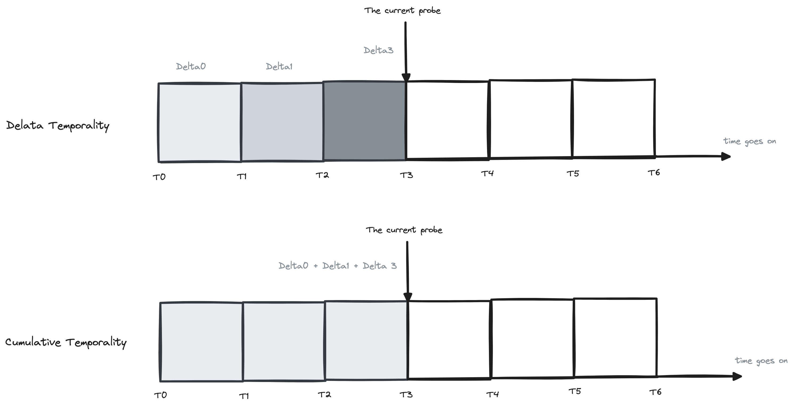
<div class="image-title">Aggregation Temporalities</div>

### Metric readers

As we briefly have mentioned, metrics are collected on schedule by <span class="blue">MetricReader</span> like <span class="blue">PeriodicExportingMetricReader</span> which holds a ticker in a separate thread.
The ticker initiates the metrics collection process that creates exportable data according to <span class="yellow">metrics aggregation temporalities</span>.

## Logs

Finally, we get to logs. They are the most wide-spread among the signals and have the longest record of being used for diagnosing how code works.

Logs are simple to operate. You could just write them to a standard output or a file, and then dredge them when you need. No need to have special viewers like you would need in case of traces or metrics.
That's why pretty much all languages have their off-the-shelf logging libraries to use.

Ironically, logs have gotten the last into OpenTelemetry. The integration is either in the experimental stage or doesn't exist for most languages at the moment.

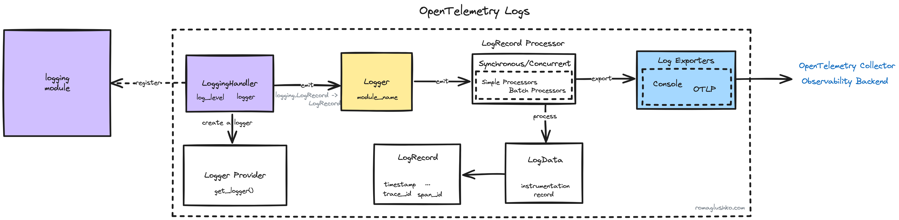
<div class="image-title">The Log Bridge in Python</div>

OpenTelemetry bridges into the existing logging libraries to integrate logs seamlessly for applications. In Python's world, there is the standard [logging](https://docs.python.org/3/library/logging.html) package.
OTel comes with a `LoggingHandler` that plugs the rest of components into the logging system. The LoggingHandler also translates logging.LogRecord into OTel's LogRecord data class.


<div class="info" style='background-color:#d9edf7; color:#31708f; border-left: solid #bce8f1 4px; border-radius: 4px; padding:0.7em;'>
    <span>
        <p style='margin-top:1em; text-align:center'>
            <b>Design Patterns in Wild</b>
        </p>
        <p style='margin-left:1em;'>
            The OTel's <code>LoggingHandler</code> is a good example of applying <a href="https://refactoring.guru/design-patterns/adapter" style="color:#31708f">the adapter pattern</a> that allowed OpenTelemetry to have its own architecture despite a variety of logging libraries it needed to support.
        </p>
    </span>
</div>


The remaining architecture resembles what we have reviewed in [the trace part](#span-processors).
There is a dedicated LoggerProvider that holds log processors and exporters attached to the processors.
The processors send logs to exporters for further saving in observability backends.

## Semantic Conventions SemConv

Before wrapping up, we need to touch on another important topic that is tangentially connected to service instrumentations and metrics.

Imagine you have three teams in a company that run different subsystems.
Now let's ask them to define golden signal metrics for their services and see what metric names they come up with.
Chances are we would get three different sets of names for semantically the same metrics. That's even more likely if they work with different tech stacks with different conventions and naming standards.

Such a lack of consistency would create a lot of mess and hinder reuse of common dashboards, alerts, etc.
The same situations can happen in traces when we instrument database queries, object storage access, etc.

OTel recognized this problem and [came up with a set of common names for common operations across all three signals](https://opentelemetry.io/docs/specs/semconv/).
So if you use it, you can come up with a very unified view of the whole system when looking at it through an observability lens.

## Closing thoughts

In this article, we have reviewed OpenTelemetry integration from the service development perspective by looking into the internals of the SDK.

## References

- [[OpenTelemetry] Signals](https://opentelemetry.io/docs/concepts/signals/)
- [[OpenTelemetry] Python SDK](https://opentelemetry.io/docs/instrumentation/python/)
- [[OpenTelemetry] Baggage](https://opentelemetry.io/docs/concepts/signals/baggage/)
- [[OpenTelemetry] Sampling](https://opentelemetry.io/docs/concepts/sampling/)
- [[OpenTelemetry] Logs](https://opentelemetry.io/docs/concepts/signals/logs/)
- [[OpenTelemetry] Python Cookbook](https://opentelemetry.io/docs/languages/python/cookbook/)
- [[OpenTelemetry] Semantic Conventions](https://opentelemetry.io/docs/specs/semconv/)
