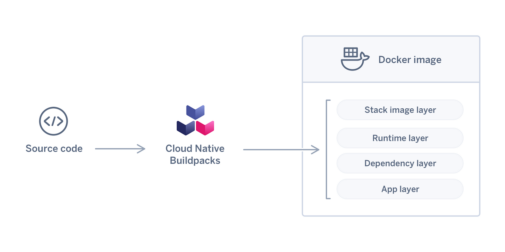

> **Build your OCI images using Buildpacks**

## ℹ️ Overview

In the ecosystem of containerization, Docker has long been the de facto standard for building and deploying applications. However, the rise of open standards such as the [Open Container Initiative (OCI)](https://opencontainers.org/) has paved the way for alternative approaches that offer greater flexibility and simplicity.

One such approach is [Cloud Native Buildpacks (CNB)](https://buildpacks.io/), a project that aims to unify the buildpack ecosystem and provide a platform-agnostic way to build OCI images. CNB is implemented by a number of tools, including [Pack](https://buildpacks.io/docs/tools/pack/), a CLI that enables users to build, manage, and deploy applications using buildpacks.

In this blog post, we will explore how Pack can be used to achieve Dockerfile-less deployment to Kubernetes. We will discuss the benefits of using buildpacks over Dockerfiles, and we will demonstrate how to use Pack to build and deploy a simple Node.js application to Kubernetes.



## 📦 OCI Image Standard: A Foundation for Portable and Interoperable Containerization

OCI images, or Open Container Initiative images, are a standard format for container images. They are defined by the Open Container Initiative (OCI), a non-profit organization that aims to create open standards for containerization.

OCI images are composed of a manifest, a set of filesystem layers, and a configuration. The manifest lists the layers that make up the image, as well as other metadata such as the image name and the author. The filesystem layers are stored as tarballs, and they contain the files that make up the image. The configuration file contains information about the image, such as the environment variables that should be set when the image is run.

OCI images are designed to be portable across different container runtimes. This means that an OCI image can be run on any runtime that supports the OCI image format. Some popular container runtimes that support OCI images include [Docker](https://www.docker.com/), [CRI-O](https://cri-o.io/), and [containerd](https://containerd.io/).

OCI images are the de facto standard for container images. They are used by a wide variety of organizations, including Google, Amazon, and Microsoft.


---

## 🚀 Pack: A Swift Solution for Docker Image Creation

Pack is a convenient tool for swiftly constructing Docker images for your projects without the need for individual Dockerfiles. This enables you to efficiently Dockerize numerous projects without having to write Dockerfiles for each one.

Buildpacks automatically identify the programming language of your project as well as any required dependencies, such as `pom.xml`, `build.gradle`, or `requirements.txt` files. All you have to do for each project is run a single command, which makes it simple to incorporate into your CI/CD pipeline for automated Docker image creation.

---

### 🌟 Benefits of Using Buildpacks Over Dockerfiles

There are a number of benefits to using buildpacks over Dockerfiles. These include:

- **Simplicity**: Buildpacks are designed to be simpler to use than Dockerfiles. They are based on the idea of detecting the programming language and project structure of an application, and then applying a series of build steps that are appropriate for that language and project. This means that users do not need to have a deep understanding of how to create Dockerfiles.
- **Flexibility**: Buildpacks are more flexible than Dockerfiles. They can be used to build a wider range of images, and they can be more easily adapted to changes in the underlying application. For example, if a buildpack is updated to support a new version of a programming language, all images that are built using that buildpack will automatically benefit from the update.
- **Portability**: Buildpacks are portable across different platforms. This means that an image that is built using a buildpack can be deployed to any platform that supports OCI images.


##  Hands-on

To illustrate the capabilities of buildpacks, let's consider a basic Node.js application as an example:

```shell
myapp
├── package.json
└── src
    └── index.js
```

To containerize our application in a container, we typically create a Dockerfile. This file contains the essential instructions for constructing an environment that will be used to execute our application.

```dockerfile
FROM node:latest
WORKDIR /app
# add our code to our future image
COPY package.json /app/package.json
COPY src/ /app/src
# launch npm which will install the Node.js dependencies of the application
RUN npm install
CMD 'npm start'
```

Once built, we can inspect our image with `docker inspect`:

```json
(...)
  "Config": {
      "Hostname": "",
      "Domainname": "",
      "User": "",
      "AttachStdin": false,
      "AttachStdout": false,
      "AttachStderr": false,
      "Tty": false,
      "OpenStdin": false,
      "StdinOnce": false,
      "Env": [
        "PATH=/usr/local/sbin:/usr/local/bin:/usr/sbin:/usr/bin:/sbin:/bin",
        "NODE_VERSION=16.17.0",
        "YARN_VERSION=1.22.19"
      ],
      "Cmd": [
        "/bin/sh",
        "-c",
        "npm start"
      ],
      "Image": "sha256:ca5108589bcee5007319db215f0f22048fb7b75d4d6c16e6310ef044c58218c0",
      "Volumes": null,
      "WorkingDir": "/app",
      "Entrypoint": [
          "docker-entrypoint.sh"
      ],
      "OnBuild": null,
      "Labels": null
  },
  (...)
      "Type": "layers",
      "Layers": [
          "sha256:20833a96725ec17c9ab15711400e43781a7b7fe31d23fc6c78a7cca478935d33",
          "sha256:07b905e91599cd0251bd575fb77d0918cd4f40b64fa7ea50ff82806c60e2ba61",
          "sha256:5cbe2d191b8f91d974fbba38b5ddcbd5d4882e715a9e008061ab6d2ec432ef7b",
          "sha256:47b6660a2b9bb2091a980c361a1c15b2a391c530877961877138fffc50d2f6f7",
          "sha256:1e69483976e43c657172c073712c3d741245f9141fb560db5af7704aee95114c",
          "sha256:a51886a0928017dc307b85b85c6fb3f9d727b5204ea944117ce59c4b4acc5e05",
          "sha256:ba9804f7abedf8ddea3228539ae12b90966272d6eb02fd2c57446e44d32f1b70",
          "sha256:c77311ff502e318598cc7b6c03a5bd25182f7f6f0352d9b68fad82ed7b4e8c26",
          "sha256:93a6676fffe0813e4ca03cae4769300b539b66234e95be66d86c3ac7748c1321",
          "sha256:3cf3c6f03984f8a31c0181feb75ac056fc2bd56ef8282af9a72dafd1b6bb0c41",
          "sha256:02dacaf7071cc5792c28a4cf54141b7058ee492c93f04176f8f3f090c42735eb",
          "sha256:85152f012a08f63dfaf306c01ac382c1962871bf1864b357549899ec2fa7385d",
          "sha256:8ceb0bd5afef8a5fa451f89273974732cd0c89dac2c80ff8b7855531710fbc49"
      ]
  (...)
```

We can see a configuration block with:

- The environment variables
- The entrypoint command, the default command
- The working directory
- The user of the image

And a second block Layers with a list of checksums. Each checksum corresponds to a compressed archive file (.tar.gz). All these layers applied on top of each other build a complete filesystem.

### 🏗️ How Docker builds images

To comprehend how Docker constructs an image, it is essential to be familiar with the `docker commit` command. This command operates on a running container and creates an image from the state of that container.

This mechanism is utilized, for instance, in the `RUN npm install` instruction:

1. Docker starts an intermediate container.
2. Within this container, the `npm install` command is executed.
3. Once the command is complete, Docker commits the container, and the difference between the previous image allows for the creation of an additional layer, resulting in a new intermediate image.

However, `docker build` has one significant drawback: by default, the build is not reproducible. Two consecutive `docker builds` with the same Dockerfile will not necessarily produce the same layers, and therefore the same checksums. This phenomenon is primarily caused by timestamps. Each file in a standard Linux filesystem has a creation date, a last modification date, and a last access date. Additionally, the image has a timestamp that is embedded in the image and alters the checksum. This makes it very difficult to isolate our different layers, and it is challenging to logically associate an operation in our Dockerfile with a layer in our final image.

For modifications to the base image (the `FROM` instruction, for security reasons, for example), Docker must perform a complete build. Additionally, uploading this update to our registry necessitates sending all the layers. Depending on the size of our image, this can lead to a significant amount of traffic on each of our machines hosting our image and wishing to update.

An image is simply a stack of layers on top of each other, along with configuration files. However, Docker (and its Dockerfile) is not the only way to build an image. Buildpacks offer a different principle for building images. Buildpacks is a project incubated at the [Cloud Native Computing Foundation](https://www.cncf.io/).

## 🇵🇸 How buildpack builds images

A buildpack is a set of executable scripts that will allow you to build and launch your application. A buildpack is made of 3 components:

1. `buildpack.toml`: the metadata of your buildpack.
2. `bin/detect`: script that determines if the buildpack applies to your application.
3. `bin/build`: script launching the build sequence of the application.

Building your application means running buildpacks one after the other. To do this we use a builder. A builder is an image including a whole set of buildpacks, a lifecycle, and a reference to a very light run image in which we will integrate our application. The build image/run image couple is called a stack.

Coming back to our Node.js application, Buildpack will only use the information in the `package.json`.

```json
{
  "name": "myapp",
  "version": "0.1",
  "main": "index.js",
  "license": "MIT",
  "dependencies": {
    "express": "^4.18.1"
  },
  "scripts": {
    "start": "node src/index.js"
  },
  "engines": {
    "node": "16"
  }
}
```

This is all we need to build an image containing our application with buildpacks:

- The base image (the `FROM` of the Dockerfile) will be the one specified in the stack.
- The buildpacks lifecycle detects a `package.json` and thus starts the installation process of Node.js and the dependencies.
- The version of Node will be the version specified in the `package.json`.
- The default command will be `node src/index.js` because it is the start command of the `package.json`.

The only command you need to know to use buildpacks is the following:

```shell
pack build myapp --builder gcr.io/buildpacks/builder:v1
```

Here we use the builder provided by Google `gcr.io/buildpacks/builder:v1`. Other builders are available (see `pack stack suggest`) or you can build your own! It is then directly possible to launch our application.

```shell
$ docker run myapp
> myapp@0.0.1 start
> node src/index.js
Example app listening on port 3000
```

### 🌟 Advantages of using buildpacks

The advantages of using buildpacks include:

- The absence of a Dockerfile. The developer can concentrate on his code only.
- The respect of good image building practices, in terms of security, limitation of the number and size of layers. This is the responsibility of the buildpack designer, not the developer.
- Caching is native, whether it's the binaries to be installed or the software libraries.
- Uses your organization's best practices if you create your own buildpack (use of internal mirrors, code analysis…).
- Each layer of the final image is logically linked with the dependencies it brings.
- Each operation of a buildpack touches only a restricted area (a folder with the name of the buildpack in the run image).
- Buildpacks allow obtaining reproducible builds with less effort.
- The files copied into the image all have a timestamp with a value of 0.
- It is however necessary that the intermediate build steps (e.g. compilation of Java code) must be idempotent.
- This allows launching an operation that buildpacks calls 'rebase'.

### 🔄 Image rebasing with Buildpacks

Image rebasing is the ability to swap out multiple layers of an image without having to modify the upper layers. This is particularly useful when updating the base image of our run image.

As an example, let's consider a Node.js application (which I'm simplifying for the sake of brevity):

At build time, Buildpacks rely on the lightest possible run image, adding layer by layer:

- A layer containing the Node binaries.
- A layer containing the `node_modules` (dependencies) of our application.

Note that the `npm` binary is not needed in our run image. It will not be included, but it is used in our build image to install the `node_modules` that will be integrated into our run image.

If our container is deployed in Kubernetes and a flaw is discovered in its base image, it is necessary to update the base image. With Docker, this would require rebuilding our image completely, and uploading our entire new image to our registry, and each Kubernetes worker would have to download this new image.

This is not necessary with Buildpacks. Only the layers related to the base image need to be uploaded. For example, we can compare two OCI images, one with an Ubuntu 18.04 base image and the other with an Ubuntu 20.04 base image. The first 3 layers (in blue) are the Ubuntu-related layers. The next layers (in red) are the layers added by Buildpacks. These layers are identical. This behavior is possible in Docker (but complex to set up), but it is the default behavior with Buildpacks.


If you want to easily implement good image creation practices for your containerized applications, Buildpacks is an excellent choice to consider. It easily integrates with your CI/CD via projects like [kpack](https://github.com/pivotal/kpack). It may even already be integrated into your DevOps infrastructure as Buildpacks is the one behind [Gitlab's Auto DevOps feature](https://docs.gitlab.com/ee/topics/autodevops/).

## 📌 Closing thoughts

Buildpacks offer a compelling alternative to Dockerfiles for building container images. They are simpler to use, more flexible, and more portable. Additionally, Buildpacks provide a number of advantages over Dockerfiles, such as reproducible builds and image rebasing.

As the containerization landscape continues to evolve, Buildpacks are poised to play a major role in the future of container image creation. If you are looking for a way to simplify and streamline your containerization workflow, then Buildpacks are a great option to consider.


<br>

**_Until next time, つづく 🎉_**

> 💡 Thank you for Reading !! 🙌🏻😁📃, see you in the next blog.🤘  **_Until next time 🎉_**

🚀 Thank you for sticking up till the end. If you have any questions/feedback regarding this blog feel free to connect with me:

**♻️ LinkedIn:** https://www.linkedin.com/in/rajhi-saif/

**♻️ X/Twitter:** https://x.com/rajhisaifeddine

**The end ✌🏻**

<h1 align="center">🔰 Keep Learning !! Keep Sharing !! 🔰</h1>

**📅 Stay updated**

Subscribe to our newsletter for more insights on AWS cloud computing and containers.
