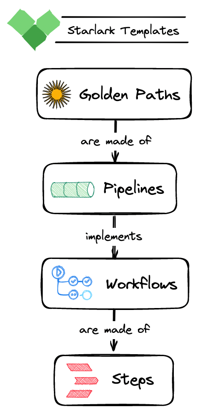

> **Exploring how Netflix balances developer autonomy with structured support**

## ℹ️ Overview

Step onto the paved golden road of freedom and responsibility in the world of Netflix engineering, where innovation takes center stage. At Netflix, engineers are embraced by a culture that fosters creativity and provides the autonomy to choose the ideal tools for their tasks where [the golden road](https://www.oreilly.com/videos/oscon-2017/9781491976227/9781491976227-video306724/) of freedom and responsibility paves the way for extraordinary innovation.

[This culture of freedom and responsibility](https://netflixtechblog.com/how-we-build-code-at-netflix-c5d9bd727f15) fuels the development process, where engineers are encouraged to push boundaries and deliver exceptional streaming experiences to millions of viewers worldwide.

## 🎯 Goals & Objectives

In this blog post, we invite you to join us on a captivating exploration of the Netflix engineering landscape. As we discover the secrets behind Netflix's success, we'll dive into the methods, practices, and cutting-edge technologies that shape their groundbreaking solutions.

### Paving the Roads to Innovation: Netflix's Culture of Freedom and Responsibility

Netflix, a trailblazer in the streaming industry, has built its success on a foundation of paved roads that lead to innovation. At the heart of this success lies Netflix's unique culture of freedom and responsibility, which empowers engineers to chart their own paths and drive remarkable advancements in the field of technology.

Within Netflix's engineering teams, the concept of freedom is not just a buzzword; it is a core value that permeates every aspect of their work. Engineers are encouraged to think outside the box, challenge conventional norms, and explore new horizons. This freedom extends to their choice of tools, allowing them to select the technologies that best align with their goals and preferences. Whether it's experimenting with emerging frameworks or utilizing cutting-edge cloud services, Netflix engineers have the freedom to innovate and bring their ideas to life.

However, this freedom is not without responsibility. Netflix understands that true innovation comes with accountability. Engineers are entrusted with the responsibility of delivering exceptional experiences to millions of viewers worldwide. This responsibility drives them to uphold high standards of quality, efficiency, and reliability. They work collaboratively within centralized teams, leveraging shared practices and resources to ensure the smooth functioning of their services.

To pave these roads to innovation, Netflix has adopted a microservices architecture, replacing their monolithic, datacenter-based application. This transformational shift enables independent operation, allowing teams to make changes at their own pace while maintaining loose coupling. By breaking down their systems into smaller, specialized services, Netflix engineers can iterate rapidly, respond to customer needs more effectively, and scale their infrastructure seamlessly.

Netflix's commitment to paving these roads goes beyond technology. The company invests in fostering a culture that values continuous learning, experimentation, and personal growth. Engineers are encouraged to share knowledge, collaborate across teams, and embrace failures as opportunities for improvement. This collaborative and growth-oriented culture ensures that the roads to innovation remain open, vibrant, and ever-evolving.

Below are some of the engineering strategies that pave the way for innovation at Netflix:

- 📦 **Pipelines and Building Blocks**
- ➰ **Use Templates And Keep It DRY**
- 🛟 **Drone Extensions To The Rescue**
- ✂️ **Decoupling CI / CD from Deployment**
- 💰 **Cost Effectiveness & Specialized Hardware**

https://giphy.com/gifs/thedungeonrun-the-dungeon-run-jessica-lynn-parsons-fahima-tadhg-ZFFO5yvRnnJZJPJAki

### Driving Innovation: Netflix's Migration to AWS and Microservices Architecture

One concrete example of Netflix's paved road in their AWS Java deployment is their migration from a monolithic, datacenter-based application to a microservices architecture. This transformation allowed Netflix to unlock the full potential of cloud-based technologies and paved the way for greater flexibility, scalability, and innovation.

In the past, Netflix operated a monolithic Java application hosted in traditional data centers. However, recognizing the limitations and the need for agility, they embarked on a journey to [migrate their streaming service to AWS](https://about.netflix.com/en/news/completing-the-netflix-cloud-migration).

By embracing AWS and adopting a microservices architecture, Netflix engineers gained the freedom to operate independently and make changes at their own pace. Each microservice became a specialized building block responsible for specific functionalities, such as user authentication, recommendation algorithms, or video playback. This decoupling of services enabled teams to iterate rapidly, innovate faster, and respond to customer needs more efficiently.

Netflix's paved road in their AWS Java deployment involved leveraging a range of AWS services to support their microservices architecture. They utilized Amazon EC2 for scalable compute resources, Amazon S3 for reliable and scalable storage, Amazon RDS for managed databases, and Amazon DynamoDB for NoSQL data storage. They also made extensive use of AWS Lambda for serverless computing, which further optimized their resource utilization and enhanced scalability.

With this paved road in place, Netflix engineers could focus on building and optimizing individual microservices, rather than being burdened by managing and scaling an entire monolithic application. They had the freedom to choose the most suitable tools and technologies for each microservice, ensuring they could deliver exceptional streaming experiences to their millions of viewers worldwide.

Overall, Netflix's journey towards a microservices architecture within AWS showcases their commitment to paving a road of freedom, enabling engineers to embrace cloud technologies and deliver groundbreaking innovations in the streaming industry.

## 👏 Wrapping Up

Netflix's culture of freedom and responsibility lays the groundwork for remarkable innovations in the engineering realm. By paving these roads, Netflix empowers its engineers to think boldly, select the best tools for their tasks, and push boundaries to deliver outstanding streaming experiences to audiences worldwide. It is through this commitment to paving the roads to innovation that Netflix continues to redefine the landscape of the entertainment industry.

https://giphy.com/gifs/over-end-its-VHrFbmOtBwysbsYnka

 

**_Until next time, つづく 🎉_**

> 💡 Thank you for Reading !! 🙌🏻😁📃, see you in the next blog.🤘  **_Until next time 🎉_**

🚀 Thank you for sticking up till the end. If you have any questions/feedback regarding this blog feel free to connect with me:

**♻️ LinkedIn:** https://www.linkedin.com/in/rajhi-saif/

**♻️ X/Twitter:** https://x.com/rajhisaifeddine

**The end ✌🏻**

<h1 align="center">🔰 Keep Learning !! Keep Sharing !! 🔰</h1>

**📅 Stay updated**

Subscribe to our newsletter for more insights on AWS cloud computing and containers.
