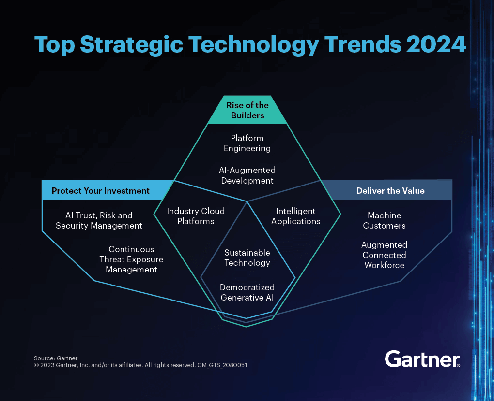
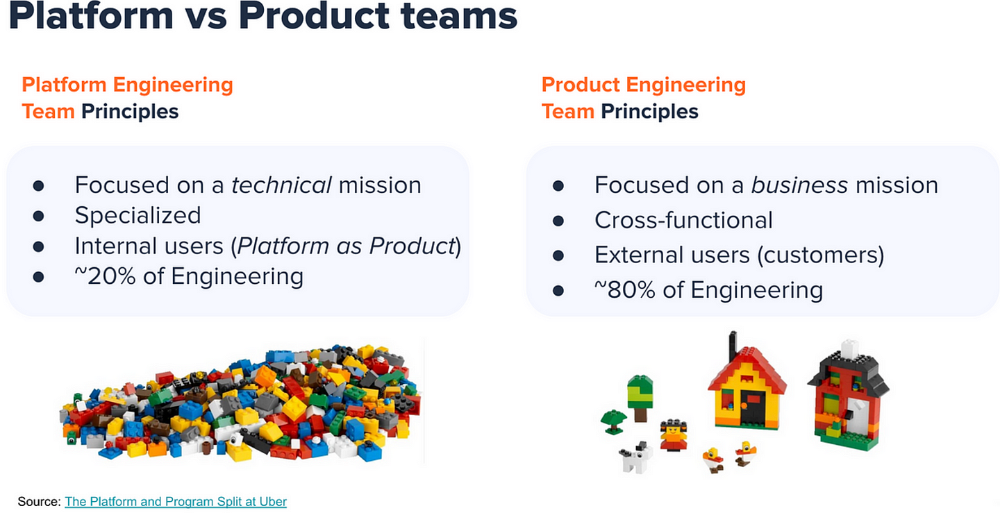
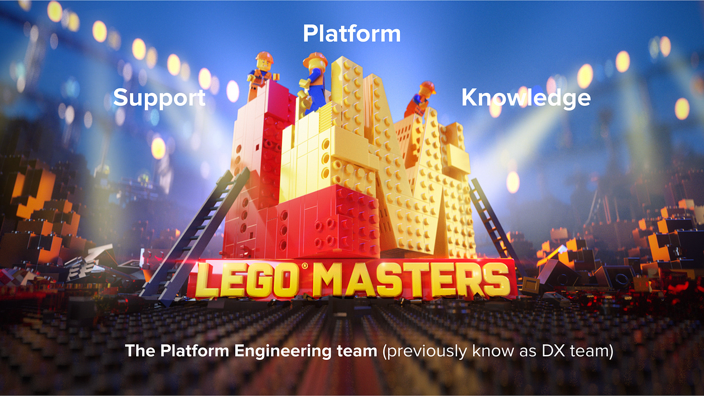
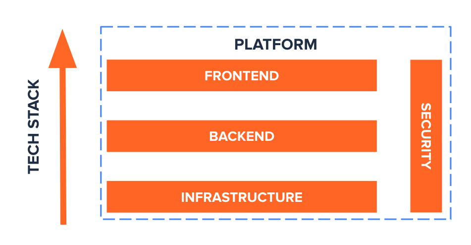
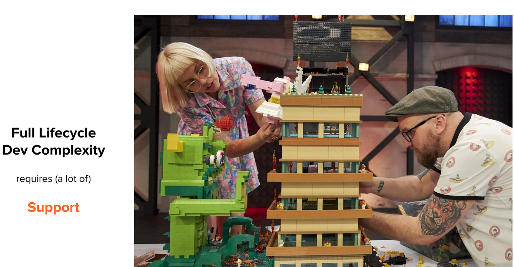
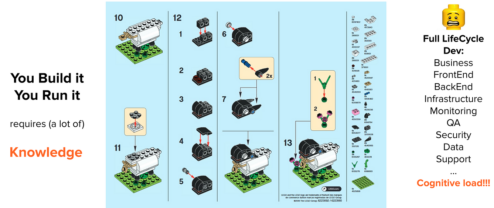

> **Making Software engineering Easier 🏗️**

## Introduction

[Platform engineering](https://thenewstack.io/platform-engineering/) is about making it easier for developers to do their job. Instead of focusing on specific tools, it’s more about creating the right environment for them to work in.

The main goal is to help developers deploy and run their code without any problems. This means that the platform engineering team needs to be experts and advisors, guiding the developers and making sure everything works well.

It is the discipline of designing and building workflows that enable self-service capabilities for software engineering organizations in the cloud-native era. It provides an integrated product most often referred to as an Internal Developer Platform covering the operational necessities of the entire lifecycle of an application.

In this blog post, we will explain why platform engineering is essential, what its goals are, and how it contributes to the software development process.

---

📢 **Announcement:** I have just launched a [GitHub repository](https://github.com/seifrajhi/awesome-platform-engineering-tools) dedicated to gathering resources and tools related to platform engineering.

Your feedback and contributions are welcomed to enhance and improve the learning experience. 🎉

---

## The Rise of Platform Engineering 🚀

Over the past three decades, the landscape of software development has gone through significant transformations.

The arrival of agile methodologies, the DevOps philosophy, and cloud-based infrastructure have reshaped the roles of software developers.

The rise of microservices, containers, and other technological advancements has introduced new engineering challenges, leading to the emergence of platform engineering teams in various organizations.

With the evolution of technology, the focus has shifted towards creating an environment that reduces the cognitive load on developers and standardizes software development processes.

This evolution has paved the way for the establishment of platform engineering as an essential discipline in modern software development.

It appeared in the latest [Gartner’s 2024 Hype Cycle for Emerging Tech](https://www.gartner.com/en/articles/gartner-top-10-strategic-technology-trends-for-2024), and it had its first dedicated conference in summer 2022: [PlatformCon 2022](https://platformcon.com/), with 7K+ online attendees.

<a href="https://www.gartner.com/en/articles/gartner-top-10-strategic-technology-trends-for-2024">Source</a>

## What Platform Engineering is Used For 🛠️

What is the ideal development platform for one company may be useless to another. Even within the same company, different development teams may have entirely different needs.

The overarching goal of the engineering platform is to enhance user experience and productivity. For the organization, such platforms encourage consistency and efficiency. For the developer, they provide welcome relief from the management of delivery pipelines and low-level infrastructure.

In modern product organizations, the teams who build end-user products are called empowered Product teams, as defined by Marty Cagan in his must-read book ["Empowered"](https://www.svpg.com/empowered/).

There is a [book](https://teamtopologies.com/book) to inspire modern engineering organizations called [Team Topologies](https://teamtopologies.com/) by Manuel Pais and Matthew Skelton.

In this book, empowered Product teams are described as Stream-Aligned teams, and they are "empowered" by the support of Enabling teams and Platform teams!

## Platform Team's Mission and Goals 🎯

The Platform Engineering team's mission is completely linked to the Product Engineering team's mission:

**Product Engineering team's mission:**
Deliver business values to the end users with high velocity and high quality, by owning the full lifecycle development (BUILD, SHIP, and RUN).

**Platform Engineering team's mission:**
Create a best-in-class technical environment where the product squads are empowered and autonomous enough to fulfill their mission.

To fulfill its mission, the Platform team is composed of specialized senior/staff engineers, who are experts in their own field, that cover the different layers of the tech stack:
Frontend: experts in the frontend ecosystem
Backend: experts in the backend ecosystem
Infrastructure: experts in CloudOps and cloud ecosystem (with CI/CD IaC tools)

Each expert is in charge of animating a tech guild, composed of product squad champions.
The high-profile platform experts provide a high level of abstraction to keep the cognitive load low for everyone else. They are also guardians of architectural reference and innovation, and owners of the tech-stack
The Platform team (aka the "Lego Masters" ) has four main goals:
Provide an internal developer platform (IDP) that abstracts away the unnecessary complexity of the tech stack to increase developer experience (See part 3 for more details).
Give expert support to unlock technical issues encountered by the product squads.
Increase and share knowledge and best practices through transversal guilds weekly meetings/workshops/documentation.
Create external visibility (Twitter, Blogs, Talks) to attract new talent.

## The Platform is Not Infrastructure 🏗️

Many Platform Engineering articles are infrastructure-centric and tend to reduce the role of a Platform team to DevOps/Ops/SRE, Kubernetes management, and developer control planes. To reduce the cognitive load of developers, the Platform team should cover the entire tech stack: Infrastructure/DevOps/SRE, but also frontend, backend, and security topics.

Also, many confuse platform engineering with infrastructure engineering. While the infrastructure team focuses on building and managing the underlying infrastructure, platform engineering is more about creating an environment that reduces the cognitive load on developers and standardizes software development processes.

## Platform Engineering Principles 📜

### Platform as a Product 🎯

The platform should be managed like a product, with proper customer discovery to understand internal customers' needs (aka the developers), roadmaps, a planned release cadence, and proper internal documentation.

### Self-Service and Support for Autonomy 🤝

Since Product teams must be able to fulfill their mission autonomously, the internal developer platform should be fully available as self-service: Push-button dev portals, internal CLI, or well-documented versioned libraries/APIs.

### Golden Paths and Automation for Productivity 🚀

During their internal customer discovery, the platform team should identify manual, repetitive, automatable, and tactical works, or tasks, to eliminate them and standardize best practices across the company. Finding these "golden paths" increases developer productivity while reducing cognitive load, a double win!

The idea behind having golden paths is not to limit or stifle engineers, or set standards for the sake of it. With golden paths in place, teams don't have to reinvent the wheel, have fewer decisions to make, and can use their productivity and creativity for higher objectives. They can get back to moving fast" - [Gary Niem, Spotify R&D](https://engineering.atspotify.com/2020/08/how-we-use-golden-paths-to-solve-fragmentation-in-our-software-ecosystem/).

## Benefits of Platform Engineering 🌟

Platform engineering offers several benefits, each contributing to the improvement of the software development process and the overall developer experience:

- **Increased Velocity**: By automating processes and providing a standardized environment, platform engineering significantly reduces the time it takes for developers to start working in the cloud, thus accelerating the development cycle.
- **Scale through Environment Automation**: Platform engineering enables application teams to create, replicate, remove, and update deployment environments without concerning themselves with the underlying processes, allowing for quick and efficient scaling.
- **Cost Reduction**: By cutting down on workload duplication and unnecessary app developer workload, platform engineering leads to cost savings across organizations. It also facilitates the pursuit of FinOps and the monitoring of cross-organization cloud costs and carbon footprint.
- **Complexity Reduction**: Platform engineering abstracts away complexity, allowing app teams to focus on their applications rather than the underlying infrastructure.
- **Emphasis on Differentiators**: While the platform team focuses on infrastructure, app teams can concentrate on delivering customer value, thus emphasizing the core business activities.
- **Faster Onboarding**: Platform engineering accelerates the onboarding process, enabling new team members to start contributing in a matter of minutes, thus increasing overall team agility.
- **Enhanced Developer Satisfaction**: By providing a stable and efficient development environment, platform engineering contributes to improved developer satisfaction and retention.
- **Security and Compliance**: Platform engineering automates privacy, compliance, and security requirements, providing a stable alternative to the chaos and inefficiency that can arise from the traditional "you build it, you run it" mindset.

These benefits are achieved by providing a set of services, tools, and processes that facilitate the coordination and standardization of software development, ultimately improving the overall developer experience and accelerating the product development process.

## What's Next? 🔮

More to come about Platform Engineering in 2024, that's for sure! During [KubeCon + CloudNativeCon Europe](https://events.linuxfoundation.org/kubecon-cloudnativecon-europe/) you will hear and learn more about Platform Engineering:

- [Platform Engineering Day EU 2024](https://events.linuxfoundation.org/archive/2024/kubecon-cloudnativecon-europe/co-located-events/platform-engineering-day/)
- [AppDeveloperCon EU 2024](https://events.linuxfoundation.org/archive/2023/kubecon-cloudnativecon-north-america/co-located-events/appdevelopercon/)
- [BackstageCon EU 2024](https://events.linuxfoundation.org/archive/2024/kubecon-cloudnativecon-europe/co-located-events/backstagecon/)

Also, I highly recommend you to join the global home for Platform Engineers community ([platformengineering.org](https://platformengineering.org/)) and register to the coming [PlatformCon 2024 - The Platform Engineering Conference in June 2024](https://platformcon.com/), and submit talks there! You can see how the 2023 edition was a huge success here: [Top PlatformCon 2023 insights and highlights](https://humanitec.com/blog/top-platformcon-2023-insights-and-highlights).

 

**_Until next time, つづく 🎉_**

> 💡 Thank you for Reading !! 🙌🏻😁📃, see you in the next blog.🤘 **_Until next time 🎉_**

🚀 Thank you for sticking up till the end. If you have any questions/feedback regarding this blog feel free to connect with me:

**♻️ LinkedIn:** https://www.linkedin.com/in/rajhi-saif/

**♻️ X/Twitter:** https://x.com/rajhisaifeddine

**The end ✌🏻**

<h1 align="center">🔰 Keep Learning !! Keep Sharing !! 🔰</h1>

**📅 Stay updated**

Subscribe to our newsletter for more insights on AWS cloud computing and containers.
