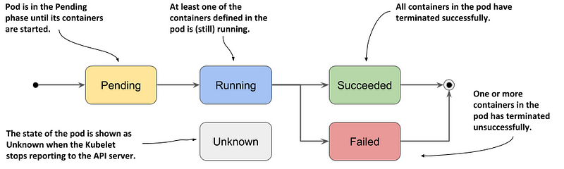
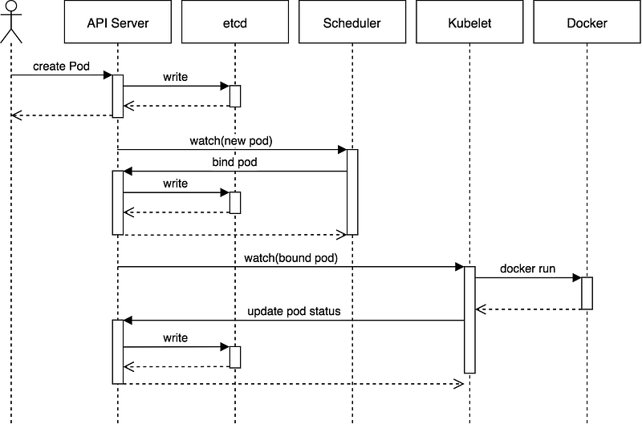

> **Key states of a Pod lifecycle**

## 📚 Introduction

The Pod lifecycle is crucial to managing containers in a Kubernetes environment. Understanding the pod lifecycle is important because it provides insight into the different stages that a pod goes through, from creation to termination, and the actions that are taken by the system at each stage.

This understanding is necessary to effectively manage containerized applications in a production environment.

## Understanding the pod's status

A Pod is a tiny universe of containers, housing your applications and breathing life into your cluster.

Understanding the different stages of the pod lifecycle is important for several reasons:

* **Visibility into the status of pods:** The pod lifecycle provides insight into the current state of a pod, whether it's pending, running, failed, or terminated.
* **Debugging and troubleshooting:** When a pod fails, it's important to understand what stage of the lifecycle it's in, and what caused the failure.
* **Resource management:** Knowing the different stages of the pod lifecycle can help in managing resources effectively. For example, if a pod is in the pending state, it means that it's waiting to be scheduled, and its resources are not being used.
* **Scheduling:** Understanding the pod lifecycle can help in scheduling pods effectively.

## States of a Pod

The pod's _status field_ is a [PodStatus](https://kubernetes.io/docs/reference/generated/kubernetes-api/v1.31/#podstatus-v1-core) object, which has a phase field.

Throughout its lifecycle, a Pod is likely to be present in any of the below-mentioned phases:

* **Pending:** After you create the Pod object, this is its initial phase. Until the pod is scheduled to a node and the images of its containers are pulled and started, it remains in this phase.
* **Running:** A Pod is said to be in the running phase when it's linked to a node, and all the containers are active.
* **Succeeded:** All Containers in the Pod have terminated in success, and will not be restarted
* **Failed:** All container(s) of the Pod have exited and at least one container has returned non-zero status.
* **Unknown:** When there is no clarity on where and what a Pod is doing, it is said to be present in an unknown phase.
* **CrashLoopBackoff:** The container fails to start and is tried again and again.

## Creation of a Pod

To help understand how this works, let's work through an example of how things get done in Kubernetes.

Now let's look at the events that lead to the creation of a Pod:

This sequence diagram illustrates the standard process for scheduling a Pod.

It depicts the infrequent scenario where the user directly creates a Pod. More commonly, the user creates an object such as a ReplicaSet, and it is the ReplicaSet that generates the Pod.

1. kubectl or any other API client submits the Pod spec to the API server.
2. The API server writes the Pod object to the etcd data store. Once the write is successful, an acknowledgment is sent back to the API server and the client.
3. The API server now reflects the change in the state of etcd.
4. In this case, the Kube-scheduler sees that a new Pod object is created on the API server but is not bound to any node.
5. kube-scheduler assigns a node to the pod and updates the API server.
6. This change is then propagated to the etcd data store. The API server also reflects this node assignment on its Pod object.
7. Kubelet on every node also runs watchers who keep watching API server. Kubelet on the destination node sees that a new Pod is assigned to it.
8. Kubelet starts the pod on its node by calling Docker and updates the container state back to the API server.
9. The API server persists the pod state into etcd.

## Container probes

Container probes are used in Kubernetes to monitor the health and status of containers in a pod.
These probes provide important information to the Kubernetes control plane, allowing it to make decisions about the state of containers and pods, and to ensure that they are running optimally.

The kubelet can optionally perform and react to three kinds of probes on running Containers:

* **Liveness probes:** Liveness probes are used to check if a container is running and healthy. If the liveness probe fails, the container is automatically restarted.
* **Readiness probes:** Readiness probes determine when a container is ready to start accepting traffic. This can be useful when a container needs time to start or finish a task before it can handle the traffic.
* **Startup probes:** Startup probes are used to check if a container has successfully started and is initialized. Unlike liveness and readiness probes, startup probes only run once, and only during container startup.

Each type of probe serves a different purpose and is used in different stages of a container's lifecycle.

## Final Thoughts

In a nutshell, the container lifecycle and creation process involves pulling an image from a registry, creating a new container instance from the image, and running it through several stages of initialization and operation. Startup probes are used to verify that the container has started successfully, while readiness probes determine when the container is ready to handle the traffic.

During operation, liveness probes are used to monitor the container's health and determine if a restart is necessary. These probes play a crucial role in ensuring the reliability and stability of containers.

 

**_Until next time, つづく 🎉_**

> 💡 Thank you for Reading !! 🙌🏻😁📃, see you in the next blog.🤘  _**Until next time 🎉**_

🚀 Thank you for sticking up till the end. If you have any questions/feedback regarding this blog feel free to connect with me:

**♻️ LinkedIn:** https://www.linkedin.com/in/rajhi-saif/

**♻️ X/Twitter:** https://x.com/rajhisaifeddine

**The end ✌🏻**

<h1 align="center">🔰 Keep Learning !! Keep Sharing !! 🔰</h1>

**📅 Stay updated**

Subscribe to our newsletter for more insights on AWS cloud computing and containers.
