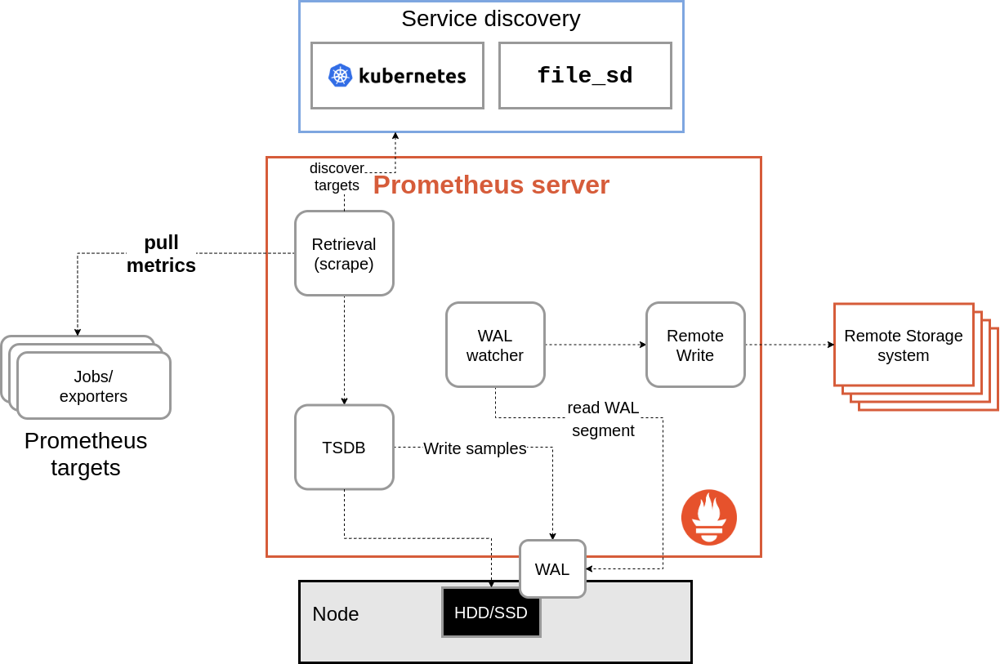

> **When Prometheus Can't Keep Up with the WAL 📈**

## 📗 Introduction

Have you ever had Prometheus crash due to an out-of-memory error while trying to catch up by reading the Write-Ahead Log (WAL)? It's a frustrating problem, but let's check it out.

Prometheus is great for monitoring, but when it restarts, it needs to process data from the Write-Ahead Log (WAL), which can be memory-intensive. This often leads to OOMKilled crashes, especially if Prometheus is already running close to its memory limits.

The issue usually stems from either collecting too much data or running too close to memory limits. This has been a long-standing concern, with [reports dating back to an open issue since 2020 on GitHub](https://github.com/prometheus/prometheus/issues/6934), highlighting the significant challenges faced by users in managing Prometheus' memory during WAL replay.

### ⁉️ The Problem

<br>

https://giphy.com/gifs/strangerthings-netflix-stranger-things-ka55CqnDNjQ7iIKtRa

While upgrading [the Helm chart of kube-prometheus-stack](https://github.com/prometheus-community/helm-charts/tree/main/charts/kube-prometheus-stack), we noticed several pods were not ready, including `prometheus-prometheus-operator-prometheus-0`, which showed a status of `3/4 Running` with a recent termination due to being OOMKilled.

The logs revealed the root cause:

```shell
ts=2024–06–14T09:49:10.383Z caller=head.go:840 level=info component=tsdb msg="Deletion of corrupted mmap chunk files failed, discarding chunk files completely" err="cannot handle error: iterate on on-disk chunks: out of sequence m-mapped chunk for series ref 946594555, last chunk: [1718071739971, 1718075459971], new: [1718049629971, 1718053199971]"
```

It seems like it's stuck in the running state, where the pod is not yet ready. Let's describe the pod to see what is wrong:

```shell
State:       Running
    Started:   Tue, 14 Jun 2024 10:04:03 +0200
Last State:  Terminated
    Reason:    OOMKilled
```

Ah, there it is. Prometheus is indeed running, but it got terminated due to an OOMKill — running out of memory. It seems Prometheus is in the midst of recovering from the Write Ahead Log (WAL), which might be causing the memory spike. This could stem from an error during recovery or a restart, where Prometheus doesn't have enough memory to write everything into the WAL.


One potential solution could be allocating more memory to Prometheus and analyzing why the WAL is getting clogged up. Essentially, we need to investigate what changed to suddenly cause this spike in memory usage in our once serene environment.

The issue persisted due to the WAL replay process requiring 2–3 times more memory than the running Prometheus instance. Despite running smoothly with around 30Gi of memory usage, the WAL replay process demanded over 50+Gi, ultimately leading to OOMKilled crashes during startup. Simply increasing the RAM limit wasn't a viable solution, as the excessive memory usage occurred specifically during the replay phase.

This problem aligns with a longstanding issue on GitHub since 2020, where users have consistently reported challenges managing Prometheus' memory during WAL replay. We encountered similar difficulties during our upgrade process, highlighting the critical need for resolution.

### 💡 Understanding Memory Overheads in WAL Replay

In the past, WAL replay often caused significant overhead, leading to unexpected out-of-memory (OOM) situations. For instance, if your Prometheus was already running at 70% of its memory limit and the overhead during replay surged by 300%, it could easily lead to crashes. Additionally, increased CPU usage during replay, especially in low CPU environments like Kubernetes, could slow down processes like garbage collection, resulting in slower memory release.

However, recent benchmarks of Prometheus versions at Google show a different picture. While there's been a noticeable 2x increase in CPU usage during replay, the memory overhead, including heap and working sets, is only around 1–5%. This raises the question: are the reported OOM issues symptoms of a larger problem, with the replay OOM merely surfacing it?

Currently, two prevalent scenarios appear:
1. **Excessive Data Collection**: If your Prometheus setup scrapes too many series or samples, it's prone to OOM crashes during replay, regardless of the memory overhead.
2. **Running Close to Memory Limits**: Even a slight overhead during replay can trigger OOM crashes if Prometheus is already running near its memory limit, such as at 95%.

These issues often revolve around cardinality — the combination of all label values per metric. High cardinality metrics, like those tracking multiple URLs or response codes, can quickly escalate memory usage. In short, much of Prometheus' memory woes can be attributed to cardinality.

### 🔄 How Does Remote Write Work?

The remote write reads data from Prometheus' [write ahead log](https://en.wikipedia.org/wiki/Write-ahead_logging).



Data generated by scrape is written to the WAL, so this essentially gives us a 2- to 3-hour buffer on disk of data for remote write. The RW system now has a subroutine that reads the WAL and passes the data back to remote write.

Remote write still has a small in-memory buffer, and the routine reading the WAL pauses where it is if it's not able to append new data to the buffer. This means we no longer drop data if the buffer is full, and the buffer doesn't need to be large enough to handle a longer outage.

As long as the remote endpoint isn't down for hours, remote write no longer loses data (with some caveats, like Prometheus restarts), since the WAL is truncated every two hours or so.

### 🛠️ Issue Resolutions

If you've never experienced this issue before (lucky you!), here's a handy solution I found effective. Since Prometheus may not be up and running to utilize PromQL for detecting potential issues, we need an alternative method to identify high cardinality. One approach is to get hands-on with some kubectl exec magic:

```sh
kubectl exec -it -n monitoring pods/prometheus-prometheus-kube-prometheus-prometheus-0 -- sh
```

Then, run the Prometheus TSDB analysis:

```sh
/prometheus $ promtool tsdb analyze .
```

This analysis will provide insights into metrics with high cardinality, like `haproxy_server_http_responses_total`, which might be causing memory issues. In such cases, updating or optimizing the problematic metric, such as haproxy, can alleviate memory strain.

Alternatively, consider increasing Prometheus' memory allocation or deploying it to a specific node group with ample memory resources.

Here are some additional strategies to mitigate memory overhead and OOM crashes:

- **Verify Memory Overhead**: Ensure that the memory overhead during replay is within acceptable limits (e.g., 10–15%). Running Prometheus close to its memory limit is risky due to dynamic garbage collection and limited room for unexpected cardinality spikes or queries.
- **Optimize Storage and Scraping**: Regularly optimize Prometheus' storage, scraping, and remote write configurations to reduce memory usage. Upgrading to newer releases can often provide optimizations in this regard.
- **Automate Recovery from OOM**: Implement auto-recovery mechanisms to handle OOM crash loops, such as automatically deleting the Write-Ahead Log (WAL) on OOM events. This ensures smoother recovery from memory-related issues.
- **Implement Scraping Limits**: Consider introducing forceful scrape limits to prevent Prometheus from scraping targets when memory usage exceeds a certain threshold. This proactive approach can help avoid memory-intensive situations and potential OOM crashes.

By implementing these strategies, you can effectively manage Prometheus' memory challenges and ensure smooth operation in your monitoring environment.

### 🔚 Conclusion

Dealing with Prometheus OOM errors during WAL replay can be challenging. By understanding the root causes, such as excessive data collection and high cardinality metrics, and implementing solutions like optimizing storage and scraping configurations, increasing memory allocations, and setting up auto-recovery mechanisms, you can mitigate these issues.

**Thank You 🖤**

<br>

**_Until next time, つづく 🎉_**

> 💡 Thank you for Reading !! 🙌🏻😁📃, see you in the next blog.🤘  **_Until next time 🎉_**

🚀 Thank you for sticking up till the end. If you have any questions/feedback regarding this blog feel free to connect with me:

**♻️ LinkedIn:** https://www.linkedin.com/in/rajhi-saif/

**♻️ X/Twitter:** https://x.com/rajhisaifeddine

**The end ✌🏻**

<h1 align="center">🔰 Keep Learning !! Keep Sharing !! 🔰</h1>

**📅 Stay updated**

Subscribe to our newsletter for more insights on AWS cloud computing and containers.
