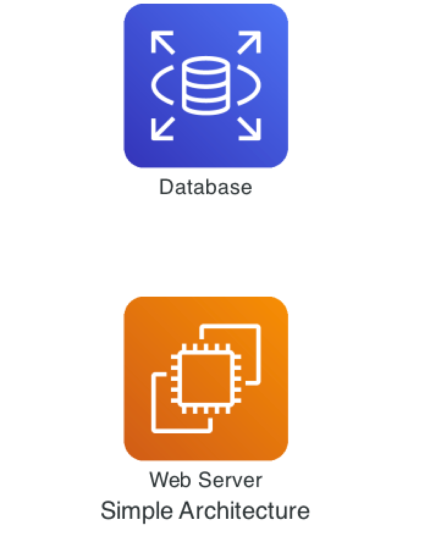
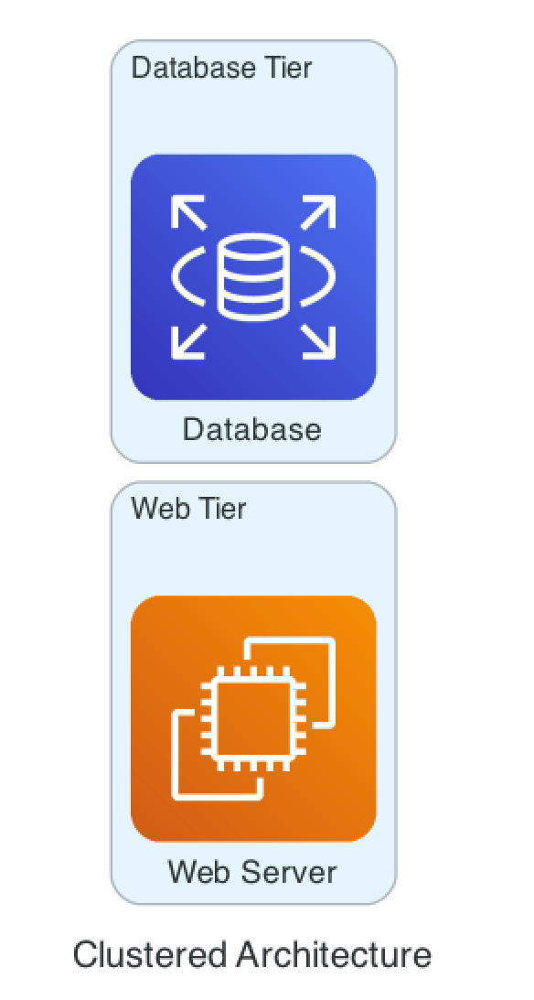
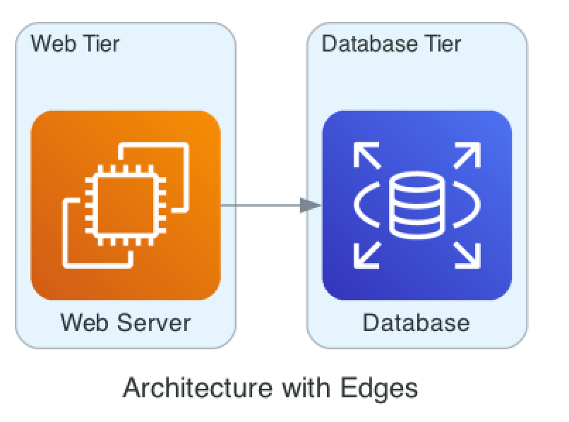
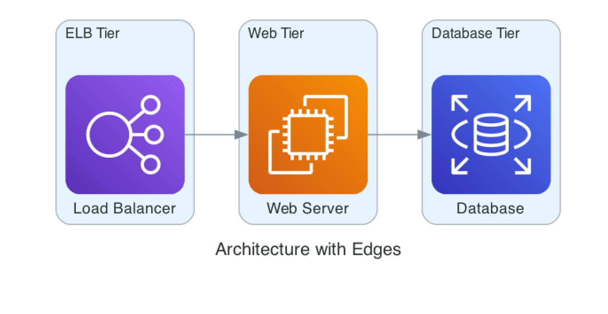
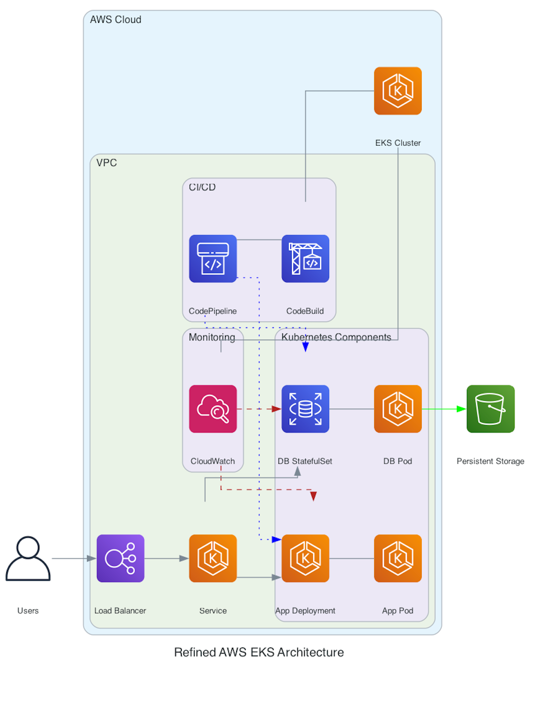

> **Using diagrams tool to visualize your architecture🔥**

## 📊 Introduction

In the software development ecosystem, clear and effective communication is key. One way to achieve this is through visual representations of software architecture.

> Traditionally, creating these diagrams has been a manual and time-consuming process. However, with the advent of **Diagram as Code (DaC)**, this task has become much simpler and more efficient.

Diagram as Code allows developers to create and maintain diagrams using code, making it easier to keep them up-to-date and consistent with the actual architecture.

One popular tool for this purpose is the [Diagrams tool](https://diagrams.mingrammer.com/). In this blog post, we will explore how the Diagrams tool can help you visualize your software architecture, making it easier to explain and communicate your technical solutions.

## 🤔 Why do we need Diagram as Code?

In software development, visualizing system architecture is important for clear communication and effective planning. Traditional methods of creating these diagrams can be time-consuming and prone to errors. Diagram as Code (DaC) addresses these issues by allowing developers to create and maintain diagrams using code. This approach ensures that diagrams are always up-to-date and accurately reflect the current state of the system.

- [Diagrams tool documentation](https://diagrams.mingrammer.com/docs/getting-started/installation)
- [GitHub repository for Diagrams tool](https://github.com/mingrammer/diagrams)
  
## How Diagram as Code Can Be Useful

The **Diagrams tool** is a great solution for implementing DaC. It allows you to draw cloud system architecture using Python code, making it ideal for prototyping new designs without the need for traditional design tools. You can also use it to describe or visualize existing architectures.

The tool supports major cloud providers like **AWS**, **Azure**, **GCP**, **Kubernetes**, **Alibaba Cloud**, and **Oracle Cloud**, as well as on-premise nodes, SaaS, and major programming frameworks and languages.

### 🛠️ Key Benefits of Using DaC

- **Version Control**: Track changes in architecture diagrams through version control systems, making it easier to manage and review changes over time.
- **Automation**: Many DaC tools can be scripted and integrated into build pipelines, enabling automatic generation of documentation. This automation saves time and reduces the risk of discrepancies between the documentation and the actual system.
- **Familiarity**: DaC leverages text-based tooling, which is familiar to most software developers. This familiarity makes it easier to adopt and integrate into existing workflows, enhancing productivity and collaboration within development teams.

### 🧰 Hands-on and Examples

Being able to codify diagrams is a huge asset and could probably save you and your team effort and time. To get started, all you need is the **Diagrams library**.

#### Prerequisites

- **Python 3.6 or higher**: Check your Python version first.
- **Graphviz**: It uses Graphviz to render the diagram, so you need to install Graphviz to use diagrams. 

#### Installation

- **macOS**:
  
```sh
brew install graphviz
```

- **Windows**:
  
```sh
choco install graphviz
```

After installing Graphviz (or if you already have it), install the diagrams library:

- **Using pip (pip3)**:
  
```sh
pip install diagrams
```

- **Using pipenv**:
  
```sh
pipenv install diagrams
```

- **Using poetry**:
  
```sh
poetry add diagrams
```

For more information, visit the [Diagrams tool documentation](https://diagrams.mingrammer.com/docs/getting-started/installation) and the [GitHub repository for Diagrams tool](https://github.com/mingrammer/diagrams).

## 🖼️ Nodes

Nodes represent individual components or services in your architecture. These can be anything from a database, a server, or an application. In the Diagrams tool, nodes are defined using specific classes that correspond to different types of services or components.

**Example:**

```python
from diagrams import Diagram
from diagrams.aws.compute import EC2
from diagrams.aws.database import RDS

with Diagram("Simple Architecture"):
    ec2_instance = EC2("Web Server")
    rds_instance = RDS("Database")
```

In this example, `EC2` and `RDS` are nodes representing an AWS EC2 instance and an AWS RDS database, respectively.

Run `python diagram.py` and it will generate the below diagram:



## 🗂️ Clusters

Clusters group related nodes together, making it easier to visualize and manage complex architectures. Clusters can represent different environments (e.g., development, staging, production) or different parts of a system (e.g., frontend, backend).

**Example:**

```python
from diagrams import Cluster, Diagram
from diagrams.aws.compute import EC2
from diagrams.aws.database import RDS

with Diagram("Clustered Architecture"):
    with Cluster("Web Tier"):
        web_server = EC2("Web Server")
    with Cluster("Database Tier"):
        db_server = RDS("Database")
```

Here, the Web Tier and Database Tier clusters group the web server and database server, respectively.

Run `python diagram.py` and it will generate the below diagram:



## 🔗 Edges

Edges represent the connections or relationships between nodes. They show how data flows between different components in your architecture. In the Diagrams tool, edges are automatically created when you connect nodes.

**Example:**

```python
from diagrams import Cluster, Diagram
from diagrams.aws.compute import EC2
from diagrams.aws.database import RDS

with Diagram("Architecture with Edges"):
    with Cluster("Web Tier"):
        web_server = EC2("Web Server")
    with Cluster("Database Tier"):
        db_server = RDS("Database")
    
    web_server >> db_server
```

In this example, the `>>` operator creates an edge between the web server and the database server, indicating a data flow from the web server to the database.

Run `python diagram.py` and it will generate the below diagram:



## 📈 Data Flow

Data Flow illustrates how data moves through the system, from one component to another. This is crucial for understanding the interactions and dependencies within your architecture.

**Example:**

```python
from diagrams import Cluster, Diagram
from diagrams.aws.compute import EC2
from diagrams.aws.database import RDS
from diagrams.aws.network import ELB

with Diagram("Architecture with Edges", show=False):
    with Cluster("Web Tier"):
        web_server = EC2("Web Server")
    with Cluster("Database Tier"):
        db_server = RDS("Database")
    with Cluster("ELB Tier"):
        load_balancer = ELB("Load Balancer")
    
    load_balancer >> web_server
    web_server >> db_server
```

In this example, data flows from the load balancer to the web server and then to the database server, showing the path data takes through the system.

Run `python diagram.py` and it will generate the below diagram:



## 🌀 Kubernetes Architecture

Creating a sophisticated Kubernetes architecture involves several components that work together to ensure scalability, reliability, and efficient management of containerized applications.

Below is an example of a detailed Kubernetes architecture using the Diagrams tool.

### Example:

```python
from diagrams import Diagram, Cluster, Edge
from diagrams.aws.compute import EKS
from diagrams.aws.network import ELB
from diagrams.aws.database import RDS
from diagrams.aws.storage import S3
from diagrams.aws.devtools import Codepipeline, Codebuild
from diagrams.aws.management import Cloudwatch
from diagrams.aws.security import IAMRole
from diagrams.aws.general import User

with Diagram("Refined AWS EKS Architecture", show=False):
    users = User("Users")

    with Cluster("AWS Cloud"):
        eks_cluster = EKS("EKS Cluster")
        
        with Cluster("VPC"):
            elb = ELB("Load Balancer")
            eks_service = EKS("Service")
            
            with Cluster("Kubernetes Components"):
                app_deploy = EKS("App Deployment")
                app_pod = EKS("App Pod")
                db_statefulset = RDS("DB StatefulSet")
                db_pod = EKS("DB Pod")
                app_deploy - app_pod
                db_statefulset - db_pod

            with Cluster("Monitoring"):
                cloudwatch = Cloudwatch("CloudWatch")
                cloudwatch - eks_cluster

            with Cluster("CI/CD"):
                codepipeline = Codepipeline("CodePipeline")
                codebuild = Codebuild("CodeBuild")
                codepipeline - codebuild
                codebuild - eks_cluster

    s3 = S3("Persistent Storage")

    users >> elb >> eks_service
    eks_service >> app_deploy
    eks_service >> db_statefulset
    cloudwatch >> Edge(color="firebrick", style="dashed") >> app_deploy
    cloudwatch >> Edge(color="firebrick", style="dashed") >> db_statefulset
    codepipeline >> Edge(color="blue", style="dotted") >> app_deploy
    codepipeline >> Edge(color="blue", style="dotted") >> db_statefulset
    db_pod >> Edge(color="green", style="solid") >> s3
```

Run `python diagram.py` and it will generate the below diagram:



## 🎨 Bonus: More Tools for Creating Diagrams

There are other tools available for creating diagrams, each with its own unique features and capabilities. Here are some of the most popular ones:

1. **Structurizr**  
    [Structurizr](https://www.structurizr.com/) is a collection of tooling to create software architecture diagrams based on the C4 model. It allows you to define your architecture models as code and visualize them in a clear and structured way.

2. **PlantUML**  
    [PlantUML](https://plantuml.com/) is another popular tool for creating UML diagrams from plain text descriptions. It supports various diagram types, including sequence diagrams, use case diagrams, and class diagrams.

3. **Mermaid**  
    [Mermaid](https://mermaid.js.org/) is a JavaScript-based diagramming and charting tool that renders Markdown-inspired text definitions to create diagrams and flowcharts. It's great for embedding diagrams in Markdown files.

4. **ASCII Editor**  
    [ASCII editors](https://asciiflow.com/#/) allow you to create simple diagrams using plain text. These are useful for quick sketches and can be easily included in code comments or documentation.

5. **Markmap**  
    [Markmap](https://markmap.js.org/) is a tool that converts Markdown files into interactive mind maps. It's useful for visualizing the structure of your Markdown documents.

6. **D2 Diagrams**  
    D2 is a diagram scripting language that turns text into diagrams. It stands for Declarative Diagramming. Declarative, as in, you describe what you want diagrammed, and it generates the image.

7. **SequenceDiagram**  
    [SequenceDiagram.org](https://sequencediagram.org/) is an online tool for creating sequence diagrams. It provides a simple interface for defining and visualizing sequence diagrams.

8. **Visio**  
    [Microsoft Visio](https://www.microsoft.com/en-ca/microsoft-365/visio/flowchart-software) is a well-known diagramming tool that offers a wide range of templates and shapes for creating professional diagrams. It's widely used in business and engineering environments.

9. **LucidChart**  
    [LucidChart](https://lucid.co/solutions/engineering) is a web-based diagramming tool that allows for real-time collaboration. It supports a variety of diagram types, including flowcharts, UML diagrams, and network diagrams.

10. **Draw.io**  
     [Draw.io](https://www.diagrams.net/) (now known as diagrams.net) is a free online diagramming tool that integrates with various cloud storage services. It's versatile and easy to use, making it a popular choice for many users.

11. **Cloudcraft**  
     [Cloudcraft](https://www.cloudcraft.co/) is a specialized tool for creating AWS architecture diagrams. It provides a drag-and-drop interface and integrates with AWS to visualize your cloud infrastructure.

12. **Archium**  
     Archium is a tool for creating architecture diagrams and documentation. It focuses on providing a clear and structured way to document your software architecture.

13. **Excalidraw**  
     [Excalidraw](https://excalidraw.com/) is an open-source virtual whiteboard tool that lets you create hand-drawn-like diagrams. It's great for brainstorming and sketching ideas quickly.

14. **CloudSkew**  
     [CloudSkew](https://www.cloudskew.com/) is an online diagramming tool for creating cloud architecture diagrams. It supports various cloud providers and offers a simple interface for designing your cloud infrastructure.

These tools offer a range of features to suit different needs, from simple text-based diagrams to complex, interactive visualizations. You can check a curated list of tools here: [Software Architecture Tools](https://softwarearchitecture.tools/).

For more information, visit the [Diagrams tool documentation](https://diagrams.mingrammer.com/docs/getting-started/installation) and the [GitHub repository for Diagrams tool](https://github.com/mingrammer/diagrams).

## 🔚 Closing Thoughts

Using Diagrams as Code simplifies software architecture by allowing developers to visualize and document their systems through code. This approach ensures that diagrams are always up-to-date with the codebase, enhances collaboration, and improves the clarity of complex architectures. Tools like PlantUML, Mermaid, and Structurizr facilitate this process, making it easier to maintain and communicate architectural designs.

**_Until next time, つづく 🎉 🇵🇸_**

<br><br>

> 💡 Thank you for Reading !! 🙌🏻😁📃, see you in the next blog.🤘  

🚀 Thank you for sticking up till the end. If you have any questions/feedback regarding this blog feel free to connect with me:

**♻️ LinkedIn:** https://www.linkedin.com/in/rajhi-saif/

**♻️ X/Twitter:** https://x.com/rajhisaifeddine

**The end ✌🏻**

<h1 align="center">🔰 Keep Learning !! Keep Sharing !! 🔰</h1>

  
**📅 Stay updated**

Subscribe to our newsletter for more insights on AWS cloud computing and containers.
