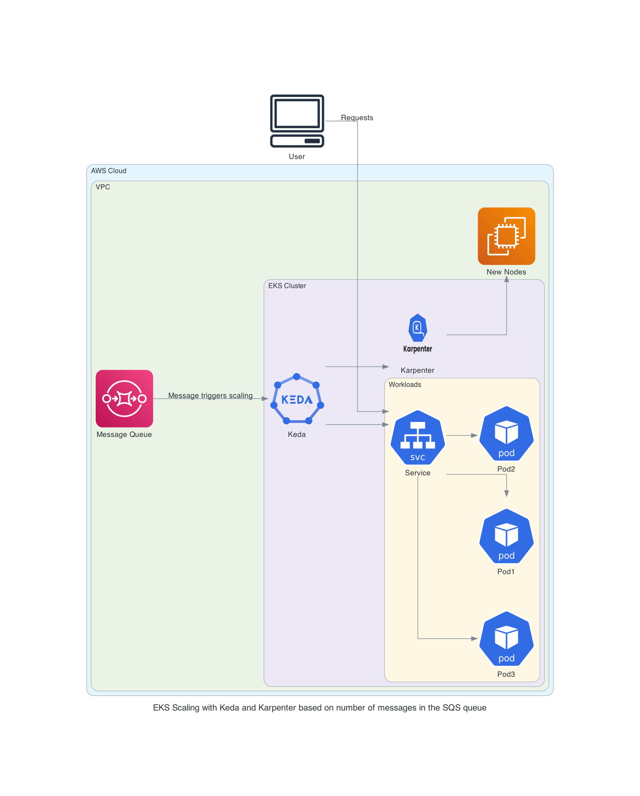

> **Use the power of Kubernetes for efficient and responsive application scaling.**

Nowadays, businesses need to handle large amounts of data and events efficiently. This is where event-driven workflows can help. By using Amazon Elastic Kubernetes Service (EKS), [KEDA](https://keda.sh/) (Kubernetes Event-Driven Autoscaling), and [Karpenter](https://karpenter.sh/), you can create a scalable and cost-effective solution for managing your workloads.

Amazon EKS provides a managed Kubernetes service, making it easier to run Kubernetes without needing to manage the control plane. KEDA helps in scaling your applications based on the number of events, ensuring that your resources are used efficiently. Karpenter, on the other hand, is an open-source Kubernetes cluster autoscaler that helps in optimizing the cost and performance of your workloads.

In this blog post, we will explore how to set up and run an event-driven workflow using these tools.

## Understanding KEDA

[KEDA](https://keda.sh/) is a Kubernetes-based autoscaler that dynamically adjusts the number of pods in your cluster based on the number of events needing to be processed. It is a lightweight, single-purpose component that integrates seamlessly with any Kubernetes cluster.

KEDA works alongside standard Kubernetes components like the [Horizontal Pod Autoscaler (HPA)](https://kubernetes.io/docs/tasks/run-application/horizontal-pod-autoscale/) without overwriting or duplicating their functionality.

KEDA provides multiple scalers that detect whether deployments should be active, scaled in, or scaled out. These scalers support various event sources, including AWS services like **SQS**, **CloudWatch**, and **DynamoDB**, as well as **GCP**, **Azure events**, and more.

By defining autoscaling policies through Custom Resource Definitions (CRDs), the KEDA operator manages the scaling of Kubernetes objects based on these policies. This ensures that your applications scale precisely according to the event load, optimizing resource usage and reducing costs.

## Exploring Karpenter

[Karpenter](https://karpenter.sh/) is a high-performance Kubernetes cluster autoscaler that dynamically provisions worker nodes to meet the resource demands of unscheduled pods.

Unlike traditional autoscalers, Karpenter uses a groupless architecture, allowing it to select the most appropriate instance types based on the specific needs of your workloads. It continuously evaluates the resource requirements of pending pods and other scheduling constraints, such as node selectors, affinities, and tolerations, to provision the ideal compute capacity.

Karpenter integrates directly with the Amazon EC2 fleet API, bypassing the need for nodes and EC2 auto scaling groups. This direct provisioning significantly reduces the time required to scale up or down, from minutes to milliseconds. Karpenter also allows you to set quotas on CPU and memory for your EKS cluster, ensuring you only pay for the resources you actually use.

By intercepting requests to Kubernetes admission controllers, Karpenter can dynamically adjust the number of nodes in your cluster, scaling up when demand increases and scaling down when there are excess resources. This flexibility helps maintain optimal performance and cost-efficiency for your Kubernetes workloads.

## Hands-On Walkthrough

This post is a proof-of-concept implementation that uses Kubernetes to execute code in response to events, such as API requests. The workflow is driven by KEDA, which scales Kubernetes pods based on incoming events like SQS messages. When KEDA scales out pods that remain in a pending state, Karpenter steps in, using provisioners to decide whether to scale out additional nodes.

By integrating KEDA and Karpenter with Amazon EKS, we can easily build event-driven workflows that orchestrate jobs running on Kubernetes with AWS services, such as Amazon SQS, with minimal code. All AWS resources, Kubernetes manifests, and Kubernetes add-ons are managed and installed using Terraform.

We will be bootstrapping the components with [EKS blueprints addons](https://github.com/aws-ia/terraform-aws-eks-blueprints-addons/tree/main).

### Architecture Overview

In this hands-on lab, we will explore an application deployment architecture that uses Kubernetes for container orchestration, AWS SQS for message queuing, KEDA for scaling pods, and Karpenter for scaling nodes.

Our architecture consists of the following components:

1. **Application Deployment:** The application is deployed in a Kubernetes cluster, running as a set of pods. These pods handle incoming requests and perform the necessary processing.
2. **AWS SQS:** Amazon Simple Queue Service (SQS) is used to queue messages that need to be processed by the application. This ensures that messages are handled asynchronously and can be processed as resources become available.
3. **KEDA:** Kubernetes Event-Driven Autoscaling (KEDA) is responsible for scaling the number of pods based on the number of messages in the SQS queue. When messages are posted to the SQS queue, KEDA scales up the pods to handle the increased load.
4. **Karpenter:** If the current cluster cannot handle the increased load even after scaling the pods, Karpenter comes into play. Karpenter is an open-source Kubernetes cluster autoscaler that creates additional nodes to accommodate the increased number of pods.



### Setup the Infrastructure

In order to create our infrastructure, we will use the [terraform-aws-eks-blueprints-addons](https://github.com/aws-ia/terraform-aws-eks-blueprints-addons) module.

Follow the steps to set up an Amazon EKS cluster, and Karpenter on the Amazon EKS cluster.

Clone the repository to your local machine using the following command:

```bash
git clone https://github.com/seifrajhi/eks-keda-karpenter-autoscaling.git
```

Navigate to the repository's directory:

```bash
cd eks-keda-karpenter-autoscaling/aws-blueprints-iac
```

Now, run the following commands to initialize, plan, and apply the Terraform configuration with automatic approval:

```bash
terraform init
terraform plan
terraform apply -auto-approve
```

This will create a VPC, EKS cluster, Karpenter, and Fargate profile, thanks to the `enable_karpenter` set to `true`.

Then provision the Karpenter `EC2NodeClass` and `NodePool` resources which provide Karpenter the necessary configurations to provision EC2 resources:

```bash
kubectl apply -f karpenter/karpenter.yaml
```

Once the Karpenter resources are in place, Karpenter will provision the necessary EC2 resources to satisfy any pending pods in the scheduler's queue.

### Deploy KEDA

We will use Helm to deploy KEDA. Run the below commands to get the values file:

```bash
helm repo add kedacore https://kedacore.github.io/charts 
helm repo update
helm show values kedacore/keda > values.yaml
```

Before installing the release, we need to update the values. Here is what you need to add:

```yaml
serviceAccount:
    annotations: 
        eks.amazonaws.com/role-arn: <POD_ROLE_ARN>
```

Now to deploy KEDA, you need to run:

```bash
helm install keda kedacore/keda --values values.yaml --namespace keda
```

## KEDA and Karpenter Autoscaling in Action

With KEDA, we are going to scale the deployment replicas to zero by using an empty AWS SQS queue. Then, we will feed that queue to scale up and down the number of replicas.

```bash
kubectl create ns keda-karpenter-scaling
kubectl config set-context --current --namespace=keda
kubectl create deployment nginx-deployment --image nginx --replicas=2 --requests=cpu=1,memory=3Gi
```

Running these commands will deploy 2 pods with 1 vCPU and 3 GiB of memory each, requiring one node per pod. Karpenter should create two nodes. If you set 3 replicas, based on the current provisioner configuration, Karpenter will create 2 nodes and leave one pod pending.

To create an SQS queue, run:

```bash
aws sqs create-queue --queue-name keda-karpenter-scaling
```

Once the queue is created, deploy the KEDA scaled object and the trigger authentication:

```yaml
cat <<EOF | kubectl create -f -
apiVersion: keda.sh/v1alpha1 
kind: ScaledObject 
metadata: 
    name: aws-sqs-queue-scaledobject 
    namespace: keda
spec: 
    scaleTargetRef: 
        name: nginx-deployment 
        minReplicaCount: 0  # We don't want pods if the queue is empty 
        maxReplicaCount: 2  # We don't want more than 2 replicas 
        pollingInterval: 10 # Frequency for metrics (in seconds) 
        cooldownPeriod: 25  # Wait time for downscale (in seconds) 
triggers: 
    - type: aws-sqs-queue 
        authenticationRef: 
            name: keda-aws-credentials 
        metadata: 
            queueURL: https://sqs.eu-west-1.amazonaws.com/$AWS_ACCOUNT_ID/keda-karpenter-scaling
            queueLength: "1" 
            awsRegion: "eu-west-1" 
            identityOwner: operator
---
apiVersion: keda.sh/v1alpha1 
kind: TriggerAuthentication 
metadata: 
    name: keda-aws-credentials 
    namespace: keda
spec: 
    podIdentity: 
        provider: aws-eks
EOF
```

After deploying the KEDA configuration, since the queue is empty, the nginx deployment should scale down to 0 because the minReplicaCount is set to 0.

With two nodes without any resources running, Karpenter will downscale the number of nodes from 2 to 0.

The queue length is set to 1, meaning that with (n) messages, we'll have (n) pods, but (n) will be less than maxReplicaCount. For example, with 2 messages in the queue, we'll have 2 pods. With 3 messages in the queue, we'll still have 2 pods due to the Karpenter quota.

If the queueLength is set to 2, with 1 or 2 messages in the queue, we'll have 1 pod, and with 3–4 or more messages, we'll have 2 pods because the maxReplicaCount is still set to 2. To test this, you can send messages using:

```bash
for i in 1..2
do
    aws sqs send-message \
    --queue-url $(aws sqs get-queue-url --queue-name keda-karpenter-scaling) \
    --message-body "Keda and Karpenter demo"
done
```

This should trigger the KEDA scaled object and create two pods. These two pods will be pending due to the lack of space in the cluster. Karpenter will detect these pending pods, create two nodes, and schedule the pods on the new nodes.

## 🔚 Conclusion

In this post, we showed how using KEDA and Karpenter on Amazon EKS makes running event-driven workloads easier and more efficient. KEDA scales your applications based on events, while Karpenter quickly adds the necessary nodes. This combination ensures your system is responsive and cost-effective.

By integrating these tools with Kubernetes, EKS, AWS, and SQS, you can manage your workloads better, optimize resources, and improve performance. This setup helps businesses handle event-driven tasks smoothly and efficiently.

The end ✌🏻

## References

- [Run a scalable event-driven workflow with Amazon EKS, KEDA, and Karpenter](https://medium.com/@ledevedeccorentin/run-a-scalable-event-driven-workflow-with-amazon-eks-keda-and-karpenter-558fce1766ec)
- [Scalable and cost-effective event-driven workloads with KEDA and Karpenter on Amazon EKS](https://aws.amazon.com/fr/blogs/containers/scalable-and-cost-effective-event-driven-workloads-with-keda-and-karpenter-on-amazon-eks/)
- [Run event-driven workflows with Amazon EKS Blueprints, KEDA, and Karpenter](https://blog.devgenius.io/run-event-driven-workflows-with-amazon-eks-blueprints-keda-and-karpenter-80e325426b4a)
- [KEDA Documentation](https://keda.sh/docs/2.14/concepts/scaling-deployments/)
- [Terraform AWS EKS Blueprints](https://aws-ia.github.io/terraform-aws-eks-blueprints/)
- [Terraform AWS EKS Blueprints Addons](https://aws-ia.github.io/terraform-aws-eks-blueprints-addons/main/)

<br>

**_Until next time, つづく 🎉_**

> 💡 Thank you for Reading !! 🙌🏻😁📃, see you in the next blog.🤘  **_Until next time 🎉_**

🚀 Thank you for sticking up till the end. If you have any questions/feedback regarding this blog feel free to connect with me:

**♻️ LinkedIn:** https://www.linkedin.com/in/rajhi-saif/

**♻️ X/Twitter:** https://x.com/rajhisaifeddine

**The end ✌🏻**

<h1 align="center">🔰 Keep Learning !! Keep Sharing !! 🔰</h1>

**📅 Stay updated**

Subscribe to our newsletter for more insights on AWS cloud computing and containers.
