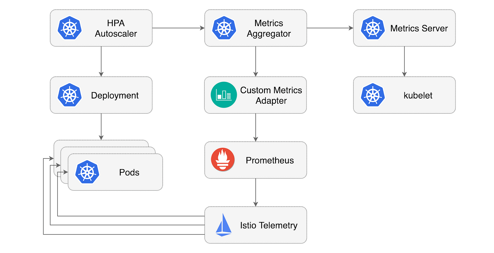

> **Autoscaling for Istio-Powered Kubernetes Applications**

## 📚 Introduction

The need for effective autoscaling is very important in Kubernetes. The [Kubernetes Horizontal Pod Autoscaler (HPA)](https://kubernetes.io/docs/tasks/run-application/horizontal-pod-autoscale/) is a great tool that allows you to automatically scale your application deployments based on various metrics.

But what if you're using [Istio](https://istio.io/), the popular service mesh for Kubernetes? Can you leverage Istio's rich set of metrics to drive your autoscaling decisions?

The answer is yes 🎉, and in this blog post, we'll explore how to configure the HPA to scale your workloads based on Istio metrics.

## 🚀 Istio and Service Mesh

[Istio](https://istio.io/) is a popular open-source service mesh framework that provides a comprehensive solution for managing, securing, and observing microservices-based applications running on Kubernetes. At its core, Istio acts as a transparent layer that intercepts all network traffic between services, allowing it to apply various policies and perform advanced traffic management tasks.

One of Istio's key capabilities is its rich telemetry and observability features. Istio automatically collects a wide range of metrics, logs, and traces for all the traffic flowing through the service mesh.

This telemetry data can be used for various purposes, including monitoring the health and performance of individual services, identifying performance bottlenecks, and troubleshooting issues.

## 📈 Horizontal Pod Autoscaler (HPA)

The [Kubernetes Horizontal Pod Autoscaler (HPA)](https://kubernetes.io/docs/tasks/run-application/horizontal-pod-autoscale/) is a built-in feature that automatically scales the number of pods in a deployment or replica set based on observed CPU utilization or other custom metrics. The HPA periodically checks the target metric, and if the value exceeds or falls below the specified thresholds, it will scale the number of pods up or down accordingly.

When running Istio-powered applications on Kubernetes, the HPA can be configured to scale based on the rich metrics provided by Istio. For example, the HPA can monitor the incoming HTTP traffic to a service and scale the number of pods to handle the load.

This allows for dynamic and efficient scaling of Istio-based microservices, ensuring that the application can handle fluctuations in traffic without over-provisioning resources.

## 📊 Istio Metrics and the HPA

To integrate autoscaling into an Istio-powered Kubernetes application, you need to configure the Kubernetes Horizontal Pod Autoscaler (HPA) to monitor the metrics provided by Istio.

Istio generates detailed metrics about the application's traffic, which can then be used as the basis for scaling decisions. One solution for using Istio metrics with the HPA is the [Kube Metrics Adapter](https://github.com/zalando-incubator/kube-metrics-adapter), a general-purpose metrics adapter developed by Zalando.

The Kube Metrics Adapter can collect and serve custom and external metrics, including Prometheus metrics generated by Istio, for the HPA to use. The Kube Metrics Adapter works by discovering HPA resources in the cluster and then collecting the requested metrics, storing them in memory. It supports configuring the metric collection via annotations on the HPA object.

This allows you to specify the Prometheus queries to use for retrieving the relevant Istio metrics, such as requests per second. Istio's built-in monitoring capabilities are a key advantage of using a service mesh. Istio automatically collects valuable metrics like HTTP request rates, response status codes, and request durations directly from the Envoy sidecar proxies, without requiring any changes to your application code.

This rich telemetry data provides deep visibility into your microservices' performance and behavior. Beyond monitoring, these Istio-generated metrics can be leveraged to drive advanced operational capabilities, such as autoscaling and canary deployments, without additional instrumentation.

I found a very clear diagram in a [Medium article by Stefan Prodan](https://medium.com/google-cloud/kubernetes-autoscaling-with-istio-metrics-76442253a45a):


<div class="image-title"><a href="https://medium.com/google-cloud/kubernetes-autoscaling-with-istio-metrics-76442253a45a">source</a></div>

## ⚙️ Configuring HPA with Istio Metrics

To configure the Kubernetes Horizontal Pod Autoscaler (HPA) to use metrics provided by Istio, follow these steps:

1. **Enable Telemetry and Prometheus**: Ensure that when installing Istio, the telemetry service and Prometheus are both enabled.
2. **Install Metrics Adapter**: You'll need a metrics adapter that can query Prometheus and make the Istio metrics available to the HPA. One such adapter is the [Kube Metrics Adapter](https://github.com/zalando-incubator/kube-metrics-adapter), developed by Zalando.
3. **Adapter Functionality**: The Kube Metrics Adapter scans the HPA objects in your cluster, executes the specified Prometheus queries (configured via annotations), and stores the metrics in memory. This allows the HPA to use the rich telemetry data provided by Istio, such as HTTP request rates, as the basis for scaling your application's pods up or down as needed.

### 🛠️ Installing the Custom Metrics Adapter

For our solution, we will need [telemetry to be enabled in Istio](https://github.com/istio/istio/blob/master/manifests/charts/istio-control/istio-discovery/values.yaml#L167) and Prometheus to scrape metrics from Istio:

```shell
helm repo add prometheus-community https://prometheus-community.github.io/helm-charts
helm repo add stable https://kubernetes-charts.storage.googleapis.com/
helm repo update
helm -n monitoring install prometheus prometheus-community/prometheus
```

It is the default Helm chart for the Prometheus installation. We use this one because Istio has a default configuration to expose metrics for it, i.e., the pod has [the following annotations](https://github.com/istio/istio/blob/master/manifests/charts/istio-control/istio-discovery/files/waypoint.yaml#L56):

```yaml
prometheus.io/path: /stats/prometheus
prometheus.io/port: 15020
prometheus.io/scrape: true
```

Simply having Prometheus installed in your Kubernetes cluster does not automatically make its metrics available for use with the Horizontal Pod Autoscaler (HPA). To leverage Istio's metrics for autoscaling, you'll need to set up the Prometheus Adapter. The Prometheus Adapter is a component that translates Prometheus metrics into a format that the HPA can understand and use. You'll need to provide a custom configuration file, `prometheus-adapter.yaml`, with the following settings:

```yaml
prometheus:
  url: http://prometheus-server.monitoring.svc.cluster.local
  port: 80
rules:
  custom:
  - seriesQuery: 'istio_requests_total{kubernetes_namespace!="",kubernetes_pod_name!=""}'
    resources:
      overrides:
        kubernetes_namespace: {resource: "namespace"}
        kubernetes_pod_name: {resource: "pod"}
    name:
      matches: "^(.*)_total"
      as: "${1}_per_second"
    metricsQuery: 'sum(rate(<<.Series>>{<<.LabelMatchers>>}[2m]))'
```

This configuration tells the Prometheus Adapter to:

- Connect to the Prometheus server running in the monitoring namespace.
- Query the `istio_requests_total` metric, which provides the total number of requests.
- Convert the metric to a rate (requests per second) using a 2-minute window.
- Expose the metric with a name like `istio_requests_per_second`.

With the Prometheus Adapter configured and deployed, the HPA will now be able to use the Istio-generated metrics to scale your application's pods as needed. Here, we can see our Prometheus instance URL, port, and one custom rule. Let's focus on this rule:

- **seriesQuery**: Needed for metric discovery.
- **resources/overrides**: Mapping fields from the metric (`kubernetes_namespace`, `kubernetes_pod_name`) to the names required by Kubernetes (`namespace`, `pod`).
- **name/matches, name/as**: Needed to change the metric name. We are transforming this metric, so it is good to change the name `istio_requests_total` to `istio_requests_per_second`.
- **metricsQuery**: The actual query (which is actually a query template) and it will be run by the adapter while scraping the metric from Prometheus. `rate` and `[2m]` "calculates the per-second average rate of increase of the time series in the range vector" (from Prometheus documentation), here it is the per-second rate of HTTP requests as measured over the last 2 minutes, per time series in the range vector (also, almost from the Prometheus documentation).

Now, as we have the adapter configuration, we can deploy it using:

```shell
helm -n monitoring install prometheus-adapter prometheus-community/prometheus-adapter -f prometheus-adapter.yaml
```

### 🧪 Installing the Test App

You will use [podinfo](https://github.com/stefanprodan/podinfo) to test the HPA.

First, create a test namespace with Istio sidecar injection enabled:

```shell
kubectl apply -f ./demo-app/test.yaml
```

Create the deployment and ClusterIP service in the test namespace:

```shell
kubectl apply -f ./demo-app/deployment.yaml,./demo-app/service.yaml
```

In order to trigger the autoscaling, you'll need a tool to generate traffic. Deploy the load test service in the test namespace:

```shell
kubectl apply -f ./loadtest/
```

Verify the install by calling the app API. Exec into the load tester pod and use `hey` to generate load for a couple of seconds:

```shell
export loadtester=$(kubectl -n test get pod -l "app=loadtester" -o jsonpath='{.items[0].metadata.name}')
kubectl -n test exec -it ${loadtester} -- sh

$ hey -z 5s -c 10 -q 2 http://podinfo.test:9898

Summary:
  Total:	5.0138 secs
  Requests/sec:	19.9451

Status code distribution:
  [200]	100 responses
$ exit
```

The app ClusterIP service exposes port 9898 under the `http` name. When using the `http` prefix, the Envoy sidecar will switch to L7 routing and the telemetry service will collect HTTP metrics.

### Querying the Istio metrics

The Istio telemetry service collects metrics from the mesh and stores them in Prometheus. One such metric is istio_requests_total, with it you can determine the rate of requests per second a workload receives.
This is how you can query Prometheus for the req/sec rate received by podinfo in the last minute, excluding 404s:

```yaml
sum(
    rate(
      istio_requests_total{
        destination_workload="podinfo",
        destination_workload_namespace="test",
        reporter="destination",
        response_code!="404"
      }[1m]
    )
  )
```

The HPA needs to know the req/sec that each pod receives. You can use the container memory usage metric from kubelet to count the number of pods and calculate the Istio request rate per pod:

```yaml
sum(
    rate(
      istio_requests_total{
        destination_workload="podinfo",
        destination_workload_namespace="test"
      }[1m]
    )
  ) /
  count(
    count(
      container_memory_usage_bytes{
        namespace="test",
        pod=~"podinfo.*"
      }
    ) by (pod)
  )
```

### Configuring the HPA with Istio metrics

Using the req/sec query you can define a HPA that will scale the podinfo workload based on the number of requests per second that each instance receives:

```yaml
apiVersion: autoscaling/v2
kind: HorizontalPodAutoscaler
metadata:
  name: podinfo
  namespace: test
  annotations:
    metric-config.object.istio-requests-total.prometheus/per-replica: "true"
    metric-config.object.istio-requests-total.prometheus/query: |
      sum(
        rate(
          istio_requests_total{
            destination_workload="podinfo",
            destination_workload_namespace="test"
          }[1m]
        )
      ) /
      count(
        count(
          container_memory_usage_bytes{
            namespace="test",
            pod=~"podinfo.*"
          }
        ) by (pod)
      )
spec:
  maxReplicas: 10
  minReplicas: 1
  scaleTargetRef:
    apiVersion: apps/v1
    kind: Deployment
    name: podinfo
  metrics:
    - type: Object
      object:
        metricName: istio-requests-total
        target:
          apiVersion: v1
          kind: Pod
          name: podinfo
        targetValue: 10
```

The above configuration will instruct the Horizontal Pod Autoscaler to scale up the deployment when the average traffic load goes over 10 req/sec per replica.

Create the HPA with:

```shell
kubectl apply -f ./demo-app/hpa.yaml
```

Start a load test and verify that the adapter computes the metric:

```shell
kubectl -n kube-system logs deployment/kube-metrics-adapter -f
Collected 1 new metric(s)
Collected new custom metric 'istio-requests-total' (44m) for Pod test/podinfo
```

List the custom metrics resources:

```shell
kubectl get --raw "/apis/custom.metrics.k8s.io/v1beta1" | jq .
The Kubernetes API should return a resource list containing the Istio metric:
{
  "kind": "APIResourceList",
  "apiVersion": "v1",
  "groupVersion": "custom.metrics.k8s.io/v1beta1",
  "resources": [
    {
      "name": "pods/istio-requests-total",
      "singularName": "",
      "namespaced": true,
      "kind": "MetricValueList",
      "verbs": [
        "get"
      ]
    }
  ]
}
```

After a couple of seconds the HPA will fetch the metric from the adapter:

```shell
kubectl -n test get hpa/podinfo
NAME      REFERENCE            TARGETS   MINPODS   MAXPODS   REPLICAS
podinfo   Deployment/podinfo   44m/10    1         10        1
```

### Autoscaling Based on HTTP Traffic

To test the HPA, you can use the load tester to trigger a scale-up event. You can use other tools besides `hey` (e.g., `siege`). It is important that the tool supports HTTP/1.1, so `ab` (Apache Benchmark) is not the right solution.

Exec into the tester pod and use `hey` to generate load for 5 minutes:

```shell
kubectl -n test exec -it ${loadtester} -- sh
$ hey -z 5m -c 10 -q 2 http://podinfo.test:9898
```

Press `Ctrl+C` then `exit` to get out of the load test terminal if you want to stop prematurely. After a minute, the HPA will start to scale up the workload until the requests per second per pod drop under the target value:

```shell
watch kubectl -n test get hpa/podinfo
NAME      REFERENCE            TARGETS     MINPODS   MAXPODS   REPLICAS
podinfo   Deployment/podinfo   25272m/10   1         10        3
```

When the load test finishes, the number of requests per second will drop to zero, and the HPA will start to scale down the workload. Note that the HPA has a back-off mechanism that prevents rapid scale-up/down events; the number of replicas will go back to one after a couple of minutes.

By default, the metrics sync happens once every 30 seconds, and scaling up/down can only happen if there was no rescaling within the last 3–5 minutes.

In this way, the HPA prevents rapid execution of conflicting decisions and gives time for the [Cluster Autoscaler](https://github.com/kubernetes/autoscaler) to kick in.

## 📋 Summary

In this article, we explored the Kubernetes Horizontal Pod Autoscaler (HPA) using Custom Metrics. We set up the Prometheus Adapter to expose Istio metrics to Kubernetes' Custom Metrics API. However, the workload we tested did not respond effectively to the configured HPA parameters. A less erratic workload should exhibit more predictable behavior with the HPA settings.


<br>

**_Until next time, つづく 🎉_**

> 💡 Thank you for Reading !! 🙌🏻😁📃, see you in the next blog.🤘  **_Until next time 🎉_**

🚀 Thank you for sticking up till the end. If you have any questions/feedback regarding this blog feel free to connect with me:

**♻️ LinkedIn:** https://www.linkedin.com/in/rajhi-saif/

**♻️ X/Twitter:** https://x.com/rajhisaifeddine

**The end ✌🏻**

<h1 align="center">🔰 Keep Learning !! Keep Sharing !! 🔰</h1>

**📅 Stay updated**

Subscribe to our newsletter for more insights on AWS cloud computing and containers.
