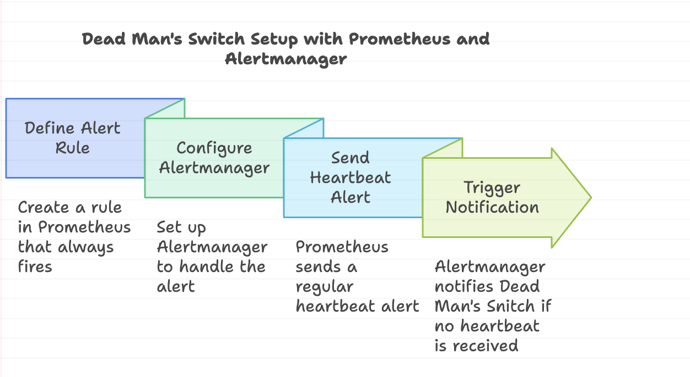
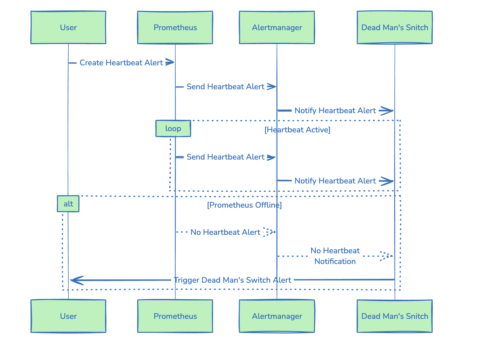
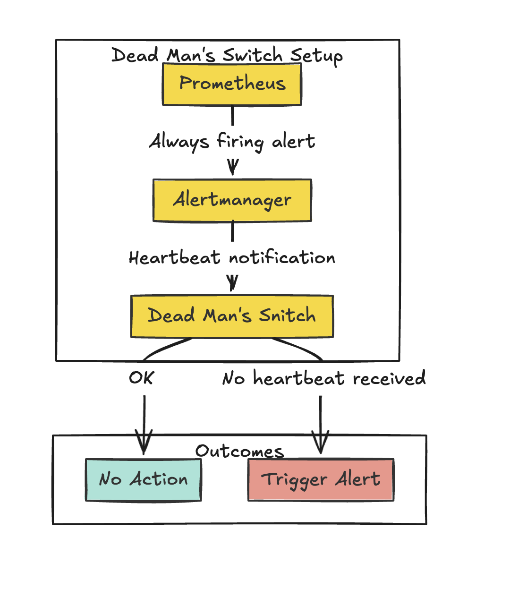
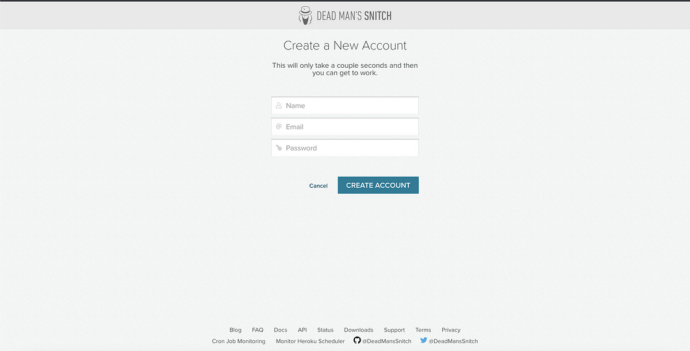
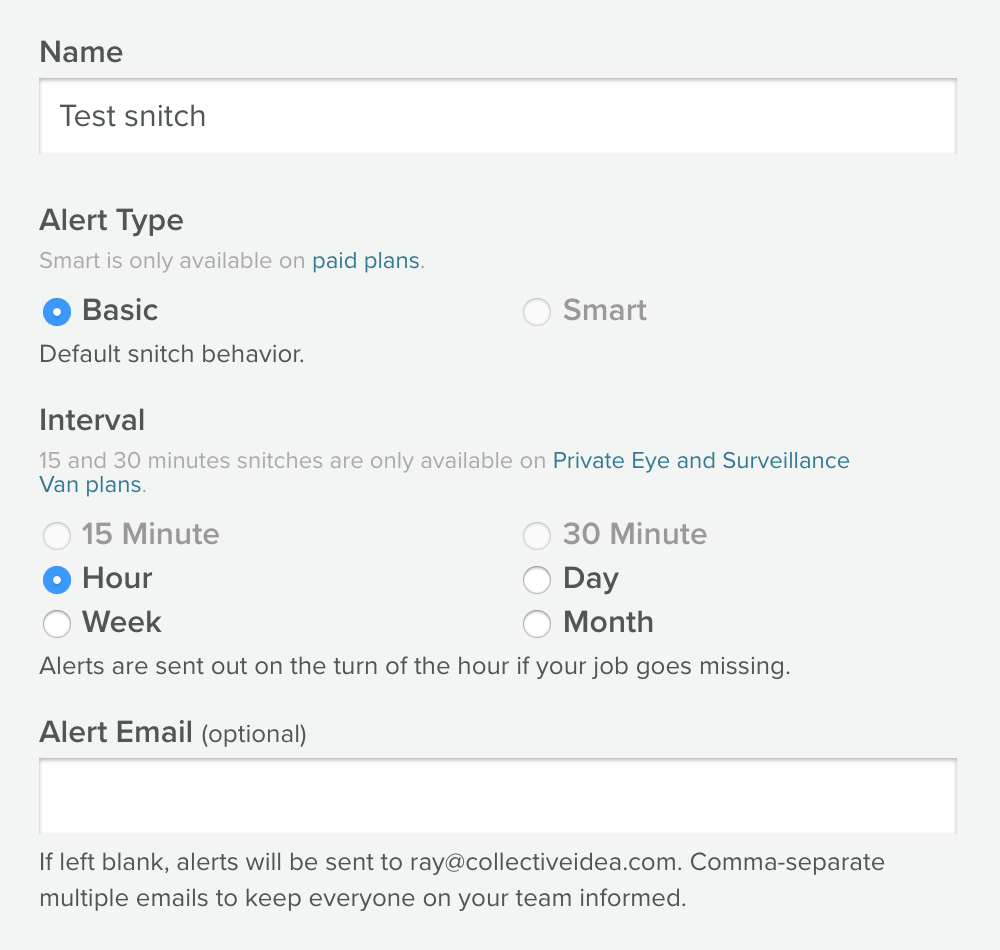
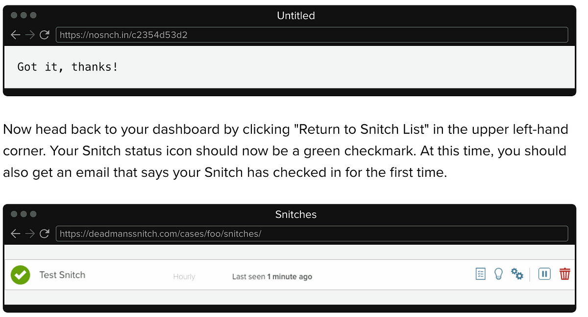
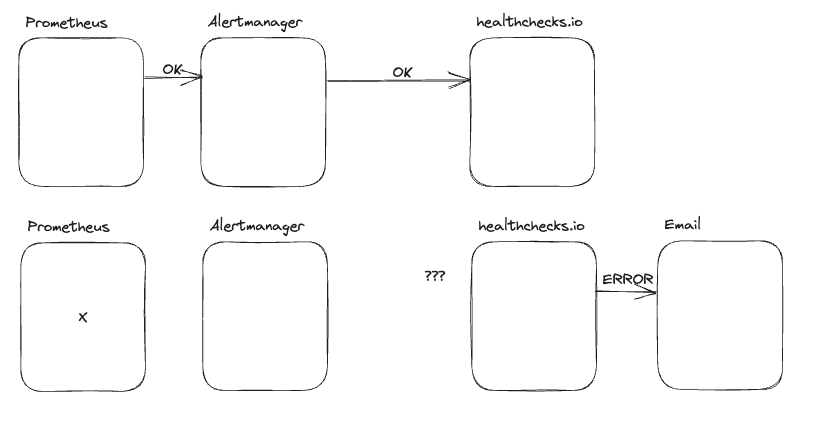

> **Who Watches the Watchers and the Monitoring Stack? 👮**

## 💬 Introduction

Nowadays, monitoring systems play an important role in ensuring the smooth operation of critical infrastructure.

However, what happens when the monitoring system itself falters? This is where the concept of a [dead man switch](https://deadmanssnitch.com/) comes into play.

A dead man switch, in the context of monitoring, serves as an independent watchdog, tasked with keeping an eye on the monitoring system. If the monitoring system fails to provide [regular heartbeats](https://en.wikipedia.org/wiki/Heartbeat_(computing)) to the dead man switch, it triggers an alarm, alerting operators to a potential problem.

## 🥅 Objectives

This blog post is a deep dive into the implementation of a dead man switch for [Prometheus](https://prometheus.io/), a widely used monitoring tool. We'll explore the tools and techniques involved in setting up this guardian of the guardians, ensuring that our monitoring system remains vigilant and reliable.

By the end of this post, you'll have a clear understanding of how a dead man switch can safeguard your monitoring system and prevent blind spots in your infrastructure.


## 📘 Dead Man's Switch

A monitoring system can be very simple, like a ping to a server IP, or it can be as complex as monitoring every component in a distributed system to ensure everything is working as expected. No matter how sophisticated the monitoring system is, we rely on them to ensure that our main system is in a healthy state. But what happens when your monitoring system fails? How do you know that your monitoring system is healthy?

A frequent question I get asked when working with our DevOps teams is:

> **Who is monitoring the monitoring system to make sure it's working?**



We can borrow a concept from the physical engineering world: the [dead man's switch](https://en.wikipedia.org/wiki/Dead_man's_switch).

The idea revolves around ensuring that we can receive a signal to trigger an alarm at any unpredictable moment. To achieve this, we can flip the logic: instead of relying on a signal to activate the alarm, we can set it up so that the alarm goes off when we **do not** receive a signal. This approach is quite straightforward! This principle, often referred to as a [«heartbeat»](https://en.wikipedia.org/wiki/Heartbeat_(computing)), is used in various applications, including clustering, and is also employed in military contexts.

In this scenario, if the operator (like Prometheus) goes offline or malfunctions, it will stop sending its "OK" response, which will then trigger an alert.



## 🏗 Why Do We Need It

Your monitoring solution is your bread and butter for knowing when you have issues with your infrastructure. But what happens if it has issues? Unless you are monitoring your system health dashboards 24/7, you will want to have some notification configured to let you know if your monitoring solution itself is experiencing issues.

To do this, we'll want to create a rule that always triggers in Prometheus (think if `False == True`).

### Integrations

Integrations help bring alerts from Dead Man's Snitch into the systems and services your team uses.

Supported Integrations:

* [Microsoft Teams](https://deadmanssnitch.com/docs/integrations/teams)
* [Opsgenie](https://deadmanssnitch.com/docs/integrations/opsgenie)
* [PagerDuty](https://deadmanssnitch.com/docs/integrations/pagerduty)
* [Slack](https://deadmanssnitch.com/docs/integrations/slack)
* [VictorOps](https://deadmanssnitch.com/docs/integrations/victor-ops)
* [Webhooks](https://deadmanssnitch.com/docs/integrations/webhooks)

## Hands-On

To transform the concept of a dead man's switch into the Prometheus world, we need to:

1. **Create a Prometheus alert** that will fire regularly, like the train conductor pushing the button.
2. **Configure the Alertmanager** to send to another system outside our primary monitoring system.
3. **Set up the outside system** to take care of the alert and notify us if it doesn't receive the alert.

In the following sections, we will go through each of these steps in detail.



### Setting Up the Dead Man's Switch

I will use the following services and tools:
- [kube-prometheus-stack Helm chart](https://github.com/prometheus-community/helm-charts/tree/main/charts/kube-prometheus-stack) to deploy Prometheus and Alertmanager.
- [Dead Man's Snitch](https://deadmanssnitch.com/) to send the alerts to.
- A Kubernetes cluster to deploy onto. I will use Docker Desktop for Mac to deploy the services, but you can use any Kubernetes cluster you want.

#### Sign Up for Dead Man's Snitch

Dead Man's Snitch is a monitoring tool for cron, [Heroku Scheduler](https://addons.heroku.com/scheduler), or any periodic process. Dead Man's Snitch will notify you when your scheduled tasks don't run so you can investigate before it becomes a problem.



A Snitch looks like this:

```shell
$ curl https://nosnch.in/c2354d53d2
```

It's a unique URL we create for you to add to jobs you want to be monitored. If you want to add a Snitch to your backup cron job, it would look something like this:

To create a snitch:

1. Log in and click "Create Your First Snitch".
2. Give your Snitch a name (Nightly Backup, Data Import, Monthly Invoice, etc.).
3. Choose an interval. This is based on how often your task runs. If you have an hourly task, then choose hourly. If you have a task that runs every six hours, round up to Daily.
4. Type in an email address that you would like to be alerted at should your task fail. If you leave this space blank, your Snitch alerts will be sent to the email you used to sign up with. Click "Save".

The next page displays your unique Snitch URL in the blue box followed by examples of how your Snitch can be used. For each Snitch you create, a new URL will be created. Simply curl the unique Snitch URL after your task (as shown in the examples).

To tell your Snitch to start checking, hit the URL. You can manually hit the URL by pasting your Snitch URL into a browser window and hitting return. Refresh the page. The box next to your Snitch should be green.

That's it! If your process fails to run, Dead Man's Snitch will email you.



The next page displays your unique Snitch URL and methods for checking in your Snitch: cURL, [Field Agent](https://deadmanssnitch.com/docs/field-agent), [email](https://deadmanssnitch.com/blog/snitch-check-in-via-email), Ruby, and Python.

To kick off the checking-in process for your Snitch, you'll send a request for the unique Snitch URL. The most common and basic method is using cURL and it would look something like this:

```shell
run_backups_or_something.sh && curl https://nosnch.in/c2354d53d2
```

For the purpose of the test Snitch, cURL only the Snitch URL in the terminal or paste the Snitch URL in your browser.



On the hour, every hour, Dead Man's Snitch looks to see if your Snitch checked in during the previous hour. Since you just checked in your Snitch manually, and our alert type is set to Basic, we won't check on your Snitch until the next full hour. For example, if you manually checked in your Snitch at 2:10 p.m., the next full hour it monitors doesn't start until the period of 3–4 p.m. This means we won't check for your Snitch until 4:01 p.m. Once you check-in, we will continue to monitor your Snitches on the hour, every hour.

We'll keep watching your Snitch, expecting it to check in every hour. We'll alert you at the end of the expected interval if it doesn't check-in.

### Terraform Code

We can automate the creation of snitch. I have created a [Terraform module](https://github.com/seifrajhi/Terraform-Dead-Mans-Snitch-module/tree/main) to automate it.

```hcl
terraform {
    required_providers {
        dmsnitch = {
            source = "plukevdh/dmsnitch"
            version = "0.1.5"
        }
    }
}

provider "dmsnitch" {
    api_key = var.dms_key
}

resource "dmsnitch_snitch" "dmsnitch" {
    name = var.snitch_name
    notes = "DeadMan's Switch ensures proper functioning of k8s Alertmanager alerting pipeline"

    interval = var.snitch_interval
    type = var.snitch_type
    tags = var.snitch_tags
    alert_email = var.snitch_emails
}
```

To apply it, you can use your values:

```hcl
module "dmsnitch" {
    source = "git::https://github.com/seifrajhi/Terraform-Dead-Mans-Snitch-module.git?ref=v1.0.0"

    snitch_name     = "dms-demo-blog"
    snitch_interval = "5_minute"
    snitch_type     = "basic"
    snitch_tags     = ["DMS", "demo"]
    snitch_emails   = ["example@example.com"]
}
```

### Deploying Prometheus and Alertmanager

I use the default values to deploy the [kube-prometheus-stack Helm chart](https://github.com/prometheus-community/helm-charts/tree/main/charts/kube-prometheus-stack). The only thing I changed is setting the Alertmanager configuration to use the deadmanssnitch.com service when it receives it's not receiving an alert.

```shell
alertmanager:
    config:
        receivers:
            - name: 'null'
            - name: deadman
                webhook_configs:
                    - url: "https://nosnch.in/c2354d53d2"
        route:
            routes:
                - match:
                        alertname: Watchdog
                    receiver: deadman
                    group_wait: 0s
                    group_interval: 1m
                    repeat_interval: 50s
prometheus-node-exporter:
    hostRootFsMount:
        enabled: false
```

Then run the following commands

```shell
helm repo add prometheus-community https://prometheus-community.github.io/helm-charts
helm upgrade -i monitoring prometheus-community/kube-prometheus-stack -f values.yaml
```

The good thing about the kube-prometheus-stack Helm chart is that there is already a Prometheus alert configured that acts as a heartbeat. The alert is called Watchdog and here is the alert rule:

```yaml
- alert: Watchdog
                annotations:
                    description: |
                        This is an alert meant to ensure that the entire alerting pipeline is functional.
                        This alert is always firing, therefore it should always be firing in Alertmanager
                        and always fire against a receiver. There are integrations with various notification
                        mechanisms that send a notification when this alert is not firing. For example the
                        "DeadMansSnitch" integration in PagerDuty.
                    runbook_url: https://runbooks.prometheus-operator.dev/runbooks/general/watchdog
                    summary: An alert that should always be firing to certify that Alertmanager
                        is working properly.
                expr: vector(1)
                labels:
                    severity: none
```

If everything went well, you should see the Watchdog alert firing in the Alertmanager dashboard.



### Let's break it

Now that we have everything set up, let's break it and see what happens. For this, I will **scale down the Alertmanager and the operator to 0**.

```shell
kubectl scale statefulset alertmanager-monitoring-kube-prometheus-alertmanager --replicas=0
kubectl scale deployment monitoring-kube-prometheus-operator --replicas=0
```

Let's see what happens in the **deadmanssnitch.com** dashboard. We should see in the status column that the check is late. This means that the check didn't receive a ping in the last 2 minutes.

To fix the problem, we need to scale up the Alertmanager and the operator again.

```shell
kubectl scale statefulset alertmanager-monitoring-kube-prometheus-alertmanager --replicas=1
kubectl scale deployment monitoring-kube-prometheus-operator --replicas=1
```

## 📑 Conclusion

In this article, we learned how to create a dead man's switch implementation with Prometheus and Alertmanager. Of course, a dead man's switch is not a silver bullet, but it is an important part of a monitoring system and helps to build a more robust monitoring system.

In the end, we need to make sure that our systems are up and running, and if they are not, which can happen more often than we think, we need to be notified as soon as possible. This means also when the monitoring system itself is not working.

**References**

* https://deadmanssnitch.com/docs/api/

<br>

**_Until next time, つづく 🎉_**

> 💡 Thank you for Reading !! 🙌🏻😁📃, see you in the next blog.🤘  **_Until next time 🎉_**

🚀 Thank you for sticking up till the end. If you have any questions/feedback regarding this blog feel free to connect with me:

**♻️ LinkedIn:** [https://www.linkedin.com/in/rajhi-saif/](https://www.linkedin.com/in/rajhi-saif/)

**♻️ X/Twitter:** [https://x.com/rajhisaifeddine](https://x.com/rajhisaifeddine)

**The end ✌🏻**

<h1 align="center">🔰 Keep Learning !! Keep Sharing !! 🔰</h1>

**📅 Stay updated**

Subscribe to our newsletter for more insights on AWS cloud computing and containers.
