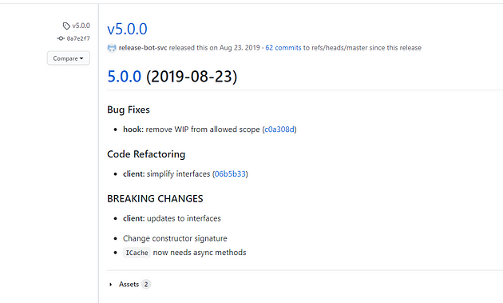

> **Consistency through Semantic Versioning 🧩**

## 💬 Introduction

Stay nimble and consistent by automating change communication with **Semantic Release** - a powerful tool that follows strict semantic versioning standards.

By eliminating emotion from version numbers, it fosters transparency, clarity, and efficiency across teams and users. This guide explores how Semantic Release empowers developers at all levels to enhance their release strategies and boost version control.


## 📚 Semantic Versioning and Conventional Commits

Before we jump into Semantic Release, there are two important concepts to understand:

1. **Semantic Versioning**
2. **Conventional Commits**

Let's briefly explain what these two mean.

### 📈 Semantic Versioning

Semantic Versioning (also called **SemVer**) is an automated versioning and release management approach that follows semantic versioning principles to increment software versions based on the nature of changes (major, minor, patch) by analyzing commit messages. This ensures consistent and predictable versioning and often integrates with CI/CD pipelines to streamline the release process and reduce manual efforts.

This follows a strict pattern that can be used to show what kind of changes and how impactful the changes are.


- **Major (X)**: Indicates a complete version change that alters the product significantly.
- **Minor (Y)**: Represents a feature increase that is backward compatible with previous changes.
- **Patch (Z)**: Small fixes and bug resolutions.
- **Pre-Release+Build**: Optionally used for building a version from a feature branch. This can utilize the existing version and suffix it with either the branch name or the build version. Example: `1.2.3-myNewFeature-35923`

For more details, you can refer to the [Semantic Versioning Specification](https://semver.org/).

## Conventional Commits

Conventional commit is a specification, a set of rules that have to be followed when writing commit messages. It is heavily inspired by [Angular commit guidelines](https://github.com/angular/angular/blob/main/CONTRIBUTING.md#commit) and follows this structure

For more information, visit the [Conventional Commits](https://www.conventionalcommits.org/) website.


When using this, only type and description are mandatory, while the rest is optional. The value of type is important and needs to be only one of the following:
feat: A new feature
fix: A bug fix
docs: Documentation only changes
style: Changes that do not affect the meaning of the code (white-space, formatting, missing semi-colons, etc)
refactor: A code change that neither fixes a bug nor adds a feature
perf: A code change that improves performance
test: Adding missing or correcting existing tests
chore: Changes to the build process or auxiliary tools and libraries, such as documentation generation

Below are some sample commits made using this specification -
feat(logging): added logs for failed signups
fix(homepage): fixed image gallery
test(homepage): updated tests
docs(readme): added new logging table information

To ensure adherence to these conventions in your projects, tools such as [commitlint](https://github.com/conventional-changelog/commitlint) and [commitizen](https://commitizen.github.io/cz-cli/) can be immensely helpful. If you would like to learn more about this, read here - [Automate and enforce conventional commits for .NET-based projects](https://medium.com/yasser-dev/automate-and-enforce-conventional-commits-for-net-based-projects-a322be7a1eb7).

## 🚀 How to Use SemVer

What we want to do is use the SemVer formatting and schema definition to identify what sprint version of the build is deployed with what features and/or hotfix version.

For the latter, we will use a simple branching strategy where all features are developed on branches `feature/{ticket-name}` and hotfixes are developed on `hotfix/{ticket-name}`. These will then use a Pull Request into the main branch, which in this case will be where we would release from.


### 🌿 Branching Pattern

Taking that into account, we will have all bug fixes increment the **Patch** digit, and the new features increment the **Minor**. This will mean every change that is merged into the main branch will have a unique version. We will then have the **Major** that will be incremented manually for each major release you put out for the product.

### ⚙️ How Does It Work

Semantic release works by automating the process of determining when and how to increment a software version and when to make a new release. Here's a simplified overview of how it works:

1. **Commit Messages**: Developers follow conventional commit messages to indicate the nature of their changes. For example, using specific keywords like "feat" for new features, "fix" for bug fixes, and "break" for breaking changes.
2. **Semantic Versioning**: The semantic release tool analyzes these commit messages and identifies the type of change. In our example, "feat" represents a minor change, "fix" is a patch change, and "break" signifies a major change.
3. **Release Notes**: The tool extracts information from commit messages to generate release notes.
4. **Changelog Generation**: The semantic release tool parses these commit messages to generate a changelog that summarizes the changes in a user-friendly format. It groups the changes by the type of commit (e.g., new features, bug fixes, breaking changes).
5. **Publishing**: With the version and release notes ready, the tool can automatically publish the new release to a package repository or distribution channel.
6. **CI/CD Integration**: This entire process can be integrated into your CI/CD pipeline. So, whenever developers push new commits or merge in the main branch, the semantic release tool can automatically determine the version, generate release notes, and publish the release without manual intervention.

Semantic release uses the commit messages to determine the type of changes in the codebase. Following formalized conventions for commit messages, semantic release automatically determines the next semantic version number, generates a changelog, and publishes the release.

### 🛠️ Configuring Semantic Release with GitHub Actions

Configuring semantic release with GitHub actions is a simple process. Here, we are using `cycjimmy/semantic-release-action@v2` action, which supports a wide variety of optional features via its plugins - git, exec, and changelog.

```yaml
publish:
    steps:
        needs: [ build ]
        - name: Checkout
            uses: actions/checkout@v1
        - name: Semantic Release
            uses: cycjimmy/semantic-release-action@v2
            with:
                extra_plugins: |
                    @semantic-release/git
                    @semantic-release/exec
                    @semantic-release/changelog 
            runs-on: ubuntu-latest
```

The `semantic-release/exec` plugin allows us to execute any custom shell commands at the different stages of semantic release, that is, prepare, publish, notify, etc.

```javascript
module.exports = {
    branches: ['main'],
    "verifyConditions": ["@semantic-release/github"],
    "prepare": // INSERT-CUSTOM-COMMANDS-HERE-TO-RUN-ON-PREPARE,
    "publish": // INSERT-CUSTOM-COMMANDS-HERE-TO-RUN-ON-PUBLISH,
    "notify": // INSERT-CUSTOM-COMMANDS-HERE-TO-RUN-ON-NOTIFY
}
```

Here, we use the familiar `dotnet build`, `pack`, and `push` commands to push new releases to [NuGet](https://www.nuget.org/) (package manager for .NET). The generated version number and other release details are easily accessible through `${nextRelease.xxx}`. This section can be used for doing so much more, the possibilities are limitless here.

### 📋 Revisiting Our Checklist

With semantic release successfully implemented, let's revisit our initial checklist to evaluate our progress.

- ✅ Calculate the new version number based on the commit messages.

    

- ✅ Create git tags for every release.

    

- ✅ Publish a release to GitHub releases & [NuGet](https://www.nuget.org/).

- ✅ Create release notes & changelogs automatically.

    

- ✅ Notify maintainers and users of new releases.

    

## 🏁 Conclusion

Semantic-release simplifies versioning. It uses commit messages for version control, produces informative release notes, and integrates smoothly with CI/CD workflows. Adopt semantic-release for streamlined version control and effortless package releases in your development cycle.

**References:**

* https://semver.org/
* https://www.conventionalcommits.org/en/v1.0.0/
* https://github.com/semantic-release/semantic-release
* https://github.com/cycjimmy/semantic-release-action

<br>

**_Until next time, つづく 🎉_**

> 💡 Thank you for Reading !! 🙌🏻😁📃, see you in the next blog.🤘  **_Until next time 🎉_**

🚀 Thank you for sticking up till the end. If you have any questions/feedback regarding this blog feel free to connect with me:

**♻️ LinkedIn:** https://www.linkedin.com/in/rajhi-saif/

**♻️ X/Twitter:** https://x.com/rajhisaifeddine

**The end ✌🏻**

<h1 align="center">🔰 Keep Learning !! Keep Sharing !! 🔰</h1>

**📅 Stay updated**

Subscribe to our newsletter for more insights on AWS cloud computing and containers.
