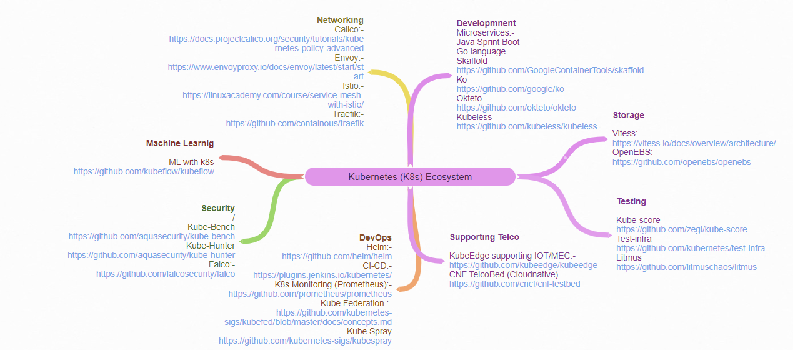
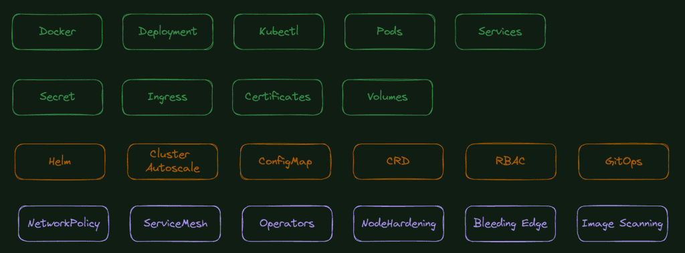

> **Do you really need it and how Much Should You Know? 🧩**

## 💬 Introduction

The tech field requires some knowledge of Kubernetes. If you work with software, you might use it to set up and manage your work. If you're a developer, you might use it to make your software run better.

But not everyone needs to be a Kubernetes expert. The amount you should learn depends on your job and what you want to do.

This guide will help you figure out if you should learn Kubernetes, and how much you should learn. We'll make it easy to understand, so you can make the right choice for your career.

⏲ **Kubernetes: Why It's Worth Your Time and What You Need to Know**

Should you learn Kubernetes? Definitely. While Kubernetes might seem like it's just for DevOps folks, it's actually much bigger. It's spreading across different industries fast, with more and more companies using it for serious stuff. These days, all sorts of experts are getting into Kubernetes, not just the DevOps crowd. Whether you're a coder, a network person, or someone who deals with security, storage, machine learning, or testing, there's something in Kubernetes for you.

Learning Kubernetes isn't just about keeping up with trends. It's about putting yourself in a great spot for the future. It opens doors to new opportunities and helps you understand the latest tech that's shaping the world. So, if you're thinking about learning Kubernetes, go for it!

### 🚀 Why Learn Kubernetes?

Here are some reasons why learning Kubernetes is a smart move:

- **Industry Demand:** Kubernetes is becoming more popular in various industries. Companies are using it for serious stuff, not just for tech experts. Whether you're a coder, a network person, someone who deals with security, storage, machine learning, or testing, there's something in Kubernetes for you.
- **Future-Proofing Your Skills:** By mastering Kubernetes, you gain insights into cutting-edge technology that shapes our world. It's not just about following trends; it's about preparing for the future and unlocking new opportunities.
- **Job Opportunities:** Learning Kubernetes can lead to new job opportunities. As more companies adopt Kubernetes, the demand for experts in this field is growing.
- **Better Software Development:** Kubernetes can help you make your software run better. It's like a traffic cop for your computer, making sure everything runs smoothly.

### 📈 How Much Kubernetes Should You Learn?

Kubernetes is huge, and sooner than later, you perceive yourself asking this question: How much more should I explore this technology? What path to follow?

Well, it depends on your role and what you want to achieve. Here's a breakdown to help you figure it out:

- **Software Developers:** Knowing the basics of Kubernetes can be super helpful. You don't need to be an expert, but understanding things like pods, deployments, and services will make your job easier.
- **DevOps Engineers and System Administrators:** You'll probably need to dive deeper. You'll be responsible for setting up and managing Kubernetes clusters, so a solid understanding of its inner workings is crucial.
- **Managers and Decision-Makers:** You don't need to know all the technical details, but having a general understanding of Kubernetes and its benefits can help you make informed decisions about your company's infrastructure.
- **Other Roles:** If your job doesn't directly involve software development or system administration, you might not need to learn Kubernetes at all. However, having a basic understanding of it can still be beneficial for collaboration and communication within your team.

Here are the few paths that require multiple domain experts to jump in with DevOps whether Developer, Network, Security, Storage, Machine Learning, Testing, and much more:

### 📚 What Do I Need to Know to Start Learning Kubernetes?

When learning Kubernetes it's important to be open to new concepts as well as new technologies. In fact, it's common for the concepts to be harder to grasp than the technologies.

On the technology side, it helps if you understand how containers work and have some hands-on experience with them.

On the concepts front, Kubernetes forces you to adopt microservices design patterns, infrastructure as code, and immutable infrastructure. These require you to change your mindset as well as a lot of your existing practices.

As a quick example, you should avoid logging on to live systems to perform updates or fixes. Instead, you should test updates and fixes in a separate environment, save them in a version control repository, and then use a GitOps tool to push them to the live environment. This ensures your source repositories and live environments are always in sync.

Sometimes the jargon creates friction, but once you grasp and embrace the concepts the rest is easy.

### 🎓 What Kubernetes Certifications Are Available?

There are two major paths to Kubernetes certification:

1. **Official CNCF Certifications**
2. **Platform-Specific Certifications**

The official CNCF certifications test your mastery of Kubernetes. Those skills can be applied wherever Kubernetes is deployed. The official CNCF certifications are as follows:

- **[Kubernetes and Cloud Native Associate (KCNA)](https://www.cncf.io/certification/kcna/):** This is a multiple-choice proctored exam with no hands-on elements.
- **[Certified Kubernetes Application Developer (CKAD)](https://www.cncf.io/certification/ckad/):** This is a simulator-based hands-on proctored exam.
- **[Certified Kubernetes Administrator (CKA)](https://www.cncf.io/certification/cka/):** This is a simulator-based hands-on proctored exam.
- **[Certified Kubernetes Security Specialist (CKS)](https://www.cncf.io/certification/cks/):** This is a simulator-based hands-on proctored exam.

Platform-specific certifications exist for most of the major cloud platforms and test your mastery of Kubernetes using the particular cloud's implementation and associated tooling.

### 📘 Where Can I Learn Kubernetes?

Both [A Cloud Guru](https://acloudguru.com/) and [Pluralsight](https://www.pluralsight.com/) offer comprehensive introductory courses on Kubernetes. Additionally, they both provide courses to help you earn official Kubernetes certifications, such as the Certified Kubernetes Administrator exam.

Other Kubernetes learning resources:

- [Quick Start Kubernetes](https://kubernetes.io/docs/setup/)
- [The Kubernetes Book](https://www.amazon.com/Kubernetes-Book-Nigel-Poulton/dp/1521823634)
- [Exploring Kubernetes' Official Documentation](https://kubernetes.io/docs/home/)

🔚 **Conclusion:**

Kubernetes is undoubtedly a valuable tool in the tech industry, but the extent to which you should learn it depends on your specific role and career aspirations. Ultimately, whether you're deeply immersed in the world of Kubernetes or simply have a basic understanding, the key is to continuously learn and adapt as the technology evolves.

 

**_Until next time, つづく 🎉_**

> 💡 Thank you for Reading !! 🙌🏻😁📃, see you in the next blog.🤘  **_Until next time 🎉_**

🚀 Thank you for sticking up till the end. If you have any questions/feedback regarding this blog feel free to connect with me:

**♻️ LinkedIn:** https://www.linkedin.com/in/rajhi-saif/

**♻️ X/Twitter:** https://x.com/rajhisaifeddine

**The end ✌🏻**

<h1 align="center">🔰 Keep Learning !! Keep Sharing !! 🔰</h1>

**📅 Stay updated**

Subscribe to our newsletter for more insights on AWS cloud computing and containers.
