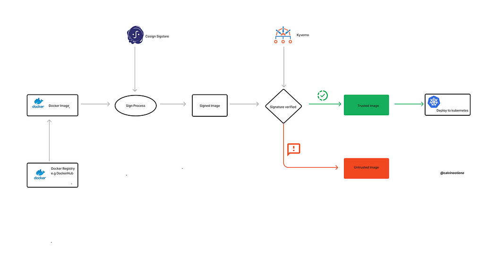

> **🔗 Securing CI/CD Pipelines for Production Deployment 🔗**

## 🔊 Introduction

Container technology is not new, but the need for secure container images is more important than ever. In this post, we will discuss two technologies that can help achieve your application containers more securely deploying and running in production: **Cosign** and **distroless container images**.

[Cosign](https://github.com/sigstore/cosign) from the [Sigstore project](https://www.sigstore.dev/), which is a non-profit public good service that provides developers with the means to validate that the software they use is exactly what is expected. Cosign can be used to sign container images, which can help to ensure that the images you are running on your Kubernetes clusters are the trusted ones.

[Kyverno](https://kyverno.io/docs/introduction/) is a policy engine for Kubernetes that can be used to enforce security policies. One of the ways that Kyverno can be used is to require that all container images deployed to a Kubernetes cluster be signed.

[Distroless](https://github.com/GoogleContainerTools/distroless) container images are a type of container image that is built without a base image. This makes them smaller and more secure, as they do not contain any unnecessary packages or vulnerabilities.

In this article, we focus on how to sign and verify Docker distroless images with Cosign and Kyverno.



### Distroless Container Images: Smaller, Faster, and More Secure

Distroless container images are a type of Docker image that is built without a base image. This means that they are smaller and more secure than traditional container images, which often include many unnecessary libraries and utilities. Distroless container images only contain the application and its runtime dependencies, which makes them ideal for running microservices and other cloud-native applications.

**Benefits:**

- **Improved security:** Distroless container images have a smaller attack surface, as they do not contain any unnecessary packages. This makes them less vulnerable to security vulnerabilities.
- **Reduced size:** Distroless container images are much smaller than traditional container images, which can save on storage and bandwidth costs.
- **Improved performance:** Distroless container images start up and run faster than traditional container images, due to their smaller size.
- **Cost-efficiency:** Distroless container images can help to reduce cloud computing costs, as they require fewer resources to run.

Overall, distroless container images offer a number of benefits over traditional container images, including improved security, reduced size, improved performance, and cost-efficiency.

### Cosign-verified Distroless Container Images

Supported by the [OpenSSF (Open Source Security Foundation)](https://openssf.org/), the Sigstore project operates as a non-profit public good service. The goal of Sigstore is to provide developers with the means to validate that the software they use is exactly what is expected. This validation is done through the use of encoded digital signatures and transparency log technologies.

Sigstore therefore provides a suite of tools including:

- **Cosign** for signing software artifacts.
- The certification authority **Fulcio**.
- The trust (or transparency) journal **Rekor**.
- **Gitsign** for signing Git commits.

### Verify the Distroless Container Base Image with Cosign Verification

Verification of distroless image `gcr.io/distroless/static` with Cosign public key shared by publisher Google. This should be the first step of the image building process.

```sh
cosign verify -key publisher-shared-cosign-pub.key gcr.io/distroless/static
```

Verification for `gcr.io/distroless/static` -- The following checks were performed on each of these signatures:

- The cosign claims were validated.
- The signatures were verified against the specified public key.
- Any certificates were verified against the Fulcio roots.

```json
{
    "critical": {
        "identity": {
            "docker-reference": "gcr.io/distroless/static"
        },
        "image": {
            "docker-manifest-digest": "sha256:c9320b754c2fa2cd2dea50993195f104a24f4c7ebe6e0297c6ddb40ce3679e7d"
        },
        "type": "cosign container image signature"
    },
    "optional": null
}
```

### Building Application Images as Distroless Container Images

There are a couple of approaches for building application images as the distroless container images:

1. Use respective build tools to build the application from the source code. After that, by using the Docker directives `COPY` or `ADD` to build the Docker images with the build artifacts copied or added.
2. Multi-stage Docker build.

I am following multiple scenarios here, where I am building a Docker container image for my Hello-World Go web app, which you can find here with static distroless image and standard base images.

**App Image built with `gcr.io/distroless/static` as base image in a multistage build process:**

```shell
FROM golang:1.15 as builder
COPY . /usr/local
WORKDIR /usr/local/
RUN CGO_ENABLED=0 GOOS=linux GOARCH=amd64 go build -a -tags netgo -ldflags '-w -extldflags "-static"' -o cmd/app

FROM gcr.io/distroless/static
USER nonroot:nonroot
COPY --from=builder --chown=nonroot:nonroot /usr/local/cmd/app /bin/app
ENTRYPOINT ["/bin/app"]
```

**App Image built with `golang:1.15` in a single stage build process:**

```shell
FROM golang:1.15 as builder
COPY . /usr/local
WORKDIR /usr/local/
RUN CGO_ENABLED=0 GOOS=linux GOARCH=amd64 go build -o /bin/app
ENTRYPOINT ["/bin/app"]
```

**App Image built with `ubuntu:21.04` as base image in a multi-stage build process:**

```shell
FROM golang:1.15 as builderstage
COPY . /usr/local
WORKDIR /usr/local/
RUN CGO_ENABLED=0 GOOS=linux GOARCH=amd64 go build -o cmd/app

FROM ubuntu:21.04
COPY --from=builderstage /usr/local/cmd/app /bin/app
ENTRYPOINT ["/bin/app"]
```

### Generate the Cosign Key Pairs

```sh
$ cosign generate-key-pair
Enter password for private key: 
Enter again: 
Private key written to cosign.key
Public key written to cosign.pub
```

This generates new key pairs, `cosign.key` and `cosign.pub`. Private keys should be stored safely. You can manage them by [HashiCorp Vault](https://www.vaultproject.io/) or [Amazon KMS](https://aws.amazon.com/kms/) and the password in a secret manager. This makes the keys easier to manage in your CI system.

### Build and Push Docker Image

```sh
docker build -t rajhisaifeddine/cosign-distroless -f Dockerfile.distroless
docker tag rajhisaifeddine/cosign-distroless rajhisaifeddine/cosign-distroless:latest
```

### Signing Image with Sigstore

Before signing any image, we need to publish the image to a registry. Cosign does not support the signing of images that have not been published to a registry. On top of that, you need to have write permission to that registry.

```sh
docker push rajhisaifeddine/cosign-distroless:latest
```

### Sign the Image

```sh
cosign sign --key cosign.key rajhisaifeddine/cosign-distroless:latest
```

This command will create a new tag `SHAxxxxx.sig` in our OCI registry. You can verify that the name of the tag contains the digest of the image uploaded with the tag signed.

### Verifying Signed Images

To verify the signature against the signed image, we use the public key `cosign.pub`.

```sh
cosign verify --key cosign.pub rajhisaifeddine/cosign-distroless:latest | jq -r .
```

I would advise using [immutable tags](https://docs.aws.amazon.com/AmazonECR/latest/userguide/image-tag-mutability.html). This makes sure you are always downloading the same image when using it. Mutating a tag might be useful for development purposes but in a production environment, it can introduce risks.

## Install Kyverno using Helm

Kyverno can be deployed via a Helm chart–the recommended and preferred method for a production install–which is accessible either through the Kyverno repository or on [Artifact Hub](https://artifacthub.io/). Both generally available and pre-releases are available with Helm.

### 🛠️ Steps to Install Kyverno with Helm

1. **Add the Kyverno Helm repository:**

    ```sh
    helm repo add kyverno https://kyverno.github.io/kyverno/
    ```

2. **Scan the new repository for charts:**

    ```sh
    helm repo update
    ```

3. **Optionally, show all available chart versions for Kyverno:**

    ```sh
    helm search repo kyverno -l
    ```

4. **Install Kyverno using Helm:**

    ```sh
    helm install kyverno-policies kyverno/kyverno-policies -n kyverno
    ```

### 🔒 Kubernetes with Kyverno: Verifying Image Signatures

To secure our Kubernetes clusters, it is essential to ensure that only trusted, signed container images are deployed. Kyverno is a policy engine for Kubernetes that can be used to enforce this security policy.

#### 📝 Steps to Verify Container Image Signatures with Kyverno

1. **Define the specific container image to be verified, either by its tag or SHA.**
2. **Create a Kyverno ClusterPolicy CR that specifies the container image to be verified and the required digest.**
3. **Apply the ClusterPolicy CR to the Kubernetes cluster.**

By following these steps, you can prevent unauthorized images from being deployed to the cluster, ensuring a higher level of security for your Kubernetes environment.

For more details, visit the [Kyverno Documentation](https://kyverno.io/docs/introduction/).

Once the `ClusterPolicy` CR is applied, Kyverno will intercept all requests to create new pods and deployments. If the container image specified in the request does not have a valid signature or does not match the required digest, Kyverno will deny the request.

```yaml
apiVersion: kyverno.io/v1
kind: ClusterPolicy
metadata:
    name: check-signed-images
spec:
    validationFailureAction: Enforce
    background: false
    webhookTimeoutSeconds: 30
    failurePolicy: Fail
    rules:
        - name: check-image-signature
            match:
                any:
                - resources:
                        kinds:
                            - Pod
            verifyImages:
            - image: "rajhisaifeddine/cosign-distroless:*"
            # Replace with your own public key
                key: |-
                    -----BEGIN PUBLIC KEY-----
                    MIIBIjANBgkqhkiG9w0BAQEFAAOCAQ8AMIIBCgKCAQEAzSRvEUG1h8IQrCBP0+xxxxz
                    N7nheR1sX/xxxxx/tNOBXsZZEeIm1pg67E1dfCfR5pl0gulSfG9yO9Vb5vF+xxxxxxx
                    xxxxxxx/sUr5S+ToQ+R52K+pqG8doz/xxxxxxxxxxxxxxx
                    pO9LYeWj0K8QvCf7RIssIa9PmjYDpZHEBd7bUtDrrjvGZgjGQ2ePhkf/7y3QvSXC
                    KXxOjbOCAa9AtXdBf1kkFb4/IuLNCfZrg59Yq6mFzOw6E7c0gPN+2JkwD6JvKti
                    LnhgHbcBx7e4XZUnrTzPKij8+xxxeeee/xxxxxxxx+x
                    +wIDAQAB
                    -----END PUBLIC KEY-----
```

For more details, visit the [Kyverno Documentation](https://kyverno.io/docs/introduction/).

### Enforcing Image Signature Verification with Kyverno

This policy by default enforces the `validationFailureAction` and the `failurePolicy` is set to `Fail`. The `verifyImages` rule from the `ClusterPolicy` in Kyverno checks all the container image signatures that match. We are validating all the tags generated, hence the use of wildcard `*`.

We also specify the public key that will be used to verify the signed images. This public key is the one we generated. Let's check the verification process by deploying a pod that runs our signed image from DockerHub.

```sh
kubectl create namespace demo
kubectl run demo-test --image rajhisaifeddine/cosign-distroless:latest
```

You can see the `verifyImages` rule we defined in the Kyverno Cluster Policy checks against the public key defined in the step before the container gets into a running state.

Kyverno prevents the deployment of a pod using an unsigned and unverified image.

In this guide, I used Kyverno as an example, but you can use other Policy Engines such as [Connaisseur](https://github.com/sse-secure-systems/connaisseur#what-is-connaisseur) and [policy-controller](https://docs.sigstore.dev/policy-controller/overview/) which are [compatible with Cosign](https://docs.sigstore.dev/cosign/overview/#kubernetes-integrations).

## 📝 Takeaways

In this comprehensive guide, we explored the importance of securing CI/CD pipelines for production deployments. We learned how to sign and verify container images using Cosign and Kyverno, two powerful tools that enhance security in the software development lifecycle. By implementing these practices, you can significantly improve the trust and integrity of your containerized applications, ensuring safer and more reliable production deployments.

<br>

**_Until next time, つづく 🎉_**

> 💡 Thank you for Reading !! 🙌🏻😁📃, see you in the next blog.🤘  **_Until next time 🎉_**

🚀 Thank you for sticking up till the end. If you have any questions/feedback regarding this blog feel free to connect with me:

**♻️ LinkedIn:** [https://www.linkedin.com/in/rajhi-saif/](https://www.linkedin.com/in/rajhi-saif/)

**♻️ X/Twitter:** [https://x.com/rajhisaifeddine](https://x.com/rajhisaifeddine)

**The end ✌🏻**

<h1 align="center">🔰 Keep Learning !! Keep Sharing !! 🔰</h1>

**📅 Stay updated**

Subscribe to our newsletter for more insights on AWS cloud computing and containers.
