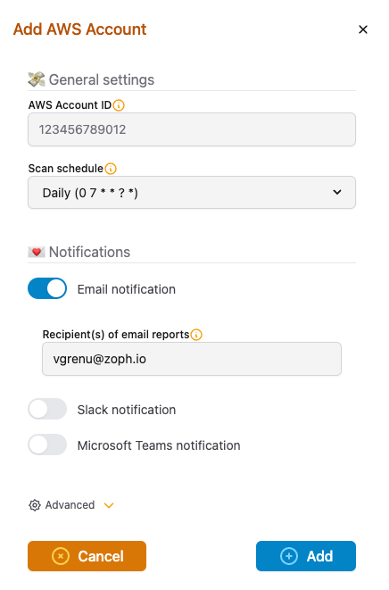
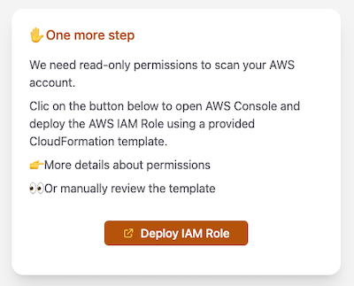

> **Discover hidden costs: Spot idle AWS resources 💸**

## 💬 Introduction

AWS is a powerful tool that can help businesses of all sizes save money and scale efficiently. However, it's important to be aware of the potential for hidden costs. If you're not careful, you can easily overspend on unused resources, inefficient configurations, and unexpected data transfer fees.

That's where [unusd.cloud](https://unusd.cloud/) comes in. Unusd.cloud is a cloud cost management platform that helps you identify and eliminate hidden AWS costs. With unusd.cloud, you can:

- Get a clear view of your AWS spending
- Identify and terminate unused resources
- Optimize your resource configurations
- Set up alerts to notify you of potential cost overruns

In this blog post, we'll show you how to use unusd.cloud to uncover hidden AWS costs and save money. We'll also run the numbers on real-world scenarios to show you exactly how much you could be overspending.


### 🧠 Rationale

One of the main advantages of cloud computing is the ability to experiment. Whether you're learning new skills, testing new ideas, or working on proofs of concept, you can easily spin up new resources on AWS and get started.

However, it's important to be mindful of your costs. AWS uses a consumption-based pricing model, so you're billed for every resource that you use. This means that it's easy to forget to turn off resources, especially if you're working on multiple projects or if you're new to AWS.

### 💣 What's the Problem?

AWS doesn't have any built-in billing alerts by default, so you're responsible for manually checking your bill to make sure that there aren't any unexpected charges. This can be challenging, especially if you have resources running in multiple regions.

### 🔍 Let's Dive into the Main Culprits

Here are some of the most common AWS services that can lead to wasted resources:

- **EC2 Instances**: If you forget to terminate EC2 instances that you're no longer using, you'll continue to be billed for them.
- **EBS Volumes**: If you have EBS volumes that are attached to EC2 instances that you've terminated, you'll continue to be billed for them.
- **S3 Buckets**: If you have S3 buckets that are storing data that you no longer need, you'll continue to be billed for the storage and bandwidth costs.
- **RDS Databases**: If you have RDS databases that are running when you're not using them, you'll continue to be billed for them.
- **Lambda Functions**: If you have Lambda functions that are triggered by events that no longer occur, you'll continue to be billed for them.

### 💰 How to Save Money

The best way to save money on AWS is to be mindful of your resource usage and to turn off resources that you're not using. You can also use [AWS Cost Explorer](https://aws.amazon.com/aws-cost-management/aws-cost-explorer/) to identify and eliminate wasted resources.

Here are some tips:

- Set up billing alerts to notify you when your costs exceed a certain threshold.
- Review your AWS Cost Explorer reports regularly to identify wasted resources.
- Use [AWS Trusted Advisor](https://aws.amazon.com/premiumsupport/technology/trusted-advisor/) to get recommendations on how to optimize your AWS costs.
- Use [Reserved Instances](https://aws.amazon.com/ec2/pricing/reserved-instances/) and [Savings Plans](https://aws.amazon.com/savingsplans/) to save money on EC2 instances and RDS databases.

### 🛡️ Reduce Attack Surface

In addition to saving money, reducing wasted resources can also help to improve your security posture. When you have fewer resources running, there are fewer potential targets for attackers.

Here are some tips:

- Delete S3 buckets that are storing sensitive data that you no longer need.
- Terminate EC2 instances that are not in use.
- Disable Lambda functions that are no longer needed.
- Remove unnecessary permissions from your IAM users and roles.

### 🌳 Lower Carbon Footprint

AWS is committed to reducing its environmental impact. By eliminating wasted resources, you can help to reduce the carbon footprint of your cloud applications.

### 🔍 Let's Dive into the Main Culprits: AWS Services

#### 🖥️ EC2 Instances

- Use CloudWatch (CW) metrics to find unused AWS instances, such as `CPUUtilization`, `NetworkPacketsIn`, and `NetworkPacketsOut`. If CPU Utilization is barely low AND there is no traffic in/out during a specific period, we can assume this EC2 instance is no longer used.
- Use Composite Alarm to monitor multiple CW metrics.
- Review each instance in EC2 Console manually and check the Monitoring tab in the last two weeks.
- Paid options on AWS: Trusted Advisor (Cost Optimizations section, Business or Enterprise Support Plan required - at least $100/month) and AWS Compute Optimizer (See Pricing).

#### 💽 RDS Instances

- Check CloudWatch Metrics to see active connection to RDS Database.
- A database without connection for a week is a good suspect for no longer being used.
- Set up a CloudWatch alarm to observe this behavior with an alarm on a 0 threshold on this metric for one week.

#### 🪣 EBS Volumes

Identify "available" EBS volumes for a given AWS Region with the following command:

```bash
aws ec2 describe-volumes --query "Volumes[?State=='available'].[VolumeId,Size]" --output table
```

#### 📸 EBS Snapshots

Identify obsolete snapshots older than 90 days with the following bash script:

```bash
#!/bin/bash
region=$1
aws ec2 describe-snapshots --region $region --query "Snapshots[?StartTime<=(timestamp('2023-10-16T16:25:00Z') - 259200000)]" --output json | jq -r '.Snapshots[] | {VolumeId: .VolumeId, SnapshotId: .SnapshotId, StartTime: .StartTime}'
```

#### 📒 CloudWatch LogGroups

Identify CloudWatch LogGroup without expiration with the following AWS CLI command:

```bash
aws logs describe-log-groups --query "sort_by(logGroups[?retentionInDays == null], &storedBytes) | reverse(@) | [].[logGroupName, storedBytes]" --output table
```

#### 👷🏻‍♀️ IAM Principals

Use credential reports to extract the last usage of IAM principals. This is a flat file containing all AWS users with metadata about the IAM creds.

### Automate Waste Detection on AWS with unusd.cloud

You can automate waste detection on AWS with [unusd.cloud](https://unusd.cloud/). It's a SaaS platform that scans all your AWS accounts and regions for unused or underutilized resources, including both common and specialized services.

To use unusd.cloud, simply onboard your AWS accounts and schedule regular scans. The platform will then do the heavy lifting for you, sifting through CloudWatch metrics and setting up alerts. You'll receive a digest report through your chosen communication channel, so you can easily identify and address any wasted resources.

Here are the benefits of using unusd.cloud to automate waste detection on AWS:

- **Save time and effort**: unusd.cloud takes care of the complex task of waste detection for you, so you can focus on other things.
- **Get a comprehensive view of your AWS resource usage**: unusd.cloud scans all your AWS accounts and regions, giving you a complete picture of your resource usage.
- **Identify and address wasted resources quickly and easily**: unusd.cloud provides you with a clear and concise report of all your wasted resources, so you can take action to address them immediately.
- **Improve your security posture**: by eliminating wasted resources, you can reduce your attack surface and improve your overall security posture.
- **Save money**: by eliminating wasted resources, you can reduce your AWS costs.

If you're looking for a way to automate waste detection on AWS, unusd.cloud is a great solution. It's easy to use and provides you with all the tools you need to identify and address wasted resources quickly and easily.

## 🚀 Getting Started with unusd.cloud

This article will guide you through the setup of unusd.cloud.

### 📝 Step 1: Sign-up

- Sign-up on [unusd.cloud](https://unusd.cloud) to set up your AWS Accounts and preferred configuration.
- Free forever for a single AWS Account
- No credit card required
- Cancel anytime
- ReadOnly permissions

### ➕ Step 2: Add AWS Accounts

1. Login to the [unusd.cloud app](https://app.unusd.cloud).
2. Add each of your AWS Accounts and desired notification configuration (Email, Slack, Microsoft Teams).



3. Deploy the associated read-only IAM Role using the provided link to the CloudFormation console:



4. Repeat this operation for every AWS account that you want to attach to your unusd.cloud subscription.
5. If you have multiple AWS Accounts, prefer the usage of [AWS CloudFormation StackSets](https://docs.aws.amazon.com/AWSCloudFormation/latest/UserGuide/what-is-cfnstacksets.html). It will allow you to deploy the IAM Role to all your AWS Accounts with a single deployment.

### ✅ [Optional] Step 3: Add Exception Tag to Legitimate AWS Assets

To prevent alert fatigue and irrelevant reports, it may be necessary to add legitimate assets to the exception list. Typically, this can be accomplished by setting a tag on existing legitimate AWS assets. 

- Utilize an existing AWS tag that has already been deployed to your legitimate assets.
- The Key of this tag is part of the unusd configuration (Exception Tag) in the advanced menu. The default tag key is `unusd`.

### ✏️ Conclusion

unusd.cloud is your cost-saving ally in the AWS environment. It scans your AWS accounts, identifies mistakenly active assets, and delivers a summary report filled with cost-saving recommendations.

What's more, it's not limited to just one AWS service; it supports a range of services, from EC2 instances to Redshift clusters and more. By using unusd.cloud, you're making a smart move toward cost-efficiency and sustainability, freeing up resources for business growth and innovation.

In a tech-driven world, having the right tool can make all the difference, and unusd.cloud makes optimizing your cloud resources a breeze.

<br>

**_Until next time, つづく 🎉_**

> 💡 Thank you for Reading !! 🙌🏻😁📃, see you in the next blog.🤘  **_Until next time 🎉_**

🚀 Thank you for sticking up till the end. If you have any questions/feedback regarding this blog feel free to connect with me:

**♻️ LinkedIn:** https://www.linkedin.com/in/rajhi-saif/

**♻️ X/Twitter:** https://x.com/rajhisaifeddine

**The end ✌🏻**

<h1 align="center">🔰 Keep Learning !! Keep Sharing !! 🔰</h1>

**📅 Stay updated**

Subscribe to our newsletter for more insights on AWS cloud computing and containers.
