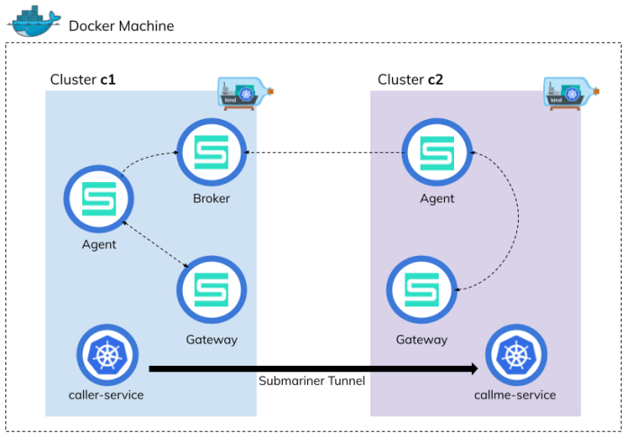
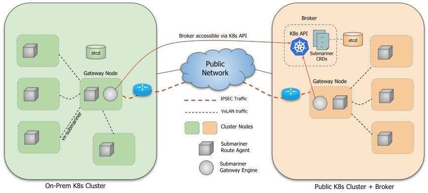

> **Navigating the Waters of Multi-Cluster Kubernetes**

## 🔊 Introduction

While organizations adopt Kubernetes, they often find themselves with multiple clusters, each managing a different set of applications.

As applications grow in complexity and geographical distribution, the need to interconnect Kubernetes clusters across different environments becomes more important.

**Submariner** emerges as a powerful tool to address this challenge, providing a networking component that facilitates seamless communication between Pods and Services across Kubernetes clusters.

## 📚 Getting Started

Submariner consists of several main components that work in conjunction to securely connect workloads across multiple Kubernetes clusters.

### The Broker

The Broker is an API that all participating clusters are given access to, and where two objects are exchanged via CRDs in `.submariner.io`:

- **Cluster**: Defines a participating cluster and its IP CIDRs.
- **Endpoint**: Defines a connection endpoint to a cluster, and the reachable cluster IPs from the endpoint.

The Broker must be deployed on a single Kubernetes cluster. This cluster's API server must be reachable by all Kubernetes clusters connected by Submariner. It can be a dedicated cluster or one of the connected clusters.

### The Submariner Deployment on a Cluster

Once Submariner is deployed on a cluster with the proper credentials to the Broker, it will exchange Cluster and Endpoint objects with other clusters (via push/pull/watching), and start forming connections and routes to other clusters.

### Architecture

Submariner connects multiple Kubernetes clusters in a way that is secure and performant. Submariner flattens the networks between the connected clusters and enables IP reachability between Pods and Services. Submariner also provides, via Lighthouse, service discovery capabilities. The service discovery model is built using the proposed Kubernetes Multi Cluster Services.

Submariner consists of several main components that work in conjunction to securely connect workloads across multiple Kubernetes clusters, both on-premises and on public clouds:

- **Gateway Engine**: Manages the secure tunnels to other clusters.
- **Route Agent**: Routes cross-cluster traffic from nodes to the active Gateway Engine.
- **Broker**: Facilitates the exchange of metadata between Gateway Engines enabling them to discover one another.
- **Service Discovery**: Provides DNS discovery of Services across clusters.

Submariner has optional components that provide additional functionality:

- **Globalnet Controller**: Handles interconnection of clusters with overlapping CIDRs.

The diagram below illustrates the basic architecture of Submariner:

### Terminology and Concepts

- **ClusterSet**: A group of two or more clusters with a high degree of mutual trust that share Services amongst themselves. Within a cluster set, all namespaces with a given name are considered to be the same namespace.
- **ServiceExport (CRD)**: Used to specify which Services should be exposed across all clusters in the cluster set. If multiple clusters export a Service with the same name and from the same namespace, they will be recognized as a single logical Service.
    - ServiceExports must be explicitly created by the user in each cluster and within the namespace in which the underlying Service resides, in order to signify that the Service should be visible and discoverable to other clusters in the cluster set. The ServiceExport object can be created manually or via the `subctl export` command.
    - When a Service is exported, it then becomes accessible as `<service>.<ns>.svc.clusterset.local`.
    - For Headless Services, individual Pods can be accessed as `<pod-name>.<cluster-id>.<svc-name>.<ns>.svc.clusterset.local`. `<cluster-id>` must be a valid DNS-1123 Label.
- **ServiceImport (CRD)**: Representation of a multi-cluster Service in each cluster. Created and used internally by Lighthouse and does not require any user action.

### Network Agnostic and Reliable Communication

Submariner's versatility stems from its network plugin (CNI) agnostic nature, allowing it to integrate seamlessly with various Container Network Interfaces (CNIs) commonly used in Kubernetes environments. This flexibility ensures compatibility with a wide range of network configurations, catering to diverse deployment scenarios.

### Encrypted or Non-Encrypted Tunnels

Submariner offers a choice between encrypted and non-encrypted tunnels for communication between connected clusters. This flexibility empowers users to tailor the communication protocol to their specific security requirements. Encrypted tunnels provide an additional layer of protection for sensitive data transmission, while non-encrypted tunnels offer enhanced performance for less sensitive data.

### Cloud Native Computing Foundation Sandbox Project

Submariner's designation as a [Cloud Native Computing Foundation (CNCF)](https://www.cncf.io/) sandbox project underscores its potential and alignment with the CNCF's mission of fostering innovation in cloud-native technologies. This recognition highlights the project's significance and positions it for future growth and adoption.

## 🏁 Conclusion

Submariner emerges as a promising solution for bridging the gap between Kubernetes clusters, enabling secure and reliable communication across diverse environments. Its network agnostic nature, support for encrypted tunnels, and active development under the CNCF sandbox initiative make it a valuable tool for organizations seeking to expand their Kubernetes footprint.

 

**_Until next time, つづく 🎉_**

> 💡 Thank you for Reading !! 🙌🏻😁📃, see you in the next blog.🤘  **_Until next time 🎉_**

🚀 Thank you for sticking up till the end. If you have any questions/feedback regarding this blog feel free to connect with me:

**♻️ LinkedIn:** [https://www.linkedin.com/in/rajhi-saif/](https://www.linkedin.com/in/rajhi-saif/)

**♻️ X/Twitter:** [https://x.com/rajhisaifeddine](https://x.com/rajhisaifeddine)

**The end ✌🏻**

<h1 align="center">🔰 Keep Learning !! Keep Sharing !! 🔰</h1>

**📅 Stay updated**

Subscribe to our newsletter for more insights on AWS cloud computing and containers.
