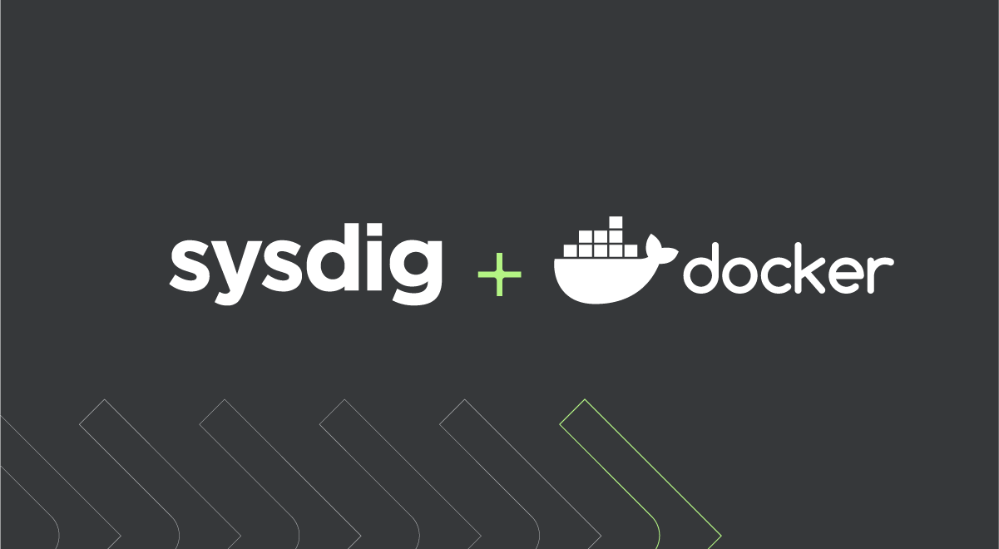
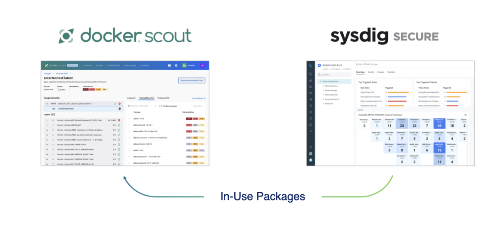
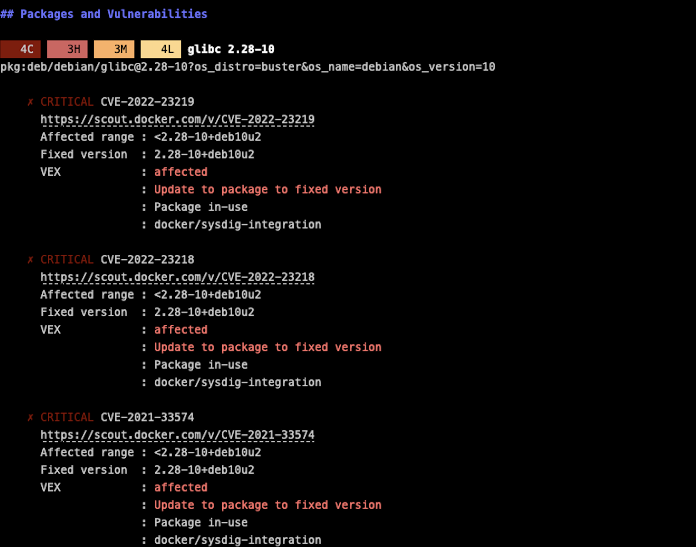
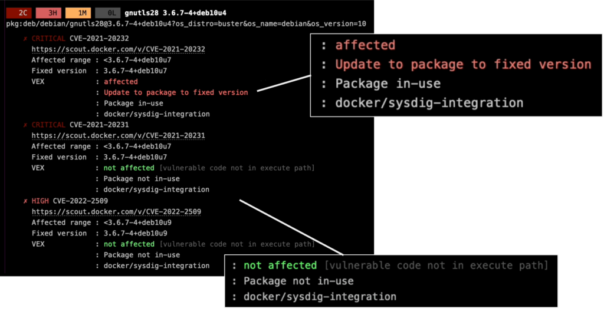
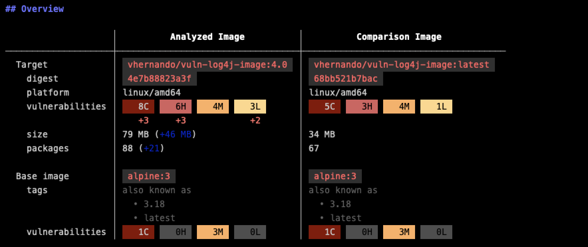
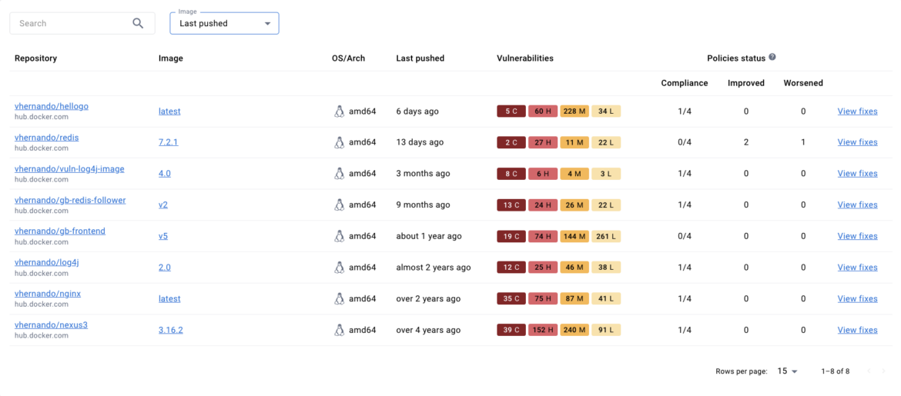

> **Shift Left and Shield Right with Prioritized Risk and Improved Security Posture**

## 🐋 Introduction

[Docker](https://www.docker.com/) and [Sysdig](https://sysdig.com/) are teaming up to make cloud-native app delivery faster and safer. This partnership brings Sysdig's runtime insights into Docker Scout, giving developers useful information to manage risks and boost security.

This collaboration is important for the cloud-native community because it combines two popular tools for container security and app delivery. Sysdig provides deep visibility into container environments, while Docker Scout helps find and fix security issues in container images.

By merging these tools, Sysdig and Docker are helping developers secure their cloud-native apps throughout the development process. This is crucial in today's fast-moving and constantly changing threat landscape.

> TL;DR: [Docker Scout](https://www.docker.com/products/docker-scout/) is a set of software supply chain features integrated into Docker's user interfaces and CLI. These features offer comprehensive visibility into the structure and security of container images.

## 🥅 Goals and Objectives

In this blog post, we'll explore the new partnership between Sysdig and Docker and how it helps developers speed up and secure cloud-native app delivery.



## ☸️ Sysdig Runtime Insights and Docker Scout

Sysdig and Docker have announced an integration at [DockerCon](https://www.dockercon.com/), [merging Sysdig runtime insights with Docker Scout](https://www.docker.com/press-release/announces-new-local-cloud-products-to-accelerate-delivery-of-secure-apps/). This collaboration helps developers prioritize risk assessment within their CLI and simplifies vulnerability identification in container-based applications. Docker Scout, an event-based tool, enhances the development process by providing integrations with Sysdig, JFrog Artifactory, AWS ECR, BastionZero, GitHub, GitLab, CircleCI, and Jenkins, optimizing DevSecOps workflows.

Eric Carter, a senior product marketing manager at Sysdig, highlights the importance of Docker Scout as a conduit for Sysdig's container image insights through its cloud-native application protection platform (CNAPP).

During DockerCon, Docker, Inc. made [Docker Scout](https://docs.docker.com/scout/) generally available, marking a pivotal moment in streamlining the developer's inner-loop process for creating container-based applications. The goal is to improve developer productivity, reduce post-deployment vulnerabilities, and expedite image creation, potentially saving developers up to an hour per day per project.

Furthermore, Docker, Inc. introduced Docker Debug and an enhanced Docker Build tool, which offers substantially improved speed and allows for cloud service offloading.

## 🛠️ What is Docker Scout

Docker Scout is designed to generate actionable insights for the software supply chain. It offers a layer-by-layer view of image dependencies, vulnerabilities, comparisons, and remediation paths. Docker announced the general availability of Docker Scout this week at DockerCon. You can check out their announcement [here](https://www.docker.com/blog/introducing-docker-scout/).

## 🔍 What are Sysdig Runtime Insights

Sysdig's deep runtime security visibility uses system calls at the kernel level to identify container activity. This is critical for [threat detection](https://sysdig.com/solutions/cloud-threat-detection-and-response/) but also enables Sysdig Secure to identify running containers and the packages loaded at runtime. Often, containers include packages to accommodate potential dependencies that are never used. [Runtime insights](https://sysdig.com/why-runtime-insights/) help you clearly see what's in use and what's not.



## 🔒 Enhanced Security with Docker Scout and Sysdig

Docker Scout and Sysdig together provide a robust solution for managing container security. By leveraging the strengths of both tools, developers can gain deeper insights into their container images and prioritize remediation efforts effectively.

### 🧩 Prioritize Risks Using SBOMs and Runtime Insights

Container images are often built from layers of other container images and software packages. These layers and packages can contain vulnerabilities that make your containers and the applications they run vulnerable to attack. Docker Scout can proactively help you find and fix these vulnerabilities, helping you create a more secure software supply chain. It does this by analyzing your images and creating a full inventory of the packages and layers called a [Software Bill of Materials (SBOM)](https://ntia.gov/sites/default/files/publications/sbom_at_a_glance_apr2021_0.pdf). It then correlates this inventory with a continuously updated vulnerability database to identify vulnerabilities in your images.

### 📜 What is SBOM?

A Software Bill of Materials (SBOM) is key when shifting security left. SBOMs provide an artifact that contains a comprehensive list of software assets and dependencies that make up a piece of software. SBOMs are also handy for knowing details such as the licensing covering each package. In terms of security, an SBOM is key for staying on top of security risks. It helps maintain an accurate and updated correlation between package dependencies, which makes the detection task easier.

### 🛡️ Docker Scout and Sysdig to Manage Container Security

Docker Scout is a tool that helps Docker users manage container security. It provides a unified software analysis view to help users understand their image composition, correlates security risks with the image's SBOM, and gives contextual remediation advice. Sysdig is a container security platform that provides runtime insights into containerized applications. It can be integrated with Docker Scout to provide additional information about CVE data and in-use vulnerabilities.

#### Installation

The Docker Scout CLI plugin comes pre-installed with Docker Desktop.

If you run Docker Engine without Docker Desktop, Docker Scout doesn't come pre-installed, but you can install it as a standalone binary.

**Installation script**

To install the latest version of the plugin, run the following commands:

```shell
curl -fsSL https://raw.githubusercontent.com/docker/scout-cli/main/install.sh -o install-scout.sh
```

**Container image**

The Docker Scout CLI plugin is also available as [a container image](https://hub.docker.com/r/docker/scout-cli). Use the docker/scout-cli to run docker scout commands without installing the CLI plugin on your host.

```shell
 docker run -it \
  -e DOCKER_SCOUT_HUB_USER=<your Docker Hub user name> \
  -e DOCKER_SCOUT_HUB_PASSWORD=<your Docker Hub PAT>  \
  docker/scout-cli <command>
```

**GitHub Action**
The Docker Scout CLI plugin is also available as a [GitHub action](https://github.com/docker/scout-action). You can use it in your GitHub workflows to automatically analyze images and evaluate policy compliance with each push.

Docker Scout also integrates with many more CI/CD tools, such as Jenkins, GitLab, and Azure DevOps.

For more details how to install the scout CLI, follow the steps in the [documentation](https://docs.docker.com/scout/install/)

#### Use Case 1: CVE Data and In-Use Vulnerabilities

Docker Scout can get CVE information from the SBOM, but it does not know which packages are actually in use. The Sysdig integration allows developers to see which CVE data impacts in-use packages, so they can prioritize remediation efforts.

Run the below command:

```shell
docker scout cves nginx
```



Vulnerabilities are ordered and summarized by priority, from the highest (CRITICAL) to the lowest (LOW). With the Sysdig integration, developers also get information about whether a vulnerability impacts in-use packages or not.



#### Use Case 2: Compare Vulnerabilities Between Releases

At software development time, it is important to have visibility into the differences between the code being developed and the code that is deployed in production. Docker Scout can be used to compare a local image to an image that is currently running in a cluster, and to identify any vulnerabilities that exist in the newer image but not in the older image. This information can then be used to prioritize remediation efforts and to minimize security blind spots in production. In addition to identifying new vulnerabilities, the "compare" approach can also be used to identify packages that are no longer in use. These packages can then be removed from the image, which can help to reduce the attack surface and make the image more lean and efficient.

The below command can perform the comparison:

```shell
docker scout compare nginx:1.27.2 nginx:1.26.2
```



#### Use Case 3: View Image Insights in Your CI/CD Pipeline

Docker Scout can be integrated into the CI/CD pipeline workflow to get vulnerability and runtime insights when building and pushing images. This can be done using a variety of CI/CD tools, including GitHub, GitLab, CircleCI, Microsoft Azure DevOps Pipelines, and Jenkins. Specifically for GitHub, Docker Scout can be integrated using the popular Docker Build and Push GitHub Action. This action allows developers to build and push images to Docker Hub from their GitHub workflows.

### 🛠️ View and Manage Security Issues

Docker Scout results can be viewed and managed across various interfaces, including Docker Desktop, the Docker CLI, Docker Hub, and the Docker Scout Dashboard. The Docker Scout Dashboard provides a unified view of discovered vulnerabilities, as well as extended information about CVEs and recommendations on how to remediate them by updating to a different base image. The Docker Scout Dashboard web console gives developers a view into discovered vulnerabilities but also provides extended information about CVEs along with recommendations on how to bypass vulnerabilities by updating to a different base image.



### 🚀 Ship More Secure Images

The ability to compare images during the build phase with those running in production gives developers a new lens to help build better images. Beyond remediating in-use vulnerabilities, teams can see which packages are unused and consider if they can be removed to address "container bloat." Leaner container images have a reduced attack surface with the added benefit of being able to scale more quickly.

## 🏁 Conclusion

It is essential to identify, prioritize, and fix security issues across the software supply chain in order to avoid security breaches when software is released into production. Docker and Sysdig help teams to do this more effectively by providing real-time security information throughout the development and deployment process. The integration of Sysdig Secure and Docker Scout offers users new and powerful ways to stay on top of known CVEs and ensure the security of their software supply chain.

<br>

**_Until next time, つづく 🎉_**

> 💡 Thank you for Reading !! 🙌🏻😁📃, see you in the next blog.🤘  **_Until next time 🎉_**

🚀 Thank you for sticking up till the end. If you have any questions/feedback regarding this blog feel free to connect with me:

**♻️ LinkedIn:** [https://www.linkedin.com/in/rajhi-saif/](https://www.linkedin.com/in/rajhi-saif/)

**♻️ X/Twitter:** [https://x.com/rajhisaifeddine](https://x.com/rajhisaifeddine)

**The end ✌🏻**

<h1 align="center">🔰 Keep Learning !! Keep Sharing !! 🔰</h1>

**📅 Stay updated**

Subscribe to our newsletter for more insights on AWS cloud computing and containers.
