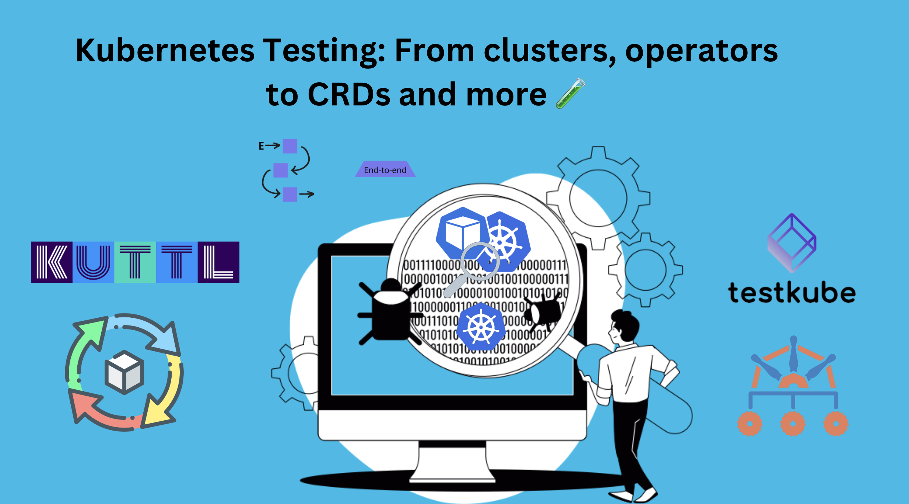

> **A Deep dive into tools and practices for testing Kubernetes environments**

## Introduction

Kubernetes is the leading platform for container orchestration, but deploying and managing a Kubernetes cluster requires thorough testing to ensure everything works correctly.

This guide will cover essential tools and practices for testing Kubernetes clusters and components, ensuring your deployments are robust and reliable.



## Importance of Testing Kubernetes Clusters

- **Application Functionality**: Testing ensures your applications run correctly in a Kubernetes environment. It helps identify issues with performance, functionality, and interactions with other services and databases. By testing, you can confirm that your application meets expected standards and provides a good user experience.

- **Operational Reliability**: Testing evaluates the cluster's ability to handle your application under different conditions. It helps find issues like resource allocation problems, network connectivity issues, and configuration errors. Addressing these issues through testing ensures your cluster is reliable and can manage your application effectively.

- **Performance Optimization**: Testing helps assess how well your application performs under various workloads and configurations. It identifies performance bottlenecks, allowing you to optimize your application to handle load efficiently.

### Types of Tests for Kubernetes

- **Unit Tests**: These tests focus on individual components or functions of a microservice. They are usually performed during the development phase and do not involve Kubernetes. Unit tests ensure that each part of your application works as expected in isolation.

- **Integration Tests**: Integration tests check if different components of an application work together as expected. They involve testing communication between microservices, databases, and interactions with external APIs. These tests help ensure that the integrated parts of your application function correctly.

- **End-to-End (E2E) Tests**: E2E tests simulate user workflows and verify that the entire application functions as expected from the user's perspective. These tests often require a Kubernetes environment to run the application components. E2E tests are crucial for validating the complete functionality of your application in a real-world scenario.

- **Performance or Load Tests**: Performance tests assess the application's ability to handle load and maintain responsiveness under various conditions. These tests may involve stress testing, load testing, and benchmarking on a Kubernetes cluster. Performance tests help identify bottlenecks and ensure that your application can scale effectively.

- **Resilience Tests or Chaos Tests**: These tests evaluate an application's ability to recover from failures and continue functioning. They can involve chaos testing, failover testing, and disaster recovery testing on a Kubernetes cluster. Resilience tests help ensure that your application can withstand unexpected disruptions and maintain availability.

## Tools for Testing Kubernetes

### KUTTL (Kubernetes Test Tool)

[KUTTL](https://kuttl.dev/) is a declarative integration testing harness for testing operators, KUDO, Helm charts, and other Kubernetes applications or controllers. Test cases are written as plain Kubernetes resources and can be run against a mocked control plane, locally in kind, or any other Kubernetes cluster.

**Demo**:

1. **Install KUTTL**:

    Install the kubectl kuttl plugin. To do so, please run the below commands:

    ```sh
    brew tap kudobuilder/tap
    brew install kuttl-cli
    ```

    Another alternative is [krew](https://krew.sigs.k8s.io/), the package manager for kubectl plugins.

    ```sh
    kubectl krew install kuttl
    ```

2. **Create a Test Case**:

```yaml
apiVersion: kuttl.dev/v1beta1
kind: TestStep
apply:
    - my-resource.yaml
assert:
    - command: kubectl get myresource my-instance -o yaml
commands:
    - command: helm init
unitTest: false
```

3. **Run the Test**:

```sh
kubectl kuttl test
```

### Chainsaw

[Chainsaw](https://kyverno.github.io/chainsaw/0.2.3/) is a tool primarily developed to run end-to-end tests in Kubernetes clusters. It tests Kubernetes operators by running a sequence of steps and asserting various conditions.

**Demo**:

1. **Install Chainsaw**:

```sh
go install github.com/operator-framework/operator-sdk/cmd/operator-sdk@latest
```

2. **Create a Test Scenario**:

```yaml
apiVersion: chainsaw.kyverno.io/v1alpha1
kind: Test
metadata:
    name: example
spec:
    steps:
        - try:
                - apply:
                        resource:
                            apiVersion: v1
                            kind: ConfigMap
                            metadata:
                                name: quick-start
                            data:
                                foo: bar
                - assert:
                        resource:
                            apiVersion: v1
                            kind: ConfigMap
                            metadata:
                                name: quick-start
                            data:
                                foo: bar
```

3. **Run the Test**:

You can run the chainsaw test command:

```sh
chainsaw test
```

### Testkube

[Testkube](https://testkube.io/) is a Kubernetes-native testing framework that allows you to orchestrate and scale tests within Kubernetes. It supports various testing frameworks like Postman, Cypress, and k6.

**Demo**:

1. **Install Testkube**:

```sh
brew install testkube
testkube init demo
```

2. **Create a Test**:

```sh
testkube create test --name my-test --type postman/collection --source https://example.com/my-collection.json
```

3. **Run the Test**:

```sh
kubectl testkube run test my-test
```

### Kubernetes E2E Framework

This framework provides a set of tools and libraries to write end-to-end tests for Kubernetes. It is designed to test the functionality of Kubernetes clusters and components.

**Demo**:

1. **Clone the Repository**:

```sh
git clone https://github.com/kubernetes-sigs/e2e-framework
```

2. **Write a Test**:

```go
package main

import (
        "testing"
        "sigs.k8s.io/e2e-framework/pkg/env"
)

func TestMain(m *testing.M) {
        env.TestMain(m)
}
```

3. **Run the Test**:

```sh
go test -v
```

### Goss

[Goss](https://goss.rocks/) is a YAML-based serverspec alternative tool for validating a server's configuration. It can be used to test Kubernetes nodes and configurations.

**Demo**:

1. **Install Goss**:

```sh
curl -fsSL https://goss.rocks/install | sh
```

2. **Create a Goss File**:

```yaml
file:
    /etc/passwd:
        exists: true
```

3. **Run Goss**:

```sh
goss validate
...............
Total Duration: 0.021s
Count: 15, Failed: 0
```

### Garden

[Garden](https://garden.io/) is a development and testing tool that allows you to define, build, and test your Kubernetes environments.

**Demo**:

1. **Install Garden**:

```sh
curl -sL https://get.garden.io/install.sh | bash
```

2. **Create a Garden Project**:

```yaml
kind: Project
name: my-project
environments:
    - name: dev
```

3. **Run Garden**:

```sh
garden deploy
```

### Conftest

[Conftest](https://www.conftest.dev/) is a tool for writing tests against structured configuration data using the Open Policy Agent (OPA) Rego language.

**Demo**:

1. **Install Conftest**:

```sh
brew install conftest
```

2. **Write a Policy**:

```rego
package main

deny[msg] {
        input.kind == "Deployment"
        not input.spec.template.spec.containers[_].resources
        msg = "Containers must have resource limits"
}
```

3. **Run Conftest**:

```sh
conftest test my-deployment.yaml
```

## Best Practices for Kubernetes Testing

- **Automating Tests in CI/CD Pipelines**: Integrate your tests into CI/CD pipelines to ensure that every change is automatically tested before it reaches production. This helps catch issues early and ensures that your codebase remains stable. Tools like Jenkins, GitLab CI, and GitHub Actions can be used to automate these tests.

- **Regularly Updating and Maintaining Test Cases**: Keep your test cases up to date with the latest changes in your application and infrastructure. Regular maintenance ensures that your tests remain relevant and effective in catching new issues. Review and update your test cases periodically to adapt to any changes in your environment.

- **Monitoring and Analyzing Test Results**: Use monitoring tools to keep track of your test results and analyze them for patterns or recurring issues. Tools like Prometheus, Grafana, and ELK Stack can help you visualize and analyze test data. Regular analysis helps in understanding the health of your applications and clusters, and in making informed decisions for improvements.

## Conclusion

Testing is an important component in the lifecycle of Kubernetes deployments. It ensures that your clusters and applications are not only functional but also resilient and performant. By integrating comprehensive testing strategies, you can detect and resolve issues early, maintain operational reliability, and optimize performance.

Implementing robust testing practices using tools like KUTTL, Chainsaw, Testkube, and others discussed in this guide will help you achieve a stable and reliable Kubernetes environment. Regularly updating your test cases, automating tests in CI/CD pipelines, and monitoring test results are essential practices to keep your Kubernetes deployments healthy and efficient.

By adopting these best practices and leveraging the right tools, you can ensure that your Kubernetes clusters and applications are well-tested and ready to handle production workloads.

**Additional resources**

- [KUTTL Documentation](https://kuttl.dev/docs/)
- [Chainsaw GitHub Repository](https://github.com/kyverno/chainsaw)
- [Testkube Documentation](https://docs.testkube.io/)
- [Kubernetes E2E Framework](https://github.com/kubernetes-sigs/e2e-framework)
- [Goss Documentation](https://goss.rocks/docs/)
- [Garden Documentation](https://docs.garden.io/)
- [Conftest Documentation](https://www.conftest.dev/docs/)
