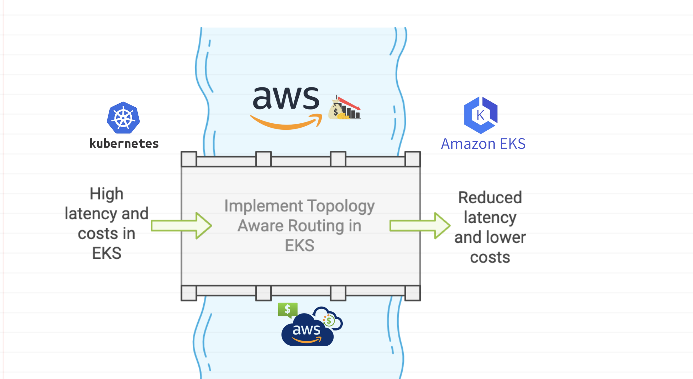
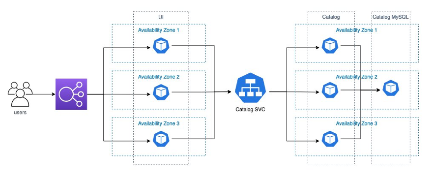

> **How Topology Aware Routing Can Reduce Costs and Improve Network Performance 🚀**

## 🔖 Introduction



As Kubernetes clusters are increasingly deployed in multi-zone environments, it becomes important to keep network traffic within the zone where it originated. [Topology Aware Routing](https://kubernetes.io/docs/concepts/services-networking/topology-aware-routing/) (TAR) is a feature in Kubernetes that adjusts routing behavior to prefer keeping traffic in the zone it originated from.

This can help reduce costs or improve network performance by minimizing inter-zone traffic and ensuring that traffic reaches its destination with minimal delay.

In this blog post, we will learn about the concept of Kubernetes topology aware routing and discuss its benefits in terms of reducing latency and optimizing network traffic flow.

We will also show you how to enable Topology Aware Routing for a Service and minimize the performance impact of overlay networking. In this blog post, we will refer to Topology Aware Routing as TAR.

<div class="note">
    <p><strong>🔵 Note:</strong></p>
    <p>Prior to Kubernetes 1.27, this feature was known as Topology Aware Hints.</p>
</div>
<br>


## 🌐 Impact of TAR on Network Traffic in Amazon EKS

A best practice for architecting resilient systems in AWS is to leverage multiple Availability Zones (AZs). AWS Regions are composed of multiple AZs designed to be independent of each other and are separated by a meaningful physical distance to avoid correlated failure scenarios.

AWS EKS makes it possible for customers to run their mission-critical workloads across multiple distinct AZs, providing increased availability by combining Amazon's global infrastructure with Kubernetes constructs such as pod topology spread constraints. However, when architecting workloads in this manner, there are considerations in terms of both latency and cost to consider. Pods within the same Amazon EKS cluster can easily communicate using a Kubernetes Cluster IP Service, which routes traffic to its associated pods even if they are in different AZs.

Although this is a convenient way to take advantage of multiple AZs, some customers may want to bias traffic routing to pods in the same AZ as the originator. Keeping traffic in the same AZ benefits latency-sensitive workloads for low latency and can reduce inter-AZ data transfer costs.

TAR is a feature that reached beta status in Kubernetes version 1.23 and became available in Amazon EKS version 1.24. It's intended to provide a mechanism that attempts to keep traffic closer to its origin within the same AZ or in another location.

## 🛠️ Services in Kubernetes

Let's begin by explaining how a Kubernetes Service operates before exploring TAR.

When you create a Service, you define a selector to target specific pods. Kubernetes generates an Endpoints object, which maintains the IP addresses of the relevant pods. Subsequently, the Kubernetes controller assigns a Cluster IP to the Service - a virtual IP accessible only within the worker nodes of the Kubernetes cluster.

The kube-proxy DaemonSet instance, running on each node, establishes a set of [iptables rules](https://kubernetes.io/docs/reference/networking/virtual-ips/#proxy-modes) (or IP Virtual Server (IPVS) virtual servers, if enabled). When traffic is directed at the Cluster IP (or enters the cluster via NodePort), either iptables or IPVS routes the packet to a pod based on its load balancing algorithm.

By default, kube-proxy adds all pods from an Endpoints object to each node's iptables or IPVS, without considering factors like the availability zones (AZs) where the pods reside or the originating traffic zone.

Consequently, packets are routed indiscriminately across AZs, potentially introducing latency and incurring inter-AZ data traffic costs.

## 🔄 Understanding TAR Functionality

TAR offers a different way to route traffic by sending some endpoints to kube-proxy. It relies on the EndpointSlices controller, which is more flexible than the Endpoints controller. Endpoints in the Endpoints controller only have pod IP addresses and ports, but EndpointSlices can include hints. Hints are extra labels on each endpoint.

TAR adds a hint about which zone the endpoint is in. When a hint is added, kube-proxy filters the endpoints based on these hints. Usually, it picks endpoints in the same zone. When traffic reaches kube-proxy, it is directed only to pods in the same zone, avoiding traffic costs.

### Hands-on example

In this walkthrough, you'll deploy an EKS cluster using Terraform. You can design your infrastructures as templates and use Terraform to provision, manage, and destroy them. Besides the cluster itself, Terraform also deploys the AWS Distro for [OpenTelemetry (ADOT) Operator](https://aws-otel.github.io/) via its [EKS Blueprints add-ons](https://github.com/aws-ia/terraform-aws-eks-blueprints-addons). The ADOT Operator enables a simplified experience for instrumenting your applications running on Amazon EKS to capture metrics and tracing data.

We'll use the ADOT Operator and AWS X-Ray to visualize the requests between workloads running on the Amazon EKS cluster. After the EKS cluster and its related infrastructure are created, we deploy the containers sample application, which shows traffic between separate front-end and back-end components. This allows us to explore how different configurations of the EKS worker nodes and pods affect TAR.



### Prerequisites

For this demo, you need the following:

- Basic understanding of Linux operating systems and Kubernetes.
- An AWS account.
- Administrator or equivalent access to deploy the required resources.
- [AWS Command Line Interface (AWS CLI)](https://docs.aws.amazon.com/cli/latest/userguide/install-cliv2.html) installed and configured.
- [Terraform CLI](https://learn.hashicorp.com/tutorials/terraform/install-cli) installed.
- [Git CLI](https://git-scm.com/book/en/v2/Getting-Started-Installing-Git) installed.
- [kubectl](https://kubernetes.io/docs/tasks/tools/install-kubectl/) and [helm client](https://helm.sh/docs/intro/install/) installed.

### Deploy EKS Cluster

We prepared a Terraform template to deploy Amazon EKS cluster and ADOT Operator. Start by cloning the sample source code repository from GitHub.

```bash
git clone https://github.com/seifrajhi/topology-aware-routing-tf
cd topology-aware-routing-tf/terraform
```

Run the following command to deploy the cluster.

```bash
export AWS_REGION="eu-west-1"
terraform init
terraform plan
terraform apply -auto-approve
```

Once the Terraform has completed, then you can set up kubectl by running this command:

```bash
aws eks --region $AWS_REGION update-kubeconfig --name tar-demo-cluster
```

### Deploy the Demo App

Run the following command to deploy the sample application:

```bash
cd ../kubernetes
kubectl apply --server-side -f common.yaml
kubectl apply --server-side -f simple.yaml
```

Get the endpoint for UI component by running the following command:

```bash
kubectl get svc ui-lb -n ui -o jsonpath={.status.loadBalancer.ingress[0].hostname}
```

You can access the demo application by accessing this link. This displays an example online shopping site.

### Run Initial Load Testing

Now we have deployed the EKS cluster and demo application, we can run a load test to simulate traffic and see how traffic between front-end and back-end is routed.

We'll use [hey](https://github.com/rakyll/hey) to generate traffic, which is a small application that can send HTTP requests.

Before you test TAR, you may want to know how traffic has been routed without TAR for comparison. You can determine this by performing a load test against this application, and traffic shows on AWS X-Ray service graph.

Run load test against UI load balancer. Run the following command:

```bash
export UI_ENDPOINT=$(kubectl get svc ui-lb -n ui -o jsonpath='{.status.loadBalancer.ingress[0].hostname}')
kubectl run load-generator \
  --image=williamyeh/hey:latest \
  --restart=Never -- -c 10 -q 5 -z 60m http://$UI_ENDPOINT/home
```

### Enable TAR and Re-run Load Testing

Enabling TAR is easy: simply set the `service.kubernetes.io/topology-mode` annotation to `Auto` on a Service. The EndpointSlice controller will try to assign hints to each endpoint in an EndpointSlice to steer traffic to Pods within a given zone. It's important to understand the [safeguards](https://kubernetes.io/docs/concepts/services-networking/topology-aware-routing/#safeguards) and [constraints](https://kubernetes.io/docs/concepts/services-networking/topology-aware-routing/#constraints) implemented by the EndpointSlice controller and the kube-proxy, especially if routing isn't working as you expect.

> **Note:** Prior to Kubernetes 1.27, this behavior was controlled using the `service.kubernetes.io/topology-aware-hints` annotation.

Now let's enable TAR and re-run the load test to see if that improves traffic routing. Run the following command to enable TAR on the catalog Service:

```bash
kubectl -n catalog annotate svc catalog service.kubernetes.io/topology-mode=Auto
```

You can run the following command to check if hints are set:

```bash
kubectl get endpointslices -l kubernetes.io/service-name=catalog -n catalog -o yaml
```

You'll get results similar to the following example. If you see hints and a corresponding AZ name, then the TAR is enabled and was successfully activated.

```yaml
addressType: IPv4
apiVersion: discovery.k8s.io/v1
endpoints:
- addresses:
  - 10.0.10.100
  conditions:
    ready: true
    serving: true
    terminating: false
  hints:
    forZones:
    - name: eu-west-1a
```

The control plane is very conservative about TAR decisions. If you run into issues, such as errors in the Service events or you find that hints are not populating on the EndpointSlice, then you should double-check that your topology labels have been applied and that Nodes are reporting values for allocatable CPU.

Re-run the load test with the following command:

```bash
export UI_ENDPOINT=$(kubectl get svc ui-lb -n ui -o jsonpath='{.status.loadBalancer.ingress[0].hostname}')
kubectl run load-generator \
  --image=williamyeh/hey:latest \
  --restart=Never -- -c 10 -q 5 -z 60m http://$UI_ENDPOINT/home
```

Now you know that each UI pod only talks to one catalog pod. You can also find that UI pod always talks to catalog pod that resides on the same AZ. No inter-AZ data traffic cost is incurred in this scenario.

## 🔚 End Notes

Topology Aware Routing is a useful feature in Kubernetes that helps manage traffic flow by keeping it within the same zone where it originated. While it may not be suitable for every workload, it can be beneficial in environments with evenly distributed zonal traffic.

In this blog post, we explored TAR and its effects on network traffic routing in Amazon EKS. We also provided a walkthrough on how to enable TAR for a Service and minimize the performance impact of overlay networking.

<br>

**_Until next time, つづく 🎉_**

> 💡 Thank you for Reading !! 🙌🏻😁📃, see you in the next talk.🤘  **_Until next time 🎉_**

🚀 Thank you for sticking up till the end. If you have any questions/feedback regarding this talk feel free to connect with me:

**♻️ LinkedIn:** https://www.linkedin.com/in/rajhi-saif/

**♻️ X/Twitter:** https://x.com/rajhisaifeddine

**The end ✌🏻**

<h1 align="center">🔰 Keep Learning !! Keep Sharing !! 🔰</h1>

**📅 Stay updated**

Subscribe to our newsletter for more insights on AWS cloud computing and containers.
