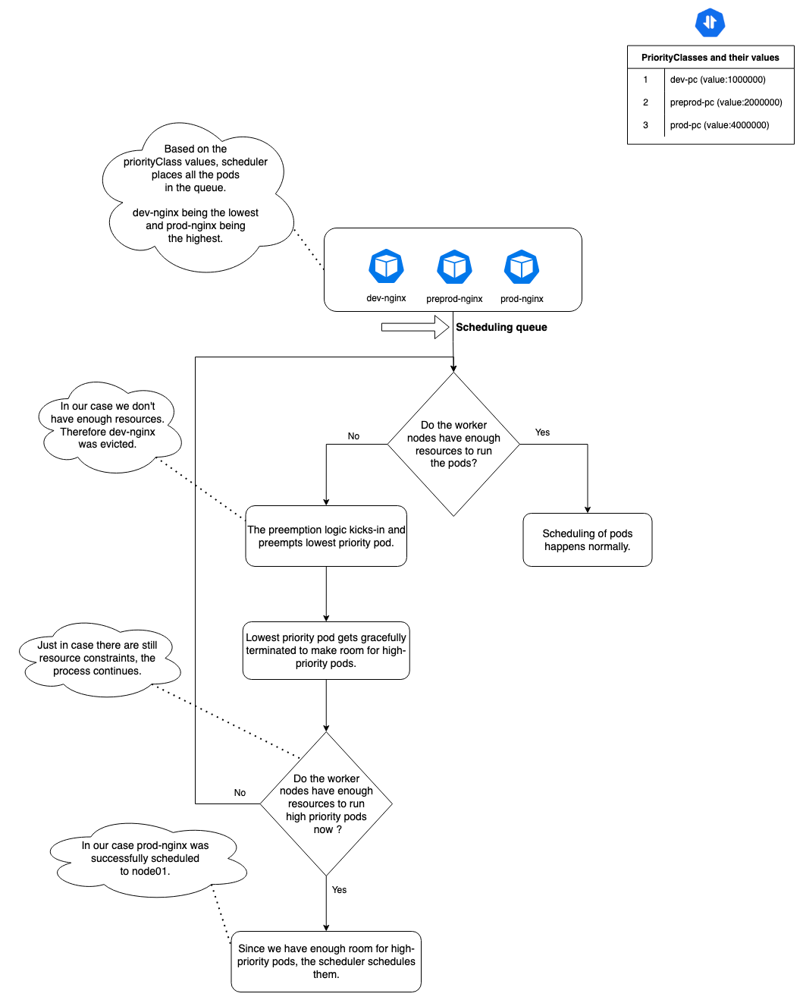

> **Explore the lesser-known features that keep Kubernetes high available**

## ⭐️ Introduction

Ensuring high availability and reliability in Kubernetes clusters can be a challenge. While some features like Deployments and Services are well-known for their ability to maintain availability, there are several lesser-known features that play an important role in keeping Kubernetes clusters running smoothly. In this article, we'll talk about some of these unsung heroes, including **Pod Topology Spread Constraints**, **pod-deletion-cost**, **maxUnavailable**, **Pod Disruption Budgets**, **PriorityClasses**, and **Pod Anti-Affinity**.

## Pod Topology Spread Constraints

Pod Topology Spread Constraints in Kubernetes allow for fine-grained control over the distribution of pods across failure domains, such as regions and zones, to achieve high availability and efficient resource utilization. These constraints use labels to enforce specific distribution patterns, ensuring that workloads are evenly distributed and separated by topology. By preventing single points of failure, they enhance fault-tolerance, improve performance, and optimize resource utilization.

For example, the `maxSkew` parameter defines the degree to which pods may be unevenly distributed, while the `minDomains` parameter forces spreading pods over a minimum number of domains. These constraints complement other Kubernetes scheduling policies, such as Pod affinity/anti-affinity, Node Selector, Node Affinity, and Node Taints, and are an important asset in deploying and running efficient and highly available workloads in complex, distributed environments.

Here's an example of a pod topology spread constraint:

```yaml
apiVersion: v1
kind: Pod
metadata:
    name: example-pod
spec:
    topologySpreadConstraints:
        - maxSkew: <integer>
            minDomains: <integer> # optional
            topologyKey: <string>
            whenUnsatisfiable: <string>
            labelSelector: <object>
            matchLabelKeys: <list> # optional
            nodeAffinityPolicy: [Honor|Ignore] # optional
            nodeTaintsPolicy: [Honor|Ignore] # optional
```

You can find a full explanation of each element in the [Kubernetes documentation](https://kubernetes.io/docs/concepts/scheduling-eviction/topology-spread-constraints/#spread-constraint-definition). For now, let's just briefly outline the obligatory fields:

- **maxSkew**: The degree to which your Pods can be distributed unevenly across all zones. Its value must be more than zero.
- **topologyKey**: The key of node labels. Nodes with the same label and values belong to the same topology. Each topology instance is a domain to which the scheduler tries to assign a balanced number of pods.
- **whenUnsatisfiable**: Lets you decide what to do with a Pod when it doesn't satisfy your spread constraint:
    1. `DoNotSchedule` instructs the scheduler not to schedule it.
    2. `ScheduleAnyway` tells the scheduler to schedule it and prioritize the nodes minimizing the skew.
- **labelSelector**: Allows finding matching Pods. The number of Pods in their corresponding topology domain is based on the Pods matching the label selector.

## Pod Deletion Cost

Pod deletion cost is an annotation in Kubernetes that allows users to set a preference regarding which pods to remove first when downscaling a ReplicaSet. By using the `controller.kubernetes.io/pod-deletion-cost` annotation, users can influence the order in which pods are deleted. The annotation should be set on the pod, and the range is `[-2147483648, 2147483647]`.

It represents the cost of deleting a pod compared to other pods belonging to the same ReplicaSet. Pods with lower deletion cost are preferred to be deleted before pods with higher deletion costs. If the annotation is not specified, the implicit value is 0.

This feature is useful for influencing the downscaling order of pods and can be particularly beneficial in scenarios where specific pods need to be retained for longer periods during downscaling. The annotation interacts with the ReplicaSet controller to determine the order of pod deletion based on the set deletion cost values. It provides a way to customize the pod deletion behavior, ensuring that pods are removed in the desired order when downscaling a ReplicaSet.

Here's an example of a YAML manifest for a Kubernetes Pod with the `controller.kubernetes.io/pod-deletion-cost` annotation:

```yaml
apiVersion: v1
kind: Pod
metadata:
    name: example-pod
    labels:
        app: example
    annotations:
        controller.kubernetes.io/pod-deletion-cost: "100"
spec:
    containers:
    - name: nginx
        image: nginx
        ports:
        - containerPort: 80
```

In this example, we have a Pod named "example-pod" with the label "app: example" running an Nginx container. The `controller.kubernetes.io/pod-deletion-cost` annotation is set to "100" to indicate the deletion cost for this Pod. When scaling down, Pods with lower deletion costs will be preferred for deletion first.

## maxUnavailable Parameter

`maxUnavailable` is a parameter in Kubernetes that specifies the maximum number of pods that can be unavailable during a rolling update. It is used in conjunction with the `maxSurge` parameter, which specifies the maximum number of new pods that can be created at a time. Together, these parameters control the rate at which pods are updated during a rolling update.

Here's an example of how to use `maxUnavailable` in a Kubernetes Deployment:

```yaml
apiVersion: apps/v1
kind: Deployment
metadata:
    name: my-deployment
spec:
    replicas: 3
    selector:
        matchLabels:
            app: my-app
    template:
        metadata:
            labels:
                app: my-app
        spec:
            containers:
            - name: my-container
                image: my-image
                ports:
                - containerPort: 80
    strategy:
        type: RollingUpdate
        rollingUpdate:
            maxSurge: 1
            maxUnavailable: 0
```

In this example, the `maxSurge` is set to 1, which means that only one new pod can be created at a time. The `maxUnavailable` is set to 0, which means that no old pods can be deleted at a time.

Keep in mind that `maxUnavailable` can only be used to control the eviction of pods that have an associated controller managing them. In the case of a Deployment, this means that the controller is the ReplicaSet. If you want to control the eviction of pods in a StatefulSet, you can use the `maxUnavailable` parameter in the StatefulSet's rolling update strategy.

## Pod Disruption Budgets (PDB)

PDBs are a Kubernetes feature that allows users to declare the minimum or maximum number of unavailable pods for an application during disruptions. PDBs help ensure the high availability of applications by setting constraints on the number of pods that can be disrupted at a time. Disruptions can be voluntary, such as maintenance operations or node scaling, or involuntary, such as hardware failures or system crashes.

### Three Steps to Creating a PDB:

1. **Determine the Minimum Number of Instances**: Assess your application's needs and identify the minimum number of instances (`minAvailable`) that must be operational during disruptions.
2. **Create a YAML File**: Use a text editor to create a YAML file that specifies the PDB object. Here's an example YAML file:

        ```yaml
        apiVersion: policy/v1
        kind: PodDisruptionBudget
        metadata:
            name: my-pdb
        spec:
            minAvailable: 2
            selector:
                matchLabels:
                    app: my-app
        ```

        In this example, the `minAvailable` field is set to 2, indicating that at least two instances of the specified pods should be available at any given time. The `selector` field identifies the target pods based on the label selector `app: my-app`.

3. **Apply the YAML File**: Use the `kubectl apply` command to apply the YAML file and create the PDB within your Kubernetes cluster:

        ```sh
        kubectl apply -f pdb.yaml
        ```

## Kubernetes Pod Priority & Preemption

`PriorityClass` is a cluster-wide API object in Kubernetes and part of the `scheduling.k8s.io/v1` API group. It contains a mapping of the `PriorityClass` name (defined in `.metadata.name`) and an integer value (defined in `.value`). This represents the value that the scheduler uses to determine Pod's relative priority.

[Pod preemption](https://kubernetes.io/docs/concepts/scheduling-eviction/pod-priority-preemption/#preemption) is a Kubernetes feature that allows the cluster to preempt pods (removing an existing Pod in favor of a new Pod) on the basis of priority. [Pod priority](https://kubernetes.io/docs/concepts/scheduling-eviction/pod-priority-preemption/#pod-priority) indicates the importance of a pod relative to other pods while scheduling. If there aren't enough resources to run all the current pods, the scheduler tries to evict lower-priority pods over high-priority ones.

Here's an example. Next, create some environment-specific `PriorityClasses`:

```yaml
apiVersion: scheduling.k8s.io/v1
kind: PriorityClass
metadata:
    name: dev-pc
value: 1000000
globalDefault: false
description: >-
    (Optional) This priority class should only be used for all development pods.
---
apiVersion: scheduling.k8s.io/v1
kind: PriorityClass
metadata:
    name: preprod-pc
value: 2000000
globalDefault: false
description: >-
    (Optional) This priority class should only be used for all preprod pods.
---
apiVersion: scheduling.k8s.io/v1
kind: PriorityClass
metadata:
    name: prod-pc
value: 4000000
globalDefault: false
description: >-
    (Optional) This priority class should only be used for all prod pods.
```

Use `kubectl create -f <FILE.YAML>` command to create a pc and `kubectl get pc` to check its status.

```sh
$ kubectl get pc
NAME                      VALUE        GLOBAL-DEFAULT   AGE
dev-pc                    1000000      false            3m13s
preprod-pc                2000000      false            2m3s
prod-pc                   4000000      false            7s
system-cluster-critical   2000000000   false            82m
system-node-critical      2000001000   false            82m
```

Now, let's say there are 3 application pods: one for prod, one for preprod, and one for development. Below are three sample YAML manifest files for each of those.

```yaml
---
# development
apiVersion: v1
kind: Pod
metadata:
    name: dev-nginx
    labels:
        env: dev
spec:
    containers:
    - name: dev-nginx
        image: nginx
    priorityClassName: dev-pc
---
# preproduction
apiVersion: v1
kind: Pod
metadata:
    name: preprod-nginx
    labels:
        env: preprod
spec:
    containers:
    - name: preprod-nginx
        image: nginx
    priorityClassName: preprod-pc
---
# production
apiVersion: v1
kind: Pod
metadata:
    name: prod-nginx
    labels:
        env: prod
spec:
    containers:
    - name: prod-nginx
        image: nginx
    priorityClassName: prod-pc
```

You can create these pods with the `kubectl create -f <FILE.yaml>` command, and then check their status using the `kubectl get pods` command. You can see if they are up and look ready to serve traffic:

```sh
$ kubectl get pods --show-labels
NAME            READY   STATUS    RESTARTS   AGE   LABELS
dev-nginx       1/1     Running   0          55s   env=dev
preprod-nginx   1/1     Running   0          55s   env=preprod
prod-nginx      0/1     Pending   0          55s   env=prod
```

The diagram below shows exactly how it works with the help of an exampl



## Inter-pod Anti-affinity

Inter-pod affinity and anti-affinity allow you to constrain which nodes your Pods can be scheduled on based on the labels of Pods already running on that node, instead of the node labels. Inter-pod affinity and anti-affinity rules take the form "this Pod should (or, in the case of anti-affinity, should not) run in an X if that X is already running one or more Pods that meet rule Y", where X is a topology domain like node, rack, cloud provider zone or region, or similar and Y is the rule Kubernetes tries to satisfy.

You express these rules (Y) as [label selectors](https://kubernetes.io/docs/concepts/overview/working-with-objects/labels/#label-selector) with an optional associated list of namespaces. Pods are namespaced objects in Kubernetes, so Pod labels also implicitly have namespaces. Any label selectors for Pod labels should specify the namespaces in which Kubernetes should look for those labels. You express the topology domain (X) using a `topologyKey`, which is the key for the node label that the system uses to denote the domain.

Here's what the pod spec looks like:

```yaml
spec:
    affinity:
        podAntiAffinity:
            requiredDuringSchedulingIgnoredDuringExecution:
            - labelSelector:
                    matchExpressions:
                    - key: app
                        operator: In
                        values:
                        - web
                topologyKey: kubernetes.io/hostname
            preferredDuringSchedulingIgnoredDuringExecution:
            - weight: 100
                podAffinityTerm:
                    labelSelector:
                        matchExpressions:
                        - key: app
                            operator: In
                            values:
                            - backend
                    topologyKey: kubernetes.io/hostname
```

Let's dive into the inter-pod anti-affinity structure:

- **requiredDuringSchedulingIgnoredDuringExecution**: It means that conditions must be satisfied to pod be scheduled (hard requirement).
- **preferredDuringSchedulingIgnoredDuringExecution**: If a condition can be satisfied, it will be satisfied. But if not, it will be ignored (soft requirement).
- **podAffinityTerm**: The pod affinity term defines which pods we select with a label selector and which node topology key we target.

A soft requirement has `podAffinityTerm` as separate property with an additional weight parameter that defines which term is more important. A hard requirement has an affinity term as a root list item object. For the hard affinity rule, all affinity terms and all expressions should be satisfied for the pod to be scheduled.

## Wrap Up

In this blog post, we explore the lesser-known features of Kubernetes that play an important role in keeping Kubernetes clusters running smoothly. We discuss **Pod Topology Spread Constraints**, **pod-deletion-cost**, **maxUnavailable**, **Pod Disruption Budgets**, and **PriorityClasses**. These features help ensure high availability and reliability in Kubernetes clusters, making them essential for managing Kubernetes workloads effectively.


<br>

**_Until next time, つづく 🎉_**

> 💡 Thank you for Reading !! 🙌🏻😁📃, see you in the next blog.🤘  **_Until next time 🎉_**

🚀 Thank you for sticking up till the end. If you have any questions/feedback regarding this blog feel free to connect with me:

**♻️ LinkedIn:** https://www.linkedin.com/in/rajhi-saif/

**♻️ X/Twitter:** https://x.com/rajhisaifeddine

**The end ✌🏻**

<h1 align="center">🔰 Keep Learning !! Keep Sharing !! 🔰</h1>

**📅 Stay updated**

Subscribe to our newsletter for more insights on AWS cloud computing and containers.
