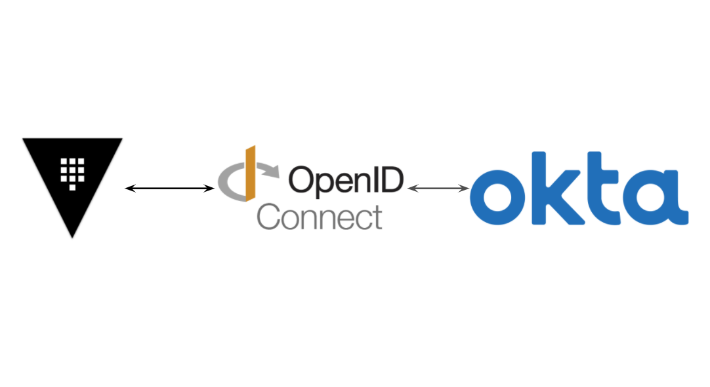
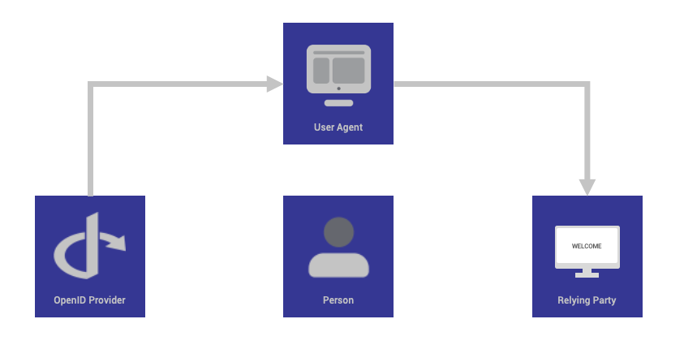
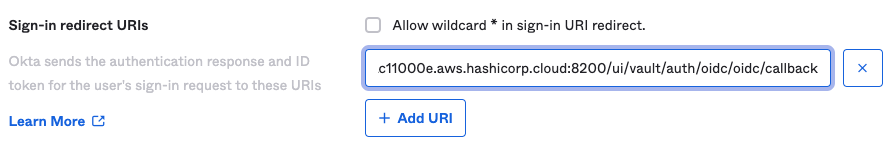
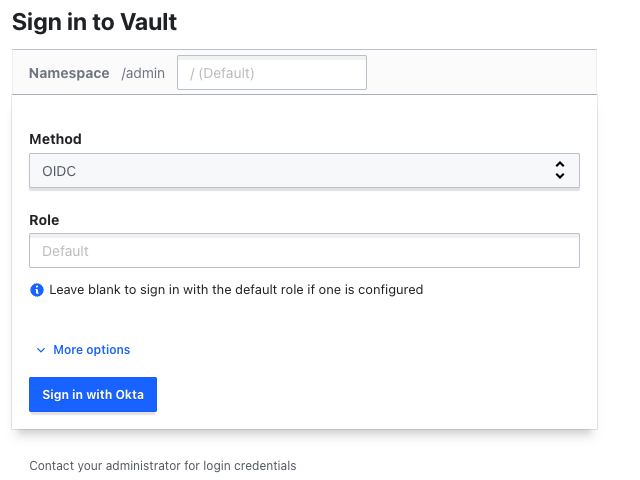

> **Enhancing Security and Access Control 🔆**

## 💬 Introduction

Hashicorp Vault is a popular open-source secret management tool that helps organizations to securely store and manage their secrets. Vault can be configured to integrate with a variety of identity providers, including Okta. This allows organizations to use their existing Okta credentials to authenticate to Vault, which can simplify workflows and improve security.

OpenID Connect (OIDC) is a standard-based identity layer on top of OAuth 2.0 that provides additional features such as user authentication and profile information. Vault supports OIDC authentication, which allows organizations to use Okta as an OIDC identity provider for Vault.

This blog post will provide a comprehensive guide on how to configure Okta authentication in Vault using OpenID Connect.



## What is OpenID Connect

[OpenID Connect](https://openid.net/) is an interoperable authentication protocol based on the OAuth 2.0 framework of specifications (IETF RFC 6749 and 6750). It simplifies the way to verify the identity of users based on the authentication performed by an Authorization Server and to obtain user profile information in an interoperable and REST-like manner.

OpenID Connect enables application and website developers to launch sign-in flows and receive verifiable assertions about users across Web-based, mobile, and JavaScript clients. The specification suite is extensible to support a range of optional features such as encryption of identity data, discovery of OpenID Providers, and session logout.

For developers, it provides a secure and verifiable answer to the question "What is the identity of the person currently using the browser or mobile app that is connected?" Best of all, it removes the responsibility of setting, storing, and managing passwords which is frequently associated with credential-based data breaches.

---

## How OpenID Connect Works

OpenID Connect enables an Internet identity ecosystem through easy integration and support, security and privacy-preserving configuration, interoperability, wide support of clients and devices, and enabling any entity to be an OpenID Provider (OP).

The OpenID Connect protocol, in abstract, follows these steps:

1. End user navigates to a website or web application via a browser.
2. End user clicks sign-in and types their username and password.
3. The RP (Client) sends a request to the OpenID Provider (OP).
4. The OP authenticates the User and obtains authorization.
5. The OP responds with an Identity Token and usually an Access Token.
6. The RP can send a request with the Access Token to the User device.
7. The UserInfo Endpoint returns Claims about the End-User.



### Lab Setup

Open a new terminal window and start a Vault dev server with root as the root token.

```shell
$ vault server -dev -dev-root-token-id root
```

The Vault dev server defaults to running at `127.0.0.1:8200`. The server is initialized and unsealed.

Export an environment variable for the vault CLI to address the Vault server.

```shell
$ export VAULT_ADDR=http://127.0.0.1:8200
```

Export an environment variable for the vault CLI to authenticate with the Vault server.

```shell
$ export VAULT_TOKEN=root
```

### Okta Setup

If you do not have an Okta account, sign up for an [Okta Developer Edition account](https://developer.okta.com/signup/).

#### Okta Users and Groups

To demonstrate authentication and policy assignment based on group membership you will create one user, and two groups in Okta.

1. Launch the Okta portal and login.
2. In the Okta dashboard, expand **Directory** in the left navigation menu and click **People**.
3. Click the **Add person** button and enter the following:

```shell
User type: User
First name: Bill
Last name: Example
Username: bill@example.com
Password: Set by admin
Enter password: Password1!
```

4. Uncheck the **User must change password on first login** checkbox.
5. Click the **Save** button.
6. Click **Groups** in the left navigation menu.
7. Click the **Add Group** button, name the group `okta-group-vault-admins` and click the **Save** button.
8. Click the **Add Group** button, name the group `okta-group-vault-developer` and click the **Save** button.
9. Click on `okta-group-vault-admins` and click the **Assign People** button.
10. Click Bill Example to add that user to the Members list and click the **Save** button.
11. Click the `<- Back to Groups` link.
12. Click on `okta-group-vault-developer` and click the **Assign People** button.
13. Click Bill Example to add that user to the Members list and click the **Save** button.

You have created one user, Bill, and assigned him to Okta groups `okta-group-vault-admins` and `okta-group-vault-developer`. 🎉

### Okta OIDC Configuration

1. Expand **Security** in the left navigation menu and click **API**.
2. Click **default** and then click the **Claims** tab.
3. Click the **+ Add Claim** button and enter the following:

```shell
Name: groups
Include in token type: ID Token / Always
Value type: Groups
Filter: Starts with / okta-group-vault
Include in: Click the The following scopes: radio button
In the text box below The following scopes: type profile and click profile when it appears.
Click the Create button.
```

You have updated the default authorization server to include groups with the token ID. Adding groups to the token ID will allow you to assign a Vault policy based on the Okta group membership.

4. Expand **Applications** in the left navigation menu and click **Applications**.
5. Click the **Create App Integration** button.
6. Click the **OIDC - OpenID Connect** radio button, a new section will appear.
7. Click the **Web Application** radio button and then click the **Next** button.
8. In the **App integration name** text box enter `hc-vault`.
9. In the **Grant type** section click the checkbox for **Implicit (hybrid)**.
10. Remove any existing Sign-in redirect URIs by clicking the **X** button.
11. Click the **+ Add URI** button - an empty text box will appear.
12. Retrieve and copy the address of the Vault cluster stored in the `VAULT_ADDR` environment variable.

```shell
echo $VAULT_ADDR
```

13. Enter the address of your Vault cluster followed by `/ui/vault/auth/oidc/oidc/callback`.

This URI will support authenticating a user via the Vault UI.

14. Click the **+ Add URI** button again. Enter `http://localhost:8250/oidc/callback`.



This URI supports authenticating a user via the Vault CLI. For more information visit the [JWT/OIDC auth method documentation](https://developer.hashicorp.com/vault/docs/auth/jwt).

15. Scroll to the bottom of the form.
16. In the **Assignments** section, click the **Limit access to selected groups** radio button.
17. In the **Selected group(s)** text box, enter `okta-group` and click `okta-group-vault-admins`.
18. Enter `okta-group` again and click `okta-group-vault-developer`.
19. Click the **Save** button.
20. Click the **Sign On** tab.
21. In the **OpenID Connect ID Token** section, click **Edit**.
22. In the **Groups claim filter** text box enter `okta-group-vault`.
23. Click the **Save** button.
24. Click the **Okta API Scopes** tab.
25. Find `okta.groups.read` in the list and click **Grant**.
26. Find `okta.users.read.self` in the list and click **Grant**.

You have created an application integration that will support OIDC and assigned the user groups you created to this integration. 🎉

### Collect Okta Configuration Settings

1. Click the **General** tab.
2. Copy the **Client ID**.
3. Switch to your terminal and set an environment variable named `OKTA_CLIENT_ID`.

```shell
$ export OKTA_CLIENT_ID=<CLIENT_ID>
```

4. Switch back to the Okta `hc-vault` configuration page and copy the **Client secret**.
5. Switch to your terminal and set an environment variable named `OKTA_CLIENT_SECRET`.

```shell
$ export OKTA_CLIENT_SECRET=<CLIENT_SECRET>
```

6. Switch back to the Okta `hc-vault` configuration page. Click the user pull down menu at the top right of the Okta dashboard and copy the **Okta domain**.
7. Switch to your terminal and set an environment variable named `OKTA_DOMAIN`.

```shell
$ export OKTA_DOMAIN=<OKTA_DOMAIN>
```

### Configure Vault

You have now configured your local workstation and Okta with enough sample data to start the Vault OIDC auth method configuration.

#### Create Vault Policies

Within an organization, personas with different capabilities are required to interact with the secrets stored in Vault. Each persona requires a different set of capabilities. These are expressed in policies. If you are not familiar with policies, [complete the policies tutorial](https://developer.hashicorp.com/vault/tutorials/getting-started/getting-started-policies).

During the Okta configuration, we created a user, Bill. He was added to the `okta-group-vault-admins` group and to the `okta-group-vault-developer` group. You will now create a policy that allows read access to the k/v secrets engine for Bill, and a policy that allows him also admin/super user access.

Create the policy file named `vault-policy-developer-read.hcl`.

```shell
tee vault-policy-developer-read.hcl <<EOF
# Read permission on the k/v secrets
path "/secret/*" {
    capabilities = ["read", "list"]
}
EOF
```

This policy grants read and list capabilities to all paths in the KV secrets engine enabled at the secret path.

Create a Vault policy named `vault-policy-developer-read` using the file `vault-policy-developer-read.hcl`.

```shell
$ vault policy write vault-policy-developer-read vault-policy-developer-read.hcl
```

Create the policy file named `vault-policy-admin.hcl`.

```shell
$ tee vault-policy-admin.hcl <<EOF
# Admin policy
path "*" {
        capabilities = ["sudo","read","create","update","delete","list","patch"]
}
EOF
```

Create a Vault policy named `vault-policy-admin` using the file `vault-policy-admin.hcl`.

```shell
$ vault policy write vault-policy-admin vault-policy-admin.hcl
```

Success! Uploaded policy: `vault-policy-admin`.

### Enable OIDC Auth Method

The preferred way to configure Vault in a repeatable way is using [Terraform](https://terraform.io/). For this, there is a [onetwopunch/okta/vault terraform module](https://github.com/onetwopunch/terraform-vault-okta) for you to use that automates this, so we'll go through how to use it here. If you're new to Terraform, you'll first need to download the executable and create a `main.tf` file that looks like this:

```hcl
module "okta" {
  source  = "onetwopunch/okta/vault"
  version = "v0.2.0"

  okta_discovery_url = "https://$OKTA_DOMAIN"
  okta_client_id     = "$OKTA_CLIENT_ID"
  okta_client_secret = "$OKTA_CLIENT_SECRET"
  vault_addr         = "https://<Vault Domain>:8200"
  okta_bound_audiences = [
    "api://vault",
    "$OKTA_CLIENT_ID"
  ]

  roles = {
    vault-role-okta-group-vault-admins = {
          token_policies = ["default","vault-policy-admin"]
          bound_groups   = ["okta-group-vault-admins"]
        },
    vault-role-okta-group-vault-developer ={
          token_policies = ["default","vault-policy-developer-read"]
          bound_groups   = ["okta-group-vault-developer"]    
    }
  }
}
```

### Login with OIDC

Launch the Vault UI. Select **OIDC** from the Method drop-down list.



Click **Sign in with Okta**. A new browser window will open. Log in as `bill@example.com` and the password `Password1!`.

## Conclusion

In this tutorial, you learned how to create Okta groups and update the default authorization server to include a user's group membership in the ID Token, create and configure a new Okta application integration to support OpenID Connect, and configured HCP Vault to authenticate users and assign unique policies to users based on their Okta group membership.

You should now have everything you need on the Okta side to support the OIDC auth flow, authenticate against your active directory, and provide proper scopes and claims back to Vault to test basic Vault functionality.

<br>

**_Until next time, つづく 🎉_**

> 💡 Thank you for Reading !! 🙌🏻😁📃, see you in the next blog.🤘  **_Until next time 🎉_**

🚀 Thank you for sticking up till the end. If you have any questions/feedback regarding this blog feel free to connect with me:

**♻️ LinkedIn:** https://www.linkedin.com/in/rajhi-saif/

**♻️ X/Twitter:** https://x.com/rajhisaifeddine

**The end ✌🏻**

<h1 align="center">🔰 Keep Learning !! Keep Sharing !! 🔰</h1>

**📅 Stay updated**

Subscribe to our newsletter for more insights on AWS cloud computing and containers.
