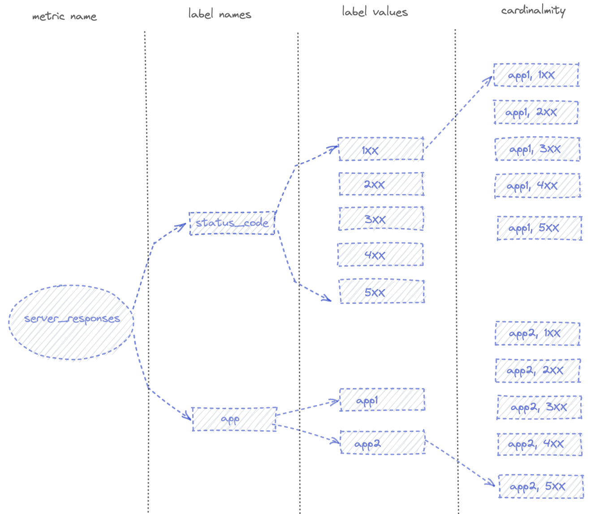
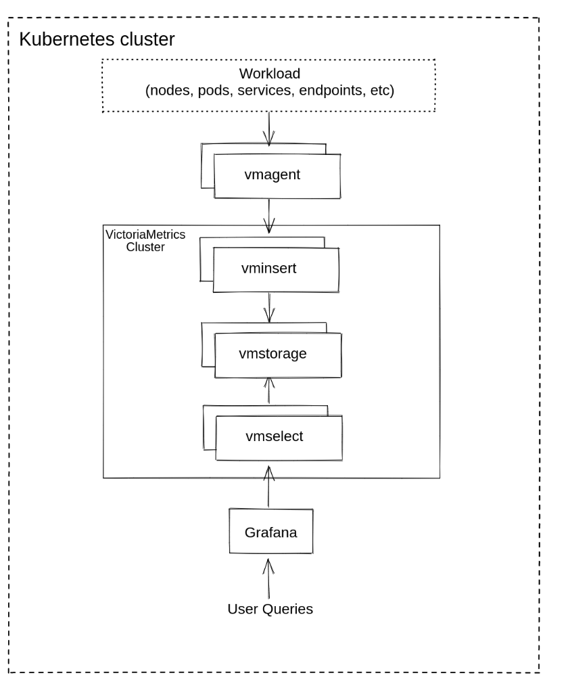
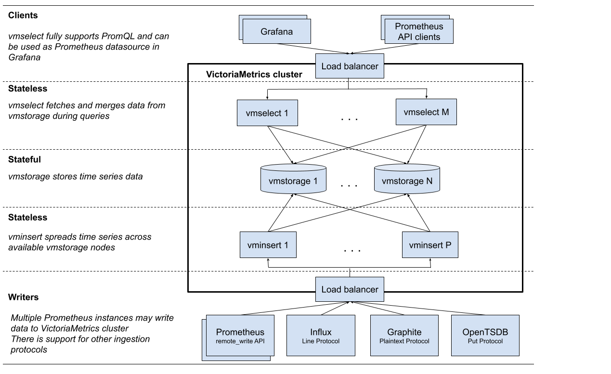
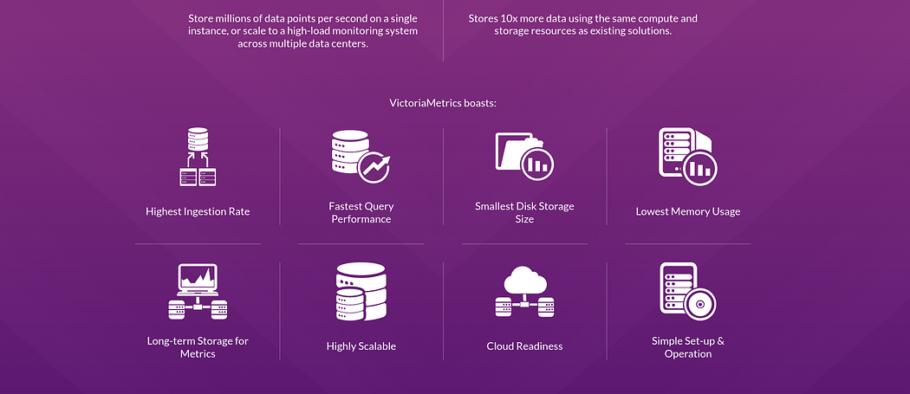
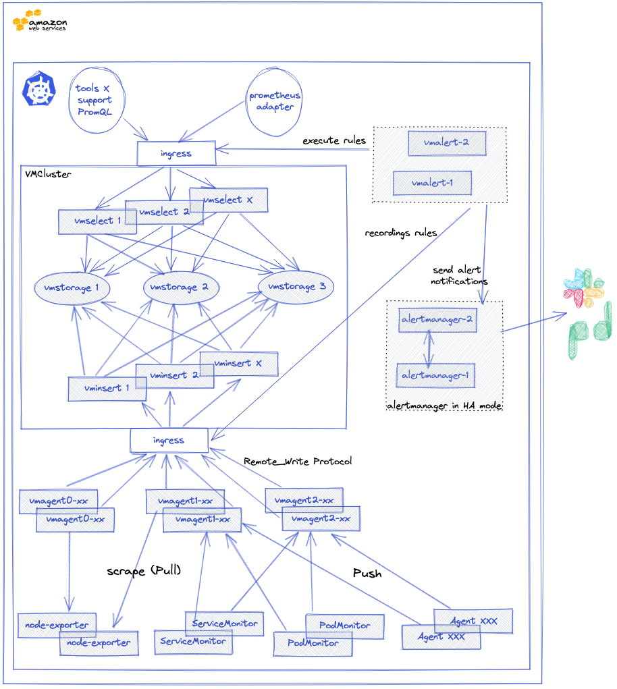

> **A great Time-Series database for monitoring and analytics 🔆**

## 💬 Introduction

[VictoriaMetrics](https://victoriametrics.com/) is a time-series database designed for high-performance monitoring and analytics. It is similar to Prometheus in many ways, but it offers several advantages, including better performance, scalability, and data compression. VictoriaMetrics is also open-source and free to use.

VictoriaMetrics can monitor a wide range of systems, including Kubernetes clusters, servers, applications, infrastructure components, and even IoT devices.

In this blog post, we will provide a comprehensive overview of VictoriaMetrics, covering the following topics:

- What is VictoriaMetrics and how does it work?
- How does VictoriaMetrics compare to Prometheus?
- How to implement Kubernetes monitoring with VictoriaMetrics

This blog post is for anyone who wants to learn more about VictoriaMetrics or use it to improve their system monitoring capabilities. It is also a good resource for anyone who is considering using Prometheus and wants to compare the two solutions.


**TL;DR: VictoriaMetrics and Prometheus**

**VictoriaMetrics** and **Prometheus** are both time-series databases used for monitoring and analytics, but they have some key differences:

**Main features of VictoriaMetrics Compared to Prometheus**

1. **Performance and Scalability**:
   - **VictoriaMetrics**: Higher performance, better scalability, and more efficient data compression.
   - **Prometheus**: Good performance but can struggle with high cardinality metrics and large-scale environments.

2. **Resource Usage**:
   - **VictoriaMetrics**: Lower CPU, RAM, and disk IO usage, especially with [vmagent](https://docs.victoriametrics.com/vmagent/).
   - **Prometheus**: Higher resource consumption, especially with high cardinality metrics.

3. **Data Ingestion**:
   - **VictoriaMetrics**: Supports both pull and push models natively.
   - **Prometheus**: Primarily pull-based; requires Pushgateway for push model.

4. **High Availability**:
   - **VictoriaMetrics**: Built-in support for high availability.
   - **Prometheus**: No native high availability; requires duplication and sharding.

5. **Long-Term Storage**:
   - **VictoriaMetrics**: Designed for long-term storage with efficient data retention.
   - **Prometheus**: Not intended for long-term storage; relies on external solutions.

6. **Anomaly Detection**:
   - **VictoriaMetrics**: Includes built-in anomaly detection features.
   - **Prometheus**: Does not have built-in anomaly detection.

7. **Buffering**:
   - **VictoriaMetrics**: Independent disk-backed buffers for each remote storage.
   - **Prometheus**: Single shared buffer for all remote storage systems.

8. **Query Language**:
   - **VictoriaMetrics**: Uses MetricsQL, which extends PromQL with additional features.
   - **Prometheus**: Uses PromQL.

## 📊 VictoriaMetrics vs Prometheus: System Properties Comparison

VictoriaMetrics is a monitoring system that is fully compatible with Prometheus. It offers many of the same features as Prometheus, but with some additional benefits, such as higher performance and scalability.

One key difference between VictoriaMetrics and Prometheus is that VictoriaMetrics includes an anomaly detection feature. This feature can be used to identify unusual changes in metrics data, which can be helpful for troubleshooting and identifying potential problems.

While both `vmagent` and Prometheus may scrape Prometheus targets (aka `/metrics` pages) according to the provided Prometheus-compatible scrape configs and send data to multiple remote storage systems, `vmagent` has the following additional features:

- `vmagent` usually requires lower amounts of CPU, RAM, and disk IO compared to Prometheus when scraping an enormous number of targets (more than 1000) or targets with a great number of exposed metrics.
- `vmagent` provides independent disk-backed buffers for each configured remote storage (see `-remoteWrite.url`). This means that slow or temporarily unavailable storage doesn't prevent it from sending data to healthy storage in parallel. Prometheus uses a single shared buffer for all the configured remote storage systems (see `remote_write->url`) with a hardcoded retention of 2 hours.
- `vmagent` may accept, relabel, and filter data obtained via multiple data ingestion protocols in addition to data scraped from Prometheus targets. That means it supports both pull and push protocols for data ingestion. [See these docs for details](https://docs.victoriametrics.com/vmagent.html#features).

Prometheus does not have a native High Availability mode: to have high availability, we had to duplicate our Prometheus instances. This implies that our targets were "scraped" by all our Prometheus instances (same for our rules and records). To avoid this, we had to use sharding, but this made the infrastructure more complex. More information on this subject in [this documentation](https://github.com/prometheus-operator/prometheus-operator/blob/main/Documentation/high-availability.md) from the Prometheus operator.

Prometheus is not designed to store metrics on a long-term basis, as mentioned in [the documentation](https://prometheus.io/docs/prometheus/latest/storage/#operational-aspects):

> Prometheus's local storage is not intended to be durable long-term storage; external solutions offer extended retention and data durability.

We worked around this limitation by using VictoriaMetrics (VMCluster) as a LongTermStorage via the `remote_write` protocol.

All processes (scraping, ingest, storage, etc.) were, until now, managed in the same Prometheus instance, which implied a less flexible and vertical scaling only (since recently a [Prometheus agent](https://prometheus.io/blog/2021/11/16/agent/) is available for the "scraping" part).

The RAM and CPU usage of a Prometheus instance is correlated to the number of metrics (and their cardinality) it has to manage. In our case, several Prometheus instances consumed more than 64 GB of RAM and 26 CPUs each, in order to absorb our peak loads. In a Kubernetes cluster, this high resource consumption can cause problems, especially for scheduling.

The Write-Ahead Log (WAL) system can cause rather slow restarts if the Prometheus instance runs out of RAM and can cause the Prometheus instance to hang for varying lengths of time. During the replay of the WAL, Prometheus doesn't scrape anything, thus there is no alerting and no way of knowing if something is going on.

## 📈 The Cardinality of Metrics

When our Kubernetes clusters manage a large number of pods, a constraint quickly appears: cardinality.

> The cardinality of a metric is the number of TimeSeries of that metric with single-valued labels.



In the example above, the `status_code` label has a cardinality of 5, `app` has a cardinality of 2, and the overall cardinality of the `server_responses` metric is 10. In this example, any Prometheus instance can handle this cardinality, but if you add, for example, the label `pod_name` or `client_IP` (or both) to the `server_responses` metric, the cardinality increases for each different client's calls and for each pod.

You should read the excellent [article on cardinality](https://www.robustperception.io/cardinality-is-key) from "Robust Perception" for more details on this subject.

At Bedrock, the high cardinality metrics come from our HAProxy ingress. For our needs, we retrieve several labels like the name of the ingress pod as well as its IP address, but more importantly, the name and IP address of the destination pod. In a cluster that can grow to more than 15,000 pods, the combination of unique labels (cardinality) is very significant for some of our ingress metrics.

We found that Prometheus performed poorly when we had multiple metrics with high cardinalities (> 100,000), resulting in over-consumption of RAM. During a high load event, Prometheus could consume up to 200 GB of RAM before being OOMKilled. When this happened, we would go completely blind as we had no metrics or alerting. This also impacts scalability in our Kubernetes clusters, as we use [Custom Metrics](https://kubernetes.io/docs/tasks/run-application/horizontal-pod-autoscale/#scaling-on-custom-metrics) very heavily in HPAs to scale the number of pods in our applications.

There are many comparisons available online; here is a summary:

- [System Properties Comparison: Prometheus vs. VictoriaMetrics](https://db-engines.com/en/system/Prometheus%3BVictoriaMetrics) - General information on both systems.
- [Prometheus vs VictoriaMetrics Benchmark on Node Exporter Metrics](https://valyala.medium.com/prometheus-vs-victoriametrics-benchmark-on-node-exporter-metrics-4ca29c75590f) - VictoriaMetrics uses much less disk and memory.
- [FAQ: Differences Between vmagent and Prometheus](https://docs.victoriametrics.com/FAQ.html#what-is-the-difference-between-vmagent-and-prometheus) - FAQ from VictoriaMetrics.
- [Prominent Features of VictoriaMetrics](https://docs.victoriametrics.com/Single-server-VictoriaMetrics.html#prominent-features) - Documentation from VictoriaMetrics about its capabilities.

In short, some of VictoriaMetrics' abilities include:

- Supports both Pull and Push models (unlike Prometheus, which requires Pushgateway for push).
- You can configure Prometheus with remote write to VictoriaMetrics, i.e., write data to VictoriaMetrics from Prometheus.
- VictoriaMetrics has a concept of "namespaces" - you can have isolated environments for metrics, see [Multitenancy](https://docs.victoriametrics.com/Cluster-VictoriaMetrics.html#multitenancy).
- Has its own [MetricsQL](https://docs.victoriametrics.com/MetricsQL.html) with wider capabilities than PromQL.
- For acquaintance, there is a [VictoriaMetrics playground](https://play.victoriametrics.com/select/accounting/1/6a716b0f-38bc-4856-90ce-448fd713e3fe/prometheus/graph/#/).
- For AWS, there is [Managed VictoriaMetrics](https://aws.amazon.com/marketplace/pp/prodview-4tbfq5icmbmyc).

## 🏗️ VictoriaMetrics Cluster Architecture

VictoriaMetrics can be deployed as a single server or as a cluster version. I chose to [deploy the VictoriaMetrics-cluster on k8s](https://docs.victoriametrics.com/guides/k8s-monitoring-via-vm-cluster.html) using Helm charts.





- **vmstorage**: Stores the raw data and returns the queried data on the given time range for the given label filters. This is the only stateful component in the cluster.
- **vminsert**: Accepts the ingested data and spreads it among vmstorage nodes according to consistent hashing over metric name and all its labels.
- **vmselect**: Performs incoming queries by fetching the needed data from all the configured vmstorage nodes.
- **vmauth**: A simple auth proxy and router for the cluster. It reads auth credentials from the Authorization HTTP header (Basic Auth, Bearer token, and [InfluxDB authorization](https://github.com/VictoriaMetrics/VictoriaMetrics/issues/1897) is supported), matches them against configs, and proxies incoming HTTP requests to the configured targets.
- **vmagent**: A tiny but mighty agent that helps you collect metrics from various sources and store them in VictoriaMetrics or any other Prometheus-compatible storage systems that support the remote_write protocol.
- **vmalert**: Executes a list of the given alerting or recording rules against configured data sources. Sending alerting notifications, vmalert relies on configured [Alertmanager](https://github.com/prometheus/alertmanager). Recording rules results are persisted via [remote write](https://prometheus.io/docs/prometheus/latest/storage/#remote-storage-integrations) protocol. vmalert is heavily inspired by Prometheus implementation and aims to be compatible with its syntax.
- **promxy**: Used for querying the data from multiple clusters. It's a Prometheus proxy that makes many shards of Prometheus appear as a single API endpoint to the user.

##  Cluster Resizing and Scalability

Cluster performance and capacity can be scaled up in two ways:

1. **Vertical Scalability**: By adding more resources (CPU, RAM, disk IO, disk space, etc.).
2. **Horizontal Scalability**: By adding more of each component to the cluster.

The components can all be scaled individually, with the only stateful component being the `vmstorage` component. This makes it easier to maintain and scale clusters. Adding new components and updating `vminsert` configurations is all it takes to scale the storage layer. Nothing else is needed.



## 🛠️ Implementation of VictoriaMetrics

VictoriaMetrics has charts for each component to deploy in Kubernetes. See [Victoria Metrics Helm Charts](https://github.com/VictoriaMetrics/helm-charts/tree/master). There are also charts to run [VictoriaMetrics Operator](https://github.com/VictoriaMetrics/operator) and [victoria-metrics-k8s-stack](https://github.com/VictoriaMetrics/helm-charts/blob/master/charts/victoria-metrics-k8s-stack/README.md) – an analog of the Kubernetes Prometheus Stack.

We will use the [victoria-metrics-k8s-stack](https://github.com/VictoriaMetrics/helm-charts/blob/master/charts/victoria-metrics-k8s-stack/README.md), which "under the hood" will launch VictoriaMetrics Operator, Grafana, and kube-state-metrics. See its [dependencies](https://github.com/VictoriaMetrics/helm-charts/blob/master/charts/victoria-metrics-k8s-stack/Chart.yaml#L10C1-L10C13).

A VMCluster (Insert, Select, Storage) is deployed to manage access to metrics. The collection of metrics (push/pull) from exporters in Prometheus format is handled by the `vmagent`. Its configuration is done in the form of a Prometheus configuration file. It is able to:

- Manage the relabeling of metrics.
- Temporarily store the metrics it has collected if the VMCluster is unavailable or not able to send the metrics to the VMCluster.
- Limit the cardinality of metrics.

One of the advantages of using this Helm chart is that it will deploy essential components to properly monitor a Kubernetes cluster such as `kube-state-metrics` or `prometheus-node-exporter`, but also scraping configurations for services such as `Kubelet`, `KubeApiServer`, `KubeControllerManager`, `KubeDNS`, `KubeEtcd`, `KubeScheduler`, `KubeProxy`.

Alerting is also managed via a `VMAlert` component, which will execute the alerting and recording rules set by VictoriaMetrics. Notifications are managed by an `Alertmanager`, which is also deployable via this chart.

This is what the monitoring and alerting stack based on this Helm chart looks like:



If you want to keep historical metrics of your Kubernetes clusters, VictoriaMetrics provides a tool to manage the export and import of data from different TSDB: [vmctl](https://docs.victoriametrics.com/vmctl.html).

Let's go. Let's start by checking the chart itself: `victoria-metrics-k8s-stack`.

### 📦 VictoriaMetrics Stack Helm Chart Installation

Add repositories with dependencies:

```shell
helm repo add grafana https://grafana.github.io/helm-charts
"grafana" has been added to your repositories
helm repo add prometheus-community https://prometheus-community.github.io/helm-charts
"prometheus-community" has been added to your repositories
```

And VictoriaMetrics itself:

```shell
helm repo add vm https://victoriametrics.github.io/helm-charts/
"vm" has been added to your repositories
helm repo update
```

All values can be taken as follows:

```shell
helm show values vm/victoria-metrics-k8s-stack > default-values.yaml
```

Or just from the repository — [values.yaml](https://github.com/VictoriaMetrics/helm-charts/blob/master/charts/victoria-metrics-k8s-stack/values.yaml).

VictoriaMetrics has very good documentation, so during the process, we will often use the [API Docs](https://docs.victoriametrics.com/operator/api.html).

### Create a Configuration

```shell
victoria-metrics-operator:
    serviceAccount:
        create: false

alertmanager:
    enabled: true

vmalert:
    annotations: {}
    enabled: true

vmagent:
    enabled: true

grafana:
    enabled: true
    ingress:
        enabled: true
        annotations:
            kubernetes.io/ingress.class: alb
            alb.ingress.kubernetes.io/target-type: ip
            alb.ingress.kubernetes.io/scheme: internet-facing
        hosts:
            - monitoring.dev.example.com
```

### 🚀 Deploy to a New Namespace

```shell
helm upgrade --install victoria-metrics-k8s-stack -n monitoring --create-namespace vm/victoria-metrics-k8s-stack -f monitoring-values.yaml
```

Get the pods lists by running these commands:

```shell
kubectl get pods -A | grep 'victoria-metrics'
# or list all resources of victoria-metrics
kubectl get all -n monitoring | grep victoria
```

Get the application by running these commands:

```shell
helm list -f victoria-metrics -n monitoring
```

See the history of versions of victoria-metrics application with command:

```shell
helm history victoria-metrics -n monitoring
```

## 📋 Summarizing

In this post, VictoriaMetrics is a high-performance time-series database that is well-suited for Kubernetes monitoring and analytics. It offers several advantages over Prometheus, including:

- Superior scalability and performance
- Long-term storage capabilities
- Seamless integration with Kubernetes
- Anomaly detection

VictoriaMetrics can help organizations to improve their monitoring and analytics efforts, leading to more informed decision-making and improved system reliability.


<br>

**_Until next time, つづく 🎉_**

> 💡 Thank you for Reading !! 🙌🏻😁📃, see you in the next blog.🤘  **_Until next time 🎉_**

🚀 Thank you for sticking up till the end. If you have any questions/feedback regarding this blog feel free to connect with me:

**♻️ LinkedIn:** https://www.linkedin.com/in/rajhi-saif/

**♻️ X/Twitter:** https://x.com/rajhisaifeddine

**The end ✌🏻**

<h1 align="center">🔰 Keep Learning !! Keep Sharing !! 🔰</h1>

**📅 Stay updated**

Subscribe to our newsletter for more insights on AWS cloud computing and containers.
