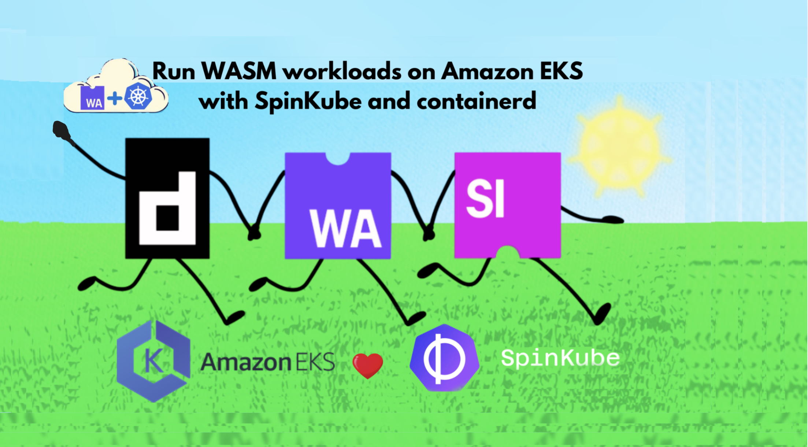
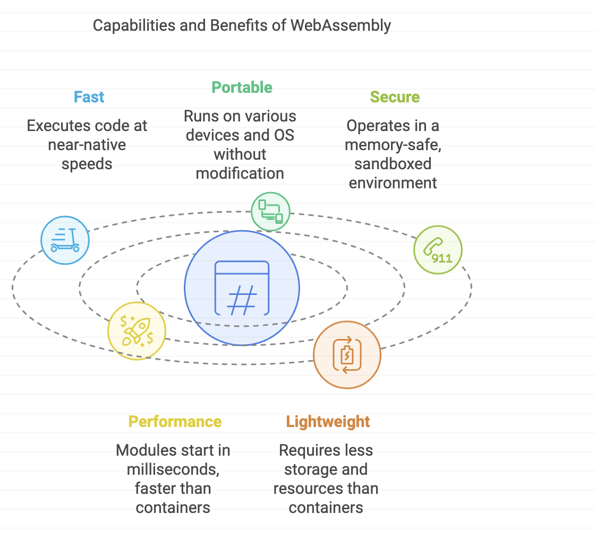
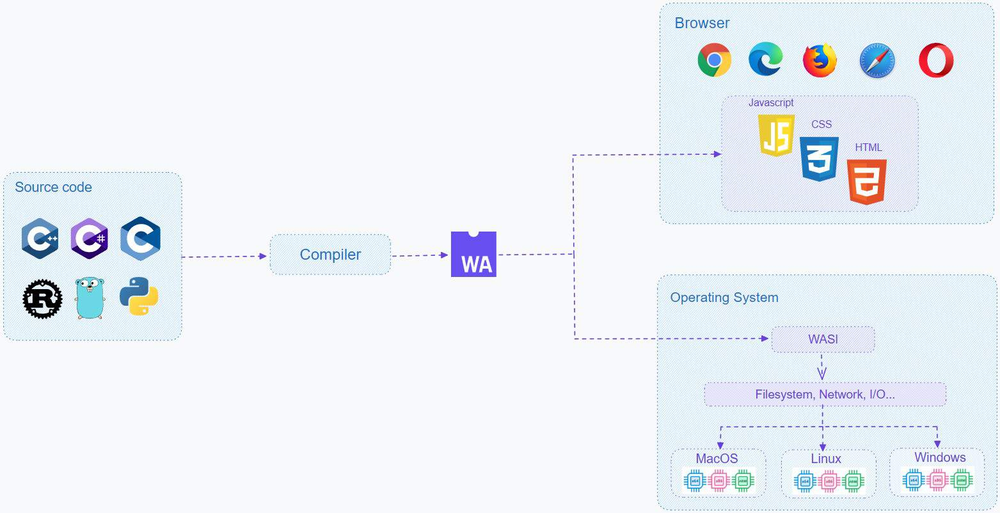
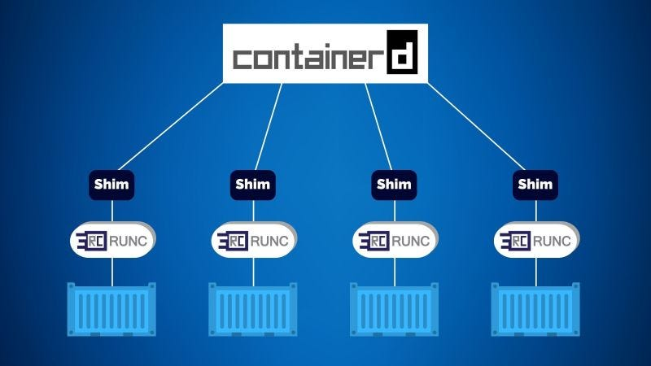

> **Deploy efficient applications in the Amazon cloud 🔆**

## 💬 Introduction

Kubernetes is an orchestrator for managing containerized applications, making it easier to deploy and scale software in the cloud.

One exciting technology that works well with Kubernetes is WebAssembly (Wasm). Wasm allows developers to run applications quickly and securely, not just in web browsers but also in cloud environments like Amazon Elastic Kubernetes Service (EKS).

In this guide, we will explore how to use SpinKube to deploy Wasm applications on Amazon EKS. You’ll learn how to take advantage of these modern tools to create efficient and portable applications.



## Understanding WebAssembly

**WebAssembly (Wasm)** is a unique code format designed for a stack-based virtual machine. It allows developers to write programs in various programming languages, such as **C**, **C++**, and **Rust**, and convert them into a format that can run efficiently on the web and servers. This makes Wasm a versatile tool for creating high-performance applications.

### Capabilities of WebAssembly

Wasm is built to be:

- **⚡ Fast**: It executes code at near-native speeds, which is essential for applications that require quick startup times, like serverless functions.
- **🌍 Portable**: Wasm code can run on different devices and operating systems without modification, eliminating the need for separate versions of applications for each platform.
- **🔒 Secure**: It operates in a memory-safe, sandboxed environment, meaning it cannot directly access the host system. This design helps protect against security vulnerabilities.

### Benefits of using WebAssembly

Using Wasm offers several significant advantages:

1. **Performance**: Wasm modules typically start in milliseconds, making them much quicker than traditional containers. This speed is crucial for applications needing rapid responses.
  
2. **Lightweight**: Compared to container images, Wasm modules require less storage space and consume fewer CPU and memory resources, allowing more applications to run simultaneously.

3. **Security**: Wasm modules run in isolation from the host operating system. They can only perform actions that are explicitly permitted, reducing potential security risks.



### Use cases for WebAssembly beyond the browser

Wasm's applications extend far beyond web browsers:

- **Server applications**: With the **WebAssembly System Interface (WASI)**, Wasm can securely access system resources like the network and filesystem. This capability allows developers to run Wasm on servers, broadening its use cases.

- **Edge computing**: Wasm is lightweight and can operate in various environments, making it ideal for edge computing scenarios, such as applications running in cell towers or retail locations, where traditional Kubernetes setups may face challenges.

- **Game development**: Wasm enables game developers to run complex games directly in the browser with high performance, making it easier to reach a broader audience.



### Common misunderstandings about WebAssembly and containers

1. **Misunderstanding #1: Wasm will replace containers**: This is a misconception! Many established applications, such as Redis and nginx, are well-suited for containers and are unlikely to transition to Wasm anytime soon.

2. **Misunderstanding #2: Running Wasm inside containers is the best approach**: While it’s technically possible, this might complicate your setup. The overhead of starting a Docker container can negate the performance advantages that Wasm offers.

3. **Misunderstanding #3: Wasm cannot work with Kubernetes**: In reality, Wasm and Kubernetes can complement each other effectively! They can be used together, allowing developers to take advantage of both technologies.

### Why Use WebAssembly?

Kubernetes is excellent for managing clusters, but it has limitations, especially at the edge. Wasm is lightweight and can run in various environments, making it a better fit for edge computing.

1. **Cost and utilization**: Many companies find their Kubernetes servers underutilized, often running at only 25-35% capacity. Wasm can help maximize resource use, allowing more applications to run in less space.

2. **Security benefits**: Wasm modules are secure by default. They can’t perform actions unless explicitly allowed, simplifying security management for developers.

### WebAssembly runtimes

Several runtimes support Wasm, including **Wasmer**, **Wasmtime**, and **Wasmedge**. These runtimes facilitate the efficient execution of Wasm modules in different environments.

## Introduction to Containerd

**Containerd** is a high-performance container runtime that serves as a critical component in the container ecosystem. It manages the complete lifecycle of containers, including image transfer, storage, and execution, making it essential for modern cloud-native applications.

### Key Features of Containerd

1. **Core Runtime**: Containerd operates as a core runtime, managing:
   - **Image Management**: Facilitates pulling, storing, and managing container images using a robust image store.
   - **Container Lifecycle Management**: Handles the creation, starting, stopping, and deletion of containers, ensuring efficient resource allocation and process management.
   - **Resource Management**: Allocates CPU, memory, and storage resources, optimizing performance across multiple containers.

2. **Architecture**: The architecture of Containerd is modular and extensible:
   - **Daemon**: The containerd daemon runs as a background service, managing container operations and providing a gRPC API for client interactions.
   - **Container Runtime Interface (CRI)**: This interface allows Kubernetes to communicate with Containerd, enabling seamless integration into Kubernetes clusters. Examples of runtimes that can be used with CRI include **runc** for traditional containers and **Spin** for WebAssembly applications.

3. **Integration with Spin**: Containerd can integrate with **Spin** using the containerd-shim-spin project. This shim enables the execution of Spin workloads on Kubernetes via **runwasi**. By installing this shim on Kubernetes nodes, you can add a runtime class to Kubernetes, allowing Spin applications to be scheduled and managed just like traditional container workloads.

4. **Containerd Shim**: The **containerd-shim** is a lightweight component that enables Containerd to manage non-traditional workloads, such as Wasm applications. This shim optimizes resource utilization and provides a consistent interface for developers.

5. **Performance and Scalability**: Containerd is optimized for performance, allowing for rapid container startup times and efficient resource usage. This is critical in high-demand environments where scalability and responsiveness are paramount.

### containerd and runwasi

Most Kubernetes clusters use containerd as the high-level runtime. It runs on every node and manages container lifecycle events such as create, start, stop, and delete. However, containerd only manages these events, it actually uses a low-level container runtime called [runc](https://github.com/opencontainers/runc) to perform the actual work. A shim process sits between containerd and the low-level runtime and performs important tasks such as abstracting the low-level runtime.

The architecture is shown below:



runwasi is a containerd project that let's you swap-out container runtimes for WebAssembly runtimes. It operates as a shim layer between containerd and low-level Wasm runtimes and enables WebAssembly workloads to seamlessly run on Kubernetes clusters.

The architecture is shown below:

1[runwasi](./runwasi.jpg)

Everything from containerd and below is opaque to Kubernetes - Kubernetes schedules work tasks to nodes and doesn't care if it's a traditional OCI container or a WebAssembly workload.

Wasm runtimes are binary executables that should be installed on worker nodes in a path that's visible to containerd. They should also be named according to the [containerd binary runtime naming convention](https://github.com/containerd/containerd/tree/main/core/runtime/v2#invoking-runtimes).

The following list shows the wasmtime and spin runtime binaries named appropriately and installed into the /bin directory:

   – **wasmtime**: /bin/containerd-shim-wasmtime-v1
   – **spin**: /bin/containerd-shim-spin-v1

Once installed, runtimes need registering with containerd. This is done by adding them to the [containerd config file](https://github.com/containerd/containerd/blob/main/docs/man/containerd-config.toml.5.md) which is usually located at /etc/containerd/config.toml.

The following extract shows how to register the [wasmtime](https://wasmtime.dev/) and [spin](https://www.fermyon.com/spin) runtimes in the containerd config.toml file.

```yaml
[plugins.cri.containerd.runtimes.wasmtime]
  runtime_type = "io.containerd.wasmtime.v1"
[plugins.cri.containerd.runtimes.spin]
  runtime_type = "io.containerd.spin.v1"
```

## What is Spin?

**Spin** is a specialized tool designed to streamline the development and deployment of WebAssembly applications. It provides a comprehensive workflow for creating, building, and running Wasm binaries, making it an excellent choice for serverless architectures.

### Key Features of Spin

1. **Ease of Use**: Spin offers a command-line interface (CLI) that simplifies project scaffolding and management. This allows developers to quickly set up new projects and focus on building functionality.

2. **Performance and Security**: Spin applications leverage WebAssembly's capabilities to run in a memory-safe, sandboxed environment. This ensures high performance while maintaining strict security boundaries, reducing the risk of vulnerabilities.

3. **Composable Microservices**: Spin supports the latest developments in the WebAssembly component model, enabling the creation of modular applications. This allows for microservices that can be independently developed, tested, and deployed, enhancing flexibility and maintainability.

4. **Integration with Wasmtime**: Spin utilizes the **Wasmtime** runtime, which is optimized for executing WebAssembly. This integration ensures that applications can fully leverage Wasm's performance characteristics, providing near-native execution speeds.

5. **Deployment Strategies**: Spin applications can be packaged as OCI (Open Container Initiative) images, allowing them to be deployed within container environments. This makes it easy to run Wasm applications alongside traditional containerized applications in Kubernetes, facilitating a hybrid architecture.

### Why Use Spin?

Spin provides a powerful toolset for harnessing the capabilities of WebAssembly. It allows for rapid development and deployment of applications that can run across various platforms, enhancing flexibility and scalability. With Spin, developers can build applications that are not only fast and lightweight but also secure and easy to manage.

## Exploring SpinKube

**SpinKube** is an innovative open-source project that enhances the development, deployment, and operation of WebAssembly (Wasm) workloads on Kubernetes. By integrating Spin with the **runwasi** and **Runtime Class Manager** (formerly KWasm), SpinKube streamlines the entire process, making it easier for developers to leverage the power of Wasm.

### Advantages of Using SpinKube

1. **Smaller Artifacts**: Wasm artifacts are significantly smaller than traditional container images, which reduces storage requirements and speeds up deployment.

2. **Faster Startup Times**: Artifacts can be quickly fetched over the network and started much faster than containerized applications. While there are ongoing optimizations to improve startup times further, the current performance is already advantageous for many use cases.

3. **Resource Efficiency**: SpinKube requires substantially fewer resources during idle times compared to traditional containers, making it more cost-effective and efficient.

4. **Kubernetes Integration**: Thanks to the **Spin Operator**, SpinKube integrates seamlessly with Kubernetes primitives such as DNS, health probes, autoscaling, and metrics. This integration allows developers to utilize familiar Kubernetes features while managing Wasm workloads.

### Key Components of SpinKube

1. **Containerd Shim Spin**: The **Containerd Shim Spin** repository provides shim implementations for running Wasm and Wasm System Interface (WASI) workloads using **runwasi** as a library. This allows workloads built with the Spin framework to function similarly to traditional container workloads within a Kubernetes environment.

2. **Runtime Class Manager**: Also known as the **Containerd Shim Lifecycle Operator**, the Runtime Class Manager automates and manages the lifecycle of containerd shims in Kubernetes. It handles tasks such as installation, updates, removal, and configuration of shims, reducing manual errors and improving reliability when managing Wasm workloads and other containerd extensions.

3. **Spin Plugin for Kubernetes**: This plugin enhances Kubernetes by enabling the execution of Wasm modules directly within a Kubernetes cluster. It integrates with containerd shims, allowing Kubernetes to manage and run Wasm workloads in a manner similar to traditional container workloads.

4. **Spin Operator**: The Spin Operator facilitates the deployment of Spin applications to Kubernetes. Built using the **kubebuilder** framework, it defines Spin App Custom Resource Definitions (CRDs). The Spin Operator monitors these resources—such as Spin app images, replicas, and user-defined values—and ensures the desired state is realized in the Kubernetes cluster. It also introduces functionalities like resource-based scaling and event-driven scaling.

5. **Spin Trigger MQTT**: The **Spin Trigger MQTT** is designed specifically for Spin, enabling seamless integration with MQTT-based systems. This allows for automation of workflows and triggering actions based on MQTT messages, enhancing the interactivity and responsiveness of applications.

## Hands-on: Setting Up AWS EKS Environment

In this section, we will guide you through the prerequisites and the step-by-step process for setting up an Amazon EKS (Elastic Kubernetes Service) cluster to run WebAssembly (Wasm) applications using Spin and SpinKube. By the end of this tutorial, you will have a fully operational EKS cluster with the Spin Operator installed, ready to deploy a simple Spin application.

### Prerequisites

Before you begin, ensure you have the following tools installed:

- **kubectl**: The command-line interface for interacting with Kubernetes. [Installation Guide](https://kubernetes.io/docs/tasks/tools/install-kubectl/)
- **EKSCTL**: A simple CLI tool for creating and managing EKS clusters. [Installation Guide](https://docs.aws.amazon.com/eks/latest/userguide/eksctl.html)
- **Helm**: The package manager for Kubernetes, used to install applications. [Installation Guide](https://helm.sh/docs/intro/install/)

### Provisioning the Necessary AWS Infrastructure

Before deploying the Spin Operator on Amazon EKS, you need to provision the underlying cloud infrastructure. For this tutorial, we will create a simple EKS cluster.

### Deploying the Spin Operator

1. **Install the Custom Resource Definitions (CRDs)**:
   First, you need to install the CRDs for the Spin Operator:

   ```bash
   kubectl apply -f https://github.com/spinkube/spin-operator/releases/download/v0.3.0/spin-operator.crds.yaml
   ```

2. **Install the Runtime Class**:
   Next, install the Runtime Class for `wasmtime-spin-v2`:

   ```bash
   kubectl apply -f https://github.com/spinkube/spin-operator/releases/download/v0.3.0/spin-operator.runtime-class.yaml
   ```

3. **Install cert-manager**:
   Cert-manager is required to automatically provision and manage TLS certificates used by the admission webhook system of the Spin Operator.

   - Install the cert-manager CRDs:

   ```bash
   kubectl apply -f https://github.com/cert-manager/cert-manager/releases/download/v1.14.3/cert-manager.crds.yaml
   ```

   - Add and update the Jetstack repository:

   ```bash
   helm repo add jetstack https://charts.jetstack.io
   helm repo update
   ```

   - Install the cert-manager Helm chart:

   ```bash
   helm install cert-manager jetstack/cert-manager \
     --namespace cert-manager \
     --create-namespace \
     --version v1.14.3
   ```

4. **Install KWasm Operator**:
   The Spin Operator chart has a dependency on KWasm, which you will use to install the containerd-wasm-shim on the Kubernetes node(s).

   - Add the KWasm Helm repository:

   ```bash
   helm repo add kwasm http://kwasm.sh/kwasm-operator/
   helm repo update
   ```

   - Install the KWasm operator:

   ```bash
   helm install \
     kwasm-operator kwasm/kwasm-operator \
     --namespace kwasm \
     --create-namespace \
     --set kwasmOperator.installerImage=ghcr.io/spinkube/containerd-shim-spin/node-installer:v0.16.0
   ```

5. **Provision Nodes**:
   Annotate all nodes to enable KWasm:

   ```bash
   kubectl annotate node --all kwasm.sh/kwasm-node=true
   ```

6. **Verify Installation**:
   To verify the installation of the containerd-wasm-shim, inspect the logs from the KWasm Operator:

   ```bash
   kubectl logs -n kwasm -l app.kubernetes.io/name=kwasm-operator
   ```

   You should see logs indicating successful deployment.

7. **Install the Spin Operator**:
   Finally, install the Spin Operator chart:

   ```bash
   helm install spin-operator \
     --namespace spin-operator \
     --create-namespace \
     --version 0.3.0 \
     --wait \
     oci://ghcr.io/spinkube/charts/spin-operator
   ```

8. **Create the Shim Executor**:
   Create the shim executor for the Spin Operator:

   ```bash
   kubectl apply -f https://github.com/spinkube/spin-operator/releases/download/v0.3.0/spin-operator.shim-executor.yaml
   ```

### Deploying a Spin App to EKS

To validate the Spin Operator deployment, you will deploy a simple Spin App to the EKS cluster.

1. **Deploy a Sample Spin App**:
   Use the following command to install a simple Spin App using the SpinApp CRD:

   ```bash
   kubectl apply -f https://raw.githubusercontent.com/spinkube/spin-operator/main/config/samples/simple.yaml
   ```

### Verifying the Spin App

1. **Configure Port Forwarding**:
   Set up port forwarding from your local machine to the Kubernetes service that points to the Spin App:

   ```bash
   kubectl port-forward services/simple-spinapp 8080:80
   ```

   You should see output indicating that port forwarding is active.

2. **Send an HTTP Request**:
   Use `curl` to send a request to the Spin App:

   ```bash
   curl -iX GET http://localhost:8080/hello
   ```

   You should receive a response similar to:

   ```shell
   HTTP/1.1 200 OK
   transfer-encoding: chunked
   date: Mon, 12 Feb 2024 12:23:52 GMT

   Hello world from Spin!
   ```

### Additional Resources

- [Amazon EKS Documentation](https://docs.aws.amazon.com/eks/index.html)
- [Spin Documentation](https://developer.fermyon.com/spin)
- [Spinkube Documentation](https://www.spinkube.dev/docs/)
- [Wasm Documentation](https://webassembly.org/docs/)
- [Kubernetes Documentation](https://kubernetes.io/docs/home/)
- [Helm Documentation](https://helm.sh/docs/)

<br>

**_Until next time, つづく 🎉_**

> 💡 Thank you for Reading !! 🙌🏻😁📃, see you in the next blog.🤘  **_Until next time 🎉_**

🚀 Thank you for sticking up till the end. If you have any questions/feedback regarding this blog feel free to connect with me:

**♻️ LinkedIn:** https://www.linkedin.com/in/rajhi-saif/

**♻️ X/Twitter:** https://x.com/rajhisaifeddine

**The end ✌🏻**

<h1 align="center">🔰 Keep Learning !! Keep Sharing !! 🔰</h1>

**📅 Stay updated**

Subscribe to our newsletter for more insights on AWS cloud computing and containers.
