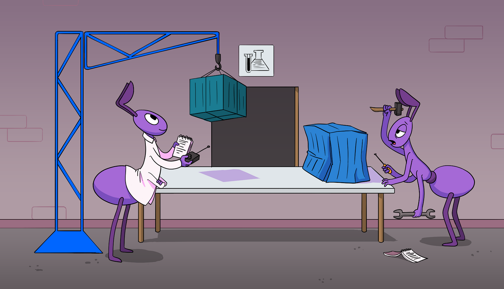

> **An Insight into the Rising Star of the CNCF Project 🚀**

## 🗃 Introduction

Welcome to this blog post, where we explore the fascinating world of [Werf](https://werf.io/), a remarkable [CI/CD](https://en.wikipedia.org/wiki/CI/CD) tool that is transforming the way we approach software development and deployment.

As a [standout member](https://github.com/werf/werf/discussions/5155) of the [CNCF](https://www.cncf.io/projects/werf/) (Cloud Native Computing Foundation) project family, Werf brings a fresh perspective and cutting-edge capabilities to the ever-evolving field of [DevOps](https://en.wikipedia.org/wiki/DevOps) and cloud native.

## 📘 Goals

In this article, we explore the features, advantages, and impact of Werf, shedding light on why it has rapidly gained recognition as an impressive solution within the tech community.

## 🛠️ The Art of Assembling: Explore the Software Delivery Lifecycle with Werf

Werf aims to enhance the efficiency of software delivery in Kubernetes by combining existing technologies with industry best practices. As it has now become an official CNCF project, we are thrilled to share its story and provide an overview of its benefits for users.

Having a vast ecosystem can be both advantageous and challenging. The true complexity lies not in finding the best implementation of essential functions but rather in integrating various components to achieve a desired solution. Essentially, you are constructing your own CI/CD pipeline using these fundamental building blocks.

The software delivery lifecycle involves multiple stages that must be completed for successful code building, testing, releasing, and deploying. Consequently, you need to select tools for each of these steps and find a way to seamlessly connect them, all while integrating them with your preferred CI system.

### Enhancing CI/CD with Best Practices and Kubernetes Integration

Werf, an Open Source Command-Line Interface (CLI) tool, aims to elevate the CI/CD experience by automating and standardizing workflows. Originally developed by a professional services company offering DevOps as a Service, Werf addresses the challenges faced while implementing CI/CD pipelines for diverse projects. The project's primary goal is to minimize the risks associated with potential mishaps that can occur when using established CI/CD workflows, inadvertently causing disruptions in production.

To achieve these objectives, Werf incorporates a range of best practices, including:

- **Sophisticated caching system**: By leveraging layer-by-layer caching, incremental rebuilds based on Git history, and shared caches for layers and images, Werf ensures optimal building times.
- **Content-based tagging**: This feature prevents unnecessary builds and subsequent redeployments to Kubernetes (K8s), resulting in improved efficiency.
- **Kubernetes-native container image building**: Werf facilitates in-cluster container image building, seamlessly integrating with K8s.
- **Giterminism**: Inspired by the fusion of "Git" and "determinism," Werf utilizes Git as a single source of truth, guaranteeing reproducibility in builds.
- **Advanced Kubernetes deployment process**: Werf enhances observability through K8s resource tracking and a fail-fast mechanism, taking the deployment process to new heights.
- **Original container registry cleanup mechanism**: Detecting and removing unused container images specific to your development flow, this mechanism optimizes storage space.

By leveraging these features and adhering to the implied requirements, Werf enforces compliance in your CI/CD practices. This ensures a consistent approach that guarantees expected outcomes in production, provides a robust rollback mechanism, and optimizes time and resource allocation.


## 🏗️ A Hands-On Experience with Werf

To achieve its groundbreaking capabilities, Werf leverages well-established cloud-native projects, acting as the foundation for its functionalities. Among these building blocks, Buildah takes the lead in building container images, while an enhanced version of Helm facilitates their deployment. However, the scope of Werf's integration extends far beyond these components, encompassing an impressive lineup of tools and systems:

- **Git**: Leveraging Git history for rebuilds and relying on Git for Giterminism.
- **Various container registries**: Efficiently storing and managing container images.
- **Argo CD**: Implementing the GitOps pattern, catering to diverse deployment needs.
- **Kubernetes**: Seamless integration with the renowned container orchestration platform.
- **Various CI systems**: Seamless execution of your pipeline, with built-in support for [GitLab CI/CD](https://werf.io/guides/nodejs/400_ci_cd_workflow/030_gitlab_ci_cd.html) and [GitHub Actions](https://werf.io/guides/nodejs/400_ci_cd_workflow/040_github_actions.html), alongside guidelines for other platforms.

### Installation

Before proceeding, it is essential to install [Werf](https://werf.io/documentation/v1.2/) and its dependencies. You can follow the guide provided below to ensure a smooth installation process.

**Requirements:**

- Bash
- Git version 2.18.0 or above
- GPG
- [Docker Engine](https://docs.docker.com/engine/install/)

Then, run the command below to install Werf:

```bash
curl -sSL https://werf.io/install.sh | bash -s -- --version 1.2 --channel stable
```

and then start a new shell session.

### Create Application Repository

```bash
# Clone the example repository to ~/werf-guide/guides (if you have not cloned it yet).
test -e ~/werf-guide/guides || git clone https://github.com/werf/website ~/werf-guide/guides

# Copy the (unchanged) application files to ~/werf-guide/app.
rm -rf ~/werf-guide/app
cp -rf ~/werf-guide/guides/examples/basic/000_app ~/werf-guide/app

# Make the ~/werf-guide/app directory a git repository.
cd ~/werf-guide/app
git init
git add .
git commit -m initial

# To see what changes we will make later in this chapter, let's replace all the application files
# in the repository with new, modified files containing the changes described below.
git rm -r .
cp -rf ~/werf-guide/guides/examples/basic/001_build/. .
git add .
git commit -m WIP

# Enter the command below to show files we are going to change.
git show --stat
# Enter the command below to show the changes that will be made.
git show
```

### Dockerfile

[Dockerfile](https://docs.docker.com/engine/reference/builder/) contains all the steps required to build our application:

```dockerfile
FROM alpine:3.14
WORKDIR /app

# [<en>] Install app dependencies.
# [<ru>] Устанавливаем зависимости приложения.
RUN apk add --no-cache --update nmap-ncat

# [<en>] Add to the image a script to run the echo server and set the permission to execution.
# [<ru>] Добавляем в образ скрипт для запуска эхо-сервера и устанавливаем разрешение на выполнение.
COPY start.sh .
RUN chmod +x start.sh
```

The primary Werf configuration file, `werf.yaml` (in the repository's root) specifies Dockerfile to use when building an application with Werf:

```yaml
project: werf-guide-app
configVersion: 1

---
image: app
dockerfile: Dockerfile
```

The `werf.yaml` file can describe the assembly of multiple images at once. There are also some additional settings for building an image.

Note that before starting the Werf-based build/deploy process, you have to add all the files to the commit. We already did this in the Create Application repository section above. Normally, however, you have to run the `git add` and `git commit` commands.

Start the build using the [werf build](https://werf.io/documentation/v1.2/reference/cli/werf_build.html) command:

```bash
werf build
```

### Starting the Application

You can run the container locally using the built image via the [werf run](https://werf.io/documentation/v1.2/reference/cli/werf_run.html) command:

```bash
werf run app --docker-options="-ti --rm -p 8000:8000" -- /app/start.sh
```

Here, the `--docker-options` flag sets the [Docker parameters](https://docs.docker.com/engine/reference/run/), while the command to run in the container is given at the end (after two hyphens).

Go to [http://127.0.0.1:8000/ping](http://127.0.0.1:8000/ping) in the browser to check if the application is running. Alternatively, you can use the curl utility:

```bash
curl http://127.0.0.1:8000/ping
```

You will get the `pong` message in response and the following text will appear in the container log:

```shell
GET /ping HTTP/1.1
Host: 127.0.0.1:8000
User-Agent: curl/7.67.0
Accept: */*
```



## 🌟 Conclusion

In conclusion, Werf emerges as a promising addition to the DevOps landscape and a rising star within the CNCF project.

Werf offers numerous advantages such as ease of use, flexibility, and enhanced efficiency. Its innovative approach to containerization and GitOps empowers developers to streamline their workflows, ensuring seamless and reliable application deployment.

By integrating seamlessly with popular container orchestration platforms like Kubernetes, Werf enables teams to achieve faster delivery cycles, better collaboration, and improved scalability. With its growing community and continuous development, Werf is set to shape the future of CI/CD, empowering organizations to accelerate their software delivery processes and embrace the full potential of modern DevOps practices.

<br>

**_Until next time, つづく 🎉_**

> 💡 Thank you for Reading !! 🙌🏻😁📃, see you in the next blog.🤘  **_Until next time 🎉_**

🚀 Thank you for sticking up till the end. If you have any questions/feedback regarding this blog feel free to connect with me:

**♻️ LinkedIn:** https://www.linkedin.com/in/rajhi-saif/

**♻️ X/Twitter:** https://x.com/rajhisaifeddine

**The end ✌🏻**

<h1 align="center">🔰 Keep Learning !! Keep Sharing !! 🔰</h1>

**📅 Stay updated**

Subscribe to our newsletter for more insights on AWS cloud computing and containers.
