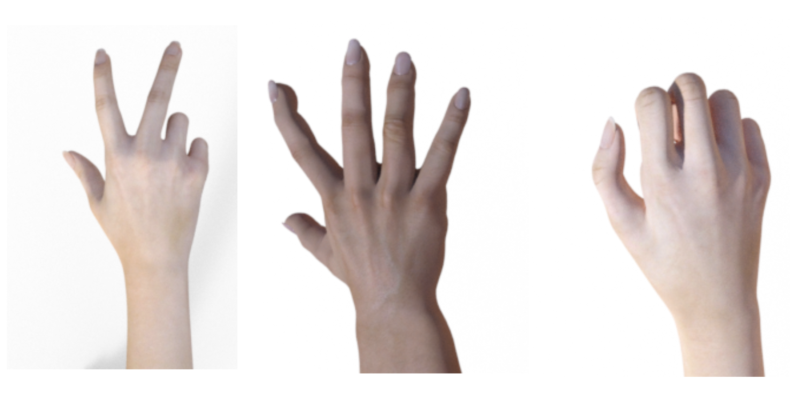
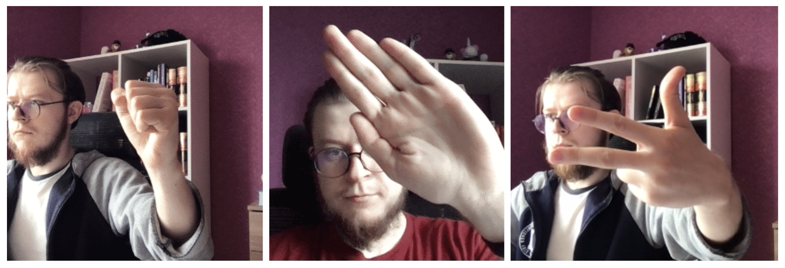
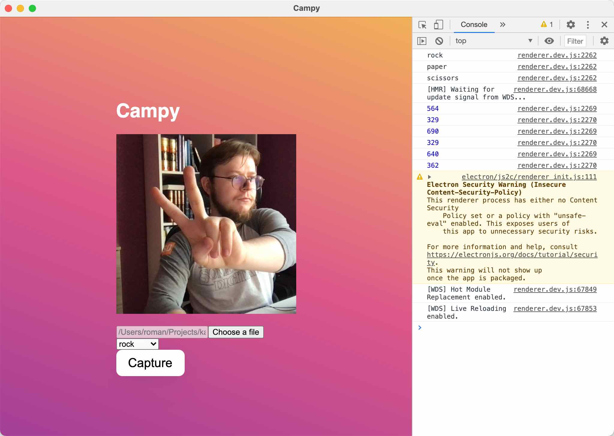
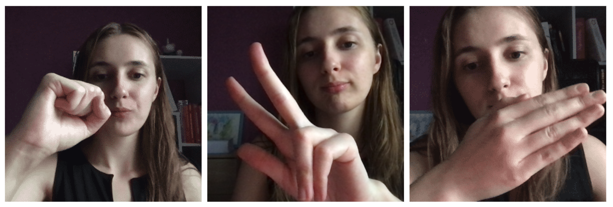

## More About Experiment

I hope you had a great time playing the game and now you are ready to understand what it took me to build it.

### Baseline

All machine learning experiments start with data. I wanted to find some open source datasets I would be able to use to build a quick baseline.

Fortunately, I could find a few datasets on Kaggle that seemed to match the goal. Namely, I picked:

- [[Kaggle] frtgnn/rock-paper-scissor dataset](https://www.kaggle.com/frtgnn/rock-paper-scissor)

Here are how samples from the dataset look like:

Next, I chose a proper model architecture. I did not want to host my final model anywhere on an external server.

This requirement effectively left me with one single option: to use a small-size model and deploy it to my existing static website via [TensorFlow.js](https://www.tensorflow.org/js).

This thought process brought me to [the MobileNet model architecture](https://arxiv.org/abs/1704.04861).

MobileNet is a popular 2M+ params network that performs very well considering its relatively tiny size. Fortunately, TensorFlow supports a few versions of MobileNet trained on [the ImageNet dataset](https://www.image-net.org/). This meant that I was able to start training from the pre-trained weights. It was actually good as it helped to reduce training time considerably and relaxed a need for a large training dataset.

I wasn't the only one on the Internet who was thinking about this idea, so I was quickly able to a good notebook to build my baseline on:

- [[Google Colab] trekhleb/rock-paper-scissors-mobilenet-v2](https://colab.research.google.com/github/trekhleb/machine-learning-experiments/blob/master/experiments/rock_paper_scissors_mobilenet_v2/rock_paper_scissors_mobilenet_v2.ipynb)

Before doing any experiments I'd configured a few more things:

- configuration management with [Morty](https://github.com/seifrajhi/morty) which is my open source project to track ML/DL experiments
- experiment tracking with [Weights & Biases](https://wandb.com/)

The baseline had been successfully established, however, the results of the model were not that good. It made a lot of misclassifications and it was too early to use it.

### Collecting a Custom Dataset

One possible reason for that was the training dataset itself. I assumed that it's distributed differently than images I'd got from my webcam.

Besides possible differences in the hidden technical attributes of photos, my images had different compositions. There were backgrounds, other parts of the body (not only one hand in the picture), different light conditions and things like that.

So I decided not to spend much time trying fancy DL techniques for gradient optimization or learning rate schedule, but, instead, I started improving my dataset.

The goal was clear. I needed to take hundreds of images that would be as close as possible to what I expected my model to work with.

It wasn't super easy as it turned out. I had to group all of the images by classes (rock, paper, scissors). Also, I needed to track the number of images per each class to keep the distribution even among all classes. I needed some workflow to make it easy for me and possibly for other people that would decide to help me with this project.

After a bit of thinking, I had come up with the following project:

- [[Github] seifrajhi/campy project](https://github.com/seifrajhi/campy)

Campy is an Electron-based desktop application that can simply take photos of the same size and put them in the right class folder:

The UI could have been sexier, but it'd done its job 😌

Having Campy in place helped me to streamline dataset building.

Another important thing is the test dataset. I chose to delegate this part to my girlfriend, so I would be more confident that my model was not learning what I looked like and would work with other people as well. Thankfully, girls like to take pictures, so I came with the right request:

As a result, we were able to collect:

- 360+ files per each class in the train dataset
- 260+ files per each class in the validation dataset
- 150+ files per each class in the test dataset

You can find the final dataset on Kaggle:

- [[Kaggle] glushko/rock-paper-scissors-dataset dataset](https://www.kaggle.com/glushko/rock-paper-scissors-dataset)

For training my model, I used not only images I had taken but also the whole dataset I used to train my baseline model on.

### Fine-Tuning

The custom dataset helped quite a lot, but there were still a noticeable number of errors.

With my initial model architecture, there was merely one single dense layer that was training at that point. It wasn't really enough to gain a good accuracy in this task. So I went for fine-tuning of my MobileNet network.

I took the best configs I was able to get at that point and started to unfreeze more layers starting from the end of the MobileNet feature extractor. With the RMSProp optimizer and 55 unfrozen layers
layers, I was able to get 93% accuracy on my test dataset and significantly reduce the number of misclassifications which was a way more important for the game.

I ended up with the model that was trained for 50 epochs with:

- MobileNetV2 (55 unfeezed layers)
- RMSprop optimizer (I could not beat it 😄) with 0.01 L2 regularization
- Small learning rate (10-4)

### Deployment

I did not want to buy any servers or Cloud instances to run my tiny little pet project. That was a challenging requirement that left me with few options. The most solid one was to use Tensorflow.js.

Tensorflow.js is a JavaScript frontend library that can load Tensorflow models right into the browser and use them to perform predictions.

You will need to [convert](https://www.tensorflow.org/js/tutorials/conversion/import_keras) a Tensorflow model to Tensorflow.js compatible format. This is only possible if you persisted the whole model and not just only the model weights.

Next, your model may fail to load in Tensorflow.js if you used any layers in your Tensorflow model that don't map to any layers on Tensorflow.js side. In my case, I used L2 normalization and I had to implement a new layer to map it on the JS side.

After the model is loaded, it may be very slow at the very first prediction, so you may need to call run your predict method on the dummy tensor to warm up the model during the model initialization.

Finally, Tensorflow.js and your model may add a few megabytes to your download resources that can be harmful to your frontend performance. So be sure you load your model weights and Tensorflow.js only where and when they are needed.

### Conclusions

I noticed that building AI-enabled applications, even simple ones, is quite a different story than training models in Jupyter notebooks just for the sake of training and getting the best possible score. You stop evaluating the success of your project by some metrics and you are getting focused on how well your project solves your problem.

## Resources

- [[Github] seifrajhi/rock-paper-scissors project](https://github.com/seifrajhi/rock-paper-scissors)
- [[Github] Trained Tensorflow.js model](https://github.com/seifrajhi/seifrajhi.github.io-lab/tree/master/rock-paper-scissors)
- [[Kaggle] glushko/rock-paper-scissors-dataset dataset](https://www.kaggle.com/glushko/rock-paper-scissors-dataset)
- [[trekhleb.dev] Rock Paper Scissors (MobilenetV2)](https://trekhleb.dev/machine-learning-experiments/#/experiments/RockPaperScissorsMobilenetV2)
