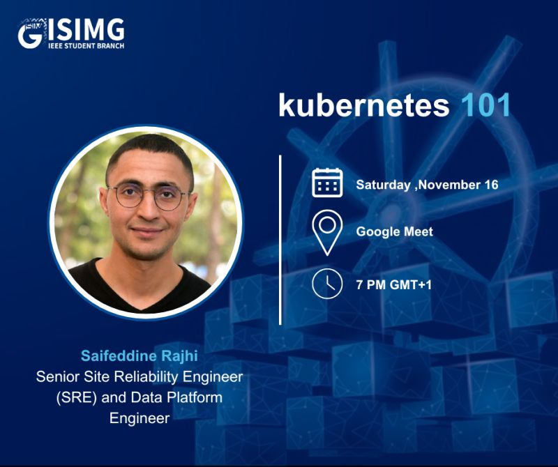

> **The Containerization and Kubernetes Intro I Wish I Had When I Started the Journey**

## An Introduction to Kubernetes, Covering Key Concepts and Practical Use Cases

Yesterday, I had the pleasure of presenting at the [IEEE ISIMG Student Branch](https://www.linkedin.com/in/ieee-isimg-sb-ab20922b1/) event, where I introduced the basics of Kubernetes. It was an insightful session where we covered key concepts and practical use cases to help attendees get started with container orchestration.

📅 **Date &amp; Time**: November 16, 7:00 – 9:00 PM (GMT+1)
🏢 **Event link**: [IEEE ISIMG Student Branch Linkedin Page](https://www.linkedin.com/feed/update/urn:li:activity:7261708738716217344/)
🌐 **Location**: Online (Google Meet)  
🔗 **Meet Link**: Link: [https://lnkd.in/eN2XTPfN]

### About This Event

I was thrilled to share my knowledge as a Senior Site Reliability Engineer (SRE) and Platform Engineer. During the session, we explored:

- The fundamentals of Kubernetes
- How Kubernetes can enhance your development and deployment workflows
- Tips on managing and scaling applications with ease

## Hosted by IEEE ISIMG Student Branch

The IEEE ISIMG Student Branch at The Higher Institute of Computer Science and Multimedia of Gabes is dedicated to advancing education and inspiring transformation in the field of technology. We host talks and events to foster innovation and knowledge sharing among students and professionals.

**_Until next time, つづく 🎉_**

&gt; 💡 Thank you for Reading !! 🙌🏻😁📃, see you in the next talk.🤘  **_Until next time 🎉_**

🚀 Thank you for sticking up till the end. If you have any questions/feedback regarding this talk feel free to connect with me:

**♻️ LinkedIn:** https://www.linkedin.com/in/rajhi-saif/

**♻️ X/Twitter:** https://x.com/rajhisaifeddine

**The end ✌🏻**

🔰 Keep Learning !! Keep Sharing !! 🔰

**📅 Stay updated**

Subscribe to our newsletter for more insights on Kubernetes and containerization.
