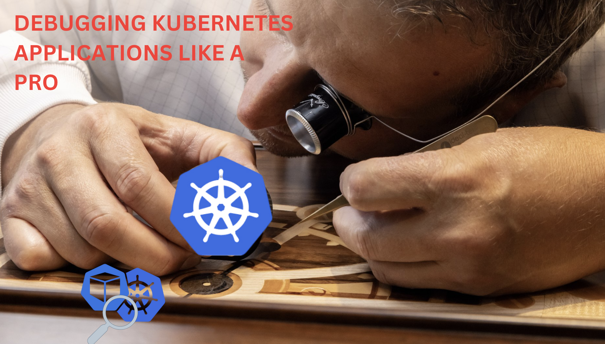

> **Debugging Kubernetes Applications Like a Pro**

**Tools & Tricks to Make Kubernetes Applications Debugging Faster and Easier for Everyone**

Is Kubernetes debugging making you pull your hair out? Don't worry! This talk will give you a set of easy tricks and tools to make debugging faster and easier. Even if you're new to Kubernetes, you'll learn how to find and fix problems quickly.

📅 **Date & Time**: March 29, 4:00 – 6:00 PM (GMT+1)  
🔗 **Event Link**: [Debugging Kubernetes Applications Like a Pro](https://community.cncf.io/events/details/cncf-cloud-native-tunisia-presents-containers-and-kubernetes-intro-and-hands-on/)

### About This Event

The Tunisian cloud native community is back with a first virtual event that covers debugging tools and techniques for Kubernetes applications.

**Hosted by:** Cloud Native Tunisia Chapter
🔗 **Community Link**: [Cloud Native Tunisia](https://community.cncf.io/cloud-native-tunisia/)

Kubernetes and Cloud Native Tunisia is the official Cloud Native Computing Foundation (CNCF) Meetup group dedicated to building a strong community around Kubernetes in Tunisia. We host talks from anyone doing cool things with Kubernetes, including companies using K8S in production or vendors who are pushing the boundaries of what K8S can do.

Presentations are demo-focused and not sales pitches.

### This Group Follows Three Central Ideas

1. **Open Sponsorships**: We believe in open sponsorships, so anyone can cover the cost of food, space, and travel for speakers. To not price out smaller vendors, sponsorship prices are not set beyond the cost. Organizations donating speakers, food/drinks, or space will automatically count as sponsors for the event.
2. **Community Engagement**: Encouraging knowledge sharing and collaboration among Kubernetes enthusiasts in Tunisia.
3. **Practical Learning**: Providing hands-on experience and practical insights to help attendees enhance their Kubernetes skills.

Join us for an insightful session and become part of our growing community!

 

**_Until next time, つづく 🎉_**

> 💡 Thank you for Reading !! 🙌🏻😁📃, see you in the next talk.🤘  **_Until next time 🎉_**

🚀 Thank you for sticking up till the end. If you have any questions/feedback regarding this talk feel free to connect with me:

**♻️ LinkedIn:** https://www.linkedin.com/in/rajhi-saif/

**♻️ X/Twitter:** https://x.com/rajhisaifeddine

**The end ✌🏻**

<h1 align="center">🔰 Keep Learning !! Keep Sharing !! 🔰</h1>

**📅 Stay updated**

Subscribe to our newsletter for more insights on AWS cloud computing and containers.
