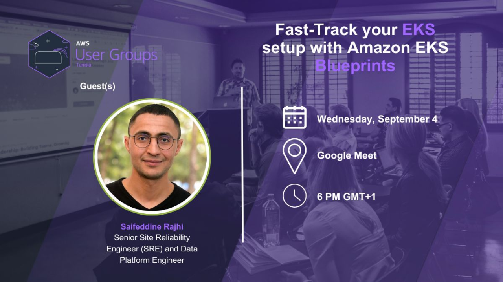

## Kubernetes Setup Using Amazon EKS Blueprints

📅 **Date & Time**: September 4, 2024, at 6 PM (Tunisia time, GMT+1)  
🔗 **Register Now**: https://lnkd.in/esGjDV8t  
🖥️ **Join via Google Meet**: https://lnkd.in/ezv6T4k4  

**#AWSUserGroup #EKSTunisia #AWSWorkshop**

### Workshop Recap

In collaboration with AWS User Group Tunisia, we hosted an online workshop focused on setting up Kubernetes using Amazon EKS Blueprints. This event was a fantastic opportunity for participants to gain hands-on experience and deepen their understanding of EKS.

The workshop covered essential topics such as:

- **Introduction to Amazon EKS Blueprints**: Understanding the basics and benefits.
- **Step-by-Step Setup**: Guided instructions on setting up your EKS environment.
- **Best Practices**: Tips and tricks for optimizing your Kubernetes setup.
- **Q&A Session**: Addressing participant queries and providing expert insights.

The interactive format allowed attendees to follow along and implement the steps in real-time, ensuring a practical learning experience. We received positive feedback from participants who appreciated the detailed explanations and the opportunity to enhance their EKS skills.

For more details about the event, [check out the event link](https://www.linkedin.com/posts/aws-women-s-user-group-tunisia_aws-cloudcomputing-automation-activity-7257711374603042816-EVGd)

Stay tuned for more events and workshops from AWS User Group Tunisia, and don't forget to join our community for the latest updates and learning opportunities.
