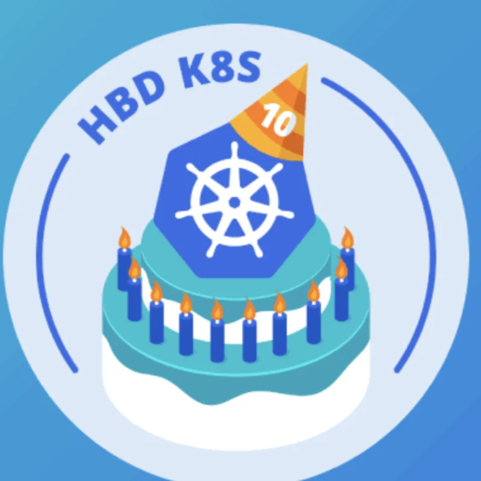

> **KuberTENes Birthday Bash Tunis**

**Kubernetes is Turning 10! Celebrate This Milestone with the Tunisian Community**

Kubernetes is turning 10! To celebrate this momentous industry and community milestone, we invite everyone in the Tunisian community to join us for a special celebration. Let's come together to honor a decade of innovation and collaboration in the Kubernetes ecosystem.

📅 **Date & Time**: June 21, 5:00 – 7:00 PM (GMT+2)  
🔗 **Event Link**: [KuberTENes Birthday Bash Tunis](https://community.cncf.io/events/details/cncf-tunisia-presents-kubertenes-birthday-bash-tunis/)

## About This Event

Join the Cloud Native Tunisia community for a festive event celebrating Kubernetes' 10th anniversary. This is a great opportunity to connect with fellow Kubernetes enthusiasts, share experiences, and enjoy the festivities.

**Hosted by:** Cloud Native Tunisia Chapter  
🔗 **Community Link**: [Cloud Native Tunisia](https://community.cncf.io/cloud-native-tunisia/)

Kubernetes and Cloud Native Tunisia is the official Cloud Native Computing Foundation (CNCF) Meetup group dedicated to building a strong community around Kubernetes in Tunisia. We host talks from anyone doing innovative things with Kubernetes, including companies using K8S in production or vendors who are pushing the boundaries of what K8S can do.

## Event Highlights

During this event, we discussed the history of Kubernetes, shared some fun facts, explored unsung features, and delved into lesser-known topics. The discussions were conducted in the form of a roundtable, allowing for an engaging and interactive session.

## This Group Follows Three Central Ideas

1. **Open Sponsorships**: We believe in open sponsorships, so anyone can cover the cost of food, space, and travel for speakers. To not price out smaller vendors, sponsorship prices are not set beyond the cost. Organizations donating speakers, food/drinks, or space will automatically count as sponsors for the event.
2. **Community Engagement**: Encouraging knowledge sharing and collaboration among Kubernetes enthusiasts in Tunisia.
3. **Practical Learning**: Providing hands-on experience and practical insights to help attendees enhance their Kubernetes skills.

 

**_Until next time, つづく 🎉_**

> 💡 Thank you for Reading !! 🙌🏻😁📃, see you in the next talk.🤘  **_Until next time 🎉_**

🚀 Thank you for sticking up till the end. If you have any questions/feedback regarding this talk feel free to connect with me:

**♻️ LinkedIn:** https://www.linkedin.com/in/rajhi-saif/

**♻️ X/Twitter:** https://x.com/rajhisaifeddine

**The end ✌🏻**

<h1 align="center">🔰 Keep Learning !! Keep Sharing !! 🔰</h1>

**📅 Stay updated**

Subscribe to our newsletter for more insights on AWS cloud computing and containers.
