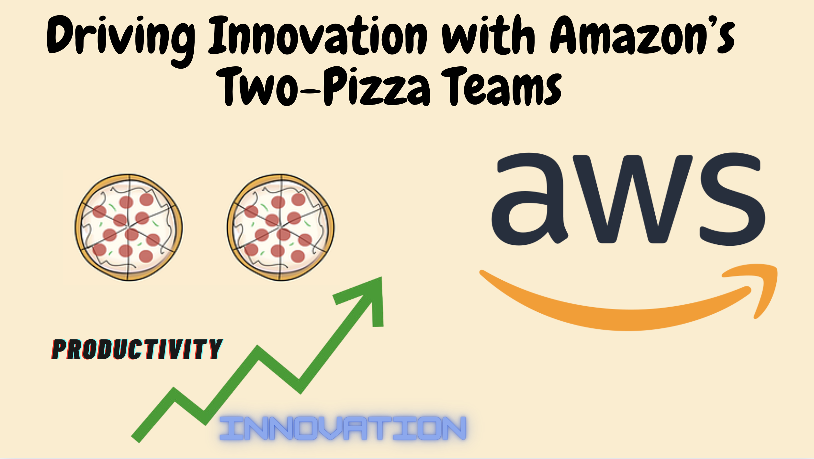

> **The power of small, focused teams**

## 📚 Introduction

Amazon's two-pizza team concept, introduced by Jeff Bezos, is a unique approach to team management that emphasizes the power of small, focused groups. The idea is simple: no team should be so large that it can't be fed with two pizzas. This typically means teams of fewer than 10 people. This strategy has been instrumental in driving Amazon's innovation and efficiency.

## 🚀 The Benefits of Two-Pizza Teams

### Minimized Communication Lines

Smaller teams reduce the complexity of communication, making it easier to coordinate and make decisions quickly. This agility is crucial for innovation and responsiveness to customer needs.

### Increased Ownership and Empowerment

With fewer people, each member has a greater sense of responsibility and ownership over their work. This can lead to higher productivity and more innovative solutions, as team members feel more accountable for their contributions.

### Higher Employee Satisfaction

Studies have shown that smaller teams tend to have higher engagement and satisfaction levels. For example, Gallup found that organizations with fewer than 10 employees had engagement levels of 42% or higher, compared to below 30% for larger organizations. This increased satisfaction can help attract and retain top talent.

### Focused Innovation

Smaller teams can focus more intensely on their specific goals and projects, leading to more effective and innovative outcomes. This focus is a key factor in enabling constant innovation and speed in a two-pizza team structure.

## 🔍 The Science Behind It

The effectiveness of Amazon's two-pizza teams can be explained by several psychological and organizational principles:

- **Ringelmann Effect**: This principle states that individual productivity decreases as team size increases. In smaller teams, each member's contribution is more noticeable, which can lead to higher individual effort.
- **Hackman and Vidmar Study**: This study found that individual satisfaction decreases as team size grows. Smaller teams allow for more recognition of individual contributions and clearer ownership of tasks.
- **Gallup's "State of the American Workplace"**: This study showed that smaller organizations have higher employee engagement levels. Engaged employees are more productive, innovative, and committed to their work.

## Practical Applications

- **Project Management**: When forming teams for new projects, consider the two-pizza rule to keep the team size manageable. This can lead to more efficient project execution and better outcomes.
- **Team Dynamics**: Encourage cross-functional teams where each member brings a unique skill set. This diversity within a small team can drive innovation and problem-solving.
- **Meeting Efficiency**: Apply the two-pizza rule to meetings as well. Keep meetings small and focused to ensure they are productive and that everyone has a chance to contribute.
  
## 🛠️ Implementation at Amazon

At Amazon, the two-pizza team concept is not just about keeping teams small. It's also about empowering these teams with a single-threaded focus. Each team is dedicated to a specific project or goal, which allows them to work more efficiently and innovate continuously. This structure helps Amazon maintain its agility and customer focus, even as it has grown into one of the largest companies in the world.

## 🌟 Real-World Examples

Several successful projects at Amazon have been the result of the two-pizza team approach:

- **Amazon Prime**: The development of Amazon Prime was driven by a small, focused team that could quickly iterate and improve the service based on customer feedback.
- **Amazon Web Services (AWS)**: AWS started as a small team with a clear mission to provide scalable cloud computing services. Today, it is a major part of Amazon's business, thanks to the innovative work of its initial two-pizza team.
- **Startups**: Many startups adopt this principle to stay nimble and responsive to market changes, ensuring that their teams can pivot quickly when needed.

## 🔍 Conclusion

Amazon's two-pizza team concept is more than just a catchy name; it's a powerful strategy for fostering innovation, efficiency, and employee satisfaction. By keeping teams small and focused, Amazon ensures that each team member can contribute meaningfully and that the company can remain agile and responsive to its customers.
