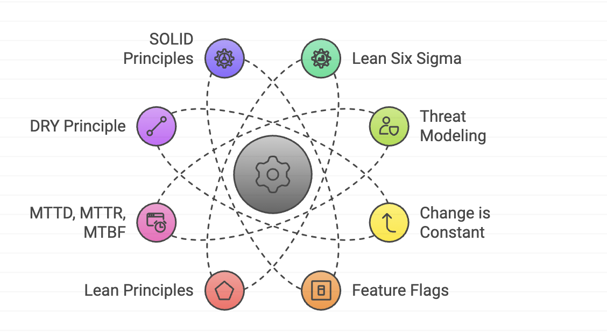

## 📚 Introduction

Welcome to a deep dive into the principles that can transform your engineering and management practices! In this thought piece, we will explore a wide array of principles designed to improve quality, efficiency, and adaptability in various processes. These principles foster a culture of continuous improvement and innovation, essential for thriving in today's fast-paced tech landscape.

## Key Principles

1. **Lean Six Sigma**: This methodology combines lean manufacturing and Six Sigma principles to improve quality, reduce waste, and increase efficiency. By identifying and eliminating defects in processes, it ensures smoother operations and higher customer satisfaction.

2. **Threat Modeling**: Identifying potential threats and vulnerabilities in a system or application is crucial. By evaluating and prioritizing these threats, you can determine the most effective mitigation strategies, ensuring robust security.

3. **Change is Constant**: Embrace the inevitability of change. Organizations must be adaptable and flexible to stay relevant and competitive. This principle encourages a proactive approach to change management.

4. **Feature Flags**: This software development technique allows developers to turn features on and off at runtime without deploying new code. It provides greater flexibility and control over feature releases, enabling safer and more efficient rollouts.

5. **Lean Principles**: Focus on reducing waste, increasing efficiency, and optimizing processes. Lean principles help streamline operations and improve overall productivity.

6. **MTTD, MTTR, MTBF**: These metrics measure the time to detect, repair, and the interval between failures in a system or application. They are essential for maintaining high availability and reliability.

7. **DRY Principle**: "Don't Repeat Yourself" emphasizes writing reusable code to avoid duplication and improve maintainability. It leads to cleaner, more efficient codebases.

8. **SOLID Principles**: These software development principles ensure maintainable and scalable code:
   - **Single Responsibility Principle (SRP)**: A class or module should have only one reason to change.
   - **Open-Closed Principle (OCP)**: A class or module should be open for extension but closed for modification.
   - **Liskov Substitution Principle (LSP)**: A derived class should be able to substitute for its base class without affecting the correctness of the program.
   - **Interface Segregation Principle (ISP)**: Clients should not be forced to depend on interfaces they do not use.
   - **Dependency Inversion Principle (DIP)**: High-level modules should not depend on low-level modules, but both should depend on abstractions.

9. **KISS Principle**: "Keep It Simple, Stupid" advocates for simplicity in software design. Simplicity is key to achieving maintainability, scalability, ease of use.

10. **YAGNI Principle**: "You Aren't Gonna Need It" advises against implementing functionality until it is actually needed. This avoids unnecessary complexity and wasted effort.

11. **12-Factor App Methodology**: This methodology for building modern, cloud-native applications emphasizes best practices such as declarative configurations, statelessness, and portability.

12. **Avoid Premature Optimization**: Optimizing code or architecture prematurely can lead to wasted effort and reduced maintainability. Focus on optimization when it is truly necessary.

13. **The Boy Scout Rule**: Encourage developers to continually improve the codebase by refactoring and eliminating technical debt. Leave the codebase cleaner than you found it.

14. **Fail Fast Philosophy**: Promote quick testing and iteration. Learn from mistakes and failures along the way to achieve better outcomes faster.

15. **The Bus Factor**: Ensure that no single person or small group holds critical knowledge or skills that would be catastrophic if lost. Encourage cross-training and documentation.

16. **Conway's Law**: The structure of an organization will influence the design of the software it produces. Align your organizational structure with your software architecture for better results.

17. **The Rule of Three**: If a certain functionality is needed more than twice, invest time and effort to create a reusable, generic solution for it.

18. **The Two Pizza Rule**: A management philosophy suggesting that a team should be small enough to be fed with just two pizzas. Smaller teams promote better communication, collaboration, and productivity.

19. **Blameless Post-Mortems**: Analyze and learn from failures or incidents without placing blame. The goal is to improve systems and prevent future incidents.

20. **Shifting Left**: Integrate security and other important considerations earlier in the software development process. This proactive approach leads to more secure and reliable software.

21. **Psychological Safety**: Ensure team members feel safe to speak up and share their opinions without fear of retribution or negative consequences. A psychologically safe environment fosters innovation and collaboration.

22. **Parkinson's Law**: This principle states that work expands to fill the time allotted for its completion. By setting shorter deadlines and focusing on essential tasks, you can optimize productivity and avoid unnecessary delays.

23. **Five Whys**: This problem-solving technique involves asking "why" five times to get to the root cause of an issue. It helps in identifying underlying problems and implementing effective solutions.

## 🧩 Additional Principles

1. **The Law of Demeter**: A module or object should only talk to its immediate neighbors, promoting loose coupling and reducing dependencies.

2. **The Broken Windows Theory**: Maintain code quality to prevent a general decline in system behavior. Address small issues before they become big problems.

3. **The Pareto Principle (80/20 Rule)**: Focus efforts and resources where they will have the most significant impact. Often, 80% of the results come from 20% of the efforts.

4. **Technical Debt**: Recognize the cost of maintaining and updating software developed with short-term gains in mind. Encourage proactive management of technical debt.

5. **Refactoring**: Restructure existing code to improve its internal structure without changing its external behavior. This enhances maintainability and readability.

## 📚 Conclusion

By adhering to these principles, engineering and management teams can foster a culture of continuous improvement, efficiency, and adaptability. This approach ultimately leads to better outcomes, a more robust work environment, and the ability to navigate the ever-changing landscape of the tech industry with confidence and resilience.

Thank you for joining me on this exploration of essential principles for SRE and platform engineers. Let's continue to learn, share, and grow together!

🚀 If you have any questions or feedback, feel free to connect with me:

**♻️ LinkedIn:** [https://www.linkedin.com/in/rajhi-saif/](https://www.linkedin.com/in/rajhi-saif/)

**♻️ X/Twitter:** [https://x.com/rajhisaifeddine](https://x.com/rajhisaifeddine)

**The end ✌🏻**

<h1 align="center">🔰 Keep Learning !! Keep Sharing !! 🔰</h1>

**📅 Stay updated**

Subscribe to our newsletter for more insights on AWS cloud computing and containers.
